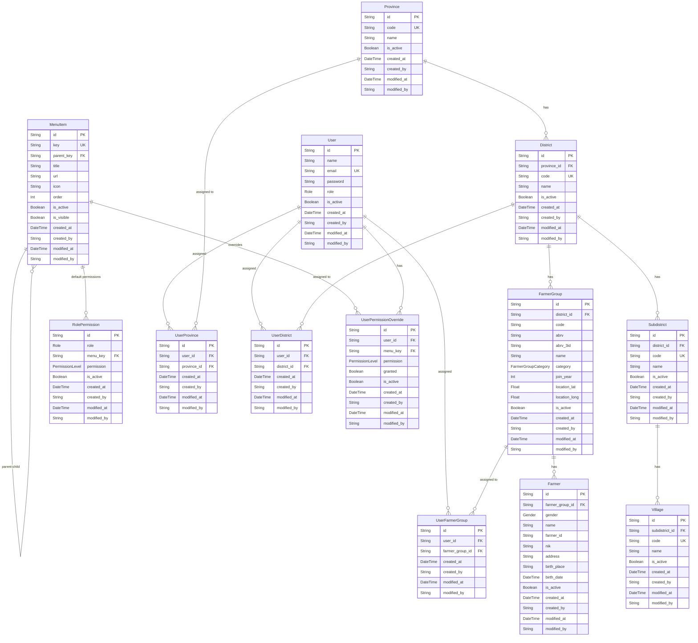
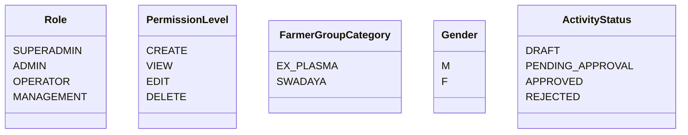
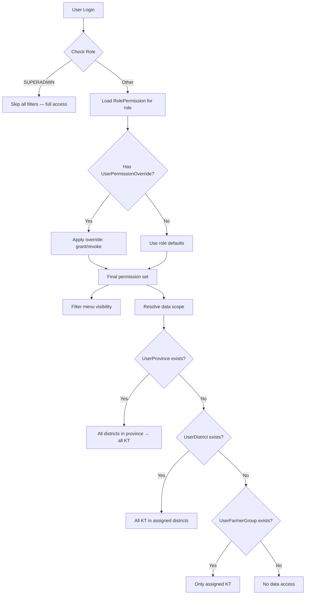
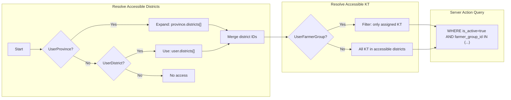

# Database Schema — ERD

> Visualisasi Entity Relationship Diagram untuk schema aktif.
> Update terakhir: 2026-06-09

---

## ERD Overview



---

## Common Fields (semua tabel)

| Field | Type | Keterangan |
|-------|------|-----------|
| `created_at` | DateTime | Auto-set saat create |
| `created_by` | String? | User ID yang membuat (null saat seed) |
| `modified_at` | DateTime | Auto-update saat edit |
| `modified_by` | String? | User ID yang terakhir edit |

---

## Enums



---

## Table Naming Convention

| Prefix | Arti | Contoh |
|--------|------|--------|
| `tbl_` | Tabel transaksional / data utama | `tbl_user`, `tbl_farmer_group` |
| `reg_` | Reference data regional | `reg_province`, `reg_district` |
| `ref_` | Reference data domain (nanti) | `ref_commodity`, `ref_batch` |
| `rbac_` | Tabel RBAC / permission | `rbac_role_permission`, `rbac_user_district` |
| `cache_` | Cache / materialized view | `cache_dashboard_stats` |

---

## RBAC Flow



---

## Data Access Examples

| User | Role | UserProvince | UserDistrict | UserFarmerGroup | Hasil Akses |
|------|------|-------------|-------------|-----------------|-------------|
| Ahmad | Project Leader | Riau | — | — | Semua district di Riau → semua KT |
| Erma | District Coord | — | Kampar | — | Semua KT di Kampar |
| Anissa | Facilitator | — | Kampar | KBM, Kopsa | Hanya KBM & Kopsa |
| Super Admin | SUPERADMIN | — | — | — | Semua (skip filter) |

---

## Data Access Pattern



---

## File Structure

```
prisma/schema/
├── _config.prisma        # Generator, datasource, enums
├── user.prisma           # User identity
├── geography.prisma      # Province → District → Subdistrict → Village
├── farmer-group.prisma   # FarmerGroup
├── farmer.prisma         # Farmer
├── rbac.prisma           # RolePermission, UserProvince, UserDistrict, UserFarmerGroup, UserPermissionOverride
└── menu.prisma           # MenuItem
```
