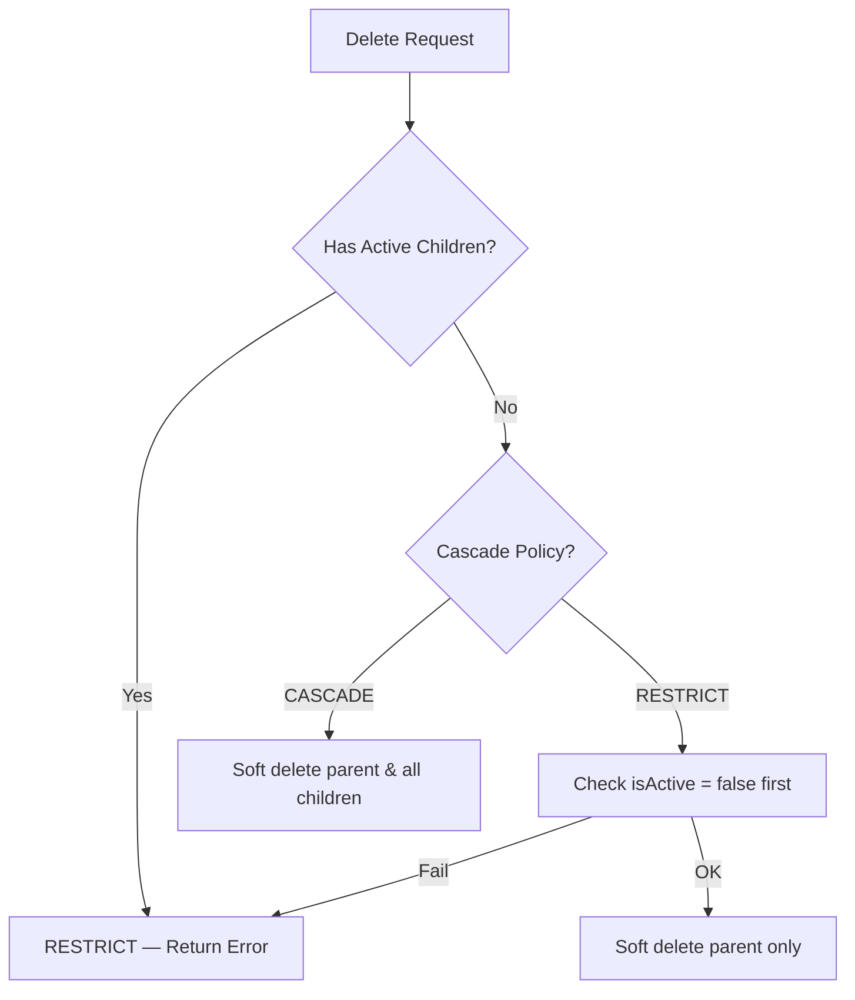

# Database — Constraints & Data Integrity

> Bagian dari dokumentasi **Database**. Indeks: [../README.md](../README.md) · Terkait: [erd.md](./erd.md) · [models.md](./models.md) · [indexes.md](./indexes.md) · [migrations.md](./migrations.md) · [security.md](./security.md) · [performance.md](./performance.md) · [dashboard-snapshots.md](./dashboard-snapshots.md)

<strong>Constraint & Data Integrity</strong> — Aturan integritas data dan validasi

## Constraint & Data Integrity

### Foreign Key Constraints

| Child Table | FK Field | Parent Table | Parent Field | On Delete | On Update |
|-------------|----------|--------------|--------------|-----------|-----------|
| **Geography Hierarchy** | | | | | |
| District | `provinceId` | Province | `id` | RESTRICT | CASCADE |
| Subdistrict | `districtId` | District | `id` | RESTRICT | CASCADE |
| Village | `subdistrictId` | Subdistrict | `id` | RESTRICT | CASCADE |
| **FarmerGroup** | | | | | |
| FarmerGroup | `districtId` | District | `id` | RESTRICT | CASCADE |
| **Farmer** | | | | | |
| Farmer | `farmerGroupId` | FarmerGroup | `id` | RESTRICT | CASCADE |
| **LandParcel** | | | | | |
| LandParcel | `farmerId` | Farmer | `id` | RESTRICT | CASCADE |
| **Production** | | | | | |
| ProductionRecord | `farmerId` | Farmer | `id` | RESTRICT | CASCADE |
| ProductionRecord | `parcelId` (nullable) | LandParcel | `id` | RESTRICT | CASCADE |
| **Dashboard Snapshot** | | | | | |
| MainDashboardSnapshot | `districtId` (nullable) | District | `id` | SET NULL | CASCADE |
| MainDashboardSnapshot | `createdBy` | User | `id` | RESTRICT | CASCADE |
| **Training** | | | | | |
| TrainingActivity | `packageId` | TrainingPackage | `id` | RESTRICT | CASCADE |
| TrainingActivity | `farmerGroupId` | FarmerGroup | `id` | RESTRICT | CASCADE |
| TrainingParticipant | `activityId` | TrainingActivity | `id` | RESTRICT | CASCADE |
| TrainingParticipant | `farmerId` | Farmer | `id` | RESTRICT | CASCADE |
| **RBAC** | | | | | |
| RolePermission | `menuKey` | MenuItem | `key` | RESTRICT | CASCADE |
| UserProvince | `userId` | User | `id` | RESTRICT | CASCADE |
| UserProvince | `provinceId` | Province | `id` | RESTRICT | CASCADE |
| UserDistrict | `userId` | User | `id` | RESTRICT | CASCADE |
| UserDistrict | `districtId` | District | `id` | RESTRICT | CASCADE |
| UserFarmerGroup | `userId` | User | `id` | RESTRICT | CASCADE |
| UserFarmerGroup | `farmerGroupId` | FarmerGroup | `id` | RESTRICT | CASCADE |
| UserPermissionOverride | `userId` | User | `id` | RESTRICT | CASCADE |
| UserPermissionOverride | `menuKey` | MenuItem | `key` | RESTRICT | CASCADE |
| **Menu Hierarchy** | | | | | |
| MenuItem | `parentKey` | MenuItem | `key` | SET NULL | CASCADE |

> Koreksi audit 2026-07-10: nilai On Delete di atas diverifikasi langsung ke SQL di `prisma/migrations/*`. Seluruh FK memakai **RESTRICT** kecuali dua **SET NULL** (`MenuItem.parentKey`, `MainDashboardSnapshot.districtId`). Tidak ada FK CASCADE on-delete di schema — soft delete (`isActive`) yang dipakai, bukan hard delete berantai; versi dokumen sebelumnya keliru menandai RBAC/TrainingParticipant/MenuItem sebagai CASCADE.

### Cascade Behavior Explanation

**RESTRICT (Default Prisma untuk relasi wajib)**:
- Mencegah penghapusan parent jika ada child yang masih mereferensikan
- Dipakai pada **hampir semua** FK (geography, farmer group/farmer, land parcel, production, training, RBAC assignment, role permission, override)
- Error bila dilanggar: `Foreign key constraint failed`
- Konsisten dengan pola **soft delete** aplikasi: record tidak pernah di-hard-delete dari app, sehingga cascade delete tidak dibutuhkan

**SET NULL (relasi opsional)**:
- `MenuItem.parentKey` → bila parent menu dihapus, `parentKey` anak menjadi NULL (anak tidak ikut terhapus)
- `MainDashboardSnapshot.districtId` → bila district dihapus, filter snapshot menjadi NULL (snapshot tetap ada)

**CASCADE**:
- Hanya berlaku untuk **On Update** (propagasi perubahan primary key), bukan On Delete
- Tidak ada FK dengan On Delete CASCADE di schema ini

### Business Rules & Validation

| Tabel | Field | Constraint | Business Rule |
|-------|-------|-----------|---------------|
| **User** | `email` | UNIQUE, NOT NULL | Email harus unik, digunakan untuk login |
| User | `role` | ENUM, NOT NULL | Role wajib (default: OPERATOR) |
| **Geography** | `code` | UNIQUE, NOT NULL | Code wilayah harus unik (BPS standard) |
| **FarmerGroup** | `category` | ENUM, NOT NULL | Kategori: EX_PLASMA / SWADAYA (default: SWADAYA) |
| **Farmer** | `farmerId` | NOT NULL, INDEXED | Internal farmer ID, bisa sama dengan NIK atau custom ID |
| Farmer | `nik` | NULLABLE, 16 digits | NIK optional, jika diisi harus 16 digit angka |
| Farmer | `gender` | ENUM (M/F), NOT NULL | Gender wajib |
| Farmer | `joinedYear` | INT (1900-2100), NULLABLE | Tahun bergabung dengan KT, optional |
| **TrainingPackage** | `code` | UNIQUE, ENUM | Training category code harus unik |
| **TrainingParticipant** | `(activityId, farmerId)` | UNIQUE COMPOSITE | Satu farmer hanya bisa terdaftar 1x di satu training |
| **MenuItem** | `key` | UNIQUE, NOT NULL | Menu key (slug) harus unik |
| MenuItem | `parentKey` | NULLABLE, FK | Self-reference untuk menu hierarchy (max 3 level) |
| **RolePermission** | `(role, menuKey, permission)` | UNIQUE COMPOSITE | Tidak boleh duplicate role permission |
| **UserProvince** | `(userId, provinceId)` | UNIQUE COMPOSITE | User tidak boleh assigned 2x ke province yang sama |
| **UserDistrict** | `(userId, districtId)` | UNIQUE COMPOSITE | User tidak boleh assigned 2x ke district yang sama |
| **UserFarmerGroup** | `(userId, farmerGroupId)` | UNIQUE COMPOSITE | User tidak boleh assigned 2x ke KT yang sama |

### Soft Delete Pattern

Semua tabel menggunakan **soft delete** dengan field `isActive`:
- `isActive = true` → record aktif
- `isActive = false` → record "dihapus" tapi data tetap ada di DB
- Query default HARUS filter `WHERE isActive = true`
- Untuk recovery data, bisa toggle kembali `isActive = true`

**Keuntungan**:
- Audit trail tetap terjaga
- Data tidak hilang permanen
- Bisa restore kapan saja
- Relasi referential integrity tidak patah

**Trade-off**:
- Perlu disiplin di query layer (selalu filter `isActive`)
- UNIQUE constraint harus conditional (tapi Prisma tidak support, jadi pakai kombinasi unik+isActive di app layer)

### Referential Integrity Check

