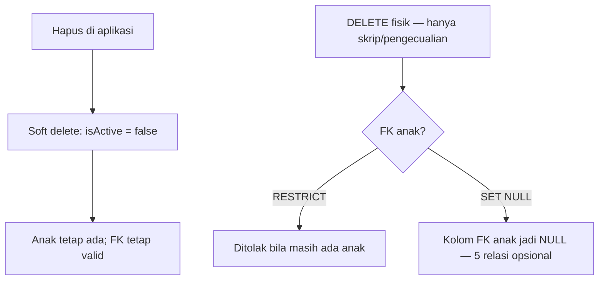

# Database — Constraints & Data Integrity

> Bagian dari dokumentasi **Database**. Indeks: [../README.md](../README.md) · Terkait: [erd.md](./erd.md) · [models.md](./models.md) · [indexes.md](./indexes.md) · [migrations.md](./migrations.md) · [security.md](./security.md) · [performance.md](./performance.md) · [dashboard-snapshots.md](./dashboard-snapshots.md)

<strong>Constraint & Data Integrity</strong> — Aturan integritas data dan validasi

## Constraint & Integritas Data

### Foreign Key

| Child Table | FK Field | Parent Table | Parent Field | On Delete | On Update |
|-------------|----------|--------------|--------------|-----------|-----------|
| **Geography Hierarchy** | | | | | |
| District | `provinceId` | Province | `id` | RESTRICT | CASCADE |
| Subdistrict | `districtId` | District | `id` | RESTRICT | CASCADE |
| Village | `subdistrictId` | Subdistrict | `id` | RESTRICT | CASCADE |
| **FarmerGroup** | | | | | |
| FarmerGroup | `districtId` | District | `id` | RESTRICT | CASCADE |
| ReferenceBenchmark | `farmerGroupId` (UNIQUE) | FarmerGroup | `id` | RESTRICT | CASCADE |
| **Boundary (#266)** | | | | | |
| FarmerGroupBoundary | `farmerGroupId` | FarmerGroup | `id` | RESTRICT | CASCADE |
| AdministrativeBoundary | `districtId` (nullable) | District | `id` | SET NULL | CASCADE |
| **Farmer** | | | | | |
| Farmer | `farmerGroupId` | FarmerGroup | `id` | RESTRICT | CASCADE |
| **LandParcel** | | | | | |
| LandParcel | `farmerId` | Farmer | `id` | RESTRICT | CASCADE |
| LandParcel | `parcelUid` | LandParcelIdentity | `id` | RESTRICT | CASCADE |
| **Land Parcel Identity & Satelit (#296)** | | | | | |
| LandParcelIdentity | `farmerId` | Farmer | `id` | RESTRICT | CASCADE |
| LandParcelDocument | `parcelUid` | LandParcelIdentity | `id` | RESTRICT | CASCADE |
| LandStdb | `farmerId` | Farmer | `id` | RESTRICT | CASCADE |
| LandParcelStdb | `parcelUid` | LandParcelIdentity | `id` | RESTRICT | CASCADE |
| LandParcelStdb | `stdbId` | LandStdb | `id` | RESTRICT | CASCADE |
| LandParcelExternalId | `parcelUid` | LandParcelIdentity | `id` | RESTRICT | CASCADE |
| LandParcelProgram | `parcelUid` | LandParcelIdentity | `id` | RESTRICT | CASCADE |
| **Sepadan, NKT & Patok (#326 #328 #329)** | | | | | |
| LandParcelBorder | `parcelUid` | LandParcelIdentity | `id` | RESTRICT | CASCADE |
| LandParcelNkt | `parcelUid` | LandParcelIdentity | `id` | RESTRICT | CASCADE |
| LandParcelMarker | `parcelUid` | LandParcelIdentity | `id` | RESTRICT | CASCADE |
| LandParcelMarker | `markerId` | LandMarker | `id` | RESTRICT | CASCADE |
| **Monev BMP (#344)** | | | | | |
| BmpAssessment | `farmerId` | Farmer | `id` | RESTRICT | CASCADE |
| BmpAssessment | `parcelUid` (nullable) | LandParcelIdentity | `id` | SET NULL | CASCADE |
| **Rincian Monev BMP (#346)** | | | | | |
| BmpAssessmentDetail | `assessmentId` | BmpAssessment | `id` | RESTRICT | CASCADE |
| BmpAssessmentDetail | `indicatorId` | BmpIndicator | `id` | RESTRICT | CASCADE |
| BmpGroupAssessment | `farmerGroupId` | FarmerGroup | `id` | RESTRICT | CASCADE |
| BmpGroupAssessmentDetail | `groupAssessmentId` | BmpGroupAssessment | `id` | RESTRICT | CASCADE |
| BmpGroupAssessmentDetail | `indicatorId` | BmpIndicator | `id` | RESTRICT | CASCADE |
| **Tree** | | | | | |
| Tree | `landParcelId` | LandParcel | `id` | RESTRICT | CASCADE |
| **Production** | | | | | |
| ProductionRecord | `farmerId` | Farmer | `id` | RESTRICT | CASCADE |
| ProductionRecord | `parcelId` (nullable) | LandParcel | `id` | RESTRICT | CASCADE |
| **Dashboard Snapshot** | | | | | |
| MainDashboardSnapshot | `districtId` (nullable) | District | `id` | SET NULL | CASCADE |
| MainDashboardSnapshot | `createdBy` | User | `id` | RESTRICT | CASCADE |
| BmpDashboardSnapshot | `districtId` (nullable) | District | `id` | SET NULL | CASCADE |
| BmpDashboardSnapshot | `createdBy` | User | `id` | RESTRICT | CASCADE |
| **Training** | | | | | |
| TrainingActivity | `packageId` | TrainingPackage | `id` | RESTRICT | CASCADE |
| TrainingActivity | `farmerGroupId` | FarmerGroup | `id` | RESTRICT | CASCADE |
| TrainingParticipant | `activityId` | TrainingActivity | `id` | RESTRICT | CASCADE |
| TrainingParticipant | `farmerId` | Farmer | `id` | RESTRICT | CASCADE |
| **RBAC** | | | | | |
| RolePermission | `menuKey` | MenuItem | `key` | RESTRICT | CASCADE |
| UserProvince | `userId` | User | `id` | RESTRICT | CASCADE |
| UserProvince | `provinceId` | Province | `id` | RESTRICT | CASCADE |
| UserDistrict | `userId` | User | `id` | RESTRICT | CASCADE |
| UserDistrict | `districtId` | District | `id` | RESTRICT | CASCADE |
| UserFarmerGroup | `userId` | User | `id` | RESTRICT | CASCADE |
| UserFarmerGroup | `farmerGroupId` | FarmerGroup | `id` | RESTRICT | CASCADE |
| UserPermissionOverride | `userId` | User | `id` | RESTRICT | CASCADE |
| UserPermissionOverride | `menuKey` | MenuItem | `key` | RESTRICT | CASCADE |
| **Menu Hierarchy** | | | | | |
| MenuItem | `parentKey` | MenuItem | `key` | SET NULL | CASCADE |

> Koreksi audit 2026-07-10 (diperbarui 2026-09-29, dicek ke mis-prod): nilai On Delete di atas diverifikasi langsung ke SQL di `prisma/migrations/*`. Seluruh FK memakai **RESTRICT** kecuali lima **SET NULL** (`MenuItem.parentKey`, `MainDashboardSnapshot.districtId`, `BmpDashboardSnapshot.districtId`, `BmpAssessment.parcelUid`, `AdministrativeBoundary.districtId`). Tidak ada FK CASCADE on-delete di schema — soft delete (`isActive`) yang dipakai, bukan hard delete berantai; versi dokumen sebelumnya keliru menandai RBAC/TrainingParticipant/MenuItem sebagai CASCADE.

### Perilaku Cascade

**RESTRICT (Default Prisma untuk relasi wajib)**:
- Mencegah penghapusan parent jika ada child yang masih mereferensikan
- Dipakai pada **hampir semua** FK (geography, farmer group/farmer, land parcel, production, training, RBAC assignment, role permission, override)
- Error bila dilanggar: `Foreign key constraint failed`
- Konsisten dengan pola **soft delete** aplikasi: record tidak pernah di-hard-delete dari app, sehingga cascade delete tidak dibutuhkan

**SET NULL (relasi opsional)**:
- `MenuItem.parentKey` → bila parent menu dihapus, `parentKey` anak menjadi NULL (anak tidak ikut terhapus)
- `MainDashboardSnapshot.districtId` → bila district dihapus, filter snapshot menjadi NULL (snapshot tetap ada)
- `BmpDashboardSnapshot.districtId` → bila district dihapus, filter snapshot menjadi NULL (snapshot tetap ada)
- `BmpAssessment.parcelUid` → bila identitas lahan dihapus, penilaian tetap ada tanpa rujukan lahan dikunjungi
- `AdministrativeBoundary.districtId` → bila district dihapus, poligon wilayah tetap ada tanpa tautan district

**CASCADE**:
- Hanya berlaku untuk **On Update** (propagasi perubahan primary key), bukan On Delete
- Tidak ada FK dengan On Delete CASCADE di schema ini

### Aturan Bisnis & Validasi

| Tabel | Field | Constraint | Business Rule |
|-------|-------|-----------|---------------|
| **User** | `email` | UNIQUE, NOT NULL | Email harus unik, digunakan untuk login |
| User | `role` | ENUM, NOT NULL | Role wajib (default: OPERATOR) |
| **Geography** | `code` | UNIQUE, NOT NULL | Code wilayah harus unik (BPS standard) |
| **FarmerGroup** | `category` | ENUM, NOT NULL | Kategori: EX_PLASMA / SWADAYA (default: SWADAYA) |
| **Farmer** | `farmerId` | NOT NULL, INDEXED | Internal farmer ID, bisa sama dengan NIK atau custom ID |
| Farmer | `(farmerGroupId, farmerId)` | UNIQUE COMPOSITE | ID Petani unik **per Lembaga** (TD-024) — Lembaga berbeda boleh memakai nomor yang sama |
| Farmer | `nik` | NULLABLE, 16 digits | NIK optional, jika diisi harus 16 digit angka |
| Farmer | `gender` | ENUM (M/F), NOT NULL | Gender wajib |
| Farmer | `joinedYear` | INT (1900-2100), NULLABLE | Tahun bergabung dengan Lembaga Petani, optional |
| **LandParcelIdentity** | `(farmerId, parcelId)` | UNIQUE COMPOSITE | Satu identitas per pasangan petani + ID Lahan, stabil antar revisi (#296) |
| **LandStdb** | `(farmerId, number) WHERE number IS NOT NULL AND is_active` | **PARTIAL UNIQUE** `uniq_land_stdb_farmer_number` (migrasi `20260829031525`, #306) | Nomor STDB unik per petani di antara baris aktif; STDB tahap awal boleh tanpa nomor |
| LandStdb | `(farmerId) WHERE stage IN (PERSIAPAN_DATA, PENGAJUAN, REVISI) AND is_active` | **PARTIAL UNIQUE** `uniq_land_stdb_farmer_open` | Paling banyak satu STDB yang masih berproses per petani. Menggantikan UNIQUE `(farmerId, number)` lama (dilepas #306) |
| **LandParcelStdb** | `(parcelUid, stdbId)` | UNIQUE COMPOSITE | Tautan lahan↔STDB tidak ganda |
| **LandParcelExternalId** | `(parcelUid, source, code)` | UNIQUE COMPOSITE | Sejak 2026-09-23 (dulu `(source, code)`): kode yang sama **boleh** di >1 lahan — keputusan owner, klaim ganda vendor disimpan lalu dicek silang (tanda "Juga dipakai …" di tab Legalitas); yang dijaga hanya duplikat di lahan yang sama. Nonaktif tetap memegang slot → diaktifkan kembali |
| **LandParcelBorder** | `parcelUid` | UNIQUE | Sepadan 1:1 per identitas lahan (#326). **Hapus = kosongkan keempat kolom**, bukan toggle `isActive` — baris nonaktif akan memblokir pengisian ulang |
| **LandParcelNkt** | `parcelUid` | UNIQUE | Status NKT 1:1 per identitas lahan (#328). Tanpa baris = belum dinilai; **hapus = hapus baris**. Zod: `categories` ≥ 1 kecuali `NOT_AFFECTED`, `assessedAt` ≤ hari ini |
| **BmpAssessment** | `(farmerId, surveyYear) WHERE is_active` | **PARTIAL UNIQUE** `uniq_bmp_assessment_farmer_year_active` (migrasi `20260920100000`, temuan review #344) | Satu baris AKTIF per petani-tahun; baris nonaktif tak memegang slot (isi ulang setelah soft delete sah — pelajaran #306/#326). Action tetap `findFirst` dulu untuk pesan ramah, index yang menjamin atomik (P2002 ditangkap: create/update/toggle/import). Tulis tangan seperti #306/#329 — Prisma akan mengusulkan DROP-nya, jangan diterima. Zod: `score` 0–3 dibulatkan 2 desimal, `surveyYear` 2020–tahun depan, `surveyDate` ≤ hari ini (+24 jam toleransi zona WIB/WITA/WIT karena disimpan UTC tengah malam) & tahun = `surveyYear`; `parcelUid` harus milik petani yang sama (dicek action) |
| **BmpIndicator** | `(code, level)` | UNIQUE COMPOSITE | Dua kode ada di dua level (1.2.2.2 acuan pemupukan, 1.5.1.2 infrastruktur) — kode saja tidak unik (#346). Master di-seed dari CSV; `weight` null = informatif |
| **BmpAssessmentDetail** | `(assessmentId, indicatorId)` | UNIQUE COMPOSITE | Satu skor per indikator per penilaian; rincian di-upsert utuh (isActive mengikuti induk). `score` Int? 0–3 dari form manual; import menerima 0–9 (skor 4 di form RSB diterima + ditandai, keputusan owner 2026-09-20) |
| **BmpGroupAssessment** | `(farmerGroupId, surveyYear) WHERE is_active` | **PARTIAL UNIQUE** `uniq_bmp_group_assessment_group_year_active` | Satu penilaian Lembaga aktif per tahun (tulis tangan, pola #306/#329) |
| **BmpGroupAssessmentDetail** | `(groupAssessmentId, indicatorId)` | UNIQUE COMPOSITE | Satu skor per indikator Lembaga per penilaian |
| **LandMarker** | `code` | UNIQUE, NOT NULL | Kode patok fisik `<SINGKATAN>-PTK-000123` (#331); deret per awalan di `LandMarkerCounter` (`INSERT … ON CONFLICT DO UPDATE … RETURNING`, atomik) |
| LandMarker | `longitude`, `latitude` | NOT NULL; Zod −180..180 / −90..90 + ≤ 100 m dari batas lahan | Guard koordinat tertukar / salah desimal pada data GPS (#329); `geom` GENERATED dari keduanya |
| **LandParcelMarker** | `(parcelUid, markerId)` | UNIQUE COMPOSITE | Satu tautan per pasangan lahan–patok; tautan yang dilepas diaktifkan ulang, bukan dibuat baru |
| LandParcelMarker | `(parcelUid, sequenceNo) WHERE is_active` | UNIQUE partial (`uniq_land_parcel_marker_seq`, manual) | Nomor patok unik per lahan hanya untuk tautan aktif (pola #306) |
| **TrainingPackage** | `code` | UNIQUE, ENUM | Training category code harus unik |
| **TrainingParticipant** | `(activityId, farmerId)` | UNIQUE COMPOSITE | Satu farmer hanya bisa terdaftar 1x di satu training |
| **ProductionRecord** | `(farmerId, parcelId, period, harvestNumber)` | UNIQUE COMPOSITE | Tidak boleh duplicate entri produksi untuk kombinasi farmer/parcel/periode/panen |
| **MainDashboardSnapshot** | `(snapshotDate, districtId, joinedYear)` | UNIQUE COMPOSITE | Tidak boleh duplicate snapshot untuk kombinasi tanggal + filter |
| **BmpDashboardSnapshot** | `(snapshotDate, districtId)` | UNIQUE COMPOSITE | Tidak boleh duplicate snapshot untuk kombinasi tanggal + filter |
| **MenuItem** | `key` | UNIQUE, NOT NULL | Menu key (slug) harus unik |
| MenuItem | `parentKey` | NULLABLE, FK | Self-reference untuk menu hierarchy (max 3 level) |
| **RolePermission** | `(role, menuKey, permission)` | UNIQUE COMPOSITE | Tidak boleh duplicate role permission |
| **UserProvince** | `(userId, provinceId)` | UNIQUE COMPOSITE | User tidak boleh assigned 2x ke province yang sama |
| **UserDistrict** | `(userId, districtId)` | UNIQUE COMPOSITE | User tidak boleh assigned 2x ke district yang sama |
| **UserFarmerGroup** | `(userId, farmerGroupId)` | UNIQUE COMPOSITE | User tidak boleh assigned 2x ke Lembaga Petani yang sama |
| **UserPermissionOverride** | `(userId, menuKey, permission)` | UNIQUE COMPOSITE | Tidak boleh duplicate permission override per user |

### Pola Soft Delete

Semua tabel menggunakan **soft delete** dengan field `isActive`, dengan pengecualian terdokumentasi (keputusan owner, lihat [models.md](./models.md)):

| Tabel | Perilaku "hapus" | Alasan |
|---|---|---|
| `LandParcelNkt` | hapus baris (hard delete) | Satelit 1:1 ber-`parcel_uid` UNIQUE — baris nonaktif memblokir pengisian ulang (#306/#328) |
| `LandParcelBorder` | kosongkan keempat kolom | Idem (#326) |
| `LandMarkerCounter` | tidak pernah dihapus; tanpa `isActive` & audit | Penghitung deret kode patok murni (#331) |
| `UserProvince`, `UserDistrict`, `UserFarmerGroup` | baris penugasan diganti (hapus + buat) | Tabel penugasan akses tanpa `isActive` |

Untuk tabel lainnya:
- `isActive = true` → record aktif
- `isActive = false` → record "dihapus" tapi data tetap ada di DB
- Query default HARUS filter `WHERE isActive = true`
- Untuk recovery data, bisa toggle kembali `isActive = true`

**Keuntungan**:
- Audit trail tetap terjaga
- Data tidak hilang permanen
- Bisa restore kapan saja
- Relasi referential integrity tidak patah

**Trade-off**:
- Perlu disiplin di query layer (selalu filter `isActive`)
- UNIQUE constraint **tidak mengenal soft delete** — baris nonaktif tetap memakai slot uniknya. Untuk `Farmer (farmerGroupId, farmerId)` itu **by design** (TD-024); hal yang sama berlaku untuk `LandParcelExternalId (parcelUid, source, code)` (#296; sejak 2026-09-23) — record nonaktif masih memegang slot uniknya, aktifkan kembali alih-alih membuat baru: memakai ulang ID milik petani nonaktif akan memecah riwayat pelatihan & lahannya (lihat komentar di `prisma/schema/farmer.prisma`). Bila suatu tabel memang perlu unik hanya-aktif (mis. revision tracking `LandParcel`), penegakannya di app layer (kombinasi cek unik+`isActive`) atau lewat **partial unique index tulis tangan** di migrasi (`WHERE is_active` — pola #306/#329/#344: `LandStdb`, `LandParcelMarker`, `BmpAssessment`, `BmpGroupAssessment`), karena Prisma schema tidak bisa mendeklarasikannya — Prisma akan mengusulkan DROP index itu, jangan diterima

### Cek Integritas Referensial

```mermaid
flowchart TD
    A[Hapus di aplikasi] --> B[Soft delete: isActive = false]
    B --> C[Anak tetap ada; FK tetap valid]
    A2[DELETE fisik — hanya skrip/pengecualian] --> D{FK anak?}
    D -->|RESTRICT| E[Ditolak bila masih ada anak]
    D -->|SET NULL| F[Kolom FK anak jadi NULL — 5 relasi opsional]
```

