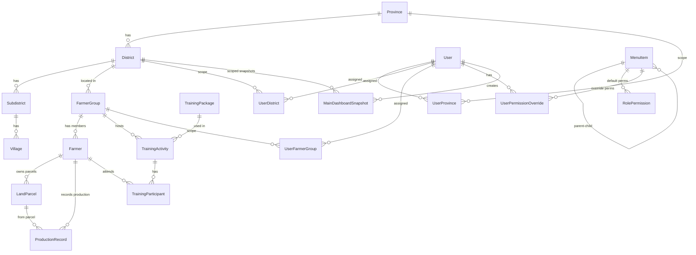
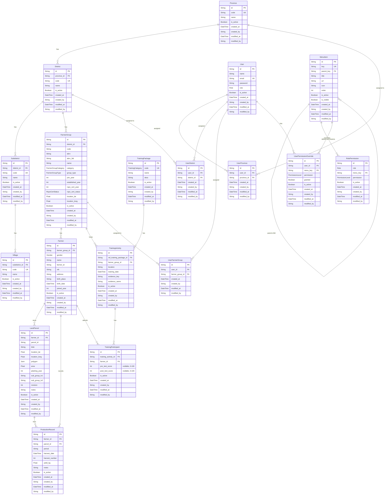

# Database — ERD & Model Overview

> Bagian dari dokumentasi **Database**. Indeks: [../README.md](../README.md) · Terkait: [models.md](./models.md) · [indexes.md](./indexes.md) · [constraints.md](./constraints.md) · [migrations.md](./migrations.md) · [security.md](./security.md) · [performance.md](./performance.md) · [dashboard-snapshots.md](./dashboard-snapshots.md)

## High-Level ERD

---

## Quick Summary

### Implemented Models (10 Categories)

| Category | Tables | Key Features |
|----------|--------|--------------|
| **Geography** | Province, District, Subdistrict, Village | 4-level hierarchy, soft-delete, audit trail |
| **User & Auth** | User | NextAuth integration, Role-based access |
| **RBAC** | RolePermission, UserProvince, UserDistrict, UserFarmerGroup, UserPermissionOverride | Permission matrix, data access control, menu override |
| **Menu** | MenuItem | Recursive parent-child (3-level), dynamic menu management |
| **Farmer Group** | FarmerGroup | **= Lembaga Petani** (level teratas; label lama "Kelompok Tani" mislabel → relabel TD-013/#147). District-based, location coordinates, category (EX_PLASMA/SWADAYA), tipe grup (ASOSIASI/KOPERASI), tahun bergabung program (`join_year`) + tahun berdiri (`established_year`), sertifikasi RSPO (`rspo_cert_status` CERTIFIED/PLANNED + `rspo_cert_year`, status boleh tanpa tahun) (#160) |
| **Farmer** | Farmer | Demographics, joinedYear, relation to FarmerGroup & Training |
| **Land Parcel** | LandParcel | Parcel per farmer, geolocation (lat/long), polygon geometry (GeoJSON), area, planting year, revision tracking; `blok` (blok kebun); **sub-kelompok interim** `subGroupLv1` (Gapoktan) + `subGroupLv2` (Kelompok Tani) per-lahan (#146) |
| **Training** | TrainingPackage, TrainingActivity, TrainingParticipant | 5 training packages, evidence upload (S3), bulk participant upload |
| **Production** | ProductionRecord | Yield tracking per farmer/parcel with period (YYYY-MM), harvest number (1-4), duplicate validation |

### Dashboard Snapshots

| Category | Tables | Key Features |
|----------|--------|--------------|
| **Dashboard Snapshots** | MainDashboardSnapshot (+ future dashboard snapshots) | Historical state capture, filter-based snapshots, JSON data storage, soft-delete |

### Planned Models (5 Categories)

- **Staff** (MD-07) — Staff activity tracking
- **HCV** (MD-08) — High Conservation Value assessments
- **BUSDEV** (MD-09) — Business development tracking
- **IMPACT** (MD-10) — Impact metrics
- **Workplan** (MD-11) — Work planning & tasks

### Enums

`Role`, `PermissionLevel`, `FarmerGroupCategory`, `Gender`, `ActivityStatus`, `TrainingCategory`

### Common Patterns

- **Soft Delete**: Semua tabel memiliki `isActive Boolean @default(true)`
- **Audit Trail**: `created_at`, `created_by`, `modified_at`, `modified_by`
- **CUID Primary Keys**: Semua tabel menggunakan CUID untuk ID
- **Table Naming**: `tbl_*` (transactional), `reg_*` (regional), `ref_*` (reference), `rbac_*` (RBAC)

### Schema Version

| Version | Date | Key Changes | Impact |
|---------|------|-------------|--------|
| **2.6.0** | 2026-07-15 | Identitas Lembaga Petani (#160): `FarmerGroup.groupType` (enum `FarmerGroupType`) + `establishedYear` + `rspoCertYear` + `rspoCertStatus` (enum `RspoCertStatus`); data `code` ICS→ISH | LOW (4 nullable columns + 2 enums, additive) |
| 2.5.0 | 2026-07-14 | `LandParcel.blok` (String?, blok kebun) | LOW (1 nullable column, additive) |
| 2.4.0 | 2026-07-14 | Sub-kelompok interim per-lahan (#146): `LandParcel.subGroupLv1` (Gapoktan) + `subGroupLv2` (Kelompok Tani); `FarmerGroup` diklarifikasi = **Lembaga Petani** (TD-013/#147) | LOW (2 nullable columns, additive) |
| 2.3.0 | 2026-07-08 | Dashboard snapshot (#99): MainDashboardSnapshot model, separate table per dashboard pattern | MEDIUM (new table + pattern establishment) |
| 2.2.1 | 2026-06-28 | Training participant pre/post-test scores (#94) + unique ProductionRecord ditambah `parcelId` | LOW–MEDIUM (nullable fields + constraint change) |
| 2.2.0 | 2026-06-22 | Production module (#89): ProductionRecord model, per-farmer/parcel yield tracking, bulk upload | Medium (new table + production tracking features) |
| 2.1.0 | 2026-06-14 | Land Parcel module (#88): LandParcel model, ZIP Shapefile bulk upload | Medium (new table + geospatial features) |
| 2.0.0 | 2026-06-11 | Training module, Farmer.joinedYear | Medium (new tables + optional field) |
| 1.5.0 | 2026-05-22 | RBAC overrides, User data access | High (new RBAC tables) |
| 1.0.0 | 2026-04-14 | Initial schema | — |

---

<strong>ERD Overview</strong> — Visualisasi lengkap relasi antar tabel

## ERD Overview

---

<strong>Schema Implementation Status</strong> — Status implementasi dan roadmap

## Schema Implementation Status

### ✅ Implemented (Production-Ready)

| Category | Tables | Status |
|----------|--------|--------|
| **Geography** | Province, District, Subdistrict, Village | ✅ Complete with hierarchy & indexes |
| **User & Auth** | User | ✅ Complete with NextAuth integration |
| **RBAC** | RolePermission, UserProvince, UserDistrict, UserFarmerGroup, UserPermissionOverride | ✅ Complete with permission matrix |
| **Menu** | MenuItem | ✅ Complete with recursive parent-child (3-level support) |
| **Farmer Group** | FarmerGroup | ✅ Complete with location & category |
| **Farmer** | Farmer | ✅ Complete with demographics & joinedYear field |
| **Land Parcel** | LandParcel | ✅ Complete with geolocation, polygon geometry (GeoJSON), area tracking, revision history |
| **Production** | ProductionRecord | ✅ Complete with yield tracking per farmer/parcel, period validation (YYYY-MM), max 4 harvests/month, duplicate prevention |
| **Training** | TrainingPackage, TrainingActivity, TrainingParticipant | ✅ Complete with evidence upload & participant management |

### 🔲 Planned (Roadmap)

| Category | Tables | Target Phase |
|----------|--------|--------------|
| **Staff** | Staff, StaffActivity | MD-07 |
| **HCV** | HCVAssessment | MD-08 |
| **Business Development** | BusinessDevelopment | MD-09 |
| **Impact** | ImpactMetrics | MD-10 |
| **Workplan** | Workplan, WorkplanTask | MD-11 |

