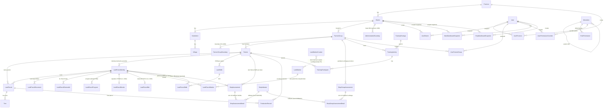

# Database — ERD & Model Overview

> Bagian dari dokumentasi **Database**. Indeks: [../README.md](../README.md) · Terkait: [models.md](./models.md) · [indexes.md](./indexes.md) · [constraints.md](./constraints.md) · [migrations.md](./migrations.md) · [security.md](./security.md) · [performance.md](./performance.md) · [dashboard-snapshots.md](./dashboard-snapshots.md)

## ERD Tingkat Tinggi

> **Konvensi penamaan tabel/model** (prefix `tbl_`/`ref_`/`reg_`/`rbac_`, pola satelit `tbl_<induk>_<aspek>`): lihat [../standards/code-standards.md §Penamaan tabel & model](../standards/code-standards.md#penamaan-tabel--model-prisma).

> **Versi interaktifnya ada di aplikasi**: menu **Data Analyst → Peta Data & Skema** (`/admin/data-analyst/data-map`, DA-07 #256) menggambar ERD yang sama dari `prisma/schema/*.prisma` — bisa di-zoom, disaring per domain, dan diklik untuk menyorot tetangga, plus tab keterisian kolom dan jalur data menu→entitas. Diagram mermaid di bawah tetap dipelihara sebagai rujukan dokumen (bisa dibaca tanpa menjalankan aplikasi), tetapi bila keduanya berbeda, **yang benar adalah hasil pindai skema** — ia diturunkan dari berkas yang sama dengan yang membuat database.

```mermaid
erDiagram
    %% GEOGRAPHY HIERARCHY
    Province ||--o{ District : "has"
    District ||--o{ Subdistrict : "has"
    Subdistrict ||--o{ Village : "has"
    
    %% FARMER GROUP & FARMER
    District ||--o{ FarmerGroup : "located in"
    District |o--o{ AdministrativeBoundary : "batas BIG (opsional, #266)"
    FarmerGroup ||--o{ FarmerGroupBoundary : "boundary ICS (#266)"
    FarmerGroup ||--o{ Farmer : "has members"
    
    %% LAND PARCEL
    Farmer ||--o{ LandParcel : "owns parcels"
    LandParcel ||--o{ Tree : "has trees"

    %% LAND PARCEL IDENTITY & SATELIT (#296) — menempel ke parcelUid, bukan baris revisi
    Farmer ||--o{ LandParcelIdentity : "identitas (farmerId, parcelId)"
    LandParcelIdentity ||--o{ LandParcel : "revisi"
    LandParcelIdentity ||--o{ LandParcelDocument : "surat kepemilikan"
    LandParcelIdentity ||--o{ LandParcelExternalId : "UL Parcel Code"
    LandParcelIdentity ||--o{ LandParcelProgram : "program (demplot PBU)"
    LandParcelIdentity ||--o| LandParcelBorder : "sepadan U/T/S/B (1:1, #326)"
    LandParcelIdentity ||--o| LandParcelNkt : "status NKT/HCV (1:1, #328)"
    LandParcelIdentity ||--o{ LandParcelMarker : "patok bernomor per lahan (#329)"
    LandMarker ||--o{ LandParcelMarker : "satu patok fisik, banyak lahan"
    LandMarkerCounter }o..o{ LandMarker : "deret kode per awalan Lembaga (tanpa FK)"
    Farmer ||--o{ LandStdb : "STDB per petani"
    LandParcelIdentity ||--o{ LandParcelStdb : "M:N"
    LandStdb ||--o{ LandParcelStdb : "M:N"
    
    %% MONEV BMP (#344) — skor per PETANI per tahun; lahan dikunjungi opsional
    Farmer ||--o{ BmpAssessment : "skor Monev BMP per tahun"
    LandParcelIdentity ||--o{ BmpAssessment : "lahan dikunjungi (opsional)"
    %% RINCIAN MONEV BMP (#346) — master 32 indikator, skor per indikator individu, penilaian Lembaga per tahun
    BmpAssessment ||--o{ BmpAssessmentDetail : "skor 18 indikator individu"
    BmpIndicator ||--o{ BmpAssessmentDetail : "indikator (level INDIVIDU)"
    FarmerGroup ||--o{ BmpGroupAssessment : "penilaian Lembaga per tahun"
    BmpGroupAssessment ||--o{ BmpGroupAssessmentDetail : "skor 14 indikator Lembaga"
    BmpIndicator ||--o{ BmpGroupAssessmentDetail : "indikator (level LEMBAGA)"

    %% PRODUCTION RECORD
    Farmer ||--o{ ProductionRecord : "records production"
    LandParcel ||--o{ ProductionRecord : "from parcel"
    
    %% TRAINING MODULE
    TrainingPackage ||--o{ TrainingActivity : "used in"
    FarmerGroup ||--o{ TrainingActivity : "hosts"
    TrainingActivity ||--o{ TrainingParticipant : "has"
    Farmer ||--o{ TrainingParticipant : "attends"
    
    %% RBAC & MENU
    User ||--o{ UserProvince : "assigned"
    User ||--o{ UserDistrict : "assigned"
    User ||--o{ UserFarmerGroup : "assigned"
    User ||--o{ UserPermissionOverride : "has"
    Province ||--o{ UserProvince : "scope"
    District ||--o{ UserDistrict : "scope"
    FarmerGroup ||--o{ UserFarmerGroup : "scope"
    MenuItem ||--o{ MenuItem : "parent-child"
    MenuItem ||--o{ RolePermission : "default perms"
    MenuItem ||--o{ UserPermissionOverride : "override perms"

    %% DASHBOARD SNAPSHOT
    District ||--o{ MainDashboardSnapshot : "scoped snapshots"
    User ||--o{ MainDashboardSnapshot : "creates"
    District ||--o{ BmpDashboardSnapshot : "scoped snapshots"
    User ||--o{ BmpDashboardSnapshot : "creates"
```

---

## Ringkasan Cepat

### Model Terimplementasi (15 Kategori)

| Category | Tables | Key Features |
|----------|--------|--------------|
| **Geography** | Province, District, Subdistrict, Village | 4-level hierarchy, soft-delete, audit trail |
| **User & Auth** | User | NextAuth integration, Role-based access |
| **RBAC** | RolePermission, UserProvince, UserDistrict, UserFarmerGroup, UserPermissionOverride | Permission matrix, data access control, menu override |
| **Menu** | MenuItem | Recursive parent-child (3-level), dynamic menu management |
| **Farmer Group** | FarmerGroup | **= Lembaga Petani** (level teratas; label lama "Kelompok Tani" mislabel → relabel TD-013/#147). District-based, location coordinates, category (EX_PLASMA/SWADAYA), tipe grup (ASOSIASI/KOPERASI), tahun bergabung program (`join_year`) + tahun berdiri (`established_year`), sertifikasi RSPO (`rspo_cert_status` CERTIFIED/PLANNED + `rspo_cert_year`, status boleh tanpa tahun) (#160), sertifikasi ISPO (`ispo_cert_status` + `ispo_cert_year`) + assurance SAP/MAP (`sap_map_assurance_status` + `sap_map_assurance_year`) — enum generik `CertStatus`, aturan sama dengan RSPO (#169) |
| **Farmer** | Farmer | Demographics, joinedYear, relation to FarmerGroup & Training |
| **Land Parcel** | LandParcel | Parcel per farmer, polygon `geometry` (GeoJSON, sumber kebenaran) + `geom` PostGIS GENERATED (#317), area, planting year, revision tracking; `blok` (blok kebun); `cropType` (Komoditas) + `species` + `isPsr` (PSR/replanting, default false); **Kelompok Tani interim** `subGroupLv2` per-lahan (#146; Gapoktan `subGroupLv1` di-drop #189); `parcelUid` → `LandParcelIdentity` (identitas stabil antar revisi, #296) |
| **Monev BMP** (#344, #346) | BmpAssessment, BmpIndicator, BmpAssessmentDetail, BmpGroupAssessment, BmpGroupAssessmentDetail | Skor Monev BMP per petani per tahun (skala 0–3), lahan dikunjungi opsional, penilai, catatan; kategori Teladan/Praktisi/Perintis/Belum dihitung dari skor via `src/lib/bmp-assessment.ts`. **Rincian** (#346): master 32 indikator (5 kegiatan berbobot, 18 individu + 14 Lembaga, 21 berbobot), skor 0–3 per indikator individu per penilaian, penilaian Lembaga per tahun (5 indikatornya berbobot & masuk skor petani — dicek ke seed dan mis-prod 2026-09-29); hitung ulang `recomputeBmpScore` hanya verifikasi — `BmpAssessment.score` tetap resmi. Dashboard realtime (pola Pelatihan) terpisah dari BMP Dashboard (Produksi) — detail di [models.md](./models.md#bmpassessment--monev-bmp-344) |
| **Land Parcel Satellites** (#296) | LandParcelIdentity, LandParcelDocument, LandStdb, LandParcelStdb, LandParcelExternalId, LandParcelProgram, LandParcelBorder, LandParcelNkt, LandMarker, LandParcelMarker, LandMarkerCounter | Identitas per `(farmerId, parcelId)` lintas revisi; surat kepemilikan (enum `LandDocumentType`, nomor tidak unik, `holderName`, `statedArea`); STDB per petani M:N ke lahan; UL Parcel Code + `rawGeometry` opsional; program demplot PBU; **sepadan** U/T/S/B teks bebas 1:1 (#326); **status NKT** hasil asesmen 1:1 (#328, MD-08 sebagian); **patok batas** fisik dipakai bersama lahan berdampingan, M:N bernomor per lahan (#329) — detail di [models.md](./models.md#landparcelidentity--satelit-lahan-296-decision-log-2026-08-27) |
| **Boundary** (#266) | FarmerGroupBoundary, AdministrativeBoundary | Poligon boundary ICS per Lembaga (sudah termasuk buffer 1,5 km) + wilayah administrasi BIG (enum `AdminBoundaryLevel` KABUPATEN/KECAMATAN/DESA, `districtId` opsional); dual-column `geom` PostGIS + `geojson` — dipakai Fire Alert & klip titik api |
| **Reference Benchmark** (#243) | ReferenceBenchmark | Angka acuan manual per Lembaga (satu baris per Lembaga, kolom metrik nullable) untuk Data Analyst › Komparasi Data Acuan |
| **Tree** | Tree | Titik pohon sawit per lahan (#238) — deteksi model + koreksi manusia (`source` auto/moved/added/verified), koordinat WGS84, `vigor`, revisi **per-set** (upload ulang nonaktifkan set lama), relasi `landParcelId` + kunci bisnis `parcelId`; skala 10⁵–10⁶ baris → wajib agregat |
| **Training** | TrainingPackage, TrainingActivity, TrainingParticipant | 5 training packages, evidence upload (S3), bulk participant upload |
| **Production** | ProductionRecord | Yield tracking per farmer/parcel with period (YYYY-MM), harvest number (1-4), duplicate validation |
| **Dashboard Snapshots** | MainDashboardSnapshot, BmpDashboardSnapshot | Snapshot pattern (#99, #166) — rincian di bawah |

### Snapshot Dashboard

| Category | Tables | Key Features |
|----------|--------|--------------|
| **Dashboard Snapshots** | MainDashboardSnapshot, BmpDashboardSnapshot (#166) | Historical state capture, filter-based snapshots, JSON data storage, soft-delete; separate table per dashboard |

### Model Terencana (5 Kategori)

- **Staff** (MD-07) — Staff activity tracking
- **HCV** (MD-08) — High Conservation Value assessments *(sebagian: status NKT per lahan `LandParcelNkt` #328 sudah ada)*
- **BUSDEV** (MD-09) — Business development tracking
- **IMPACT** (MD-10) — Impact metrics
- **Workplan** (MD-11) — Work planning & tasks

### Enum

19 enum. Inti: `Role`, `PermissionLevel`, `FarmerGroupCategory`, `Gender`, `TrainingCategory`. Lembaga: `FarmerGroupType`, `RspoCertStatus`, `CertStatus`. Wilayah: `AdminBoundaryLevel`. Satelit lahan: `LandDocumentType`, `LandProgramType`, `LandProgramStatus`, `LandStdbStage`, `LandNktStatus`, `NktCategory`, `LandMarkerCondition`, `LandMarkerType`, `LandMarkerSource`. Monev BMP: `BmpIndicatorLevel`. (`ActivityStatus` yatim dihapus 2026-09-21, #353)

### Pola Umum

- **Soft Delete**: Semua tabel memiliki `isActive Boolean @default(true)` — pengecualian terdokumentasi di [constraints.md](./constraints.md#pola-soft-delete): `LandParcelNkt` (hapus baris), `LandParcelBorder` (kosongkan kolom), `LandMarkerCounter` (tanpa `isActive`/audit), tabel penugasan `UserProvince`/`UserDistrict`/`UserFarmerGroup` (tanpa `isActive`)
- **Audit Trail**: `created_at`, `created_by`, `modified_at`, `modified_by`
- **CUID Primary Keys**: Semua tabel menggunakan CUID untuk ID, kecuali `LandMarkerCounter` (PK = `prefix`)
- **Table Naming**: `tbl_*` (transactional), `reg_*` (regional), `ref_*` (reference), `rbac_*` (RBAC)

### Versi Skema

Tabel versi skema (2.x) kini di [migrations.md § Versi Skema](./migrations.md#versi-skema), berdampingan dengan riwayat migrasi.
