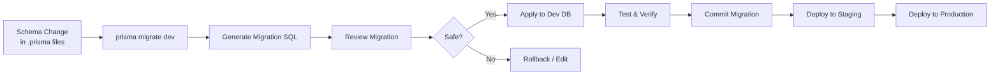

# Database — Migration Strategy

> Bagian dari dokumentasi **Database**. Indeks: [../README.md](../README.md) · Terkait: [erd.md](./erd.md) · [models.md](./models.md) · [indexes.md](./indexes.md) · [constraints.md](./constraints.md) · [security.md](./security.md) · [performance.md](./performance.md) · [dashboard-snapshots.md](./dashboard-snapshots.md)

<details>
<summary><strong>Migration Strategy</strong> — Strategi migrasi dan versioning schema</summary>

## Migration Strategy

### Migration Workflow



### Migration Types & Risk Level

| Migration Type | Risk | Strategy | Rollback |
|----------------|------|----------|----------|
| **Add New Table** | LOW | Deploy langsung | Easy (drop table) |
| **Add Nullable Column** | LOW | Deploy langsung | Easy (drop column) |
| **Add NOT NULL Column with Default** | MEDIUM | Backfill di migration | Medium (remove default, drop column) |
| **Add NOT NULL Column without Default** | HIGH | 2-step: (1) add nullable, (2) backfill + alter | Hard |
| **Rename Column** | HIGH | 2-step: (1) add new + copy data, (2) drop old | Medium |
| **Change Column Type** | HIGH | Test di staging, bisa butuh data transformation | Hard |
| **Drop Column** | HIGH | Review dependency dulu, bisa 2-step (deprecated → drop) | Hard (restore from backup) |
| **Drop Table** | CRITICAL | Review dependency + backup, soft-delete preferred | Very Hard |
| **Add UNIQUE Constraint** | MEDIUM | Check duplicate data dulu | Easy (drop constraint) |
| **Add FK Constraint** | MEDIUM | Check orphaned records dulu | Easy (drop constraint) |

### Existing Migrations (History)

| Migration | Date | Description | Impact |
|-----------|------|-------------|--------|
| `20260521232859_init` | 2026-05-21 | Initial schema — Geography, User, Menu, RBAC, FarmerGroup | CRITICAL (baseline) |
| `20260606104223_add_farmer_group_indexes` | 2026-06-06 | Add indexes on FarmerGroup (districtId, isActive, code) | LOW (index only) |
| `20260607000000_add_farmer` | 2026-06-07 | Add Farmer model (demographics, farmerId, nik) | HIGH (new table) |
| `20260610085445_init_training` | 2026-06-10 | Add Training module (Package, Activity, Participant) | HIGH (3 new tables) |
| `20260610091207_add_training_evidence` | 2026-06-10 | Add evidence upload fields to TrainingActivity (evidenceKey, evidenceName) | LOW (nullable fields) |
| `20260614075754_add_land_parcel` | 2026-06-14 | Add LandParcel model (#88): geolocation, polygon, area, planting year, revision tracking | HIGH (new table with geospatial features) |
| `20260615050657_add_production_record` | 2026-06-15 | Add ProductionRecord model (#89): yield tracking per farmer/parcel, period, harvest number | HIGH (new table) |
| `20260628211657_add_training_participant_scores` | 2026-06-28 | Add `preTestScore` & `postTestScore` (nullable Int) ke TrainingParticipant (#94) | LOW (nullable fields) |
| `20260628214742_add_parcelid_to_production_unique` | 2026-06-28 | Ubah unique ProductionRecord: tambah `parcelId` → `(farmerId, parcelId, period, harvestNumber)` | MEDIUM (constraint change) |
| `20260708042109_add_main_dashboard_snapshot` | 2026-07-08 | Add MainDashboardSnapshot → `tbl_snapshot_main_dashboard` (#99, DASH-01) | HIGH (new table + snapshot pattern) |
| `20260714032307_add_land_parcel_sub_group` | 2026-07-14 | Add `LandParcel.subGroupLv1` (Gapoktan) + `subGroupLv2` (Kelompok Tani) — sub-kelompok interim per-lahan (#146, TD-014) | LOW (2 nullable columns, additive; baris lama NULL) |
| `20260714044513_add_land_parcel_blok` | 2026-07-14 | Add `LandParcel.blok` (String?, blok kebun) | LOW (1 nullable column, additive; baris lama NULL) |
| `20260715040235_farmer_group_type_years_rspo_cert` | 2026-07-15 | Add `FarmerGroup`: `group_type` (enum `FarmerGroupType` ASOSIASI/KOPERASI), `established_year`, `rspo_cert_year`, `rspo_cert_status` (enum `RspoCertStatus` CERTIFIED/PLANNED) (#160) | LOW (4 nullable columns + 2 enums, additive; baris lama NULL) |
| `20260715081831_add_bmp_dashboard_snapshot` | 2026-07-15 | Add BmpDashboardSnapshot → `tbl_snapshot_bmp_dashboard` (#166, DASH-04) — snapshot pattern kedua; unique `(snapshot_date, district_id)` | HIGH (new table; **file dibuat via `--create-only`, apply menunggu approval owner**) |

### Pre-Deployment Checklist

Sebelum deploy migration ke production, pastikan:
- [ ] Migration SQL sudah direview manual (tidak ada DROP TABLE / DROP COLUMN unexpected)
- [ ] Test di local dev environment dulu
- [ ] Test di staging environment dengan production-like data volume
- [ ] Backup database production sebelum migrate
- [ ] Ada rollback plan jika migration gagal
- [ ] Semua query di codebase sudah update (jika ada breaking change)
- [ ] Index creation untuk tabel besar dilakukan CONCURRENTLY (jika perlu)

### Breaking Changes Policy

**Breaking change** adalah migration yang membuat existing code tidak bisa jalan:
- Drop column yang masih dipakai di code
- Rename column tanpa update query
- Change column type yang tidak compatible
- Add NOT NULL constraint tanpa default

**Strategi handling breaking changes**:
1. **2-Step Migration**: Deploy schema dulu (backward-compatible), lalu update code, baru cleanup old schema
2. **Feature Flag**: Wrap new code dengan feature flag, baru enable setelah migration success
3. **Deprecation Period**: Mark field as deprecated, kasih warning di logs, baru drop setelah 1-2 sprint

### Data Backfill Strategy

Jika perlu backfill data untuk field baru dengan NOT NULL constraint:

```sql
-- Example: Add joinedYear to Farmer (already nullable, no backfill needed)
-- If we need to make it NOT NULL in the future:

-- Step 1: Add nullable column (already done)
ALTER TABLE tbl_farmer ADD COLUMN joined_year INTEGER;

-- Step 2: Backfill with business logic (e.g., use FarmerGroup.joinYear as default)
UPDATE tbl_farmer
SET joined_year = fg.join_year
FROM tbl_farmer_group fg
WHERE tbl_farmer.farmer_group_id = fg.id
AND tbl_farmer.joined_year IS NULL;

-- Step 3: Alter to NOT NULL (if needed)
ALTER TABLE tbl_farmer ALTER COLUMN joined_year SET NOT NULL;
```

### Prisma Migration Commands

| Command | Keterangan |
|---------|-----------|
| `npx prisma migrate dev --name <name>` | Generate & apply migration di dev (auto-create DB jika belum ada) |
| `npx prisma migrate deploy` | Apply pending migrations di production (no prompt) |
| `npx prisma migrate status` | Check migration status (pending / applied) |
| `npx prisma migrate resolve --applied <migration-name>` | Mark migration as applied (manual fix) |
| `npx prisma migrate resolve --rolled-back <migration-name>` | Mark migration as rolled back |
| `npx prisma migrate reset` | Drop DB + re-run all migrations + seed (DEV ONLY) |
| `npx prisma db push` | Push schema tanpa migration (DEV ONLY, skip migration files) |

</details>
