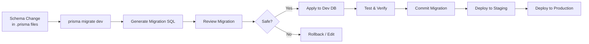

# Database — Migration Strategy

> Bagian dari dokumentasi **Database**. Indeks: [../README.md](../README.md) · Terkait: [erd.md](./erd.md) · [models.md](./models.md) · [indexes.md](./indexes.md) · [constraints.md](./constraints.md) · [security.md](./security.md) · [performance.md](./performance.md) · [dashboard-snapshots.md](./dashboard-snapshots.md)

<details>
<summary><strong>Migration Strategy</strong> — Strategi migrasi dan versioning schema</summary>

## Migration Strategy

### Migration Workflow


```mermaid
flowchart LR
    A[Schema Change<br/>in .prisma files] --> B[prisma migrate dev]
    B --> C[Generate Migration SQL]
    C --> D[Review Migration]
    D --> E{Safe?}
    E -->|Yes| F[Apply to Dev DB]
    E -->|No| G[Rollback / Edit]
    F --> H[Test & Verify]
    H --> I[Commit Migration]
    I --> J[Deploy to Staging]
    J --> K[Deploy to Production]
```

### Migration Types & Risk Level

| Migration Type | Risk | Strategy | Rollback |
|----------------|------|----------|----------|
| **Add New Table** | LOW | Deploy langsung | Easy (drop table) |
| **Add Nullable Column** | LOW | Deploy langsung | Easy (drop column) |
| **Add NOT NULL Column with Default** | MEDIUM | Backfill di migration | Medium (remove default, drop column) |
| **Add NOT NULL Column without Default** | HIGH | 2-step: (1) add nullable, (2) backfill + alter | Hard |
| **Rename Column** | HIGH | 2-step: (1) add new + copy data, (2) drop old | Medium |
| **Change Column Type** | HIGH | Test di staging, bisa butuh data transformation | Hard |
| **Drop Column** | HIGH | Review dependency dulu, bisa 2-step (deprecated → drop) | Hard (restore from backup) |
| **Drop Table** | CRITICAL | Review dependency + backup, soft-delete preferred | Very Hard |
| **Add UNIQUE Constraint** | MEDIUM | Check duplicate data dulu | Easy (drop constraint) |
| **Add FK Constraint** | MEDIUM | Check orphaned records dulu | Easy (drop constraint) |

### Existing Migrations (History)

| Migration | Date | Description | Impact |
|-----------|------|-------------|--------|
| `20260521232859_init` | 2026-05-21 | Initial schema — Geography, User, Menu, RBAC, FarmerGroup | CRITICAL (baseline) |
| `20260606104223_add_farmer_group_indexes` | 2026-06-06 | Add indexes on FarmerGroup (districtId, isActive, code) | LOW (index only) |
| `20260607000000_add_farmer` | 2026-06-07 | Add Farmer model (demographics, farmerId, nik) | HIGH (new table) |
| `20260610085445_init_training` | 2026-06-10 | Add Training module (Package, Activity, Participant) | HIGH (3 new tables) |
| `20260610091207_add_training_evidence` | 2026-06-10 | Add evidence upload fields to TrainingActivity (evidenceKey, evidenceName) | LOW (nullable fields) |
| `20260614075754_add_land_parcel` | 2026-06-14 | Add LandParcel model (#88): geolocation, polygon, area, planting year, revision tracking | HIGH (new table with geospatial features) |
| `20260615050657_add_production_record` | 2026-06-15 | Add ProductionRecord model (#89): yield tracking per farmer/parcel, period, harvest number | HIGH (new table) |
| `20260628211657_add_training_participant_scores` | 2026-06-28 | Add `preTestScore` & `postTestScore` (nullable Int) ke TrainingParticipant (#94) | LOW (nullable fields) |
| `20260628214742_add_parcelid_to_production_unique` | 2026-06-28 | Ubah unique ProductionRecord: tambah `parcelId` → `(farmerId, parcelId, period, harvestNumber)` | MEDIUM (constraint change) |
| `20260708042109_add_main_dashboard_snapshot` | 2026-07-08 | Add MainDashboardSnapshot → `tbl_snapshot_main_dashboard` (#99, DASH-01) | HIGH (new table + snapshot pattern) |
| `20260714032307_add_land_parcel_sub_group` | 2026-07-14 | Add `LandParcel.subGroupLv1` (Gapoktan) + `subGroupLv2` (Kelompok Tani) — sub-kelompok interim per-lahan (#146, TD-014) | LOW (2 nullable columns, additive; baris lama NULL) |
| `20260714044513_add_land_parcel_blok` | 2026-07-14 | Add `LandParcel.blok` (String?, blok kebun) | LOW (1 nullable column, additive; baris lama NULL) |
| `20260715040235_farmer_group_type_years_rspo_cert` | 2026-07-15 | Add `FarmerGroup`: `group_type` (enum `FarmerGroupType` ASOSIASI/KOPERASI), `established_year`, `rspo_cert_year`, `rspo_cert_status` (enum `RspoCertStatus` CERTIFIED/PLANNED) (#160) | LOW (4 nullable columns + 2 enums, additive; baris lama NULL) |
| `20260715081831_add_bmp_dashboard_snapshot` | 2026-07-15 | Add BmpDashboardSnapshot → `tbl_snapshot_bmp_dashboard` (#166, DASH-04) — snapshot pattern kedua; unique `(snapshot_date, district_id)` | HIGH (new table; **applied 2026-07-15**, approval owner) |
| `20260716031500_add_farmer_group_ispo_sapmap` | 2026-07-16 | Add `FarmerGroup`: `ispo_cert_year` + `ispo_cert_status`, `sap_map_assurance_year` + `sap_map_assurance_status` (enum generik `CertStatus` CERTIFIED/PLANNED) (#169) | LOW (4 nullable columns + 1 enum, additive; baris lama NULL; file ditulis manual, **applied 2026-07-16** approval owner) |
| `20260720044357_add_land_parcel_species_psr` | 2026-07-20 | Add `LandParcel`: `species` (String?, species komoditas) + `is_psr` (Boolean default false — PSR/replanting, produksi 0 wajar). `crop_type` existing = Komoditas; data fix terpisah: 4.163 lahan di-set "Kelapa Sawit" via script lokal (dry-run dulu) | LOW (1 nullable column + 1 boolean default, additive; **applied 2026-07-20**, permintaan owner) |
| `20260721060000_farmer_id_unique_per_group` | 2026-07-21 | Add UNIQUE composite `(farmer_group_id, farmer_id)` ke `tbl_farmer` (TD-024) — ID Petani unik **per Lembaga**; file ditulis manual dengan prasyarat cek duplikat (query di komentar migrasi; diverifikasi mis-prod 2026-07-21: 3.448 baris, 0 duplikat) | MEDIUM (add UNIQUE constraint; gagal bila ada duplikat — cek dulu; **applied 2026-07-21**) |
| `20260722010000_add_donor_role` | 2026-07-22 | `ALTER TYPE "Role" ADD VALUE 'DONOR'` (#187) | LOW (additive enum value; **applied mis-prod 2026-07-22**) |
| `20260722030000_drop_gapoktan_sub_group_lv1` | 2026-07-22 | **DROP COLUMN** `LandParcel.sub_group_lv1` (Gapoktan/KUD) — hierarki final 3 level (#189) | **DESTRUCTIVE** (drop kolom; keputusan owner "drop langsung") |
| `20260827053327_land_parcel_satellites` | 2026-08-27 | Identitas lahan stabil antar revisi `tbl_land_parcel_identity` + `LandParcel.parcel_uid` (NOT NULL, **di-backfill** satu uid per pasangan `farmer_id`+`parcel_id` lintas revisi/status) + satelit `tbl_land_parcel_document`, `tbl_land_stdb` + `tbl_land_parcel_stdb` (M:N), `tbl_land_parcel_external_id`, `tbl_land_parcel_program`; enum `LandDocumentType`, `LandProgramType`, `LandProgramStatus` (#296, Decision Log 2026-08-27). File **disunting** dari `--create-only`: dua `DROP INDEX *_geom_idx` yang diusulkan Prisma **dibuang** (GiST manual pada kolom `Unsupported` — Prisma akan selalu mengusulkannya, jangan pernah diterima) | MEDIUM (5 tabel baru + kolom NOT NULL ber-backfill; **applied `mis-staging-local` 2026-08-27** dan **applied mis-prod 2026-08-27** (#302, `migrate deploy` manual pasca dump `scripts/dump-prod/2026-08-27/mis-prod-pre-20260827053327.dump`; verifikasi: 13.639 identitas = 13.639 pasangan, 0 NULL/orphan/mismatch, 2 GiST utuh; drift checksum #270 diabaikan `migrate deploy`); **applied `mis-dev` 2026-08-27** via `migrate dev` setelah checksum `20260721060000` di `_prisma_migrations` disamakan dengan sha256 file lokal (#270 selesai; dump `tmp-backup/mis-dev-pre-20260827053327-2026-08-27.dump`): 10.953 identitas = 10.953 pasangan, 0 NULL/orphan, 2 GiST utuh) |
| `20260829031525_land_stdb_stage` | 2026-08-29 | **Tahapan penerbitan STDB (#306) + audit tautan (#299), digabung satu migrasi** (tabel serumpun — memisahkannya = dua siklus `migrate deploy` prod). `LandStdb`: enum `LandStdbStage` (PERSIAPAN_DATA/PENGAJUAN/REVISI/TERBIT/DITOLAK) + `stage` default **TERBIT** (1.086 baris lama benar apa adanya, tanpa backfill menebak), `number` **jadi opsional**, `prepared_at`/`submitted_at`/`issued_at`/`stage_changed_at`/`submitted_to`/`stage_note`. `LandParcelStdb`: `modified_at`/`modified_by` (#299). File **disunting** dari `--create-only` tiga kali: (1) dua `DROP INDEX *_geom_idx` **dibuang** (sama seperti `land_parcel_satellites`); (2) `modified_at` ditambah **nullable → backfill dari `created_at` → SET NOT NULL** (tabel berisi 1.596 baris; NOT NULL langsung gagal, dan `created_at` lebih jujur daripada NOW()); (3) `tbl_land_stdb_farmer_id_number_key` diganti **dua partial unique index tulis-tangan** (Prisma tak bisa mendeklarasikannya): `uniq_land_stdb_farmer_number` `(farmer_id, number) WHERE number IS NOT NULL AND is_active` dan `uniq_land_stdb_farmer_open` `(farmer_id) WHERE stage IN (PERSIAPAN_DATA,PENGAJUAN,REVISI) AND is_active`. Tanpa index kedua, `NULL ≠ NULL` di Postgres membuat satu petani bisa punya belasan baris pengajuan kembar. **202 baris bernomor pendek Pelalawan sengaja TIDAK dipindah** — masih dugaan, menunggu jawaban penyusun berkas (#306). Dijaga `src/test/migration-guards.test.ts` (6 test baru). | MEDIUM (drop 1 unique + 2 partial index baru + 8 kolom; **applied `mis-dev` 2026-08-29** via `migrate dev`, dump `tmp-backup/mis-dev-before-stdb-stage-20260829-1014.dump`; verifikasi: 1.086 baris TERBIT, 1.596 tautan `modified_at = created_at`, 2 GiST utuh, kedua partial index terpasang. **applied `mis-staging-local` 2026-08-29** via `migrate deploy` (dump `tmp-backup/mis-staging-local-before-stdb-stage-20260829-1122.dump`); prasyarat dicek baca-saja lebih dulu dan semuanya lolos: index lama `tbl_land_stdb_farmer_id_number_key` **ada** (penting — `DROP INDEX` di migrasi ini tanpa `IF EXISTS`), 0 calon pelanggaran `uniq_land_stdb_farmer_number`, 0 `created_at` NULL pada 1.596 tautan, 2 GiST ada, tipe `LandStdbStage` belum ada. Verifikasi pasca-deploy identik dengan mis-dev: 29 migrasi, kedua partial index `indisvalid`+`indisunique`, index lama hilang, 1.086 baris `TERBIT` tanpa nomor NULL, 1.596 tautan `modified_at = created_at` (0 NULL), 0 pelanggaran invarian berkas-terbuka, 2 GiST utuh, skala data tak berubah (13.639/1.086/1.596/6.032/6.953 = angka prod). **applied `mis-staging` 2026-08-29 12:46** via `npx dotenv -e .env.staging -- npx prisma migrate deploy` (#309); 6 prasyarat dicek baca-saja lebih dulu, semuanya lolos, dan skala data identik `mis-staging-local` sehingga gladi resiknya sah; verifikasi pasca-deploy 10 metrik hijau, sama persis dengan dua env lokal. **Tanpa dump pra-migrasi** — `pg_dump` lokal 17.10 menolak server 18.3 ("aborting because of server version mismatch"); dilanjutkan karena bukan prod, prasyarat lolos, rollback SQL ada di header migrasi, dan `tmp-backup/mis-staging-local-before-stdb-stage-20260829-1122.dump` adalah snapshot pra-migrasi berskala identik. **Untuk `mis-prod` dump WAJIB, jadi versi `pg_dump` harus diselesaikan dulu** — prod juga PG 18.3 (dicek baca-saja). **Belum applied** `mis-prod` — sisa urutannya: sediakan `pg_dump` ≥18 → dump prod → `migrate deploy` → refresh `applied-checksums.json` (#303)) |
| `20260914100000_land_parcel_geom` | 2026-09-14 | **#317 Fase 1 (dikerjakan lewat #327)** — `LandParcel.geom geometry(MultiPolygon,4326)` **GENERATED ALWAYS AS (…) STORED** dari `geometry` JSONB + GiST manual `tbl_land_parcel_geom_idx`. Tanpa backfill (Postgres mengisi 14.003 baris saat ALTER, 161 ms di TEMP), tanpa perubahan jalur tulis, mustahil divergen (beda dual-column manual #266). Ekspresi dijaga `CASE` pada `type` + `coordinates` array karena `ST_GeomFromGeoJSON` **melempar error** untuk JSON `null`/objek asing — dengan guard, baris seperti itu cukup `geom NULL`. **Review 2026-09-14:** `ST_MakeValid` dibungkus `ST_CollectionExtract(…, 3)` — pada ring kolinear/berduri `ST_MakeValid` mengembalikan LINESTRING dan kolom MultiPolygon menolak barisnya (seluruh transaksi bulk upload gagal); identik untuk 14.003 baris nyata. File disunting **sebelum** naik ke staging/prod; di `mis-dev` & `mis-staging-local` kolom di-drop + dibuat ulang dan checksum `_prisma_migrations` disamakan dengan sha256 file (pola #270), `migrate status` up to date. File ditulis manual dari `migrate diff`: dua `DROP INDEX *_geom_idx` dibuang, klausa `GENERATED` ditambah. Dijaga `migration-guards.test.ts` (5 test; penjaga `*_geom_idx` kini mengabaikan komentar `--` agar petunjuk ROLLBACK di header tak dihitung) | LOW–MEDIUM (1 kolom turunan + 1 GiST; **applied `mis-dev` & `mis-staging-local` 2026-09-14** via `migrate deploy`, dump `scripts/dump-prod/2026-09-14/<db>-before-geom-border.dump`; verifikasi keduanya identik: 31 migrasi, 14.003 `geom` terisi / 0 NULL / 0 invalid, 3 GiST `indisvalid`, `attgenerated = s`. **Applied `mis-staging` 2026-09-15** (#333: prasyarat 10/10 termasuk evaluasi ekspresi `geom` atas 14.003 baris baca-saja; dump `scripts/dump-prod/2026-09-15/mis-staging-before-parcel-satellites-2.dump`; 34 migrasi tercatat, 0 `geom` NULL, 4 GiST). **Belum `mis-prod`**) |
| `20260914100100_land_parcel_border` | 2026-09-14 | **#326 sepadan lahan** — `tbl_land_parcel_border` satelit **1:1** ke `tbl_land_parcel_identity` (`parcel_uid` UNIQUE, FK ke identity — utuh lintas revisi shapefile): `north/east/south/west/notes` teks bebas + audit. Tanpa backfill. Hasil `migrate diff` dipakai apa adanya (dua `DROP INDEX *_geom_idx` dibuang) | LOW (tabel baru; **applied `mis-dev` & `mis-staging-local` 2026-09-14** bersama `land_parcel_geom`, FK terverifikasi ke `tbl_land_parcel_identity`; **applied `mis-staging` 2026-09-15** (#333); belum prod) |
| `20260914150000_land_parcel_nkt` | 2026-09-14 | **#328 status NKT/HCV per lahan** (MD-08 langkah pertama) — `tbl_land_parcel_nkt` satelit **1:1** ke `tbl_land_parcel_identity` + enum `LandNktStatus` (INCLUDED/AFFECTED/NOT_AFFECTED) & `NktCategory` (NKT_1…6, kolom array); `affected_area_ha`/`affected_length_m` mengikuti Lampiran asesmen HJP. Tanpa backfill. File disunting dari `migrate diff`: tiga `DROP INDEX *_geom_idx` **dan** `ALTER COLUMN geom DROP DEFAULT` dibuang — Prisma membaca ekspresi GENERATED `geom` sebagai default dan akan selalu mengusulkan pencabutannya (error di Postgres); dijaga test baru di `migration-guards.test.ts` | LOW (tabel + 2 enum baru; **applied `mis-dev` & `mis-staging-local` 2026-09-14**; **applied `mis-staging` 2026-09-15** (#333); belum prod) |
| `20260914200000_land_marker_code` | 2026-09-14 | **#331 kode patok unik** — `tbl_land_marker.code` (nullable → **backfill dua tahap** → NOT NULL + UNIQUE `tbl_land_marker_code_key`) + `tbl_land_marker_counter(prefix PK, last_no)`. Backfill: awalan = singkatan Lembaga lahan pemakai pertama (tautan aktif tertua; lalu tautan mana pun; sisanya `MIS`), nomor urut per awalan mengikuti Kelompok Tani → Blok → ID Lahan → nomor patok; counter = nomor terbesar per awalan. Dijaga `migration-guards.test.ts` (urutan add→backfill→NOT NULL→unique, bentuk kode) | LOW (kolom + tabel kecil; dry-run `BEGIN … ROLLBACK` di mis-dev: 1.015 kode unik `HJP-PTK-000001…001015`; **applied `mis-dev` & `mis-staging-local` 2026-09-14** (staging-local 0 patok); **applied `mis-staging` 2026-09-15** (#333, 0 patok → backfill no-op, `code` NOT NULL + UNIQUE); belum prod) |
| `20260914170000_land_marker` | 2026-09-14 | **#329 patok batas lahan** — `tbl_land_marker` (patok fisik; `geom geometry(Point,4326)` **GENERATED** dari `longitude/latitude` + GiST manual `tbl_land_marker_geom_idx`) + `tbl_land_parcel_marker` (M:N ke `tbl_land_parcel_identity`, `sequence_no` per lahan, `source_revision`) + enum `LandMarkerCondition`/`LandMarkerType`/`LandMarkerSource`; **partial unique** `uniq_land_parcel_marker_seq (parcel_uid, sequence_no) WHERE is_active` ditulis manual (Prisma tak bisa mendeklarasikannya). Tanpa backfill. Disunting dari `migrate diff` seperti #328 (tiga `DROP INDEX *_geom_idx` + `ALTER COLUMN geom DROP DEFAULT` dibuang; dijaga guard test) | LOW (2 tabel + 3 enum baru; **applied `mis-dev` & `mis-staging-local` 2026-09-14**; **applied `mis-staging` 2026-09-15** (#333); belum prod). Pasca-migrasi di mis-dev: patok HJP (559 lahan) diturunkan dari poligon lewat skrip lokal `scripts/local/seed/patok/generate-markers.ts` → 1.014 patok / 2.291 tautan |
| `20260806040000_add_training_activity_notes` | 2026-08-06 | Add `TrainingActivity.notes` (String?, catatan bebas: sesi multi-hari, label modul Paket 1) + data move: `location ILIKE 'Modul%'` (390 baris) dipindah ke `notes`, `location` di-NULL-kan — "Modul BMP" bukan lokasi sebenarnya. Efek: angka kelengkapan lokasi di Dashboard Pelatihan turun (lebih jujur); file ditulis manual | MEDIUM (1 nullable column additive + UPDATE data move; angka Kualitas Data berubah) |

### Pre-Deployment Checklist

Sebelum deploy migration ke production, pastikan:
- [ ] Migration SQL sudah direview manual (tidak ada DROP TABLE / DROP COLUMN unexpected)
- [ ] Test di local dev environment dulu
- [ ] Test di staging environment dengan production-like data volume
- [ ] Backup database production sebelum migrate — cek dulu `pg_dump --version` ≥ versi server (staging & prod **PG 18**; Homebrew `postgresql@17` ditolak, pakai `/opt/homebrew/opt/postgresql@18/bin/pg_dump`; #309)
- [ ] Ada rollback plan jika migration gagal
- [ ] Semua query di codebase sudah update (jika ada breaking change)
- [ ] Index creation untuk tabel besar dilakukan CONCURRENTLY (jika perlu)
- [ ] **Sesudah `migrate deploy` prod:** segarkan snapshot checksum — `npx dotenv -e .env.prod -- npx tsx scripts/migrations/refresh-applied-checksums.ts` (SELECT saja) → commit `prisma/migrations/applied-checksums.json`. Test `migration-guards.test.ts` (#303) membandingkan sha256 file lokal dengan daftar ini: **file migrasi yang sudah applied tidak boleh diedit** — kalau perlu koreksi, buat migrasi baru. Migrasi yang belum ada di daftar dianggap pending sah hanya bila lebih baru dari entri terakhir.

### Breaking Changes Policy

**Breaking change** adalah migration yang membuat existing code tidak bisa jalan:
- Drop column yang masih dipakai di code
- Rename column tanpa update query
- Change column type yang tidak compatible
- Add NOT NULL constraint tanpa default

**Strategi handling breaking changes**:
1. **2-Step Migration**: Deploy schema dulu (backward-compatible), lalu update code, baru cleanup old schema
2. **Feature Flag**: Wrap new code dengan feature flag, baru enable setelah migration success
3. **Deprecation Period**: Mark field as deprecated, kasih warning di logs, baru drop setelah 1-2 sprint

### Data Backfill Strategy

Jika perlu backfill data untuk field baru dengan NOT NULL constraint:

```sql
-- Example: Add joinedYear to Farmer (already nullable, no backfill needed)
-- If we need to make it NOT NULL in the future:

-- Step 1: Add nullable column (already done)
ALTER TABLE tbl_farmer ADD COLUMN joined_year INTEGER;

-- Step 2: Backfill with business logic (e.g., use FarmerGroup.joinYear as default)
UPDATE tbl_farmer
SET joined_year = fg.join_year
FROM tbl_farmer_group fg
WHERE tbl_farmer.farmer_group_id = fg.id
AND tbl_farmer.joined_year IS NULL;

-- Step 3: Alter to NOT NULL (if needed)
ALTER TABLE tbl_farmer ALTER COLUMN joined_year SET NOT NULL;
```

### Prisma Migration Commands

| Command | Keterangan |
|---------|-----------|
| `npx prisma migrate dev --name <name>` | Generate & apply migration di dev (auto-create DB jika belum ada) |
| `npx prisma migrate deploy` | Apply pending migrations di production (no prompt) |
| `npx prisma migrate status` | Check migration status (pending / applied) |
| `npx prisma migrate resolve --applied <migration-name>` | Mark migration as applied (manual fix) |
| `npx prisma migrate resolve --rolled-back <migration-name>` | Mark migration as rolled back |
| `npx prisma migrate reset` | Drop DB + re-run all migrations + seed (DEV ONLY) |
| `npx prisma db push` | Push schema tanpa migration (DEV ONLY, skip migration files) |

</details>
