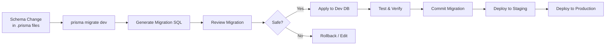

# Database — Migration Strategy

> Bagian dari dokumentasi **Database**. Indeks: [../README.md](../README.md) · Terkait: [erd.md](./erd.md) · [models.md](./models.md) · [indexes.md](./indexes.md) · [constraints.md](./constraints.md) · [security.md](./security.md) · [performance.md](./performance.md) · [dashboard-snapshots.md](./dashboard-snapshots.md)

<details>
<summary><strong>Migration Strategy</strong> — Strategi migrasi dan versioning schema</summary>

## Strategi Migrasi

### Alur Migrasi


```mermaid
flowchart LR
    A[Schema Change<br/>in .prisma files] --> B[prisma migrate dev]
    B --> C[Generate Migration SQL]
    C --> D[Review Migration]
    D --> E{Safe?}
    E -->|Yes| F[Apply to Dev DB]
    E -->|No| G[Rollback / Edit]
    F --> H[Test & Verify]
    H --> I[Commit Migration]
    I --> J[Deploy to Staging]
    J --> K[Deploy to Production]
```

### Jenis Migrasi & Tingkat Risiko

| Migration Type | Risk | Strategy | Rollback |
|----------------|------|----------|----------|
| **Add New Table** | LOW | Deploy langsung | Easy (drop table) |
| **Add Nullable Column** | LOW | Deploy langsung | Easy (drop column) |
| **Add NOT NULL Column with Default** | MEDIUM | Backfill di migration | Medium (remove default, drop column) |
| **Add NOT NULL Column without Default** | HIGH | 2-step: (1) add nullable, (2) backfill + alter | Hard |
| **Rename Column** | HIGH | 2-step: (1) add new + copy data, (2) drop old | Medium |
| **Change Column Type** | HIGH | Test di staging, bisa butuh data transformation | Hard |
| **Drop Column** | HIGH | Review dependency dulu, bisa 2-step (deprecated → drop) | Hard (restore from backup) |
| **Drop Table** | CRITICAL | Review dependency + backup, soft-delete preferred | Very Hard |
| **Add UNIQUE Constraint** | MEDIUM | Check duplicate data dulu | Easy (drop constraint) |
| **Add FK Constraint** | MEDIUM | Check orphaned records dulu | Easy (drop constraint) |

### Riwayat Migrasi

| Migration | Date | Description | Impact |
|-----------|------|-------------|--------|
| `20260521232859_init` | 2026-05-21 | Initial schema — Geography, User, Menu, RBAC, FarmerGroup | CRITICAL (baseline) |
| `20260606104223_add_farmer_group_indexes` | 2026-06-06 | Add indexes on FarmerGroup (districtId, isActive, code) | LOW (index only) |
| `20260607000000_add_farmer` | 2026-06-07 | Add Farmer model (demographics, farmerId, nik) | HIGH (new table) |
| `20260610085445_init_training` | 2026-06-10 | Add Training module (Package, Activity, Participant) | HIGH (3 new tables) |
| `20260610091207_add_training_evidence` | 2026-06-10 | Add evidence upload fields to TrainingActivity (evidenceKey, evidenceName) | LOW (nullable fields) |
| `20260614075754_add_land_parcel` | 2026-06-14 | Add LandParcel model (#88): geolocation, polygon, area, planting year, revision tracking | HIGH (new table with geospatial features) |
| `20260615050657_add_production_record` | 2026-06-15 | Add ProductionRecord model (#89): yield tracking per farmer/parcel, period, harvest number | HIGH (new table) |
| `20260628211657_add_training_participant_scores` | 2026-06-28 | Add `preTestScore` & `postTestScore` (nullable Int) ke TrainingParticipant (#94) | LOW (nullable fields) |
| `20260628214742_add_parcelid_to_production_unique` | 2026-06-28 | Ubah unique ProductionRecord: tambah `parcelId` → `(farmerId, parcelId, period, harvestNumber)` | MEDIUM (constraint change) |
| `20260708042109_add_main_dashboard_snapshot` | 2026-07-08 | Add MainDashboardSnapshot → `tbl_snapshot_main_dashboard` (#99, DASH-01) | HIGH (new table + snapshot pattern) |
| `20260714032307_add_land_parcel_sub_group` | 2026-07-14 | Add `LandParcel.subGroupLv1` (Gapoktan) + `subGroupLv2` (Kelompok Tani) — sub-kelompok interim per-lahan (#146, TD-014) | LOW (2 nullable columns, additive; baris lama NULL) |
| `20260714044513_add_land_parcel_blok` | 2026-07-14 | Add `LandParcel.blok` (String?, blok kebun) | LOW (1 nullable column, additive; baris lama NULL) |
| `20260715040235_farmer_group_type_years_rspo_cert` | 2026-07-15 | Add `FarmerGroup`: `group_type` (enum `FarmerGroupType` ASOSIASI/KOPERASI), `established_year`, `rspo_cert_year`, `rspo_cert_status` (enum `RspoCertStatus` CERTIFIED/PLANNED) (#160) | LOW (4 nullable columns + 2 enums, additive; baris lama NULL) |
| `20260715081831_add_bmp_dashboard_snapshot` | 2026-07-15 | Add BmpDashboardSnapshot → `tbl_snapshot_bmp_dashboard` (#166, DASH-04) — snapshot pattern kedua; unique `(snapshot_date, district_id)` | HIGH (new table; **applied 2026-07-15**, approval owner) |
| `20260716031500_add_farmer_group_ispo_sapmap` | 2026-07-16 | Add `FarmerGroup`: `ispo_cert_year` + `ispo_cert_status`, `sap_map_assurance_year` + `sap_map_assurance_status` (enum generik `CertStatus` CERTIFIED/PLANNED) (#169) | LOW (4 nullable columns + 1 enum, additive; baris lama NULL; file ditulis manual, **applied 2026-07-16** approval owner) |
| `20260720044357_add_land_parcel_species_psr` | 2026-07-20 | Add `LandParcel`: `species` (String?, species komoditas) + `is_psr` (Boolean default false — PSR/replanting, produksi 0 wajar). `crop_type` existing = Komoditas; data fix terpisah: 4.163 lahan di-set "Kelapa Sawit" via script lokal (dry-run dulu) | LOW (1 nullable column + 1 boolean default, additive; **applied 2026-07-20**, permintaan owner) |
| `20260721060000_farmer_id_unique_per_group` | 2026-07-21 | Add UNIQUE composite `(farmer_group_id, farmer_id)` ke `tbl_farmer` (TD-024) — ID Petani unik **per Lembaga**; file ditulis manual dengan prasyarat cek duplikat (query di komentar migrasi; diverifikasi mis-prod 2026-07-21: 3.448 baris, 0 duplikat) | MEDIUM (add UNIQUE constraint; gagal bila ada duplikat — cek dulu; **applied 2026-07-21**) |
| `20260722010000_add_donor_role` | 2026-07-22 | `ALTER TYPE "Role" ADD VALUE 'DONOR'` (#187) | LOW (additive enum value; **applied mis-prod 2026-07-22**) |
| `20260722030000_drop_gapoktan_sub_group_lv1` | 2026-07-22 | **DROP COLUMN** `LandParcel.sub_group_lv1` (Gapoktan/KUD) — hierarki final 3 level (#189) | **DESTRUCTIVE** (drop kolom; keputusan owner "drop langsung") |
| `20260806040000_add_training_activity_notes` | 2026-08-06 | Add `TrainingActivity.notes` (String?, catatan bebas: sesi multi-hari, label modul Paket 1) + data move: `location ILIKE 'Modul%'` (390 baris) dipindah ke `notes`, `location` di-NULL-kan — "Modul BMP" bukan lokasi sebenarnya. Efek: angka kelengkapan lokasi di Dashboard Pelatihan turun (lebih jujur); file ditulis manual | MEDIUM (1 nullable column additive + UPDATE data move; angka Kualitas Data berubah) |
| `20260808110000_add_tree` | 2026-08-08 | Add `Tree` → `tbl_tree` (#238): titik pohon sawit per lahan dari shapefile point; revisi **per-set** (upload ulang menonaktifkan set lama, set baru `revision + 1`) | HIGH (new table) |
| `20260811100000_add_reference_benchmark` | 2026-08-11 | Add `ReferenceBenchmark` → `tbl_reference_benchmark` (#243): angka acuan manual per Lembaga (UNIQUE `farmer_group_id`, kolom metrik nullable) untuk Data Analyst › Komparasi Data Acuan | LOW (new table, additive) |
| `20260812090000_add_permission_level_export_print` | 2026-08-12 | `ALTER TYPE "PermissionLevel" ADD VALUE 'EXPORT'`, `'PRINT'` (#245) — nilai enum baru; backfill di migrasi terpisah (PG melarang memakai nilai baru di transaksi yang sama) | LOW (additive enum value) |
| `20260812090100_backfill_export_print_permission` | 2026-08-12 | Backfill #245: setiap izin VIEW aktif (role & override per-user) disalin menjadi EXPORT + PRINT (`created_by = 'migration:issue-245'`, `ON CONFLICT DO NOTHING`) agar perilaku lama tak berubah | MEDIUM (data backfill RBAC) |
| `20260812130000_scope_export_print_backfill_to_leaf` | 2026-08-12 | Koreksi backfill #245: hapus baris EXPORT/PRINT buatan backfill di **menu induk** (kaskade izin bersifat union, jadi izin di induk membatalkan revoke per sub-menu); grant manual utuh via filter `created_by` | MEDIUM (data delete terarah) |
| `20260819041658_farmer_group_boundary` | 2026-08-19 | Add `FarmerGroupBoundary` → `tbl_farmer_group_boundary` (#266): boundary ICS per Lembaga (`geom geometry(MultiPolygon,4326)` + `geojson`), sudah termasuk buffer 1,5 km — dipakai Fire Alert | HIGH (new table, PostGIS) |
| `20260819073337_administrative_boundary` | 2026-08-19 | Add enum `AdminBoundaryLevel` (KABUPATEN/KECAMATAN/DESA) + `AdministrativeBoundary` → `tbl_administrative_boundary` (#266): poligon wilayah administrasi BIG, `district_id` opsional (FK SET NULL) | HIGH (new table, PostGIS) |
| `20260827053327_land_parcel_satellites` | 2026-08-27 | Identitas lahan stabil antar revisi `tbl_land_parcel_identity` + `LandParcel.parcel_uid` (NOT NULL, **di-backfill** satu uid per pasangan `farmer_id`+`parcel_id` lintas revisi/status) + satelit `tbl_land_parcel_document`, `tbl_land_stdb` + `tbl_land_parcel_stdb` (M:N), `tbl_land_parcel_external_id`, `tbl_land_parcel_program`; enum `LandDocumentType`, `LandProgramType`, `LandProgramStatus` (#296, Decision Log 2026-08-27). File **disunting** dari `--create-only`: dua `DROP INDEX *_geom_idx` yang diusulkan Prisma **dibuang** (GiST manual pada kolom `Unsupported` — Prisma akan selalu mengusulkannya, jangan pernah diterima) | MEDIUM (5 tabel baru + kolom NOT NULL ber-backfill; **applied `mis-staging-local` 2026-08-27** dan **applied mis-prod 2026-08-27** (#302, `migrate deploy` manual pasca dump `scripts/dump-prod/2026-08-27/mis-prod-pre-20260827053327.dump`; verifikasi: 13.639 identitas = 13.639 pasangan, 0 NULL/orphan/mismatch, 2 GiST utuh; drift checksum #270 diabaikan `migrate deploy`); **applied `mis-dev` 2026-08-27** via `migrate dev` setelah checksum `20260721060000` di `_prisma_migrations` disamakan dengan sha256 file lokal (#270 selesai; dump `tmp-backup/mis-dev-pre-20260827053327-2026-08-27.dump`): 10.953 identitas = 10.953 pasangan, 0 NULL/orphan, 2 GiST utuh) |
| `20260829031525_land_stdb_stage` | 2026-08-29 | **Tahapan penerbitan STDB (#306) + audit tautan (#299), digabung satu migrasi** (tabel serumpun — memisahkannya = dua siklus `migrate deploy` prod). `LandStdb`: enum `LandStdbStage` (PERSIAPAN_DATA/PENGAJUAN/REVISI/TERBIT/DITOLAK) + `stage` default **TERBIT** (1.086 baris lama benar apa adanya, tanpa backfill menebak), `number` **jadi opsional**, `prepared_at`/`submitted_at`/`issued_at`/`stage_changed_at`/`submitted_to`/`stage_note`. `LandParcelStdb`: `modified_at`/`modified_by` (#299). File **disunting** dari `--create-only` tiga kali: (1) dua `DROP INDEX *_geom_idx` **dibuang** (sama seperti `land_parcel_satellites`); (2) `modified_at` ditambah **nullable → backfill dari `created_at` → SET NOT NULL** (tabel berisi 1.596 baris; NOT NULL langsung gagal, dan `created_at` lebih jujur daripada NOW()); (3) `tbl_land_stdb_farmer_id_number_key` diganti **dua partial unique index tulis-tangan** (Prisma tak bisa mendeklarasikannya): `uniq_land_stdb_farmer_number` `(farmer_id, number) WHERE number IS NOT NULL AND is_active` dan `uniq_land_stdb_farmer_open` `(farmer_id) WHERE stage IN (PERSIAPAN_DATA,PENGAJUAN,REVISI) AND is_active`. Tanpa index kedua, `NULL ≠ NULL` di Postgres membuat satu petani bisa punya belasan baris pengajuan kembar. **202 baris bernomor pendek Pelalawan sengaja TIDAK dipindah** — masih dugaan, menunggu jawaban penyusun berkas (#306). Dijaga `src/test/migration-guards.test.ts` (6 test baru). | MEDIUM (drop 1 unique + 2 partial index baru + 8 kolom; **applied `mis-dev` 2026-08-29** via `migrate dev`, dump `tmp-backup/mis-dev-before-stdb-stage-20260829-1014.dump`; verifikasi: 1.086 baris TERBIT, 1.596 tautan `modified_at = created_at`, 2 GiST utuh, kedua partial index terpasang. **applied `mis-staging-local` 2026-08-29** via `migrate deploy` (dump `tmp-backup/mis-staging-local-before-stdb-stage-20260829-1122.dump`); prasyarat dicek baca-saja lebih dulu dan semuanya lolos: index lama `tbl_land_stdb_farmer_id_number_key` **ada** (penting — `DROP INDEX` di migrasi ini tanpa `IF EXISTS`), 0 calon pelanggaran `uniq_land_stdb_farmer_number`, 0 `created_at` NULL pada 1.596 tautan, 2 GiST ada, tipe `LandStdbStage` belum ada. Verifikasi pasca-deploy identik dengan mis-dev: 29 migrasi, kedua partial index `indisvalid`+`indisunique`, index lama hilang, 1.086 baris `TERBIT` tanpa nomor NULL, 1.596 tautan `modified_at = created_at` (0 NULL), 0 pelanggaran invarian berkas-terbuka, 2 GiST utuh, skala data tak berubah (13.639/1.086/1.596/6.032/6.953 = angka prod). **applied `mis-staging` 2026-08-29 12:46** via `npx dotenv -e .env.staging -- npx prisma migrate deploy` (#309); 6 prasyarat dicek baca-saja lebih dulu, semuanya lolos, dan skala data identik `mis-staging-local` sehingga gladi resiknya sah; verifikasi pasca-deploy 10 metrik hijau, sama persis dengan dua env lokal. **Tanpa dump pra-migrasi** — `pg_dump` lokal 17.10 menolak server 18.3 ("aborting because of server version mismatch"); dilanjutkan karena bukan prod, prasyarat lolos, rollback SQL ada di header migrasi, dan `tmp-backup/mis-staging-local-before-stdb-stage-20260829-1122.dump` adalah snapshot pra-migrasi berskala identik. **Untuk `mis-prod` dump WAJIB, jadi versi `pg_dump` harus diselesaikan dulu** — prod juga PG 18.3 (dicek baca-saja). applied `mis-prod` 2026-08-29 (#309, `pg_dump` 18 → dump → `migrate deploy` → refresh `applied-checksums.json`)) |
| `20260914100000_land_parcel_geom` | 2026-09-14 | **#317 Fase 1 (dikerjakan lewat #327)** — `LandParcel.geom geometry(MultiPolygon,4326)` **GENERATED ALWAYS AS (…) STORED** dari `geometry` JSONB + GiST manual `tbl_land_parcel_geom_idx`. Tanpa backfill (Postgres mengisi 14.003 baris saat ALTER, 161 ms di TEMP), tanpa perubahan jalur tulis, mustahil divergen (beda dual-column manual #266). Ekspresi dijaga `CASE` pada `type` + `coordinates` array karena `ST_GeomFromGeoJSON` **melempar error** untuk JSON `null`/objek asing — dengan guard, baris seperti itu cukup `geom NULL`. **Review 2026-09-14:** `ST_MakeValid` dibungkus `ST_CollectionExtract(…, 3)` — pada ring kolinear/berduri `ST_MakeValid` mengembalikan LINESTRING dan kolom MultiPolygon menolak barisnya (seluruh transaksi bulk upload gagal); identik untuk 14.003 baris nyata. File disunting **sebelum** naik ke staging/prod; di `mis-dev` & `mis-staging-local` kolom di-drop + dibuat ulang dan checksum `_prisma_migrations` disamakan dengan sha256 file (pola #270), `migrate status` up to date. File ditulis manual dari `migrate diff`: dua `DROP INDEX *_geom_idx` dibuang, klausa `GENERATED` ditambah. Dijaga `migration-guards.test.ts` (5 test; penjaga `*_geom_idx` kini mengabaikan komentar `--` agar petunjuk ROLLBACK di header tak dihitung) | LOW–MEDIUM (1 kolom turunan + 1 GiST; **applied `mis-dev` & `mis-staging-local` 2026-09-14** via `migrate deploy`, dump `scripts/dump-prod/2026-09-14/<db>-before-geom-border.dump`; verifikasi keduanya identik: 31 migrasi, 14.003 `geom` terisi / 0 NULL / 0 invalid, 3 GiST `indisvalid`, `attgenerated = s`. **Applied `mis-staging` 2026-09-15** (#333: prasyarat 10/10 termasuk evaluasi ekspresi `geom` atas 14.003 baris baca-saja; dump `scripts/dump-prod/2026-09-15/mis-staging-before-parcel-satellites-2.dump`; 34 migrasi tercatat, 0 `geom` NULL, 4 GiST). **Applied `mis-prod` 2026-09-15 18:53** (prasyarat 11/11, dump `mis-prod-before-parcel-satellites-2.dump`, 6 detik, 11 metrik ✓; checksum disegarkan 34 entri) |
| `20260914100100_land_parcel_border` | 2026-09-14 | **#326 sepadan lahan** — `tbl_land_parcel_border` satelit **1:1** ke `tbl_land_parcel_identity` (`parcel_uid` UNIQUE, FK ke identity — utuh lintas revisi shapefile): `north/east/south/west/notes` teks bebas + audit. Tanpa backfill. Hasil `migrate diff` dipakai apa adanya (dua `DROP INDEX *_geom_idx` dibuang) | LOW (tabel baru; **applied `mis-dev` & `mis-staging-local` 2026-09-14** bersama `land_parcel_geom`, FK terverifikasi ke `tbl_land_parcel_identity`; **applied `mis-staging` & `mis-prod` 2026-09-15** (#333)) |
| `20260914150000_land_parcel_nkt` | 2026-09-14 | **#328 status NKT/HCV per lahan** (MD-08 langkah pertama) — `tbl_land_parcel_nkt` satelit **1:1** ke `tbl_land_parcel_identity` + enum `LandNktStatus` (INCLUDED/AFFECTED/NOT_AFFECTED) & `NktCategory` (NKT_1…6, kolom array); `affected_area_ha`/`affected_length_m` mengikuti Lampiran asesmen HJP. Tanpa backfill. File disunting dari `migrate diff`: tiga `DROP INDEX *_geom_idx` **dan** `ALTER COLUMN geom DROP DEFAULT` dibuang — Prisma membaca ekspresi GENERATED `geom` sebagai default dan akan selalu mengusulkan pencabutannya (error di Postgres); dijaga test baru di `migration-guards.test.ts` | LOW (tabel + 2 enum baru; **applied `mis-dev` & `mis-staging-local` 2026-09-14**; **applied `mis-staging` & `mis-prod` 2026-09-15** (#333)) |
| `20260914170000_land_marker` | 2026-09-14 | **#329 patok batas lahan** — `tbl_land_marker` (patok fisik; `geom geometry(Point,4326)` **GENERATED** dari `longitude/latitude` + GiST manual `tbl_land_marker_geom_idx`) + `tbl_land_parcel_marker` (M:N ke `tbl_land_parcel_identity`, `sequence_no` per lahan, `source_revision`) + enum `LandMarkerCondition`/`LandMarkerType`/`LandMarkerSource`; **partial unique** `uniq_land_parcel_marker_seq (parcel_uid, sequence_no) WHERE is_active` ditulis manual (Prisma tak bisa mendeklarasikannya). Tanpa backfill. Disunting dari `migrate diff` seperti #328 (tiga `DROP INDEX *_geom_idx` + `ALTER COLUMN geom DROP DEFAULT` dibuang; dijaga guard test) | LOW (2 tabel + 3 enum baru; **applied `mis-dev` & `mis-staging-local` 2026-09-14**; **applied `mis-staging` & `mis-prod` 2026-09-15** (#333)). Pasca-migrasi di mis-dev: patok HJP (559 lahan) diturunkan dari poligon lewat skrip lokal `scripts/local/seed/patok/generate-markers.ts` → 1.014 patok / 2.291 tautan |
| `20260914200000_land_marker_code` | 2026-09-14 | **#331 kode patok unik** — `tbl_land_marker.code` (nullable → **backfill dua tahap** → NOT NULL + UNIQUE `tbl_land_marker_code_key`) + `tbl_land_marker_counter(prefix PK, last_no)`. Backfill: awalan = singkatan Lembaga lahan pemakai pertama (tautan aktif tertua; lalu tautan mana pun; sisanya `MIS`), nomor urut per awalan mengikuti Kelompok Tani → Blok → ID Lahan → nomor patok; counter = nomor terbesar per awalan. Dijaga `migration-guards.test.ts` (urutan add→backfill→NOT NULL→unique, bentuk kode) | LOW (kolom + tabel kecil; dry-run `BEGIN … ROLLBACK` di mis-dev: 1.015 kode unik `HJP-PTK-000001…001015`; **applied `mis-dev` & `mis-staging-local` 2026-09-14** (staging-local 0 patok); **applied `mis-staging` 2026-09-15** (#333, 0 patok → backfill no-op, `code` NOT NULL + UNIQUE); **applied `mis-prod` 2026-09-15** — sama, 0 patok) |
| `20260918120000_bmp_assessment` | 2026-09-18 | **#344 Monev BMP** — `tbl_bmp_assessment`: skor Monev BMP per **petani** per tahun survei (`farmer_id` FK, `survey_year`, `survey_date?`, `score` 0–3, `parcel_uid?` → identitas lahan dikunjungi, `assessor?`, `notes?`, audit + `is_active`); 3 index (`(farmer_id, survey_year)`, `survey_year`, `is_active`). **Tanpa UNIQUE** petani-tahun di file ini (dijaga action; partial unique menyusul di `20260920100000`). Tanpa backfill; kategori dihitung di kode. File ditulis manual dari `migrate diff`: 4 `DROP INDEX *_geom_idx` + 2 `ALTER COLUMN geom DROP DEFAULT` **dibuang** (pola #328/#329; guard test) | LOW (1 tabel baru, additive; applied `mis-dev` & `mis-staging-local` 2026-09-20; **`mis-staging` & `mis-prod` 2026-09-20** (#348, dump pra-migrasi `scripts/dump-prod/2026-09-20/mis-{staging,prod}-before-monev.dump`, QC A,E ✓, checksum 37 entri disegarkan) |
| `20260920100000_bmp_assessment_unique_active` | 2026-09-20 | **#344 temuan review** — partial unique index tulis tangan `uniq_bmp_assessment_farmer_year_active (farmer_id, survey_year) WHERE is_active`: satu penilaian aktif per petani-tahun dijamin DB (cek `findFirst` di action tidak atomik saat dua operator mengimpor bersamaan). Prasyarat baca-saja: 0 duplikat aktif (query di header migrasi). Dijaga `migration-guards.test.ts` | LOW (1 index; applied `mis-dev` & `mis-staging-local` + **`mis-staging` & `mis-prod` 2026-09-20** (#348)) |
| `20260920120000_bmp_indicator_detail` | 2026-09-20 | **#346 rincian Monev BMP** — enum `BmpIndicatorLevel` + `ref_bmp_indicator` (master 32 indikator; unique `(code, level)`), `tbl_bmp_assessment_detail` (unique `(assessment_id, indicator_id)`), `tbl_bmp_group_assessment` (+ **partial unique** tulis tangan `uniq_bmp_group_assessment_group_year_active WHERE is_active`) dan `tbl_bmp_group_assessment_detail`. FK RESTRICT ke `tbl_bmp_assessment`, `ref_bmp_indicator`, `tbl_farmer_group`. Tanpa backfill; master di-seed terpisah (`scripts/seed/seed-bmp-indicators.ts --apply`, idempoten). File disunting dari `migrate diff` (4 `DROP INDEX *_geom_idx` + 2 `DROP DEFAULT` dibuang; guard test) | LOW–MEDIUM (4 tabel + 1 enum, additive; applied `mis-dev` & `mis-staging-local` + **`mis-staging` & `mis-prod` 2026-09-20** (#348) + seed 32 indikator & seed menu di keduanya (`rbac:compare` selaras)) |
| `20260921120000_drop_activity_status_tree_surveyed_at` | 2026-09-21 | **#353 bagian E (keputusan owner)** — `DROP TYPE "ActivityStatus"` (enum dibuat di init untuk modul aktivitas yang tak pernah lahir; 0 kolom, 0 rujukan kode/seed) + `ALTER TABLE tbl_tree DROP COLUMN surveyed_at` (#238: tak pernah ditulis `bulk-upload-tree.ts` maupun dibaca; kontrak DBF shapefile pohon tanpa atribut tanggal). Prasyarat baca-saja di header migrasi (mis-prod 2026-09-21: 286 baris, 0 terisi; enum tak dipakai kolom mana pun). Ditulis tangan (4 `DROP INDEX *_geom_idx` + 2 `DROP DEFAULT` usulan Prisma dibuang; guard test). Rollback SQL di header | LOW (drop 1 enum + 1 kolom nullable kosong; applied `mis-dev` & `mis-staging-local` 2026-09-21 via `migrate deploy`, dump `scripts/dump-prod/2026-09-21/*-before-353e.dump`; applied `mis-staging` & `mis-prod` 2026-09-21 (#357, tercatat di `applied-checksums.json`)) |
| `20260923120000_external_id_shared_code` | 2026-09-23 | **UL Parcel Code boleh di >1 lahan** (keputusan owner: klaim ganda vendor disimpan dulu, dicek silang belakangan) — `DROP INDEX tbl_land_parcel_external_id_source_code_key` → UNIQUE `(parcel_uid, source, code)` + INDEX `(source, code)`. Tanpa perubahan data; setiap pasangan `(source, code)` lama otomatis unik juga per lahan. Kode ikut: planner import tak lagi melewati kode aktif di lahan lain (`externalIdsShared`), validator tak menolak kode sama di >1 lahan, aksi manual hanya menjaga duplikat di lahan sendiri, tab Legalitas menandai "Juga dipakai …" | LOW (ganti 1 unique + 1 index, tabel ±14 rb baris; **applied `mis-dev` & `mis-staging-local` 2026-09-23** via `migrate deploy`, dump `scripts/dump-prod/2026-09-23/<db>-before-external-id-shared-code.dump`; gladi import 142 lahan sisa di staging-local → 0 lahan tanpa kode, rerun idempoten. **applied `mis-prod` 2026-09-23** (dump `mis-prod-before-external-id-shared-code.dump`, checksum disegarkan; 4 index terverifikasi, 14.031 baris utuh). **applied `mis-staging` 2026-09-23** (dump `mis-staging-before-v1.1.0.dump`; 39 migrasi, 13.009 baris utuh, 4 index terverifikasi)) |
| `20260930120000_production_record_parcel_period_idx` | 2026-09-30 | **#251 indeks produksi** sebelum import massal (grain 1 baris/lahan/bulan, ±900k baris 2028): tambah `(parcel_id, period)`, buang `parcel_id` tunggal (tercakup awalan) & `is_active` tunggal (tak dipakai planner). Diukur di DB terpisah 840.960 baris sintetis — Peta BMP 182 → 116 ms, lahan+periode 0,22 → 0,005 ms, insert 20k +±10% ([indexes.md](./indexes.md) §Pengukuran ProductionRecord). SQL tulis tangan (bukan `migrate dev`: selalu mengusulkan DROP GiST); header memuat `-- ROLLBACK:` | LOW (indeks saja; **applied `mis-dev` & `mis-staging-local` 2026-09-30**, dump `scripts/dump-prod/2026-09-30/<db>-before-251-production-index.dump`; drift tabel produksi 0 — sisa diff hanya GiST/`geom` lama. applied **`mis-staging` 2026-09-30** sebelum merge `mvp → staging` (dump `mis-staging-before-251-production-index.dump`; 19.554 baris, indeks = `mis-dev`); **`mis-prod` 2026-09-30** sebelum PR `staging → main` (dump `mis-prod-before-251-production-index.dump`; 19.554 baris utuh, indeks = staging). Mendahului tag `v1.2.0` yang live → **sah jalur (a) kompatibel mundur**: `git grep` nama indeks lama di `v1.2.0` = 0 rujukan, indeks tak mengubah hasil query; snapshot `applied-checksums.json` disegarkan; jendela tertutup saat tag v1.3.0) |

### Versi Skema

Versi skema mengelompokkan migrasi per perubahan domain (semver skema, bukan versi aplikasi); rincian per migrasi di tabel Riwayat Migrasi di atas.


| Version | Date | Key Changes | Impact |
|---------|------|-------------|--------|
| **2.12.3** | 2026-09-30 | Indeks `ProductionRecord` (#251): `(parcelId, period)` menggantikan `parcelId` tunggal, `isActive` tunggal dibuang — migrasi `20260930120000_production_record_parcel_period_idx` | LOW (indeks saja) |
| 2.12.2 | 2026-09-23 | UL Parcel Code boleh di >1 lahan (keputusan owner — klaim ganda vendor dicek silang belakangan): `LandParcelExternalId` UNIQUE `(source, code)` → UNIQUE `(parcelUid, source, code)` + INDEX `(source, code)` — migrasi `20260923120000_external_id_shared_code`, applied `mis-dev`, `mis-staging-local`, `mis-prod`, `mis-staging` 2026-09-23 | LOW (ganti 1 unique + 1 index, tanpa perubahan data) |
| 2.12.1 | 2026-09-21 | Cleanup #353 bagian E: `DROP TYPE "ActivityStatus"` (enum yatim sejak init, 0 kolom) + `tbl_tree.surveyed_at` dihapus (0/286 terisi di prod; shapefile pohon tak punya atribut tanggal, tak pernah ditulis/dibaca) — migrasi `20260921120000_drop_activity_status_tree_surveyed_at`, applied semua DB (prod & staging via #357, rilis v0.37.0) | LOW (drop 1 enum + 1 kolom nullable kosong; tanpa data hilang) |
| 2.12.0 | 2026-09-20 | Rincian Monev BMP (#346): `BmpIndicator` → `ref_bmp_indicator` (32 indikator, 5 kegiatan berbobot, level LEMBAGA/INDIVIDU, bobot, rubrik 0–3; seed CSV), `BmpAssessmentDetail` → `tbl_bmp_assessment_detail` (skor indikator individu per penilaian, `weightUsed`), `BmpGroupAssessment` + `BmpGroupAssessmentDetail` (penilaian Lembaga per tahun, partial unique aktif). Migrasi `20260920120000_bmp_indicator_detail` (manual, additive). Plus `20260920100000_bmp_assessment_unique_active` (partial unique petani-tahun, review #344) | LOW–MEDIUM (4 tabel + 1 enum baru, additive) |
| 2.11.0 | 2026-09-18 | Monev BMP (#344): `BmpAssessment` → `tbl_bmp_assessment` — skor 0–3 per **petani** per tahun survei (FK `farmerId`; `parcelUid` opsional = lahan dikunjungi), kategori dihitung dari skor (tidak disimpan); satu baris aktif per petani-tahun dijaga di action. Migrasi `20260918120000_bmp_assessment` (manual dari `migrate diff`, tanpa backfill) | LOW (new table, additive) |
| 2.10.6 | 2026-09-14 | Keluarga satelit lahan tahap 2: `LandParcel.geom` GENERATED + GiST (#317 Fase 1), `LandParcelBorder` (#326), `LandParcelNkt` + enum `LandNktStatus`/`NktCategory` (#328), `LandMarker` + `LandParcelMarker` + enum patok (#329), kode patok unik + `LandMarkerCounter` (#331) — 5 migrasi `20260914*` | MEDIUM (5 tabel + 1 kolom generated, additive; backfill kode patok) |
| 2.10.5 | 2026-08-29 | Tahapan STDB (#306) + audit tautan (#299): enum `LandStdbStage`, UNIQUE `(farmerId, number)` diganti dua partial unique tulis tangan — migrasi `20260829031525_land_stdb_stage` | MEDIUM (enum + constraint change) |
| 2.10.4 | 2026-08-27 | Satelit lahan (#296): `LandParcelIdentity` + `LandParcel.parcelUid` (backfill), `LandParcelDocument`, `LandStdb` + `LandParcelStdb`, `LandParcelExternalId`, `LandParcelProgram` — migrasi `20260827053327_land_parcel_satellites` | HIGH (6 tabel + kolom NOT NULL ber-backfill) |
| 2.10.3 | 2026-08-19 | Boundary (#266): `FarmerGroupBoundary` + `AdministrativeBoundary` (enum `AdminBoundaryLevel`), PostGIS `geom` + `geojson` | MEDIUM (2 tabel baru, additive) |
| 2.10.2 | 2026-08-12 | Izin `EXPORT`/`PRINT` di enum `PermissionLevel` (#245) + backfill dari VIEW, lalu dikoreksi ke menu daun saja — 3 migrasi `20260812*` | MEDIUM (enum + backfill data RBAC) |
| 2.10.1 | 2026-08-11 | `ReferenceBenchmark` → `tbl_reference_benchmark` (#243), angka acuan per Lembaga | LOW (new table, additive) |
| 2.10.0 | 2026-08-08 | Tree model (#238): `tbl_tree` titik pohon sawit per lahan, bulk upload ZIP shapefile point, revisi per-set — applied mis-prod | MEDIUM (new table, additive) |
| 2.9.0 | 2026-07-20 | Field lahan `species` (String?) + `isPsr` (Boolean default false — PSR = Peremajaan Sawit Rakyat); `cropType` = Komoditas, data fix 4.163 lahan → "Kelapa Sawit" | LOW (additive) |
| 2.8.0 | 2026-07-16 | Sertifikasi Lembaga Petani (#169): `FarmerGroup.ispoCertYear` + `ispoCertStatus` + `sapMapAssuranceYear` + `sapMapAssuranceStatus` (enum generik `CertStatus` CERTIFIED/PLANNED — `RspoCertStatus` existing dibiarkan) | LOW (4 nullable columns + 1 enum, additive) |
| 2.7.0 | 2026-07-15 | Dashboard BMP snapshot (#166, DASH-04): BmpDashboardSnapshot → `tbl_snapshot_bmp_dashboard` (snapshot pattern kedua, data JSON per Lembaga) — migration applied + seed menu/permission (approval owner) | MEDIUM (new table, additive) |
| 2.6.0 | 2026-07-15 | Identitas Lembaga Petani (#160): `FarmerGroup.groupType` (enum `FarmerGroupType`) + `establishedYear` + `rspoCertYear` + `rspoCertStatus` (enum `RspoCertStatus`); data `code` ICS→ISH | LOW (4 nullable columns + 2 enums, additive) |
| 2.5.0 | 2026-07-14 | `LandParcel.blok` (String?, blok kebun) | LOW (1 nullable column, additive) |
| 2.4.0 | 2026-07-14 | Sub-kelompok interim per-lahan (#146): `LandParcel.subGroupLv1` (Gapoktan) + `subGroupLv2` (Kelompok Tani); `FarmerGroup` diklarifikasi = **Lembaga Petani** (TD-013/#147) | LOW (2 nullable columns, additive) |
| 2.3.0 | 2026-07-08 | Dashboard snapshot (#99): MainDashboardSnapshot model, separate table per dashboard pattern | MEDIUM (new table + pattern establishment) |
| 2.2.1 | 2026-06-28 | Training participant pre/post-test scores (#94) + unique ProductionRecord ditambah `parcelId` | LOW–MEDIUM (nullable fields + constraint change) |
| 2.2.0 | 2026-06-22 | Production module (#89): ProductionRecord model, per-farmer/parcel yield tracking, bulk upload | Medium (new table + production tracking features) |
| 2.1.0 | 2026-06-14 | Land Parcel module (#88): LandParcel model, ZIP Shapefile bulk upload | Medium (new table + geospatial features) |
| 2.0.0 | 2026-06-11 | Training module, Farmer.joinedYear | Medium (new tables + optional field) |
| 1.5.0 | 2026-05-22 | RBAC overrides, User data access | High (new RBAC tables) |
| 1.0.0 | 2026-04-14 | Initial schema | — |

---

<details open>
<summary><strong>ERD Overview</strong> — Visualisasi lengkap relasi antar tabel</summary>

## Gambaran ERD


```mermaid
erDiagram
    %% ═══════════════════════════════════════════
    %% GEOGRAPHY
    %% ═══════════════════════════════════════════

    Province {
        String id PK
        String code UK
        String name
        Boolean is_active
        DateTime created_at
        String created_by
        DateTime modified_at
        String modified_by
    }

    District {
        String id PK
        String province_id FK
        String code UK
        String name
        Boolean is_active
        DateTime created_at
        String created_by
        DateTime modified_at
        String modified_by
    }

    Subdistrict {
        String id PK
        String district_id FK
        String code UK
        String name
        Boolean is_active
        DateTime created_at
        String created_by
        DateTime modified_at
        String modified_by
    }

    Village {
        String id PK
        String subdistrict_id FK
        String code UK
        String name
        Boolean is_active
        DateTime created_at
        String created_by
        DateTime modified_at
        String modified_by
    }

    Province ||--o{ District : "has"
    District ||--o{ Subdistrict : "has"
    Subdistrict ||--o{ Village : "has"

    %% ═══════════════════════════════════════════
    %% USER & AUTH
    %% ═══════════════════════════════════════════

    User {
        String id PK
        String name
        String email UK
        String password
        Role role
        Boolean is_active
        DateTime created_at
        String created_by
        DateTime modified_at
        String modified_by
    }

    %% ═══════════════════════════════════════════
    %% FARMER GROUP
    %% ═══════════════════════════════════════════

    FarmerGroup {
        String id PK
        String district_id FK
        String code
        String abrv
        String abrv_3id
        String name
        FarmerGroupCategory category
        FarmerGroupType group_type
        Int join_year
        Int established_year
        Int rspo_cert_year
        RspoCertStatus rspo_cert_status
        Int ispo_cert_year
        CertStatus ispo_cert_status
        Int sap_map_assurance_year
        CertStatus sap_map_assurance_status
        Float location_lat
        Float location_long
        Boolean is_active
        DateTime created_at
        String created_by
        DateTime modified_at
        String modified_by
    }

    District ||--o{ FarmerGroup : "has"

    %% ═══════════════════════════════════════════
    %% FARMER
    %% ═══════════════════════════════════════════

    Farmer {
        String id PK
        String farmer_group_id FK
        Gender gender
        String name
        String farmer_id
        String nik
        String address
        String birth_place
        DateTime birth_date
        Int joined_year
        Boolean is_active
        DateTime created_at
        String created_by
        DateTime modified_at
        String modified_by
    }

    FarmerGroup ||--o{ Farmer : "has"

    %% ═══════════════════════════════════════════
    %% LAND PARCEL
    %% ═══════════════════════════════════════════

    LandParcel {
        String id PK
        String farmer_id FK
        String parcel_id
        String parcel_uid FK "LandParcelIdentity (#296)"
        String blok
        Json geometry "GeoJSON polygon — sumber kebenaran"
        Geometry geom "GENERATED dari geometry (#317 Fase 1)"
        Float area
        String land_status
        String crop_type
        String species
        Boolean is_psr
        Int planting_year
        String sub_group_lv2
        Int revision
        String notes
        Boolean is_active
        DateTime created_at
        String created_by
        DateTime modified_at
        String modified_by
    }

    Farmer ||--o{ LandParcel : "owns"

    %% ═══════════════════════════════════════════
    %% PRODUCTION RECORD
    %% ═══════════════════════════════════════════

    ProductionRecord {
        String id PK
        String farmer_id FK
        String parcel_id FK
        String period
        DateTime harvest_date
        Int harvest_number
        Float yield_kg
        String notes
        Boolean is_active
        DateTime created_at
        String created_by
        DateTime modified_at
        String modified_by
    }

    Farmer ||--o{ ProductionRecord : "records"
    LandParcel ||--o{ ProductionRecord : "from"

    %% ═══════════════════════════════════════════
    %% TRAINING
    %% ═══════════════════════════════════════════

    TrainingPackage {
        String id PK
        TrainingCategory code UK
        String name
        String desc
        Boolean is_active
        DateTime created_at
        String created_by
        DateTime modified_at
        String modified_by
    }

    TrainingActivity {
        String id PK
        String ref_training_package_id FK
        String farmer_group_id FK
        String location
        DateTime training_date
        String notes "catatan sesi (#228)"
        String evidence_key
        String evidence_name
        Boolean is_active
        DateTime created_at
        String created_by
        DateTime modified_at
        String modified_by
    }

    TrainingParticipant {
        String id PK
        String training_activity_id FK
        String farmer_id FK
        Int pre_test_score "nullable, 0-100"
        Int post_test_score "nullable, 0-100"
        Boolean is_active
        DateTime created_at
        String created_by
        DateTime modified_at
        String modified_by
    }

    TrainingPackage ||--o{ TrainingActivity : "has"
    FarmerGroup ||--o{ TrainingActivity : "hosts"
    TrainingActivity ||--o{ TrainingParticipant : "has"
    Farmer ||--o{ TrainingParticipant : "attends"

    %% ═══════════════════════════════════════════
    %% MENU
    %% ═══════════════════════════════════════════

    MenuItem {
        String id PK
        String key UK
        String parent_key FK
        String title
        String url
        String icon
        Int order
        Boolean is_active
        Boolean is_visible
        DateTime created_at
        String created_by
        DateTime modified_at
        String modified_by
    }

    MenuItem ||--o{ MenuItem : "parent-child"

    %% ═══════════════════════════════════════════
    %% RBAC
    %% ═══════════════════════════════════════════

    RolePermission {
        String id PK
        Role role
        String menu_key FK
        PermissionLevel permission
        Boolean is_active
        DateTime created_at
        String created_by
        DateTime modified_at
        String modified_by
    }

    UserProvince {
        String id PK
        String user_id FK
        String province_id FK
        DateTime created_at
        String created_by
        DateTime modified_at
        String modified_by
    }

    UserDistrict {
        String id PK
        String user_id FK
        String district_id FK
        DateTime created_at
        String created_by
        DateTime modified_at
        String modified_by
    }

    UserFarmerGroup {
        String id PK
        String user_id FK
        String farmer_group_id FK
        DateTime created_at
        String created_by
        DateTime modified_at
        String modified_by
    }

    UserPermissionOverride {
        String id PK
        String user_id FK
        String menu_key FK
        PermissionLevel permission
        Boolean granted
        Boolean is_active
        DateTime created_at
        String created_by
        DateTime modified_at
        String modified_by
    }

    MenuItem ||--o{ RolePermission : "default permissions"
    MenuItem ||--o{ UserPermissionOverride : "overrides"
    User ||--o{ UserProvince : "assigned"
    User ||--o{ UserDistrict : "assigned"
    User ||--o{ UserFarmerGroup : "assigned"
    User ||--o{ UserPermissionOverride : "has"
    Province ||--o{ UserProvince : "assigned to"
    District ||--o{ UserDistrict : "assigned to"
    FarmerGroup ||--o{ UserFarmerGroup : "assigned to"
```

</details>

### Checklist Pra-Deploy

Sebelum deploy migration ke production, pastikan:
- [ ] Migration SQL sudah direview manual (tidak ada DROP TABLE / DROP COLUMN unexpected)
- [ ] Test di local dev environment dulu
- [ ] Test di staging environment dengan production-like data volume
- [ ] Backup database production sebelum migrate — cek dulu `pg_dump --version` ≥ versi server (staging & prod **PG 18**; Homebrew `postgresql@17` ditolak, pakai `/opt/homebrew/opt/postgresql@18/bin/pg_dump`; #309)
- [ ] **Migrasi ber-ekspresi** (kolom `GENERATED`, backfill `UPDATE … SET x = f(y)`, CHECK ber-fungsi): jalankan ekspresi yang sama sebagai `SELECT` baca-saja atas **seluruh baris** dulu (`default_transaction_read_only = on`) — `ALTER … GENERATED … STORED` mengeksekusi ekspresi per baris dalam satu transaksi, satu baris cacat menggagalkan seluruh migrasi setelah mengunci tabel (#333: 14.003 baris `geom` dievaluasi < 1 dtk sebelum `migrate deploy`)
- [ ] Ada rollback plan jika migration gagal — pilih jalur di [../standards/rollback.md](../standards/rollback.md) (B1 roll-forward baku; `migrate resolve --rolled-back` **hanya** untuk migrasi gagal); tulis SQL pembalik di header `-- ROLLBACK:`
- [ ] Semua query di codebase sudah update (jika ada breaking change)
- [ ] Index creation untuk tabel besar dilakukan CONCURRENTLY (jika perlu)
- [ ] **Sesudah `migrate deploy` prod:** segarkan snapshot checksum — `npx dotenv -e .env.prod -- npx tsx scripts/migrations/refresh-applied-checksums.ts` (SELECT saja) → commit `prisma/migrations/applied-checksums.json`. Test `migration-guards.test.ts` (#303) membandingkan sha256 file lokal dengan daftar ini: **file migrasi yang sudah applied tidak boleh diedit** — kalau perlu koreksi, buat migrasi baru. Migrasi yang belum ada di daftar dianggap pending sah hanya bila lebih baru dari entri terakhir.
- [ ] **Migrasi prod tanpa rilis?** Ikuti §Migrasi prod di luar rilis (kompatibel mundur terbukti, atau rilis hari yang sama + baris "jendela terbuka"), lalu `npm run migrations:release-gap` untuk melihat jendelanya.

### Migrasi prod di luar rilis (#376, TD-045)

Normalnya migrasi naik ke mis-prod **bersama** rilis yang memakainya (DB dulu, lalu merge). Kebutuhan data kadang memaksa migrasi diterapkan **lebih dulu** (preseden #373, 2026-09-23: constraint `tbl_land_parcel_external_id` diubah saat prod masih v1.0.0). Itu hanya boleh bila salah satu terpenuhi:

1. **Kompatibel mundur** dengan kode di tag rilis yang sedang live — dibuktikan, bukan diasumsikan: cari semua pemakai kolom/constraint/unique lama di tag itu (`git grep <nama> vX.Y.Z -- src/ prisma/`) dan pastikan tak ada jalur tulis/baca yang patah; atau
2. **Rilis kode menyusul hari yang sama** — catat baris **"jendela terbuka"** di `docs/project/sprint.md` (rilis berjalan, kategori Rilis) sampai tag yang memuat migrasi itu terbit.

Jendela yang masih terbuka terlihat dengan `npm run migrations:release-gap` (tanpa DB): membandingkan snapshot `applied-checksums.json` dengan isi `prisma/migrations/` di tag rilis terakhir, keluar 1 bila ada migrasi applied yang belum ada di tag (atau sebaliknya: ada di tag, belum applied / snapshot basi). Diputar ulang terhadap `v1.0.0`, skrip ini menangkap persis insiden #373. Jalankan sesudah setiap `migrate deploy` prod di luar rilis dan sebagai butir Checklist Rilis.

### Kebijakan Breaking Change

**Breaking change** adalah migration yang membuat existing code tidak bisa jalan:
- Drop column yang masih dipakai di code
- Rename column tanpa update query
- Change column type yang tidak compatible
- Add NOT NULL constraint tanpa default

**Strategi handling breaking changes**:
1. **2-Step Migration**: Deploy schema dulu (backward-compatible), lalu update code, baru cleanup old schema
2. **Feature Flag**: Wrap new code dengan feature flag, baru enable setelah migration success
3. **Deprecation Period**: Mark field as deprecated, kasih warning di logs, baru drop setelah 1-2 sprint

### Strategi Backfill Data

Jika perlu backfill data untuk field baru dengan NOT NULL constraint:

```sql
-- Example: Add joinedYear to Farmer (already nullable, no backfill needed)
-- If we need to make it NOT NULL in the future:

-- Step 1: Add nullable column (already done)
ALTER TABLE tbl_farmer ADD COLUMN joined_year INTEGER;

-- Step 2: Backfill with business logic (e.g., use FarmerGroup.joinYear as default)
UPDATE tbl_farmer
SET joined_year = fg.join_year
FROM tbl_farmer_group fg
WHERE tbl_farmer.farmer_group_id = fg.id
AND tbl_farmer.joined_year IS NULL;

-- Step 3: Alter to NOT NULL (if needed)
ALTER TABLE tbl_farmer ALTER COLUMN joined_year SET NOT NULL;
```

### Perintah Migrasi Prisma

| Command | Keterangan |
|---------|-----------|
| `npx prisma migrate dev --name <name>` | Generate & apply migration di dev (auto-create DB jika belum ada) |
| `npx prisma migrate deploy` | Apply pending migrations di production (no prompt) |
| `npx prisma migrate status` | Check migration status (pending / applied) |
| `npx prisma migrate resolve --applied <migration-name>` | Mark migration as applied (manual fix) |
| `npx prisma migrate resolve --rolled-back <migration-name>` | Mark migration as rolled back |
| `npx prisma migrate reset` | Drop DB + re-run all migrations + seed (DEV ONLY) |
| `npx prisma db push` | Push schema tanpa migration (DEV ONLY, skip migration files) |

</details>
