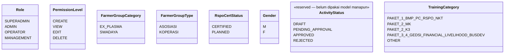
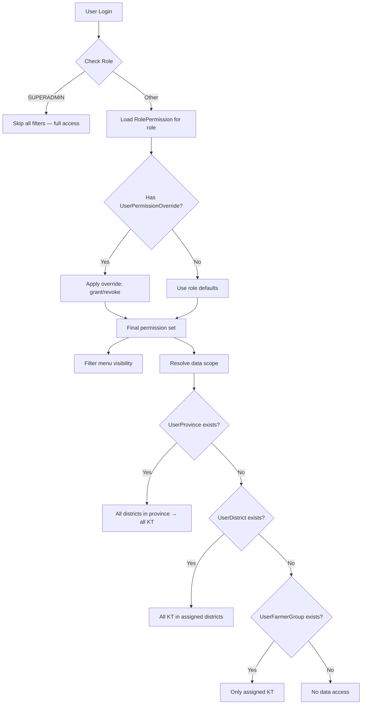
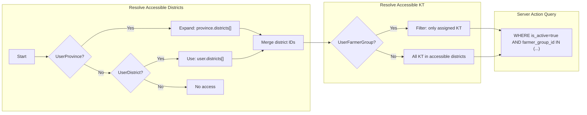
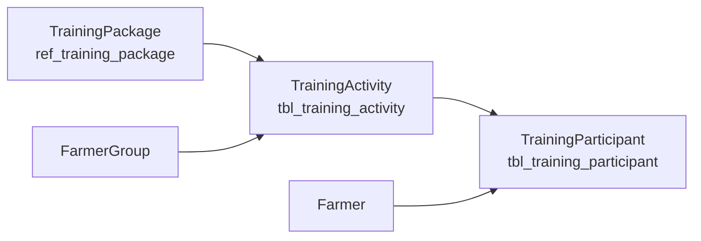

# Database — Models & Data Access

> Bagian dari dokumentasi **Database**. Indeks: [../README.md](../README.md) · Terkait: [erd.md](./erd.md) · [indexes.md](./indexes.md) · [constraints.md](./constraints.md) · [migrations.md](./migrations.md) · [security.md](./security.md) · [performance.md](./performance.md) · [dashboard-snapshots.md](./dashboard-snapshots.md)

## Common Fields (semua tabel)

| Field | Type | Keterangan |
|-------|------|-----------|
| `created_at` | DateTime | Auto-set saat create |
| `created_by` | String? | User ID yang membuat (null saat seed) |
| `modified_at` | DateTime | Auto-update saat edit |
| `modified_by` | String? | User ID yang terakhir edit |

---

<details>
<summary><strong>Enums</strong> — Definisi enumerasi sistem</summary>

## Enums



</details>

---

<details>
<summary><strong>Table Naming Convention</strong> — Konvensi penamaan tabel</summary>

## Table Naming Convention

| Prefix | Arti | Contoh |
|--------|------|--------|
| `tbl_` | Tabel transaksional / data utama | `tbl_user`, `tbl_farmer_group`, `tbl_farmer`, `tbl_training_activity`, `tbl_training_participant` |
| `reg_` | Reference data regional | `reg_province`, `reg_district` |
| `ref_` | Reference data domain | `ref_training_package` |
| `rbac_` | Tabel RBAC / permission | `rbac_role_permission`, `rbac_user_district` |
| `tbl_snapshot_` | Snapshot dashboard (separate table per dashboard) | `tbl_snapshot_main_dashboard` |
| `cache_` | Cache / materialized view (reserved — belum ada tabelnya) | `cache_dashboard_stats` (contoh rencana) |

</details>

---

<details>
<summary><strong>RBAC & Data Access</strong> — Flow autentikasi, otorisasi, dan data access control</summary>

## RBAC Flow



---

## Data Access Examples

| User | Role | UserProvince | UserDistrict | UserFarmerGroup | Hasil Akses |
|------|------|-------------|-------------|-----------------|-------------|
| Ahmad | Project Leader | Riau | — | — | Semua district di Riau → semua KT |
| Erma | District Coord | — | Kampar | — | Semua KT di Kampar |
| Anissa | Facilitator | — | Kampar | KBM, Kopsa | Hanya KBM & Kopsa |
| Super Admin | SUPERADMIN | — | — | — | Semua (skip filter) |

---

## Data Access Pattern



</details>

---

<details>
<summary><strong>Farmer Model</strong> — Detail model Farmer dengan joinedYear field</summary>

## Farmer Model Details

### Core Fields

| Field | Type | Constraint | Keterangan |
|-------|------|-----------|------------|
| `id` | String | PK | CUID generated |
| `farmerGroupId` | String | FK | Relasi ke FarmerGroup |
| `gender` | Gender | Required | Enum: M / F |
| `name` | String | Required | Nama petani |
| `farmerId` | String | Required, Indexed | ID petani (bisa sama dengan NIK atau ID internal KT) |
| `nik` | String? | Optional | NIK 16 digit (nullable) |
| `address` | String? | Optional | Alamat tinggal |
| `birthPlace` | String? | Optional | Tempat lahir |
| `birthDate` | DateTime? | Optional | Tanggal lahir |
| `joinedYear` | Int? | Optional | Tahun bergabung dengan KT (range: 1900-2100) |

### Relationships

```
FarmerGroup (1) ─→ (N) Farmer
Farmer (1) ─→ (N) TrainingParticipant
```

### Hierarki Kelembagaan (Petani → Kelompok Tani → Lembaga Petani)

Hierarki domain: **Petani → Kelompok Tani (Gapoktan) → Lembaga Petani**. Entitas `FarmerGroup` (tabel `tbl_farmer_group`, relasi `Farmer.farmerGroupId`) secara **semantik = Lembaga Petani** (level teratas) — label UI lama "Kelompok Tani" adalah *mislabel*, di-relabel ke "Lembaga Petani" (TD-013 / #147); **identifier tetap** `FarmerGroup` (rename massal ditolak, lihat `code-standards.md`).

Level **Kelompok Tani** & **Gapoktan** belum dimodelkan sebagai tabel. **Interim (#146):** disimpan sebagai field denormalisasi **di `LandParcel`** (bukan `Farmer`), karena satu petani bisa punya beberapa lahan di Kelompok Tani/Gapoktan berbeda → keanggotaan bersifat **per-lahan**:

| Field (`LandParcel`) | Type | Makna | Label UI |
|----------------------|--------|-------|----------|
| `subGroupLv1` | String? | Gapoktan | **Gapoktan/KUD** (relabel #154) |
| `subGroupLv2` | String? | Kelompok Tani | Kelompok Tani |

Konsumen agregat interim: **Report Kelompok Tani** (real-time, #154 — Summary agregat + Detail roster) & **card "Total Kelompok Tani"** di Main Dashboard (snapshot-backed, distinct `subGroupLv2`, #148). Pemodelan tabel penuh (KT/Gapoktan sebagai entitas + re-parenting `Farmer`) = **TD-014**.

### RBAC Filter Context

Farmer data difilter berdasarkan:
- `BY_DISTRICT`: User dengan assignment Province/District → akses semua Farmer di KT dalam district scope
- `BY_FARMER_GROUP`: User dengan assignment KT spesifik → akses hanya Farmer di KT assigned
- `ALL`: SUPERADMIN atau user tanpa assignment → akses semua Farmer

### Bulk Upload Support

- **Template-less approach**: Upload Excel tanpa template, user mapping kolom secara dinamis
- **Smart Validation**:
  - Gender normalization: `L/P` → `M/F`
  - NIK validation: harus 16 digit angka atau kosong
  - Date parsing: Excel serial number atau format string `dd/mm/yyyy`, `yyyy-mm-dd`
  - joinedYear validation: integer 1900-2100 atau kosong
- **Duplicate Check**: File-level dan DB-level untuk `farmerId` dalam `farmerGroupId` yang sama
- **Download Error Report**: User bisa download Excel berisi hanya baris error dengan kolom "Keterangan"

</details>

---

<details>
<summary><strong>Training Module</strong> — Struktur 3-layer training management</summary>

## Training Module Architecture

### Overview

Modul Training menggunakan struktur 3-layer untuk mengelola data pelatihan petani:
1. **TrainingPackage** (ref) — Katalog paket pelatihan standar
2. **TrainingActivity** (transactional) — Aktivitas pelatihan yang dilaksanakan per Lembaga Petani
3. **TrainingParticipant** (many-to-many) — Peserta pelatihan (relasi Farmer ↔ Training Activity)

### Training Data Flow



### Training Package Categories

| Code | Nama Paket |
|------|-----------|
| `PAKET_1_BMP_PC_RSPO_NKT` | Paket 1: BMP, PC, RSPO, NKT |
| `PAKET_2_MK` | Paket 2: Manajemen Kebun |
| `PAKET_2_K3` | Paket 2: K3 (Keselamatan dan Kesehatan Kerja) |
| `PAKET_3_4_GEDSI_FINANCIAL_LIVELIHOOD_BUSDEV` | Paket 3-4: GEDSI, Financial Literacy, Livelihood, Business Development |
| `OTHER` | Paket lainnya |

### Training Activity Features

- **Evidence Upload**: Setiap aktivitas pelatihan bisa menyertakan bukti dokumen (PDF) yang disimpan di S3
  - `evidence_key`: S3 object key
  - `evidence_name`: Nama file asli untuk display
- **Location**: Lokasi pelaksanaan pelatihan (teks bebas)
- **Training Date**: Tanggal pelaksanaan pelatihan

### Training Participant Management

- **Many-to-Many Relation**: Satu petani bisa ikut banyak training, satu training bisa punya banyak peserta
- **Unique Constraint**: `(activityId, farmerId)` — tidak boleh duplikasi peserta di aktivitas yang sama
- **Bulk Upload Support**: Upload peserta via Excel/CSV dengan validasi 3-tier (Valid, Warning, Error)
- **RBAC Filter**: Data peserta mengikuti access context dari Farmer (BY_DISTRICT / BY_FARMER_GROUP)

### Schema Relationships

```
TrainingPackage (1) ─→ (N) TrainingActivity
FarmerGroup (1) ─→ (N) TrainingActivity
TrainingActivity (1) ─→ (N) TrainingParticipant
Farmer (1) ─→ (N) TrainingParticipant
```

</details>

---

<details>
<summary><strong>File Structure</strong> — Struktur file Prisma schema</summary>

## File Structure

```
prisma/schema/
├── _config.prisma        # Generator, datasource, enums
├── user.prisma           # User identity
├── geography.prisma      # Province → District → Subdistrict → Village
├── farmer-group.prisma   # FarmerGroup
├── farmer.prisma         # Farmer
├── training.prisma       # TrainingPackage, TrainingActivity, TrainingParticipant
├── rbac.prisma           # RolePermission, UserProvince, UserDistrict, UserFarmerGroup, UserPermissionOverride
└── menu.prisma           # MenuItem
```

</details>
