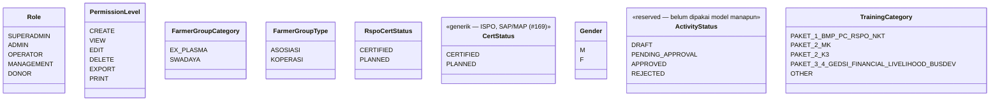
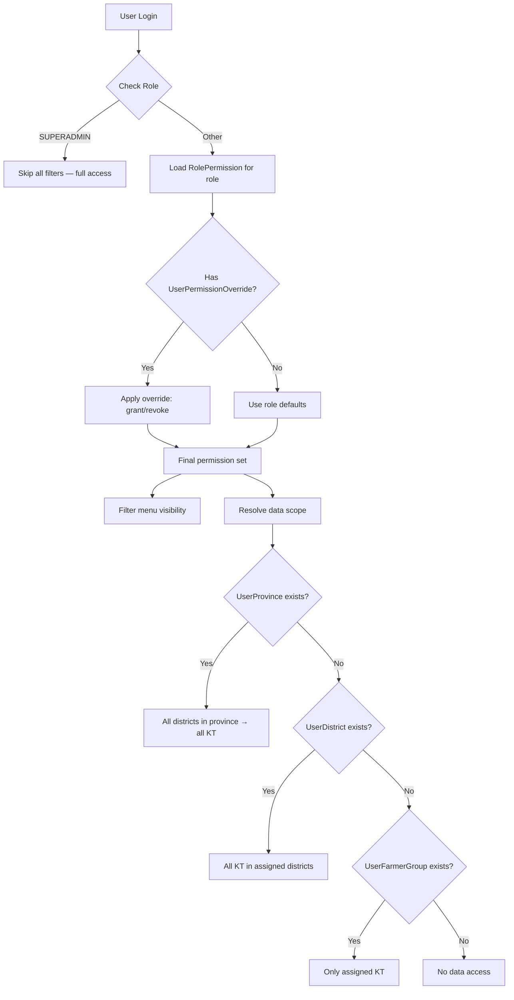
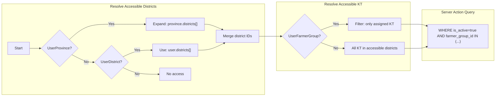
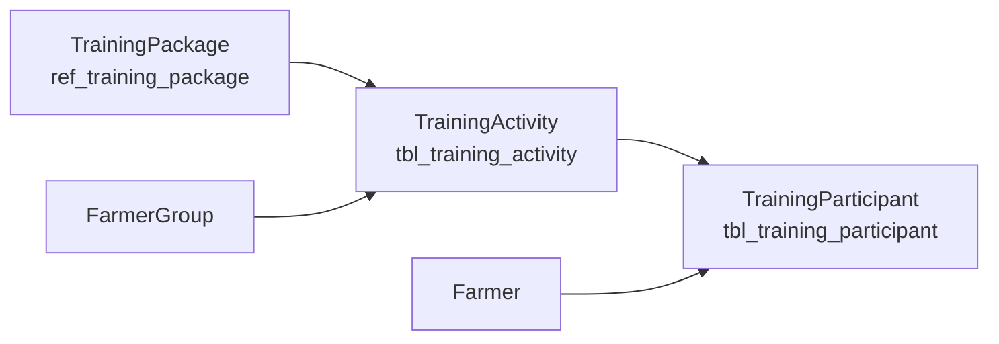

# Database — Models & Data Access

> Bagian dari dokumentasi **Database**. Indeks: [../README.md](../README.md) · Terkait: [erd.md](./erd.md) · [indexes.md](./indexes.md) · [constraints.md](./constraints.md) · [migrations.md](./migrations.md) · [security.md](./security.md) · [performance.md](./performance.md) · [dashboard-snapshots.md](./dashboard-snapshots.md)

## Common Fields (semua tabel)

| Field | Type | Keterangan |
|-------|------|-----------|
| `created_at` | DateTime | Auto-set saat create |
| `created_by` | String? | User ID yang membuat (null saat seed) |
| `modified_at` | DateTime | Auto-update saat edit |
| `modified_by` | String? | User ID yang terakhir edit |

---

<details>
<summary><strong>Enums</strong> — Definisi enumerasi sistem</summary>

## Enums


```mermaid
classDiagram
    class Role {
        SUPERADMIN
        ADMIN
        OPERATOR
        MANAGEMENT
        DONOR
    }

    class PermissionLevel {
        CREATE
        VIEW
        EDIT
        DELETE
        EXPORT
        PRINT
    }

    class FarmerGroupCategory {
        EX_PLASMA
        SWADAYA
    }

    class FarmerGroupType {
        ASOSIASI
        KOPERASI
    }

    class RspoCertStatus {
        CERTIFIED
        PLANNED
    }

    class CertStatus {
        <<generik — ISPO, SAP/MAP (#169)>>
        CERTIFIED
        PLANNED
    }

    class Gender {
        M
        F
    }

    class ActivityStatus {
        <<reserved — belum dipakai model manapun>>
        DRAFT
        PENDING_APPROVAL
        APPROVED
        REJECTED
    }

    class TrainingCategory {
        PAKET_1_BMP_PC_RSPO_NKT
        PAKET_2_MK
        PAKET_2_K3
        PAKET_3_4_GEDSI_FINANCIAL_LIVELIHOOD_BUSDEV
        OTHER
    }
```

</details>

---

<details>
<summary><strong>Table Naming Convention</strong> — Konvensi penamaan tabel</summary>

## Table Naming Convention

| Prefix | Arti | Contoh |
|--------|------|--------|
| `tbl_` | Tabel transaksional / data utama | `tbl_user`, `tbl_farmer_group`, `tbl_farmer`, `tbl_training_activity`, `tbl_training_participant` |
| `reg_` | Reference data regional | `reg_province`, `reg_district` |
| `ref_` | Reference data domain | `ref_training_package` |
| `rbac_` | Tabel RBAC / permission | `rbac_role_permission`, `rbac_user_district` |
| `tbl_snapshot_` | Snapshot dashboard (separate table per dashboard) | `tbl_snapshot_main_dashboard`, `tbl_snapshot_bmp_dashboard` |
| `cache_` | Cache / materialized view (reserved — belum ada tabelnya) | `cache_dashboard_stats` (contoh rencana) |
| `tbl_<induk>_<aspek>` | **Tabel satelit** — atribut ber-siklus-hidup sendiri / bisa >1 per induk; induk ditulis lengkap; penghubung M:N = gabungan dua induk tanpa aspek | `tbl_land_parcel_document`, `tbl_land_parcel_stdb` (M:N ke `tbl_land_stdb`) |

Aturan lengkap (termasuk larangan `tbl_parcel_*`, enum vs `ref_`): [../standards/code-standards.md §Penamaan tabel & model](../standards/code-standards.md#penamaan-tabel--model-prisma).

</details>

---

<details>
<summary><strong>RBAC & Data Access</strong> — Flow autentikasi, otorisasi, dan data access control</summary>

## RBAC Flow


```mermaid
flowchart TD
    A[User Login] --> B{Check Role}
    B -->|SUPERADMIN| SA[Skip all filters — full access]
    B -->|Other| C[Load RolePermission for role]
    C --> D{Has UserPermissionOverride?}
    D -->|Yes| E[Apply override: grant/revoke]
    D -->|No| F[Use role defaults]
    E --> G[Final permission set]
    F --> G
    G --> H[Filter menu visibility]
    G --> I[Resolve data scope]
    I --> J{UserProvince exists?}
    J -->|Yes| K[All districts in province → all KT]
    J -->|No| L{UserDistrict exists?}
    L -->|Yes| M[All KT in assigned districts]
    L -->|No| N{UserFarmerGroup exists?}
    N -->|Yes| O[Only assigned KT]
    N -->|No| P[No data access]
```

---

## Data Access Examples

| User | Role | UserProvince | UserDistrict | UserFarmerGroup | Hasil Akses |
|------|------|-------------|-------------|-----------------|-------------|
| Ahmad | Project Leader | Riau | — | — | Semua district di Riau → semua KT |
| Erma | District Coord | — | Kampar | — | Semua KT di Kampar |
| Anissa | Facilitator | — | Kampar | KBM, Kopsa | Hanya KBM & Kopsa |
| Super Admin | SUPERADMIN | — | — | — | Semua (skip filter) |

---

## Data Access Pattern


```mermaid
flowchart LR
    subgraph "Resolve Accessible Districts"
        S[Start] --> UP{UserProvince?}
        UP -->|Yes| EXP["Expand: province.districts[]"]
        UP -->|No| UD{UserDistrict?}
        UD -->|Yes| DIR["Use: user.districts[]"]
        UD -->|No| NONE["No access"]
        EXP --> MERGE[Merge district IDs]
        DIR --> MERGE
    end

    subgraph "Resolve Accessible KT"
        MERGE --> UFG{UserFarmerGroup?}
        UFG -->|Yes| FG["Filter: only assigned KT"]
        UFG -->|No| ALL["All KT in accessible districts"]
    end

    subgraph "Server Action Query"
        FG --> W["WHERE is_active=true AND farmer_group_id IN (...)"]
        ALL --> W
    end
```

</details>

---

<details>
<summary><strong>Farmer Model</strong> — Detail model Farmer dengan joinedYear field</summary>

## Farmer Model Details

### Core Fields

| Field | Type | Constraint | Keterangan |
|-------|------|-----------|------------|
| `id` | String | PK | CUID generated |
| `farmerGroupId` | String | FK | Relasi ke FarmerGroup |
| `gender` | Gender | Required | Enum: M / F |
| `name` | String | Required | Nama petani |
| `farmerId` | String | Required, Indexed, UNIQUE composite `(farmerGroupId, farmerId)` | ID petani (bisa sama dengan NIK atau ID internal KT); unik **per Lembaga** (TD-024) |
| `nik` | String? | Optional | NIK 16 digit (nullable) |
| `address` | String? | Optional | Alamat tinggal |
| `birthPlace` | String? | Optional | Tempat lahir |
| `birthDate` | DateTime? | Optional | Tanggal lahir |
| `joinedYear` | Int? | Optional | Tahun bergabung dengan KT (range: 1900-2100) |

### Relationships

```
FarmerGroup (1) ─→ (N) Farmer
Farmer (1) ─→ (N) TrainingParticipant
```

### Hierarki Kelembagaan (Petani → Kelompok Tani → Lembaga Petani)

Hierarki domain (final, #189): **Petani → Kelompok Tani → Lembaga Petani** (3 level; level **Gapoktan/KUD dihapus**). Entitas `FarmerGroup` (tabel `tbl_farmer_group`, relasi `Farmer.farmerGroupId`) secara **semantik = Lembaga Petani** (level teratas) — label UI lama "Kelompok Tani" adalah *mislabel*, di-relabel ke "Lembaga Petani" (TD-013 / #147); **identifier tetap** `FarmerGroup` (rename massal ditolak, lihat `code-standards.md`).

Level **Kelompok Tani** belum dimodelkan sebagai tabel. **Interim (#146):** disimpan sebagai field denormalisasi **di `LandParcel`** (bukan `Farmer`), karena satu petani bisa punya beberapa lahan di Kelompok Tani berbeda → keanggotaan bersifat **per-lahan**:

| Field (`LandParcel`) | Type | Makna | Label UI |
|----------------------|--------|-------|----------|
| `subGroupLv2` | String? | Kelompok Tani | Kelompok Tani |

> Kolom `subGroupLv1` (Gapoktan/KUD) **di-drop #189** (migrasi `20260722030000`).

Konsumen agregat interim: **Report Kelompok Tani** (real-time, #154 — Summary agregat + Detail roster) & **card "Total Kelompok Tani"** di Main Dashboard (snapshot-backed, distinct `subGroupLv2`, #148). Pemodelan tabel penuh (KT sebagai entitas + re-parenting `Farmer`) = **TD-014**.

### RBAC Filter Context

Farmer data difilter berdasarkan:
- `BY_DISTRICT`: User dengan assignment Province/District → akses semua Farmer di KT dalam district scope
- `BY_FARMER_GROUP`: User dengan assignment KT spesifik → akses hanya Farmer di KT assigned
- `ALL`: SUPERADMIN atau user tanpa assignment → akses semua Farmer

### Bulk Upload Support

- **Template-less approach**: Upload Excel tanpa template, user mapping kolom secara dinamis
- **Smart Validation**:
  - Gender normalization: `L/P` → `M/F`
  - NIK validation: harus 16 digit angka atau kosong
  - Date parsing: Excel serial number atau format string `dd/mm/yyyy`, `yyyy-mm-dd`
  - joinedYear validation: integer 1900-2100 atau kosong
- **Duplicate Check**: File-level dan DB-level untuk `farmerId` dalam `farmerGroupId` yang sama
- **Download Error Report**: User bisa download Excel berisi hanya baris error dengan kolom "Keterangan"

</details>

---

<details>
<summary><strong>Training Module</strong> — Struktur 3-layer training management</summary>

## Training Module Architecture

### Overview

Modul Training menggunakan struktur 3-layer untuk mengelola data pelatihan petani:
1. **TrainingPackage** (ref) — Katalog paket pelatihan standar
2. **TrainingActivity** (transactional) — Aktivitas pelatihan yang dilaksanakan per Lembaga Petani
3. **TrainingParticipant** (many-to-many) — Peserta pelatihan (relasi Farmer ↔ Training Activity)

### Training Data Flow


```mermaid
flowchart LR
    TP[TrainingPackage<br/>ref_training_package] --> TA[TrainingActivity<br/>tbl_training_activity]
    FG[FarmerGroup] --> TA
    TA --> TPART[TrainingParticipant<br/>tbl_training_participant]
    F[Farmer] --> TPART
```

### Training Package Categories

| Code | Nama Paket |
|------|-----------|
| `PAKET_1_BMP_PC_RSPO_NKT` | Paket 1: BMP, PC, RSPO, NKT |
| `PAKET_2_MK` | Paket 2: Manajemen Kelompok |
| `PAKET_2_K3` | Paket 2: K3 (Keselamatan dan Kesehatan Kerja) |
| `PAKET_3_4_GEDSI_FINANCIAL_LIVELIHOOD_BUSDEV` | Paket 3-4: GEDSI, Financial Literacy, Livelihood, Business Development |
| `OTHER` | Paket lainnya |

### Training Activity Features

- **Evidence Upload**: Setiap aktivitas pelatihan bisa menyertakan bukti dokumen (PDF) yang disimpan di S3
  - `evidence_key`: S3 object key
  - `evidence_name`: Nama file asli untuk display
- **Location**: Lokasi pelaksanaan pelatihan (teks bebas)
- **Training Date**: Tanggal pelaksanaan pelatihan

### Training Participant Management

- **Many-to-Many Relation**: Satu petani bisa ikut banyak training, satu training bisa punya banyak peserta
- **Unique Constraint**: `(activityId, farmerId)` — tidak boleh duplikasi peserta di aktivitas yang sama
- **Bulk Upload Support**: Upload peserta via Excel/CSV dengan validasi 3-tier (Valid, Warning, Error)
- **RBAC Filter**: Data peserta mengikuti access context dari Farmer (BY_DISTRICT / BY_FARMER_GROUP)

### Schema Relationships

```
TrainingPackage (1) ─→ (N) TrainingActivity
FarmerGroup (1) ─→ (N) TrainingActivity
TrainingActivity (1) ─→ (N) TrainingParticipant
Farmer (1) ─→ (N) TrainingParticipant
```

</details>

---

<details>
<summary><strong>Tree Model</strong> — Titik pohon sawit per lahan (#238)</summary>

## Tree Model Details

- **Relasi baca**: `landParcelId` (FK ke `LandParcel.id`) adalah **satu-satunya jalur baca** — semua query pohon (detail lahan, overlay peta, agregat count) lewat FK ini. Set aktif per lahan berevisi per-set (upload ulang menonaktifkan set lama, `revision + 1`).
- **`parcelId` = kolom arsip/audit** (keputusan #241): menyimpan kunci bisnis lahan (`LandParcel.parcelId`) saat upload sebagai **jangkar pemulihan manual** — lahan berevisi mendapat `id` baru dan pohon aktif di-repoint saat revisi; bila repoint terlewat/salah, keterkaitan masih bisa direkonstruksi dari kolom ini. **Tidak ada jalur baca aplikasi yang memakai/fallback ke kolom ini** — itu disengaja, bukan utang; jangan menambah jalur baca berbasis `parcelId` tanpa keputusan baru (parcelId hanya unik per petani, lookup global bisa ambigu).
- **Audit sumber**: `sourceFile` (nama ZIP asal), `modelVersion`, `source` (auto/moved/added/verified).

</details>

---

<details>
<summary><strong>File Structure</strong> — Struktur file Prisma schema</summary>

## LandParcelIdentity & satelit lahan (#296, Decision Log 2026-08-27)

`LandParcel` berevisi dengan **id baru per baris** (bulk upload: baris lama `is_active=false`, baris baru `revision+1`), sehingga tabel yang menunjuk `LandParcel.id` harus di-repoint tiap revisi (pola `Tree`/produksi). **`tbl_land_parcel_identity`** (`parcelUid`) adalah jangkar tetap: satu baris per `(farmerId, parcelId)` — unik, dibuat/di-upsert saat revisi 0 (`createLandParcel`, bulk upload) dan tidak berganti. `LandParcel.parcelUid` NOT NULL (backfill di migrasi). Tabel ini **sengaja hanya identitas** — geometri/atribut fisik tetap di `LandParcel`; `LandParcel` bukan tabel bridging (keputusan owner: `farmerId`+`parcelId` adalah identitas & basis scope RBAC).

Satelit menempel ke `parcelUid`, bukan ke baris revisi — tak perlu repoint:

| Tabel | Model | Relasi | Isi kunci |
| ----- | ----- | ------ | --------- |
| `tbl_land_parcel_document` | `LandParcelDocument` | 1:N | Surat kepemilikan: `type` enum `LandDocumentType` (SHM/SKT/SKGR/SK/SKST/SKTC/SKGK/SPPT/SKRPT/SKKT/SKTB/HIBAH/JUAL_BELI/OTHER) + `typeRaw` (ejaan sumber), `number` (**tidak unik** — nomor pendek berulang antar desa), `holderName` (97% ≠ nama petani), `statedArea` (terpisah dari `area`), `issuedYear?`, `custodyNote` ("surat di bank", "lahan sudah dijual" — status, bukan jenis), `fileUrl?` |
| `tbl_land_stdb` | `LandStdb` | per **petani**; unik lewat **dua partial index**, bukan `@@unique` | STDB menutup beberapa persil petani yang sama (maks 13 di data); `number` **opsional** sejak #306 (nomor terbit di tahap terakhir) dan mentah (`1637/53/1401/6/2025` → `issuedYear` diturunkan bila berpola); `stage` (`LandStdbStage`: PERSIAPAN_DATA/PENGAJUAN/REVISI/TERBIT/DITOLAK, default `TERBIT`) + `prepared_at`/`submitted_at`/`issued_at`/`stage_changed_at`/`submitted_to`/`stage_note`. **Keunikan:** `uniq_land_stdb_farmer_number` `(farmer_id, number) WHERE number IS NOT NULL AND is_active` dan `uniq_land_stdb_farmer_open` `(farmer_id) WHERE stage IN (PERSIAPAN_DATA,PENGAJUAN,REVISI) AND is_active` — `@@unique([farmerId, number])` tak bisa dipertahankan karena di Postgres `NULL ≠ NULL`; `DITOLAK` sengaja di luar index kedua supaya petani bisa mengajukan ulang |
| `tbl_land_parcel_stdb` | `LandParcelStdb` | M:N lahan ↔ STDB | satu-satunya M:N di keluarga satelit; daftar persil yang akan diajukan justru disusun pada tahap `PERSIAPAN_DATA`, jauh sebelum ada nomor. Audit lengkap sejak **#299** (`modified_at`/`modified_by` — `is_active` di tabel ini ditoggle dua jalur: `unlinkLandStdb`/`createLandStdb` dan `applyLandParcelDetailRows`) |
| `tbl_land_parcel_external_id` | `LandParcelExternalId` | 1:N, unik `(source, code)` | UL Parcel Code (mis. `ID080d781b4`) + **`rawGeometry Json?`** poligon mentah vendor (opsional, keputusan owner). `source` = **pemeta** (`MERIDIA` \| `WRI` \| `SWADAYA`, isian bebas diizinkan) — bukan nama kolom Excel; nilai lama `parcel_code` dimigrasi ke `MERIDIA` 2026-08-28 (6.953 baris prod & staging-local) |
| `tbl_land_parcel_program` | `LandParcelProgram` | 1:N | Keikutsertaan program: `programType` (`DEMPLOT_PBU`), `status`, `startDate/endDate` — level lahan dulu; entitas Program/PBU bisa ditambah sebagai FK tanpa mengubah baris |
| `tbl_land_parcel_nkt` | `LandParcelNkt` | **1:1** (`parcel_uid` UNIQUE) | **Status NKT / HCV** (#328, langkah pertama MD-08): `status` enum `LandNktStatus` (INCLUDED termasuk area · AFFECTED terdampak · NOT_AFFECTED sudah dinilai-bersih), `categories NktCategory[]` (NKT_1…NKT_6, kosong sah hanya untuk NOT_AFFECTED — dijaga Zod), `affected_area_ha` & `affected_length_m` (dari Lampiran asesmen HJP: "Luas NKT Area (ha)", "LENGTH"), `assessed_at`, `assessor`, `source`, `notes`. **Tanpa baris = belum dinilai** — dibedakan dari NOT_AFFECTED di laporan. **Hapus = hapus baris** (bukan toggle `is_active`; baris tanpa status tak bermakna dan UNIQUE akan memblokir pengisian ulang). Jalur tulis: form Detail Lahan (`upsertLandParcelNkt`/`deleteLandParcelNkt`), importer Data Lahan Detail (status selalu ditimpa = asesmen terbaru menang, field lain hanya bila terisi; bawaan per berkas untuk daftar tanpa kolom status). Dibaca Laporan Lahan (filter `nktStatus`), Peta Lahan (hanya `status` ikut payload), PDF Profil Lahan, tanda turunan patok (#329). Tanpa layer poligon area NKT (keputusan owner) |
| `tbl_land_parcel_border` | `LandParcelBorder` | **1:1** (`parcel_uid` UNIQUE) | **Sepadan** (#326): `north/east/south/west` teks bebas ("Lahan Pak Budi", "Jalan desa", "Sungai", "PT X") + `notes`. Menempel ke identitas — bukan kolom di `LandParcel` — karena upload ulang shapefile membuat baris lahan baru dari atribut DBF dan kolom non-DBF hilang. **Hapus = kosongkan keempat kolom, baris tetap**; `is_active` tidak dipakai sebagai jalur hapus (baris nonaktif + UNIQUE akan memblokir pengisian ulang, pelajaran #306). Jalur tulis: form Detail Lahan (`upsertLandParcelBorder`), import Excel Data Lahan Detail, atribut DBF Bulk Upload Lahan — dua importer memakai aturan **sel terisi menimpa, sel kosong dibiarkan** (pola dokumen, bukan pola KT isi-bila-kosong). Berbeda dari **lahan tetangga** (#327) yang dihitung dari geometri dan hanya memuat lahan terdaftar di MIS |
| `tbl_land_marker` + `tbl_land_parcel_marker` | `LandMarker`, `LandParcelMarker` | **M:N** lewat tautan bernomor (`(parcel_uid, marker_id)` UNIQUE; `(parcel_uid, sequence_no)` UNIQUE partial `WHERE is_active`) | **Patok batas lahan** (#329). `LandMarker` = satu patok **fisik** (**`code` UNIQUE `<SINGKATAN LEMBAGA>-PTK-000123`** — keputusan owner 2026-09-14: ditulis di patok fisik, dirujuk laporan/Excel, kunci unggah ulang; awalan = singkatan Lembaga (`abrv`, fallback `code`, huruf besar tanpa spasi/tanda baca) lahan yang PERTAMA membuatnya, deret **per awalan** lewat `LandMarkerCounter` (`tbl_land_marker_counter` — **pengecualian konvensi audit/`is_active` yang disengaja**: tabel counter murni `(prefix, last_no)` seperti sequence, tak pernah dibaca UI dan tak pernah "dihapus"; jejak siapa/kapan ada di `created_by/at` baris patok yang memakai nomornya. `INSERT … ON CONFLICT DO UPDATE … RETURNING` atomik — `allocateMarkerCodes`); `longitude/latitude`, `geom geometry(Point,4326)` GENERATED dari lon/lat + GiST — pola `LandParcel.geom` #317, `source` enum `LandMarkerSource` POLYGON_VERTEX/GPS/MANUAL, `condition` enum `LandMarkerCondition` PRESENT/MISSING/DAMAGED/NOT_INSTALLED (bawaan), `type` enum `LandMarkerType` CONCRETE/WOOD/PIPE/NATURAL/OTHER, `installed_at/by`, `photo_key/name` S3 `land-marker/<id>/…`, `notes`). `LandParcelMarker` = tautan patok ↔ identitas lahan dengan **`sequence_no` per lahan** (nomor di peta/PDF/ekspor) dan `source_revision` (revisi poligon saat patok diturunkan → petunjuk "poligon berubah sejak patok dibuat"). **Satu patok dipakai bersama lahan berdampingan** (keputusan owner 2026-09-14): "Buat patok dari poligon" menyederhanakan ring luar (`ST_SimplifyPreserveTopology` ±1 m, **`ST_Multi`** wajib karena hasilnya bisa POLYGON), menomori vertex **searah jarum jam dari utara mengikuti urutan ring** (orientasi dibalik bila berlawanan jarum jam, titik awal diputar — bukan diurutkan menurut sudut dari titik tengah, yang zig-zag pada lahan cekung; temuan review), dan vertex ≤ **5 m** (`MARKER_SNAP_M`) dari patok yang ada **ditautkan**, bukan digandakan — mengubah koordinat/kondisi/foto berlaku untuk semua lahan pemakainya. Guard tulis koordinat GPS/manual: ≤ **100 m** dari batas lahan (`ST_Distance` geography ke `ST_Boundary`), dengan deteksi lat/long tertukar. Lepas tautan = `is_active=false` pada tautan; patok tanpa tautan aktif ikut nonaktif (koordinat tetap). **NKT di patok = turunan** (`isNktAffected` lahan ini ATAU salah satu lahan pemakai), tidak disimpan. Jalur tulis: tab Patok Detail Lahan (generate/tambah/ubah/urutkan/lepas/foto), unggah Excel-CSV/shapefile Point di Upload Massal Lahan (`bulkUpsertLandMarkers`: nomor yang ada diperbarui → `source=GPS`, tanpa nomor ≤ 5 m dari patok lahan sendiri = perbarui (idempoten), nomor baru/kosong = patok baru + snap — termasuk menghidupkan patok nonaktif; satu transaksi per lahan). Ubah lewat form: pergeseran ≤ 20 cm (`MARKER_MOVE_EPSILON_M`, pembulatan 6 desimal) tidak dianggap digeser; urut-ulang dua fase memarkir nomor **negatif**. Dibaca PDF Profil Lahan (persegi bernomor + tabel "Patok Batas"), ekspor Excel per Lembaga (Detail Lembaga › Unduh Lahan). Layer patok di Peta Lahan, kode unik, Report › Patok: #331 |

Scope RBAC satelit: lewat `identity.farmer` (`farmerRelationAccessFilter` pola sama dengan `LandParcel`). Sumber data awal: `MIS_<KAB>_data-lahan.xlsx` (7.177 baris, 3 kabupaten) — statistik & bug sumber yang wajib dilaporkan parser ada di Decision Log 2026-08-27.

## LandParcel.geom — turunan PostGIS (#317 Fase 1, via #327)

`LandParcel.geometry` (JSONB, GeoJSON Polygon/MultiPolygon) tetap **sumber kebenaran & jalur render**. Sejak migrasi `20260914100000_land_parcel_geom`, kolom **`geom geometry(MultiPolygon, 4326)`** adalah `GENERATED ALWAYS AS (...) STORED` — Postgres mengisinya dari `geometry` (`ST_Multi(ST_MakeValid(ST_SetSRID(ST_GeomFromGeoJSON(geometry::text), 4326)))`, dijaga `CASE` pada `type` karena `ST_GeomFromGeoJSON` melempar error untuk JSON `null`/objek asing). Konsekuensi: **tanpa backfill, tanpa perubahan jalur tulis, mustahil divergen** — beda dengan dual-column manual `FarmerGroupBoundary`/`AdministrativeBoundary` yang dijaga lewat `$executeRaw`. Di Prisma `Unsupported(...)` (tak terbaca Client); dipakai hanya lewat `$queryRaw` — lahan tetangga ≤ 25 m (#327, `ST_DWithin` + GiST `tbl_land_parcel_geom_idx`) dan topology check (#317 Fase 2+). Prisma akan **selalu** mengusulkan `DROP INDEX tbl_land_parcel_geom_idx` di migrasi berikutnya — jangan pernah diterima (dijaga `migration-guards.test.ts`).

## FarmerGroupBoundary (Boundary Lembaga, #266)

Poligon wilayah kerja tiap ICS/lembaga (`tbl_farmer_group_boundary`) untuk Dashboard Risk Management — Fire Alert. Maksimal **satu boundary aktif per lembaga** (dijaga alur seed: soft-delete lama + insert baru; tanpa constraint DB karena soft delete). **Fakta domain (owner, 2026-08-19): poligon di shapefile sumber sudah dibuat TERMASUK buffer 1,5 km** dari area lahan — deteksi titik api cukup point-in-polygon, tanpa perhitungan buffer tambahan.

Penyimpanan **dual-column**:

| Kolom | Tipe | Peran |
| ----- | ---- | ----- |
| `geom` | `geometry(MultiPolygon, 4326)` PostGIS (`Unsupported` di Prisma) | **Sumber kebenaran** untuk analisa spasial (`ST_Intersects`/`ST_Contains`, GiST index); tulis/baca via `$executeRaw`/`$queryRaw` (`ST_GeomFromGeoJSON` / `ST_AsGeoJSON`) |
| `geojson` | `Json` (GeoJSON MultiPolygon WGS84) | Cache untuk rendering peta — konsisten pola `LandParcel.geometry` |

Drift dua kolom praktis nol: penulisan hanya lewat `scripts/seed/seed-boundary-lembaga.ts` (shapefile ZIP + `boundary-mapping.csv` nama ICS → `FarmerGroup.code`). Catatan: field `Unsupported` tidak muncul di Prisma DMMF/Client — pemindai `scripts/schema-scan.ts` sengaja melewatinya.

## AdministrativeBoundary (Batas Administrasi BIG, #266)

Garis batas administrasi (`tbl_administrative_boundary`) sebagai konteks peta — **satu tabel lintas level** dengan enum `AdminBoundaryLevel` (KABUPATEN/KECAMATAN/DESA; keputusan owner, bukan tabel per level): bentuk data identik per level dan skema atribut file BIG seragam (NAMOBJ/KDBPUM/WADM\*). Terpisah dari `reg_district`/`Subdistrict`/`Village` karena file batas mencakup **seluruh** Riau (12 kabupaten), sedangkan tabel geografi hanya wilayah program — FK `districtId` nullable terisi bila nama cocok.

Dual-column sama dengan FarmerGroupBoundary, dengan satu perbedaan penting: kolom cache `geojson` disimpan **tersimplifikasi** (`ST_SimplifyPreserveTopology` 0,001° ≈ 111 m; ~10 MB → ~165 KB) karena hanya untuk garis konteks di browser — `geom` tetap full-res untuk analisa. Seed: `scripts/seed/seed-batas-administrasi.ts` (config per level, dry-run default, idempotent per level).

## File Structure

```
prisma/schema/
├── _config.prisma        # Generator, datasource, enums
├── user.prisma           # User identity
├── geography.prisma      # Province → District → Subdistrict → Village
├── farmer-group.prisma   # FarmerGroup
├── farmer-group-boundary.prisma # FarmerGroupBoundary (poligon ICS, dual-column PostGIS+Json, #266)
├── administrative-boundary.prisma # AdministrativeBoundary (batas BIG per level, #266)
├── farmer.prisma         # Farmer
├── land-parcel.prisma    # LandParcel (+ geom generated PostGIS, #317 Fase 1)
├── land-parcel-identity.prisma # LandParcelIdentity (parcelUid — identitas stabil antar revisi, #296)
├── land-parcel-document.prisma # LandParcelDocument + enum LandDocumentType (surat kepemilikan, #296)
├── land-stdb.prisma      # LandStdb (per petani) + LandParcelStdb (M:N ke lahan, #296)
├── land-parcel-external-id.prisma # LandParcelExternalId (UL Parcel Code + rawGeometry opsional, #296)
├── land-parcel-program.prisma # LandParcelProgram + enum LandProgramType/Status (demplot PBU, #296)
├── land-parcel-border.prisma # LandParcelBorder (sepadan U/T/S/B, satelit 1:1, #326)
├── land-parcel-nkt.prisma # LandParcelNkt + enum LandNktStatus/NktCategory (status NKT, satelit 1:1, #328)
├── land-marker.prisma    # LandMarker (patok fisik, code unik, geom Point generated) + LandParcelMarker (M:N bernomor per lahan, #329) + LandMarkerCounter (deret kode per Lembaga, #331)
├── tree.prisma           # Tree (titik pohon sawit per lahan, #238)
├── reference-benchmark.prisma # ReferenceBenchmark (angka acuan manual per lembaga, #243)
├── production.prisma     # ProductionRecord
├── training.prisma       # TrainingPackage, TrainingActivity, TrainingParticipant
├── dashboard-snapshot.prisma # MainDashboardSnapshot, BmpDashboardSnapshot
├── rbac.prisma           # RolePermission, UserProvince, UserDistrict, UserFarmerGroup, UserPermissionOverride
└── menu.prisma           # MenuItem
```

</details>
