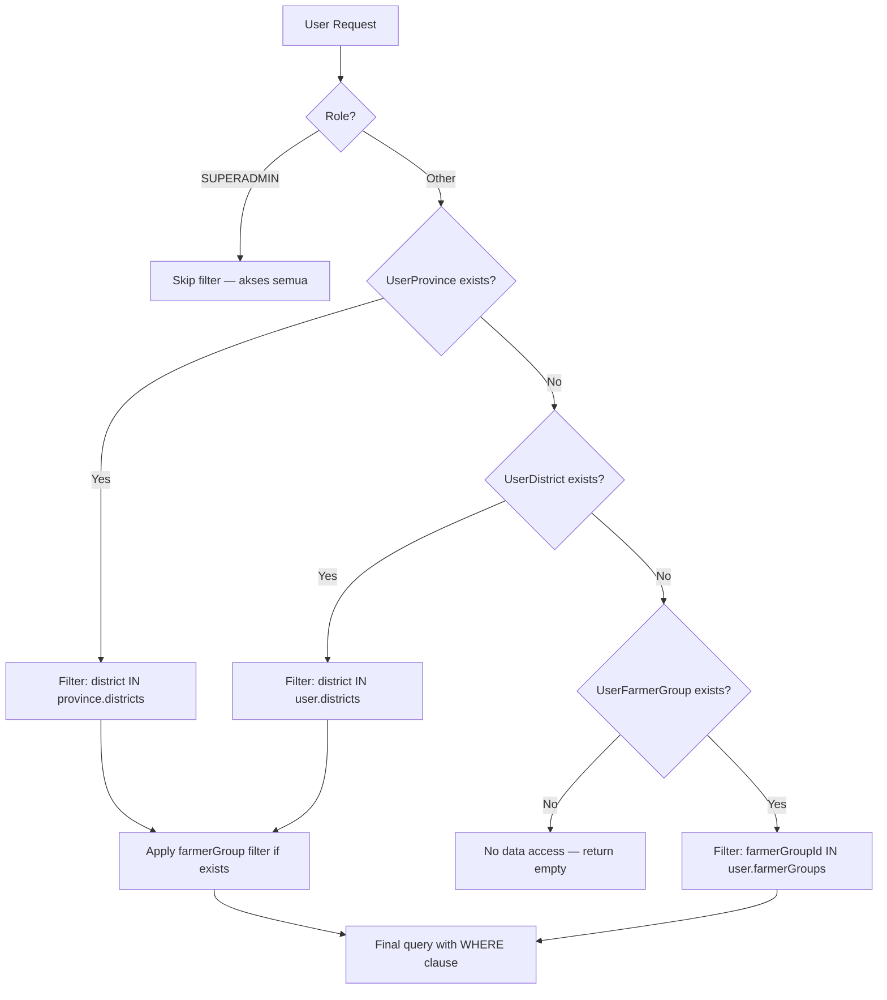

# Database — Security Considerations

> Bagian dari dokumentasi **Database**. Indeks: [../README.md](../README.md) · Terkait: [erd.md](./erd.md) · [models.md](./models.md) · [indexes.md](./indexes.md) · [constraints.md](./constraints.md) · [migrations.md](./migrations.md) · [performance.md](./performance.md) · [dashboard-snapshots.md](./dashboard-snapshots.md)

<strong>Security Considerations</strong> — Aspek keamanan database dan data access

## Security Considerations

### Authentication & Authorization

| Layer | Mekanisme | Implementation |
|-------|-----------|----------------|
| **Authentication** | NextAuth.js | Email + password, session stored in JWT |
| **Authorization** | Role-Based (RBAC) | 5 roles: SUPERADMIN, ADMIN, OPERATOR, MANAGEMENT, DONOR (donor/funder read-only: dashboard, laporan, peta) |
| **Data Access Control** | Data-level filtering | UserProvince, UserDistrict, UserFarmerGroup assignments |
| **Permission Override** | User-specific exceptions | UserPermissionOverride for grant/revoke specific menu permissions |

### Password Security

- **Storage**: Password disimpan dengan **bcrypt hash** (cost factor: 10)
- **No Plain Text**: Password plain text tidak pernah disimpan di database
- **Salt**: Bcrypt otomatis generate unique salt per password
- **Migration**: Jika ganti hashing algorithm, perlu re-hash saat user login (gradual migration)

### SQL Injection Prevention

- **Prisma ORM**: Semua query pakai Prisma Client → parameterized queries otomatis
- **No Raw Query**: Hindari `prisma.$queryRaw` dengan user input tanpa sanitasi
- **Input Validation**: Validate & sanitize input di server action / API route sebelum query

### Data Access Patterns (RBAC)

### Sensitive Data Protection

| Data Type | Tabel | Field | Protection Strategy |
|-----------|-------|-------|---------------------|
| **Password** | User | `password` | Bcrypt hash (cost 10), never return di API response |
| **Email** | User | `email` | Unique index, validate format di app layer |
| **NIK (ID Card)** | Farmer | `nik` | Optional field, validate 16 digits jika diisi, bisa mask di UI (****1234) |
| **Location Coordinates** | FarmerGroup | `locationLat`, `locationLong` | Public (untuk mapping), tidak sensitif |
| **S3 Evidence Key** | TrainingActivity | `evidenceKey` | Private S3 bucket, generate pre-signed URL saat akses |

### Audit Trail

Semua tabel memiliki audit fields:
- `createdAt` — timestamp record dibuat
- `createdBy` — user ID yang membuat (nullable saat seed)
- `modifiedAt` — timestamp terakhir diupdate
- `modifiedBy` — user ID yang terakhir update

> `createdBy`/`modifiedBy` **diisi dari `auth()` session (`session.user.id`) di semua Server Action mutasi** — pola `createdBy: session?.user?.id ?? null` (canonical: `farmer.ts`). Gap di mutasi user/menu/role-permission/region-toggle/assignment/override ditutup #130 (TD-010). Tetap `null` hanya untuk data hasil seed.

**Use Case**:
- Track siapa yang membuat/edit data
- Debug issue "data tiba-tiba berubah"
- Compliance requirement (ISO, audit eksternal)

### Database Access Control (PostgreSQL Level)

Rekomendasi production setup:
- **Application User**: User PostgreSQL khusus untuk aplikasi dengan permission terbatas (tidak punya DROP TABLE / DROP DATABASE)
- **Admin User**: Superuser PostgreSQL hanya untuk migration dan maintenance
- **Connection Limit**: Set `max_connections` sesuai expected load (default: 100)
- **SSL Mode**: Wajibkan SSL untuk koneksi production (`sslmode=require`)
- **IP Whitelist**: Restrict akses database hanya dari IP aplikasi server

### Environment Variables Security

Jangan commit ke Git:
- `DATABASE_URL` — connection string dengan password
- `NEXTAUTH_SECRET` — secret key untuk JWT signing
- `AWS_SECRET_ACCESS_KEY` — S3 credentials

Gunakan:
- `.env.local` untuk development (gitignored)
- Environment variables di CI/CD pipeline untuk staging/production
- Secret manager (AWS Secrets Manager, Google Secret Manager) untuk production

### OWASP Top 10 Compliance

| Risk | Mitigation |
|------|-----------|
| **A01: Broken Access Control** | RBAC + data-level filtering per user assignment |
| **A02: Cryptographic Failures** | Bcrypt for passwords, SSL for DB connection, S3 encryption at rest |
| **A03: Injection** | Prisma ORM parameterized queries, input validation |
| **A04: Insecure Design** | Soft delete pattern, audit trail, referential integrity |
| **A05: Security Misconfiguration** | Environment variables, no default passwords in seed |
| **A07: Identification and Authentication Failures** | NextAuth session management, secure password hashing |
| **A09: Security Logging and Monitoring Failures** | Audit trail (createdBy, modifiedBy), application logging |

