# Peta Fitur — Master Data

> Bagian dari dokumentasi **Produk** · Peta fitur untuk Miro. Indeks: [README.md](README.md) · Legenda: [legend.md](legend.md) · Sumber: [../pages/master-data/README.md](../pages/master-data/README.md)

> **Ringkasan:** Menu inti pengelolaan data program: Lembaga Petani, Petani, Pelatihan, Lahan, Produksi, Monev BMP, dan Target Program. Tujuh sub menu, enam belas halaman — tiap entitas punya halaman daftar (filter · tabel · ekspor Excel · dialog tambah/ubah) dan halaman detail; Lembaga, Petani, dan Lahan punya detail "profil 360°" ber-tab. Sebagian besar data masuk lewat **Bulk Upload**; Master Data adalah tempat melihat, melengkapi, dan mengoreksinya.

## Pohon navigasi

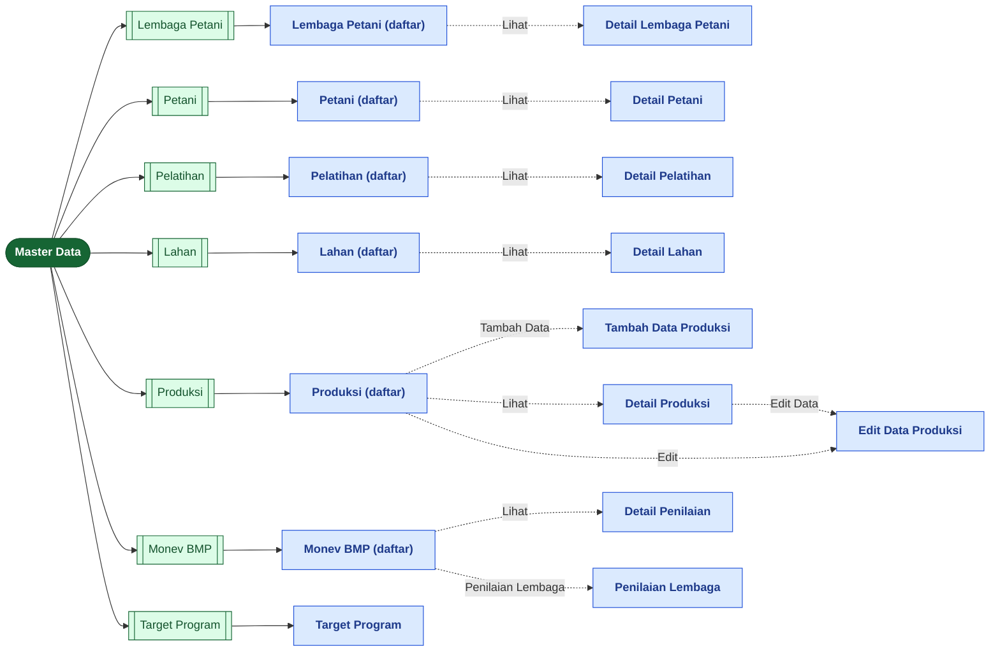
```mermaid
%%{init: {"flowchart": {"wrappingWidth": 420}}}%%
flowchart LR
  md(["Master Data"]):::menu
  md_groups[["Lembaga Petani"]]:::sub
  md_farmers[["Petani"]]:::sub
  md_training[["Pelatihan"]]:::sub
  md_parcels[["Lahan"]]:::sub
  md_production[["Produksi"]]:::sub
  md_bmpmonev[["Monev BMP"]]:::sub
  md_programtarget_sub[["Target Program"]]:::sub

  md_groups_list["Lembaga Petani (daftar)"]:::page
  md_groups_detail["Detail Lembaga Petani"]:::page
  md_farmers_list["Petani (daftar)"]:::page
  md_farmers_detail["Detail Petani"]:::page
  md_training_list["Pelatihan (daftar)"]:::page
  md_training_detail["Detail Pelatihan"]:::page
  md_parcels_list["Lahan (daftar)"]:::page
  md_parcels_detail["Detail Lahan"]:::page
  md_production_list["Produksi (daftar)"]:::page
  md_production_new["Tambah Data Produksi"]:::page
  md_production_detail["Detail Produksi"]:::page
  md_production_edit["Edit Data Produksi"]:::page
  md_bmpmonev_list["Monev BMP (daftar)"]:::page
  md_bmpmonev_detail["Detail Penilaian"]:::page
  md_bmpmonev_lembaga["Penilaian Lembaga"]:::page
  md_programtarget["Target Program"]:::page

  md --> md_groups --> md_groups_list
  md_groups_list -.->|Lihat| md_groups_detail
  md --> md_farmers --> md_farmers_list
  md_farmers_list -.->|Lihat| md_farmers_detail
  md --> md_training --> md_training_list
  md_training_list -.->|Lihat| md_training_detail
  md --> md_parcels --> md_parcels_list
  md_parcels_list -.->|Lihat| md_parcels_detail
  md --> md_production --> md_production_list
  md_production_list -.->|Tambah Data| md_production_new
  md_production_list -.->|Lihat| md_production_detail
  md_production_list -.->|Edit| md_production_edit
  md_production_detail -.->|Edit Data| md_production_edit
  md --> md_bmpmonev --> md_bmpmonev_list
  md_bmpmonev_list -.->|Lihat| md_bmpmonev_detail
  md_bmpmonev_list -.->|Penilaian Lembaga| md_bmpmonev_lembaga
  md --> md_programtarget_sub --> md_programtarget

  classDef menu fill:#166534,stroke:#14532d,color:#ffffff,font-weight:bold
  classDef sub fill:#dcfce7,stroke:#166534,color:#14532d
  classDef page fill:#dbeafe,stroke:#1d4ed8,color:#1e3a8a,font-weight:bold
```

| Halaman | Route | Katalog |
|---|---|---|
| Lembaga Petani (daftar) | `/admin/master-data/groups` | [groups/list.md](../pages/master-data/groups/list.md) |
| Detail Lembaga Petani | `/admin/master-data/groups/{id}` | [groups/detail.md](../pages/master-data/groups/detail.md) |
| Petani (daftar) | `/admin/master-data/farmers` | [farmers/list.md](../pages/master-data/farmers/list.md) |
| Detail Petani | `/admin/master-data/farmers/{id}` | [farmers/detail.md](../pages/master-data/farmers/detail.md) |
| Pelatihan (daftar) | `/admin/master-data/training` | [training/list.md](../pages/master-data/training/list.md) |
| Detail Pelatihan | `/admin/master-data/training/{id}` | [training/detail.md](../pages/master-data/training/detail.md) |
| Lahan (daftar) | `/admin/master-data/parcels` | [parcels/list.md](../pages/master-data/parcels/list.md) |
| Detail Lahan | `/admin/master-data/parcels/{id}` | [parcels/detail.md](../pages/master-data/parcels/detail.md) |
| Produksi (daftar) | `/admin/master-data/production` | [production/list.md](../pages/master-data/production/list.md) |
| Tambah Data Produksi | `/admin/master-data/production/new` | [production/new.md](../pages/master-data/production/new.md) |
| Detail Produksi | `/admin/master-data/production/{id}` | [production/detail.md](../pages/master-data/production/detail.md) |
| Edit Data Produksi | `/admin/master-data/production/{id}/edit` | [production/edit.md](../pages/master-data/production/edit.md) |
| Monev BMP (daftar) | `/admin/master-data/bmp-monev` | [bmp-monev/list.md](../pages/master-data/bmp-monev/list.md) |
| Detail Penilaian | `/admin/master-data/bmp-monev/{id}` | [bmp-monev/detail.md](../pages/master-data/bmp-monev/detail.md) |
| Penilaian Lembaga | `/admin/master-data/bmp-monev/lembaga` | [bmp-monev/lembaga.md](../pages/master-data/bmp-monev/lembaga.md) |
| Target Program | `/admin/master-data/program-target` | [program-target.md](../pages/master-data/program-target.md) |

Halaman induk `/admin/master-data` tidak punya isi; ia mengalihkan ke sub menu pertama (urut `order`) yang boleh diakses pengguna.

Semua halaman daftar memakai pola yang sama: kotak pencarian, tombol **Excel** (ekspor baris terfilter), tombol **Kolom** (tampilkan/sembunyikan kolom), paginasi, kolom aksi **Lihat · Edit · Nonaktifkan**, dan filter **Status** (Semua / Aktif / Nonaktif — hanya SUPERADMIN). Dialog tambah dan ubah adalah satu dialog yang sama; di diagram ditulis sekali sebagai `Dialog: Tambah / Edit …`.

## Lembaga Petani (daftar)

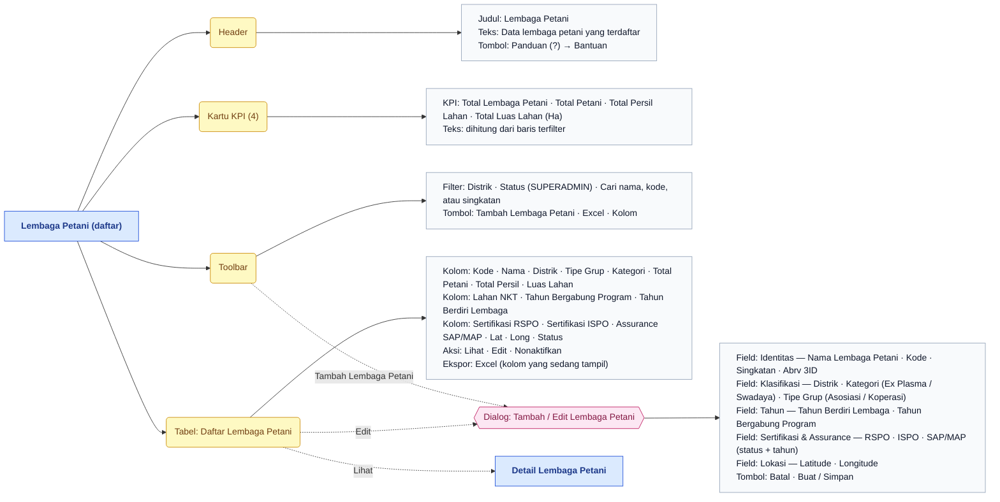
```mermaid
%%{init: {"flowchart": {"wrappingWidth": 420}}}%%
flowchart LR
  md_groups_list["Lembaga Petani (daftar)"]:::page

  md_groups_list_hdr("Header"):::section
  md_groups_list_hdr_c["Judul: Lembaga Petani<br/>Teks: Data lembaga petani yang terdaftar<br/>Tombol: Panduan (?) → Bantuan"]:::content

  md_groups_list_kpi("Kartu KPI (4)"):::section
  md_groups_list_kpi_c["KPI: Total Lembaga Petani · Total Petani · Total Persil Lahan · Total Luas Lahan (Ha)<br/>Teks: dihitung dari baris terfilter"]:::content

  md_groups_list_tb("Toolbar"):::section
  md_groups_list_tb_c["Filter: Distrik · Status (SUPERADMIN) · Cari nama, kode, atau singkatan<br/>Tombol: Tambah Lembaga Petani · Excel · Kolom"]:::content

  md_groups_list_tbl("Tabel: Daftar Lembaga Petani"):::section
  md_groups_list_tbl_c["Kolom: Kode · Nama · Distrik · Tipe Grup · Kategori · Total Petani · Total Persil · Luas Lahan<br/>Kolom: Lahan NKT · Tahun Bergabung Program · Tahun Berdiri Lembaga<br/>Kolom: Sertifikasi RSPO · Sertifikasi ISPO · Assurance SAP/MAP · Lat · Long · Status<br/>Aksi: Lihat · Edit · Nonaktifkan<br/>Ekspor: Excel (kolom yang sedang tampil)"]:::content

  md_groups_form{{"Dialog: Tambah / Edit Lembaga Petani"}}:::dialog
  md_groups_form_c["Field: Identitas — Nama Lembaga Petani · Kode · Singkatan · Abrv 3ID<br/>Field: Klasifikasi — Distrik · Kategori (Ex Plasma / Swadaya) · Tipe Grup (Asosiasi / Koperasi)<br/>Field: Tahun — Tahun Berdiri Lembaga · Tahun Bergabung Program<br/>Field: Sertifikasi & Assurance — RSPO · ISPO · SAP/MAP (status + tahun)<br/>Field: Lokasi — Latitude · Longitude<br/>Tombol: Batal · Buat / Simpan"]:::content

  md_groups_detail["Detail Lembaga Petani"]:::page

  md_groups_list --> md_groups_list_hdr --> md_groups_list_hdr_c
  md_groups_list --> md_groups_list_kpi --> md_groups_list_kpi_c
  md_groups_list --> md_groups_list_tb --> md_groups_list_tb_c
  md_groups_list --> md_groups_list_tbl --> md_groups_list_tbl_c
  md_groups_list_tb -.->|Tambah Lembaga Petani| md_groups_form --> md_groups_form_c
  md_groups_list_tbl -.->|Edit| md_groups_form
  md_groups_list_tbl -.->|Lihat| md_groups_detail

  classDef page fill:#dbeafe,stroke:#1d4ed8,color:#1e3a8a,font-weight:bold
  classDef section fill:#fef9c3,stroke:#ca8a04,color:#713f12
  classDef content fill:#f8fafc,stroke:#94a3b8,color:#0f172a,text-align:left
  classDef dialog fill:#fce7f3,stroke:#be185d,color:#831843
```

## Detail Lembaga Petani — bagian 1

Header, kartu ringkasan, tab **Ringkasan** dan **Petani**.

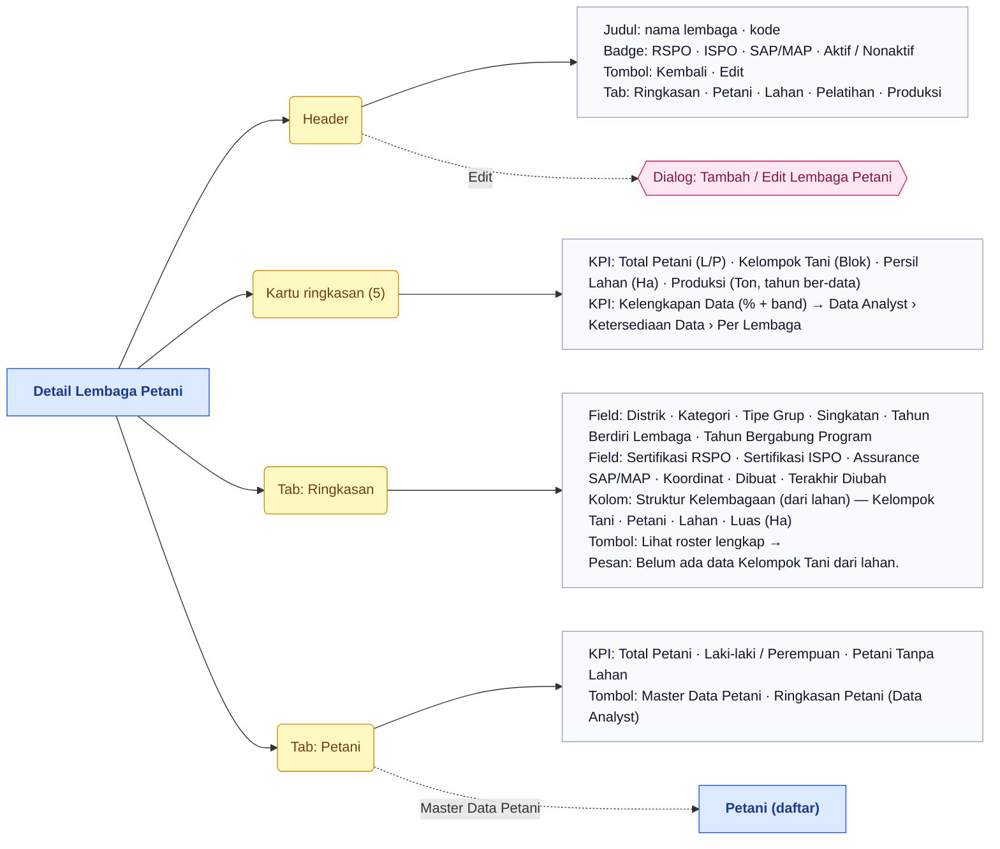
```mermaid
%%{init: {"flowchart": {"wrappingWidth": 420}}}%%
flowchart LR
  md_groups_detail["Detail Lembaga Petani"]:::page

  md_groups_detail_hdr("Header"):::section
  md_groups_detail_hdr_c["Judul: nama lembaga · kode<br/>Badge: RSPO · ISPO · SAP/MAP · Aktif / Nonaktif<br/>Tombol: Kembali · Edit<br/>Tab: Ringkasan · Petani · Lahan · Pelatihan · Produksi"]:::content

  md_groups_detail_kpi("Kartu ringkasan (5)"):::section
  md_groups_detail_kpi_c["KPI: Total Petani (L/P) · Kelompok Tani (Blok) · Persil Lahan (Ha) · Produksi (Ton, tahun ber-data)<br/>KPI: Kelengkapan Data (% + band) → Data Analyst › Ketersediaan Data › Per Lembaga"]:::content

  md_groups_detail_t1("Tab: Ringkasan"):::section
  md_groups_detail_t1_c["Field: Distrik · Kategori · Tipe Grup · Singkatan · Tahun Berdiri Lembaga · Tahun Bergabung Program<br/>Field: Sertifikasi RSPO · Sertifikasi ISPO · Assurance SAP/MAP · Koordinat · Dibuat · Terakhir Diubah<br/>Kolom: Struktur Kelembagaan (dari lahan) — Kelompok Tani · Petani · Lahan · Luas (Ha)<br/>Tombol: Lihat roster lengkap →<br/>Pesan: Belum ada data Kelompok Tani dari lahan."]:::content

  md_groups_detail_t2("Tab: Petani"):::section
  md_groups_detail_t2_c["KPI: Total Petani · Laki-laki / Perempuan · Petani Tanpa Lahan<br/>Tombol: Master Data Petani · Ringkasan Petani (Data Analyst)"]:::content

  md_groups_form{{"Dialog: Tambah / Edit Lembaga Petani"}}:::dialog
  md_farmers_list["Petani (daftar)"]:::page

  md_groups_detail --> md_groups_detail_hdr --> md_groups_detail_hdr_c
  md_groups_detail --> md_groups_detail_kpi --> md_groups_detail_kpi_c
  md_groups_detail --> md_groups_detail_t1 --> md_groups_detail_t1_c
  md_groups_detail --> md_groups_detail_t2 --> md_groups_detail_t2_c
  md_groups_detail_hdr -.->|Edit| md_groups_form
  md_groups_detail_t2 -.->|Master Data Petani| md_farmers_list

  classDef page fill:#dbeafe,stroke:#1d4ed8,color:#1e3a8a,font-weight:bold
  classDef section fill:#fef9c3,stroke:#ca8a04,color:#713f12
  classDef content fill:#f8fafc,stroke:#94a3b8,color:#0f172a,text-align:left
  classDef dialog fill:#fce7f3,stroke:#be185d,color:#831843
```

## Detail Lembaga Petani — bagian 2

Tab **Lahan**, **Pelatihan**, dan **Produksi**.

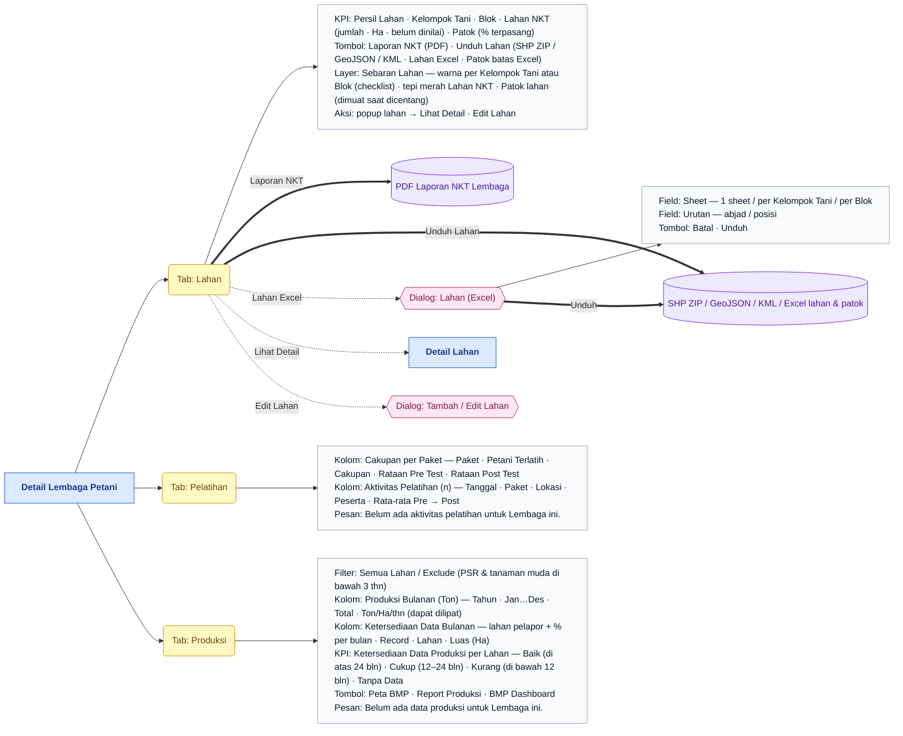
```mermaid
%%{init: {"flowchart": {"wrappingWidth": 420}}}%%
flowchart LR
  md_groups_detail["Detail Lembaga Petani"]:::page

  md_groups_detail_t3("Tab: Lahan"):::section
  md_groups_detail_t3_c["KPI: Persil Lahan · Kelompok Tani · Blok · Lahan NKT (jumlah · Ha · belum dinilai) · Patok (% terpasang)<br/>Tombol: Laporan NKT (PDF) · Unduh Lahan (SHP ZIP / GeoJSON / KML · Lahan Excel · Patok batas Excel)<br/>Layer: Sebaran Lahan — warna per Kelompok Tani atau Blok (checklist) · tepi merah Lahan NKT · Patok lahan (dimuat saat dicentang)<br/>Aksi: popup lahan → Lihat Detail · Edit Lahan"]:::content

  md_groups_detail_xlsx{{"Dialog: Lahan (Excel)"}}:::dialog
  md_groups_detail_xlsx_c["Field: Sheet — 1 sheet / per Kelompok Tani / per Blok<br/>Field: Urutan — abjad / posisi<br/>Tombol: Batal · Unduh"]:::content

  md_groups_detail_nktpdf[("PDF Laporan NKT Lembaga")]:::data
  md_groups_detail_dl[("SHP ZIP / GeoJSON / KML / Excel lahan & patok")]:::data

  md_groups_detail_t4("Tab: Pelatihan"):::section
  md_groups_detail_t4_c["Kolom: Cakupan per Paket — Paket · Petani Terlatih · Cakupan · Rataan Pre Test · Rataan Post Test<br/>Kolom: Aktivitas Pelatihan (n) — Tanggal · Paket · Lokasi · Peserta · Rata-rata Pre → Post<br/>Pesan: Belum ada aktivitas pelatihan untuk Lembaga ini."]:::content

  md_groups_detail_t5("Tab: Produksi"):::section
  md_groups_detail_t5_c["Filter: Semua Lahan / Exclude (PSR & tanaman muda di bawah 3 thn)<br/>Kolom: Produksi Bulanan (Ton) — Tahun · Jan…Des · Total · Ton/Ha/thn (dapat dilipat)<br/>Kolom: Ketersediaan Data Bulanan — lahan pelapor + % per bulan · Record · Lahan · Luas (Ha)<br/>KPI: Ketersediaan Data Produksi per Lahan — Baik (di atas 24 bln) · Cukup (12–24 bln) · Kurang (di bawah 12 bln) · Tanpa Data<br/>Tombol: Peta BMP · Report Produksi · BMP Dashboard<br/>Pesan: Belum ada data produksi untuk Lembaga ini."]:::content

  md_parcels_detail["Detail Lahan"]:::page
  md_parcels_form{{"Dialog: Tambah / Edit Lahan"}}:::dialog

  md_groups_detail --> md_groups_detail_t3 --> md_groups_detail_t3_c
  md_groups_detail --> md_groups_detail_t4 --> md_groups_detail_t4_c
  md_groups_detail --> md_groups_detail_t5 --> md_groups_detail_t5_c
  md_groups_detail_t3 ==>|Laporan NKT| md_groups_detail_nktpdf
  md_groups_detail_t3 ==>|Unduh Lahan| md_groups_detail_dl
  md_groups_detail_t3 -.->|Lahan Excel| md_groups_detail_xlsx --> md_groups_detail_xlsx_c
  md_groups_detail_xlsx ==>|Unduh| md_groups_detail_dl
  md_groups_detail_t3 -.->|Lihat Detail| md_parcels_detail
  md_groups_detail_t3 -.->|Edit Lahan| md_parcels_form

  classDef page fill:#dbeafe,stroke:#1d4ed8,color:#1e3a8a,font-weight:bold
  classDef section fill:#fef9c3,stroke:#ca8a04,color:#713f12
  classDef content fill:#f8fafc,stroke:#94a3b8,color:#0f172a,text-align:left
  classDef dialog fill:#fce7f3,stroke:#be185d,color:#831843
  classDef data fill:#ede9fe,stroke:#6d28d9,color:#4c1d95
```

## Petani (daftar)

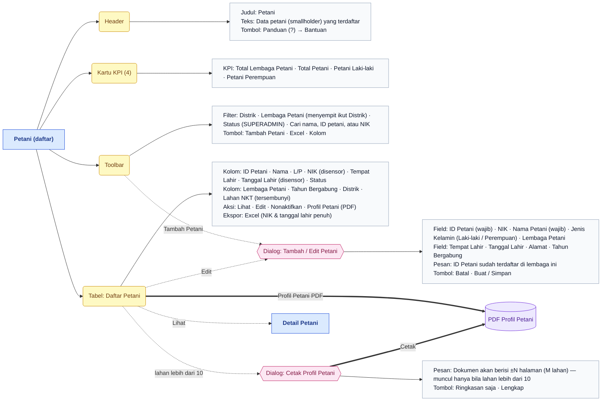
```mermaid
%%{init: {"flowchart": {"wrappingWidth": 420}}}%%
flowchart LR
  md_farmers_list["Petani (daftar)"]:::page

  md_farmers_list_hdr("Header"):::section
  md_farmers_list_hdr_c["Judul: Petani<br/>Teks: Data petani (smallholder) yang terdaftar<br/>Tombol: Panduan (?) → Bantuan"]:::content

  md_farmers_list_kpi("Kartu KPI (4)"):::section
  md_farmers_list_kpi_c["KPI: Total Lembaga Petani · Total Petani · Petani Laki-laki · Petani Perempuan"]:::content

  md_farmers_list_tb("Toolbar"):::section
  md_farmers_list_tb_c["Filter: Distrik · Lembaga Petani (menyempit ikut Distrik) · Status (SUPERADMIN) · Cari nama, ID petani, atau NIK<br/>Tombol: Tambah Petani · Excel · Kolom"]:::content

  md_farmers_list_tbl("Tabel: Daftar Petani"):::section
  md_farmers_list_tbl_c["Kolom: ID Petani · Nama · L/P · NIK (disensor) · Tempat Lahir · Tanggal Lahir (disensor) · Status<br/>Kolom: Lembaga Petani · Tahun Bergabung · Distrik · Lahan NKT (tersembunyi)<br/>Aksi: Lihat · Edit · Nonaktifkan · Profil Petani (PDF)<br/>Ekspor: Excel (NIK & tanggal lahir penuh)"]:::content

  md_farmers_form{{"Dialog: Tambah / Edit Petani"}}:::dialog
  md_farmers_form_c["Field: ID Petani (wajib) · NIK · Nama Petani (wajib) · Jenis Kelamin (Laki-laki / Perempuan) · Lembaga Petani<br/>Field: Tempat Lahir · Tanggal Lahir · Alamat · Tahun Bergabung<br/>Pesan: ID Petani sudah terdaftar di lembaga ini<br/>Tombol: Batal · Buat / Simpan"]:::content

  md_farmers_print{{"Dialog: Cetak Profil Petani"}}:::dialog
  md_farmers_print_c["Pesan: Dokumen akan berisi ±N halaman (M lahan) — muncul hanya bila lahan lebih dari 10<br/>Tombol: Ringkasan saja · Lengkap"]:::content

  md_farmers_pdf[("PDF Profil Petani")]:::data
  md_farmers_detail["Detail Petani"]:::page

  md_farmers_list --> md_farmers_list_hdr --> md_farmers_list_hdr_c
  md_farmers_list --> md_farmers_list_kpi --> md_farmers_list_kpi_c
  md_farmers_list --> md_farmers_list_tb --> md_farmers_list_tb_c
  md_farmers_list --> md_farmers_list_tbl --> md_farmers_list_tbl_c
  md_farmers_list_tb -.->|Tambah Petani| md_farmers_form --> md_farmers_form_c
  md_farmers_list_tbl -.->|Edit| md_farmers_form
  md_farmers_list_tbl -.->|Lihat| md_farmers_detail
  md_farmers_list_tbl ==>|Profil Petani PDF| md_farmers_pdf
  md_farmers_list_tbl -.->|lahan lebih dari 10| md_farmers_print --> md_farmers_print_c
  md_farmers_print ==>|Cetak| md_farmers_pdf

  classDef page fill:#dbeafe,stroke:#1d4ed8,color:#1e3a8a,font-weight:bold
  classDef section fill:#fef9c3,stroke:#ca8a04,color:#713f12
  classDef content fill:#f8fafc,stroke:#94a3b8,color:#0f172a,text-align:left
  classDef dialog fill:#fce7f3,stroke:#be185d,color:#831843
  classDef data fill:#ede9fe,stroke:#6d28d9,color:#4c1d95
```

## Detail Petani — bagian 1

Header, kartu ringkasan, tab **Ringkasan** dan **Lahan**, cetak Profil Petani.

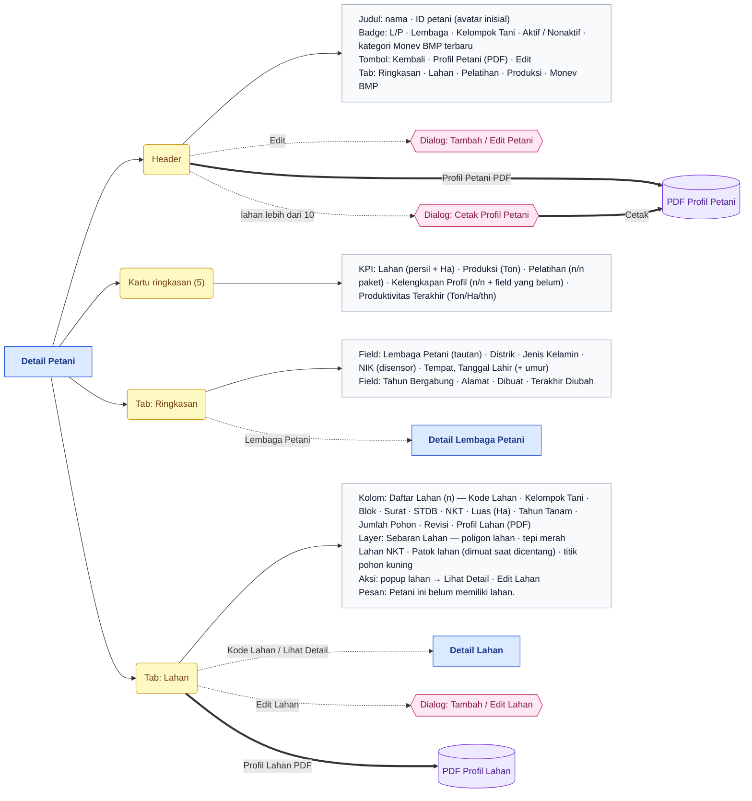
```mermaid
%%{init: {"flowchart": {"wrappingWidth": 420}}}%%
flowchart LR
  md_farmers_detail["Detail Petani"]:::page

  md_farmers_detail_hdr("Header"):::section
  md_farmers_detail_hdr_c["Judul: nama · ID petani (avatar inisial)<br/>Badge: L/P · Lembaga · Kelompok Tani · Aktif / Nonaktif · kategori Monev BMP terbaru<br/>Tombol: Kembali · Profil Petani (PDF) · Edit<br/>Tab: Ringkasan · Lahan · Pelatihan · Produksi · Monev BMP"]:::content

  md_farmers_detail_kpi("Kartu ringkasan (5)"):::section
  md_farmers_detail_kpi_c["KPI: Lahan (persil + Ha) · Produksi (Ton) · Pelatihan (n/n paket) · Kelengkapan Profil (n/n + field yang belum) · Produktivitas Terakhir (Ton/Ha/thn)"]:::content

  md_farmers_detail_t1("Tab: Ringkasan"):::section
  md_farmers_detail_t1_c["Field: Lembaga Petani (tautan) · Distrik · Jenis Kelamin · NIK (disensor) · Tempat, Tanggal Lahir (+ umur)<br/>Field: Tahun Bergabung · Alamat · Dibuat · Terakhir Diubah"]:::content

  md_farmers_detail_t2("Tab: Lahan"):::section
  md_farmers_detail_t2_c["Kolom: Daftar Lahan (n) — Kode Lahan · Kelompok Tani · Blok · Surat · STDB · NKT · Luas (Ha) · Tahun Tanam · Jumlah Pohon · Revisi · Profil Lahan (PDF)<br/>Layer: Sebaran Lahan — poligon lahan · tepi merah Lahan NKT · Patok lahan (dimuat saat dicentang) · titik pohon kuning<br/>Aksi: popup lahan → Lihat Detail · Edit Lahan<br/>Pesan: Petani ini belum memiliki lahan."]:::content

  md_farmers_form{{"Dialog: Tambah / Edit Petani"}}:::dialog
  md_farmers_print{{"Dialog: Cetak Profil Petani"}}:::dialog
  md_farmers_pdf[("PDF Profil Petani")]:::data
  md_parcels_pdf[("PDF Profil Lahan")]:::data
  md_groups_detail["Detail Lembaga Petani"]:::page
  md_parcels_detail["Detail Lahan"]:::page
  md_parcels_form{{"Dialog: Tambah / Edit Lahan"}}:::dialog

  md_farmers_detail --> md_farmers_detail_hdr --> md_farmers_detail_hdr_c
  md_farmers_detail --> md_farmers_detail_kpi --> md_farmers_detail_kpi_c
  md_farmers_detail --> md_farmers_detail_t1 --> md_farmers_detail_t1_c
  md_farmers_detail --> md_farmers_detail_t2 --> md_farmers_detail_t2_c
  md_farmers_detail_hdr -.->|Edit| md_farmers_form
  md_farmers_detail_hdr ==>|Profil Petani PDF| md_farmers_pdf
  md_farmers_detail_hdr -.->|lahan lebih dari 10| md_farmers_print ==>|Cetak| md_farmers_pdf
  md_farmers_detail_t1 -.->|Lembaga Petani| md_groups_detail
  md_farmers_detail_t2 -.->|Kode Lahan / Lihat Detail| md_parcels_detail
  md_farmers_detail_t2 -.->|Edit Lahan| md_parcels_form
  md_farmers_detail_t2 ==>|Profil Lahan PDF| md_parcels_pdf

  classDef page fill:#dbeafe,stroke:#1d4ed8,color:#1e3a8a,font-weight:bold
  classDef section fill:#fef9c3,stroke:#ca8a04,color:#713f12
  classDef content fill:#f8fafc,stroke:#94a3b8,color:#0f172a,text-align:left
  classDef dialog fill:#fce7f3,stroke:#be185d,color:#831843
  classDef data fill:#ede9fe,stroke:#6d28d9,color:#4c1d95
```

PDF Profil Petani: Bagian A (identitas lengkap, 5 kartu, daftar lahan bernomor, peta sebaran, pelatihan, produksi per lahan per tahun, Monev BMP) + Bagian B lampiran Profil Lahan per lahan (dilewati bila memilih *Ringkasan saja*).

## Detail Petani — bagian 2

Tab **Pelatihan**, **Produksi**, dan **Monev BMP**.

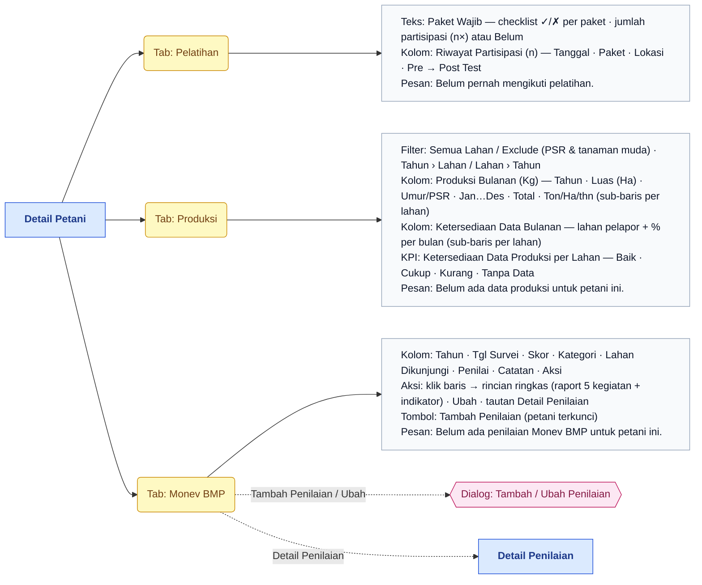
```mermaid
%%{init: {"flowchart": {"wrappingWidth": 420}}}%%
flowchart LR
  md_farmers_detail["Detail Petani"]:::page

  md_farmers_detail_t3("Tab: Pelatihan"):::section
  md_farmers_detail_t3_c["Teks: Paket Wajib — checklist ✓/✗ per paket · jumlah partisipasi (n×) atau Belum<br/>Kolom: Riwayat Partisipasi (n) — Tanggal · Paket · Lokasi · Pre → Post Test<br/>Pesan: Belum pernah mengikuti pelatihan."]:::content

  md_farmers_detail_t4("Tab: Produksi"):::section
  md_farmers_detail_t4_c["Filter: Semua Lahan / Exclude (PSR & tanaman muda) · Tahun › Lahan / Lahan › Tahun<br/>Kolom: Produksi Bulanan (Kg) — Tahun · Luas (Ha) · Umur/PSR · Jan…Des · Total · Ton/Ha/thn (sub-baris per lahan)<br/>Kolom: Ketersediaan Data Bulanan — lahan pelapor + % per bulan (sub-baris per lahan)<br/>KPI: Ketersediaan Data Produksi per Lahan — Baik · Cukup · Kurang · Tanpa Data<br/>Pesan: Belum ada data produksi untuk petani ini."]:::content

  md_farmers_detail_t5("Tab: Monev BMP"):::section
  md_farmers_detail_t5_c["Kolom: Tahun · Tgl Survei · Skor · Kategori · Lahan Dikunjungi · Penilai · Catatan · Aksi<br/>Aksi: klik baris → rincian ringkas (raport 5 kegiatan + indikator) · Ubah · tautan Detail Penilaian<br/>Tombol: Tambah Penilaian (petani terkunci)<br/>Pesan: Belum ada penilaian Monev BMP untuk petani ini."]:::content

  md_bmpmonev_form{{"Dialog: Tambah / Ubah Penilaian"}}:::dialog
  md_bmpmonev_detail["Detail Penilaian"]:::page

  md_farmers_detail --> md_farmers_detail_t3 --> md_farmers_detail_t3_c
  md_farmers_detail --> md_farmers_detail_t4 --> md_farmers_detail_t4_c
  md_farmers_detail --> md_farmers_detail_t5 --> md_farmers_detail_t5_c
  md_farmers_detail_t5 -.->|Tambah Penilaian / Ubah| md_bmpmonev_form
  md_farmers_detail_t5 -.->|Detail Penilaian| md_bmpmonev_detail

  classDef page fill:#dbeafe,stroke:#1d4ed8,color:#1e3a8a,font-weight:bold
  classDef section fill:#fef9c3,stroke:#ca8a04,color:#713f12
  classDef content fill:#f8fafc,stroke:#94a3b8,color:#0f172a,text-align:left
  classDef dialog fill:#fce7f3,stroke:#be185d,color:#831843
```

## Pelatihan (daftar)

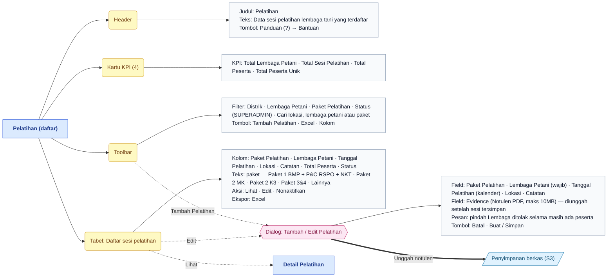
```mermaid
%%{init: {"flowchart": {"wrappingWidth": 420}}}%%
flowchart LR
  md_training_list["Pelatihan (daftar)"]:::page

  md_training_list_hdr("Header"):::section
  md_training_list_hdr_c["Judul: Pelatihan<br/>Teks: Data sesi pelatihan lembaga tani yang terdaftar<br/>Tombol: Panduan (?) → Bantuan"]:::content

  md_training_list_kpi("Kartu KPI (4)"):::section
  md_training_list_kpi_c["KPI: Total Lembaga Petani · Total Sesi Pelatihan · Total Peserta · Total Peserta Unik"]:::content

  md_training_list_tb("Toolbar"):::section
  md_training_list_tb_c["Filter: Distrik · Lembaga Petani · Paket Pelatihan · Status (SUPERADMIN) · Cari lokasi, lembaga petani atau paket<br/>Tombol: Tambah Pelatihan · Excel · Kolom"]:::content

  md_training_list_tbl("Tabel: Daftar sesi pelatihan"):::section
  md_training_list_tbl_c["Kolom: Paket Pelatihan · Lembaga Petani · Tanggal Pelatihan · Lokasi · Catatan · Total Peserta · Status<br/>Teks: paket — Paket 1 BMP + P&C RSPO + NKT · Paket 2 MK · Paket 2 K3 · Paket 3&4 · Lainnya<br/>Aksi: Lihat · Edit · Nonaktifkan<br/>Ekspor: Excel"]:::content

  md_training_form{{"Dialog: Tambah / Edit Pelatihan"}}:::dialog
  md_training_form_c["Field: Paket Pelatihan · Lembaga Petani (wajib) · Tanggal Pelatihan (kalender) · Lokasi · Catatan<br/>Field: Evidence (Notulen PDF, maks 10MB) — diunggah setelah sesi tersimpan<br/>Pesan: pindah Lembaga ditolak selama masih ada peserta<br/>Tombol: Batal · Buat / Simpan"]:::content

  md_training_s3[/"Penyimpanan berkas (S3)"/]:::external
  md_training_detail["Detail Pelatihan"]:::page

  md_training_list --> md_training_list_hdr --> md_training_list_hdr_c
  md_training_list --> md_training_list_kpi --> md_training_list_kpi_c
  md_training_list --> md_training_list_tb --> md_training_list_tb_c
  md_training_list --> md_training_list_tbl --> md_training_list_tbl_c
  md_training_list_tb -.->|Tambah Pelatihan| md_training_form --> md_training_form_c
  md_training_list_tbl -.->|Edit| md_training_form
  md_training_form ==>|Unggah notulen| md_training_s3
  md_training_list_tbl -.->|Lihat| md_training_detail

  classDef page fill:#dbeafe,stroke:#1d4ed8,color:#1e3a8a,font-weight:bold
  classDef section fill:#fef9c3,stroke:#ca8a04,color:#713f12
  classDef content fill:#f8fafc,stroke:#94a3b8,color:#0f172a,text-align:left
  classDef dialog fill:#fce7f3,stroke:#be185d,color:#831843
  classDef external fill:#e0f2fe,stroke:#0369a1,color:#0c4a6e
```

## Detail Pelatihan

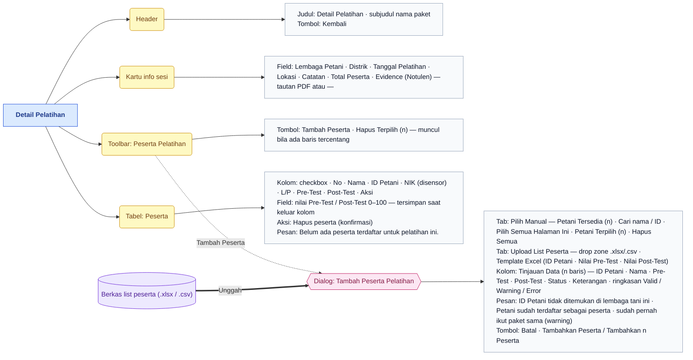
```mermaid
%%{init: {"flowchart": {"wrappingWidth": 420}}}%%
flowchart LR
  md_training_detail["Detail Pelatihan"]:::page

  md_training_detail_hdr("Header"):::section
  md_training_detail_hdr_c["Judul: Detail Pelatihan · subjudul nama paket<br/>Tombol: Kembali"]:::content

  md_training_detail_info("Kartu info sesi"):::section
  md_training_detail_info_c["Field: Lembaga Petani · Distrik · Tanggal Pelatihan · Lokasi · Catatan · Total Peserta · Evidence (Notulen) — tautan PDF atau —"]:::content

  md_training_detail_tb("Toolbar: Peserta Pelatihan"):::section
  md_training_detail_tb_c["Tombol: Tambah Peserta · Hapus Terpilih (n) — muncul bila ada baris tercentang"]:::content

  md_training_detail_tbl("Tabel: Peserta"):::section
  md_training_detail_tbl_c["Kolom: checkbox · No · Nama · ID Petani · NIK (disensor) · L/P · Pre-Test · Post-Test · Aksi<br/>Field: nilai Pre-Test / Post-Test 0–100 — tersimpan saat keluar kolom<br/>Aksi: Hapus peserta (konfirmasi)<br/>Pesan: Belum ada peserta terdaftar untuk pelatihan ini."]:::content

  md_training_detail_add{{"Dialog: Tambah Peserta Pelatihan"}}:::dialog
  md_training_detail_add_c["Tab: Pilih Manual — Petani Tersedia (n) · Cari nama / ID · Pilih Semua Halaman Ini · Petani Terpilih (n) · Hapus Semua<br/>Tab: Upload List Peserta — drop zone .xlsx/.csv · Template Excel (ID Petani · Nilai Pre-Test · Nilai Post-Test)<br/>Kolom: Tinjauan Data (n baris) — ID Petani · Nama · Pre-Test · Post-Test · Status · Keterangan · ringkasan Valid / Warning / Error<br/>Pesan: ID Petani tidak ditemukan di lembaga tani ini · Petani sudah terdaftar sebagai peserta · sudah pernah ikut paket sama (warning)<br/>Tombol: Batal · Tambahkan Peserta / Tambahkan n Peserta"]:::content

  md_training_detail_file[("Berkas list peserta (.xlsx / .csv)")]:::data

  md_training_detail --> md_training_detail_hdr --> md_training_detail_hdr_c
  md_training_detail --> md_training_detail_info --> md_training_detail_info_c
  md_training_detail --> md_training_detail_tb --> md_training_detail_tb_c
  md_training_detail --> md_training_detail_tbl --> md_training_detail_tbl_c
  md_training_detail_tb -.->|Tambah Peserta| md_training_detail_add --> md_training_detail_add_c
  md_training_detail_file ==>|Unggah| md_training_detail_add

  classDef page fill:#dbeafe,stroke:#1d4ed8,color:#1e3a8a,font-weight:bold
  classDef section fill:#fef9c3,stroke:#ca8a04,color:#713f12
  classDef content fill:#f8fafc,stroke:#94a3b8,color:#0f172a,text-align:left
  classDef dialog fill:#fce7f3,stroke:#be185d,color:#831843
  classDef data fill:#ede9fe,stroke:#6d28d9,color:#4c1d95
```

## Lahan (daftar)

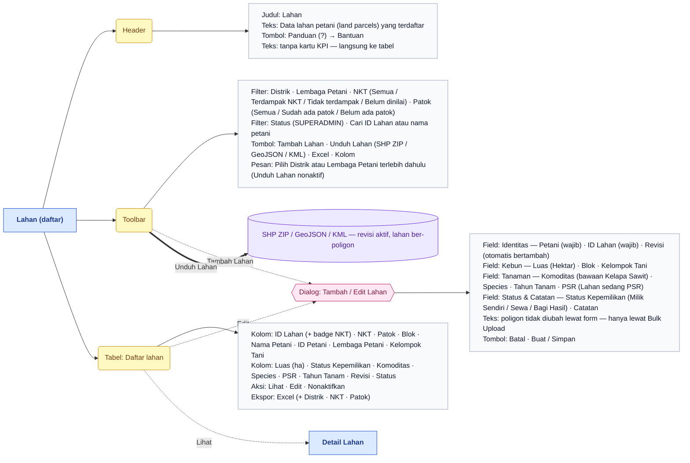
```mermaid
%%{init: {"flowchart": {"wrappingWidth": 420}}}%%
flowchart LR
  md_parcels_list["Lahan (daftar)"]:::page

  md_parcels_list_hdr("Header"):::section
  md_parcels_list_hdr_c["Judul: Lahan<br/>Teks: Data lahan petani (land parcels) yang terdaftar<br/>Tombol: Panduan (?) → Bantuan<br/>Teks: tanpa kartu KPI — langsung ke tabel"]:::content

  md_parcels_list_tb("Toolbar"):::section
  md_parcels_list_tb_c["Filter: Distrik · Lembaga Petani · NKT (Semua / Terdampak NKT / Tidak terdampak / Belum dinilai) · Patok (Semua / Sudah ada patok / Belum ada patok)<br/>Filter: Status (SUPERADMIN) · Cari ID Lahan atau nama petani<br/>Tombol: Tambah Lahan · Unduh Lahan (SHP ZIP / GeoJSON / KML) · Excel · Kolom<br/>Pesan: Pilih Distrik atau Lembaga Petani terlebih dahulu (Unduh Lahan nonaktif)"]:::content

  md_parcels_list_tbl("Tabel: Daftar lahan"):::section
  md_parcels_list_tbl_c["Kolom: ID Lahan (+ badge NKT) · NKT · Patok · Blok · Nama Petani · ID Petani · Lembaga Petani · Kelompok Tani<br/>Kolom: Luas (ha) · Status Kepemilikan · Komoditas · Species · PSR · Tahun Tanam · Revisi · Status<br/>Aksi: Lihat · Edit · Nonaktifkan<br/>Ekspor: Excel (+ Distrik · NKT · Patok)"]:::content

  md_parcels_form{{"Dialog: Tambah / Edit Lahan"}}:::dialog
  md_parcels_form_c["Field: Identitas — Petani (wajib) · ID Lahan (wajib) · Revisi (otomatis bertambah)<br/>Field: Kebun — Luas (Hektar) · Blok · Kelompok Tani<br/>Field: Tanaman — Komoditas (bawaan Kelapa Sawit) · Species · Tahun Tanam · PSR (Lahan sedang PSR)<br/>Field: Status & Catatan — Status Kepemilikan (Milik Sendiri / Sewa / Bagi Hasil) · Catatan<br/>Teks: poligon tidak diubah lewat form — hanya lewat Bulk Upload<br/>Tombol: Batal · Buat / Simpan"]:::content

  md_parcels_list_dl[("SHP ZIP / GeoJSON / KML — revisi aktif, lahan ber-poligon")]:::data
  md_parcels_detail["Detail Lahan"]:::page

  md_parcels_list --> md_parcels_list_hdr --> md_parcels_list_hdr_c
  md_parcels_list --> md_parcels_list_tb --> md_parcels_list_tb_c
  md_parcels_list --> md_parcels_list_tbl --> md_parcels_list_tbl_c
  md_parcels_list_tb -.->|Tambah Lahan| md_parcels_form --> md_parcels_form_c
  md_parcels_list_tbl -.->|Edit| md_parcels_form
  md_parcels_list_tb ==>|Unduh Lahan| md_parcels_list_dl
  md_parcels_list_tbl -.->|Lihat| md_parcels_detail

  classDef page fill:#dbeafe,stroke:#1d4ed8,color:#1e3a8a,font-weight:bold
  classDef section fill:#fef9c3,stroke:#ca8a04,color:#713f12
  classDef content fill:#f8fafc,stroke:#94a3b8,color:#0f172a,text-align:left
  classDef dialog fill:#fce7f3,stroke:#be185d,color:#831843
  classDef data fill:#ede9fe,stroke:#6d28d9,color:#4c1d95
```

## Detail Lahan — bagian 1

Header, kartu ringkasan, dan tab **Informasi** (peta + atribut + pemilik). Halaman detail terbesar; dipecah empat bagian.

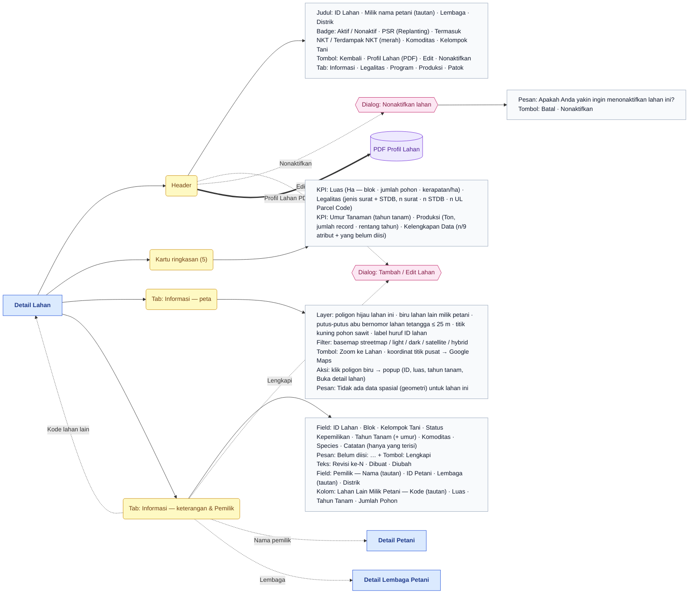
```mermaid
%%{init: {"flowchart": {"wrappingWidth": 420}}}%%
flowchart LR
  md_parcels_detail["Detail Lahan"]:::page

  md_parcels_detail_hdr("Header"):::section
  md_parcels_detail_hdr_c["Judul: ID Lahan · Milik nama petani (tautan) · Lembaga · Distrik<br/>Badge: Aktif / Nonaktif · PSR (Replanting) · Termasuk NKT / Terdampak NKT (merah) · Komoditas · Kelompok Tani<br/>Tombol: Kembali · Profil Lahan (PDF) · Edit · Nonaktifkan<br/>Tab: Informasi · Legalitas · Program · Produksi · Patok"]:::content

  md_parcels_detail_kpi("Kartu ringkasan (5)"):::section
  md_parcels_detail_kpi_c["KPI: Luas (Ha — blok · jumlah pohon · kerapatan/ha) · Legalitas (jenis surat + STDB, n surat · n STDB · n UL Parcel Code)<br/>KPI: Umur Tanaman (tahun tanam) · Produksi (Ton, jumlah record · rentang tahun) · Kelengkapan Data (n/9 atribut + yang belum diisi)"]:::content

  md_parcels_detail_t1("Tab: Informasi — peta"):::section
  md_parcels_detail_t1_c["Layer: poligon hijau lahan ini · biru lahan lain milik petani · putus-putus abu bernomor lahan tetangga ≤ 25 m · titik kuning pohon sawit · label huruf ID lahan<br/>Filter: basemap streetmap / light / dark / satellite / hybrid<br/>Tombol: Zoom ke Lahan · koordinat titik pusat → Google Maps<br/>Aksi: klik poligon biru → popup (ID, luas, tahun tanam, Buka detail lahan)<br/>Pesan: Tidak ada data spasial (geometri) untuk lahan ini"]:::content

  md_parcels_detail_t1b("Tab: Informasi — keterangan & Pemilik"):::section
  md_parcels_detail_t1b_c["Field: ID Lahan · Blok · Kelompok Tani · Status Kepemilikan · Tahun Tanam (+ umur) · Komoditas · Species · Catatan (hanya yang terisi)<br/>Pesan: Belum diisi: … + Tombol: Lengkapi<br/>Teks: Revisi ke-N · Dibuat · Diubah<br/>Field: Pemilik — Nama (tautan) · ID Petani · Lembaga (tautan) · Distrik<br/>Kolom: Lahan Lain Milik Petani — Kode (tautan) · Luas · Tahun Tanam · Jumlah Pohon"]:::content

  md_parcels_form{{"Dialog: Tambah / Edit Lahan"}}:::dialog
  md_parcels_detail_del{{"Dialog: Nonaktifkan lahan"}}:::dialog
  md_parcels_detail_del_c["Pesan: Apakah Anda yakin ingin menonaktifkan lahan ini?<br/>Tombol: Batal · Nonaktifkan"]:::content
  md_parcels_pdf[("PDF Profil Lahan")]:::data
  md_farmers_detail["Detail Petani"]:::page
  md_groups_detail["Detail Lembaga Petani"]:::page

  md_parcels_detail --> md_parcels_detail_hdr --> md_parcels_detail_hdr_c
  md_parcels_detail --> md_parcels_detail_kpi --> md_parcels_detail_kpi_c
  md_parcels_detail --> md_parcels_detail_t1 --> md_parcels_detail_t1_c
  md_parcels_detail --> md_parcels_detail_t1b --> md_parcels_detail_t1b_c
  md_parcels_detail_hdr -.->|Edit| md_parcels_form
  md_parcels_detail_t1b -.->|Lengkapi| md_parcels_form
  md_parcels_detail_hdr -.->|Nonaktifkan| md_parcels_detail_del --> md_parcels_detail_del_c
  md_parcels_detail_hdr ==>|Profil Lahan PDF| md_parcels_pdf
  md_parcels_detail_t1b -.->|Nama pemilik| md_farmers_detail
  md_parcels_detail_t1b -.->|Lembaga| md_groups_detail
  md_parcels_detail_t1b -.->|Kode lahan lain| md_parcels_detail

  classDef page fill:#dbeafe,stroke:#1d4ed8,color:#1e3a8a,font-weight:bold
  classDef section fill:#fef9c3,stroke:#ca8a04,color:#713f12
  classDef content fill:#f8fafc,stroke:#94a3b8,color:#0f172a,text-align:left
  classDef dialog fill:#fce7f3,stroke:#be185d,color:#831843
  classDef data fill:#ede9fe,stroke:#6d28d9,color:#4c1d95
```

PDF Profil Lahan (Farm Passport): informasi lahan + NKT, pemilik, Sepadan, legalitas & dokumen, pelatihan, produksi, peta poligon ber-tetangga, Patok Batas; nonaktif bila lahan tanpa geometri. Dipakai ulang sebagai lampiran PDF Profil Petani.

## Detail Lahan — bagian 2

Kotak di dalam tab **Informasi**: Sepadan, NKT, Lahan Tetangga.

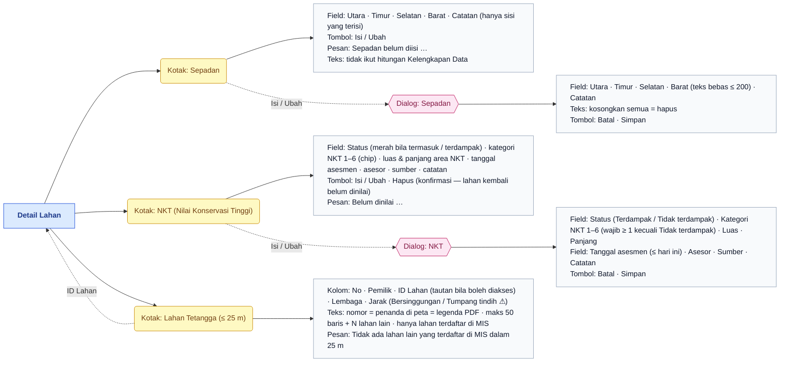
```mermaid
%%{init: {"flowchart": {"wrappingWidth": 420}}}%%
flowchart LR
  md_parcels_detail["Detail Lahan"]:::page

  md_parcels_detail_sep("Kotak: Sepadan"):::section
  md_parcels_detail_sep_c["Field: Utara · Timur · Selatan · Barat · Catatan (hanya sisi yang terisi)<br/>Tombol: Isi / Ubah<br/>Pesan: Sepadan belum diisi …<br/>Teks: tidak ikut hitungan Kelengkapan Data"]:::content

  md_parcels_detail_sepform{{"Dialog: Sepadan"}}:::dialog
  md_parcels_detail_sepform_c["Field: Utara · Timur · Selatan · Barat (teks bebas ≤ 200) · Catatan<br/>Teks: kosongkan semua = hapus<br/>Tombol: Batal · Simpan"]:::content

  md_parcels_detail_nkt("Kotak: NKT (Nilai Konservasi Tinggi)"):::section
  md_parcels_detail_nkt_c["Field: Status (merah bila termasuk / terdampak) · kategori NKT 1–6 (chip) · luas & panjang area NKT · tanggal asesmen · asesor · sumber · catatan<br/>Tombol: Isi / Ubah · Hapus (konfirmasi — lahan kembali belum dinilai)<br/>Pesan: Belum dinilai …"]:::content

  md_parcels_detail_nktform{{"Dialog: NKT"}}:::dialog
  md_parcels_detail_nktform_c["Field: Status (Terdampak / Tidak terdampak) · Kategori NKT 1–6 (wajib ≥ 1 kecuali Tidak terdampak) · Luas · Panjang<br/>Field: Tanggal asesmen (≤ hari ini) · Asesor · Sumber · Catatan<br/>Tombol: Batal · Simpan"]:::content

  md_parcels_detail_nb("Kotak: Lahan Tetangga (≤ 25 m)"):::section
  md_parcels_detail_nb_c["Kolom: No · Pemilik · ID Lahan (tautan bila boleh diakses) · Lembaga · Jarak (Bersinggungan / Tumpang tindih ⚠)<br/>Teks: nomor = penanda di peta = legenda PDF · maks 50 baris + N lahan lain · hanya lahan terdaftar di MIS<br/>Pesan: Tidak ada lahan lain yang terdaftar di MIS dalam 25 m"]:::content

  md_parcels_detail --> md_parcels_detail_sep --> md_parcels_detail_sep_c
  md_parcels_detail --> md_parcels_detail_nkt --> md_parcels_detail_nkt_c
  md_parcels_detail --> md_parcels_detail_nb --> md_parcels_detail_nb_c
  md_parcels_detail_sep -.->|Isi / Ubah| md_parcels_detail_sepform --> md_parcels_detail_sepform_c
  md_parcels_detail_nkt -.->|Isi / Ubah| md_parcels_detail_nktform --> md_parcels_detail_nktform_c
  md_parcels_detail_nb -.->|ID Lahan| md_parcels_detail

  classDef page fill:#dbeafe,stroke:#1d4ed8,color:#1e3a8a,font-weight:bold
  classDef section fill:#fef9c3,stroke:#ca8a04,color:#713f12
  classDef content fill:#f8fafc,stroke:#94a3b8,color:#0f172a,text-align:left
  classDef dialog fill:#fce7f3,stroke:#be185d,color:#831843
```

## Detail Lahan — bagian 3

Tab **Legalitas** dan **Program**.

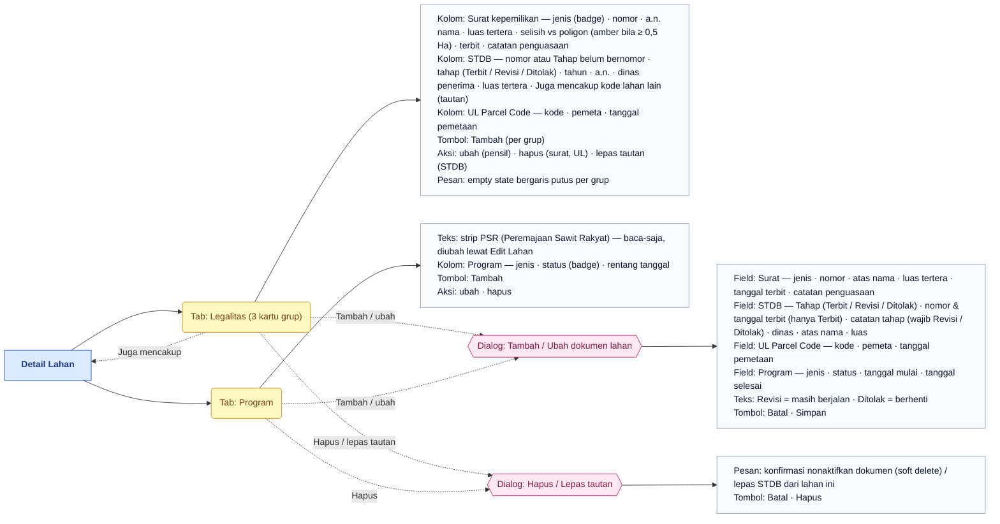
```mermaid
%%{init: {"flowchart": {"wrappingWidth": 420}}}%%
flowchart LR
  md_parcels_detail["Detail Lahan"]:::page

  md_parcels_detail_t2("Tab: Legalitas (3 kartu grup)"):::section
  md_parcels_detail_t2_c["Kolom: Surat kepemilikan — jenis (badge) · nomor · a.n. nama · luas tertera · selisih vs poligon (amber bila ≥ 0,5 Ha) · terbit · catatan penguasaan<br/>Kolom: STDB — nomor atau Tahap belum bernomor · tahap (Terbit / Revisi / Ditolak) · tahun · a.n. · dinas penerima · luas tertera · Juga mencakup kode lahan lain (tautan)<br/>Kolom: UL Parcel Code — kode · pemeta · tanggal pemetaan<br/>Tombol: Tambah (per grup)<br/>Aksi: ubah (pensil) · hapus (surat, UL) · lepas tautan (STDB)<br/>Pesan: empty state bergaris putus per grup"]:::content

  md_parcels_detail_t3("Tab: Program"):::section
  md_parcels_detail_t3_c["Teks: strip PSR (Peremajaan Sawit Rakyat) — baca-saja, diubah lewat Edit Lahan<br/>Kolom: Program — jenis · status (badge) · rentang tanggal<br/>Tombol: Tambah<br/>Aksi: ubah · hapus"]:::content

  md_parcels_detail_satform{{"Dialog: Tambah / Ubah dokumen lahan"}}:::dialog
  md_parcels_detail_satform_c["Field: Surat — jenis · nomor · atas nama · luas tertera · tanggal terbit · catatan penguasaan<br/>Field: STDB — Tahap (Terbit / Revisi / Ditolak) · nomor & tanggal terbit (hanya Terbit) · catatan tahap (wajib Revisi / Ditolak) · dinas · atas nama · luas<br/>Field: UL Parcel Code — kode · pemeta · tanggal pemetaan<br/>Field: Program — jenis · status · tanggal mulai · tanggal selesai<br/>Teks: Revisi = masih berjalan · Ditolak = berhenti<br/>Tombol: Batal · Simpan"]:::content

  md_parcels_detail_satdel{{"Dialog: Hapus / Lepas tautan"}}:::dialog
  md_parcels_detail_satdel_c["Pesan: konfirmasi nonaktifkan dokumen (soft delete) / lepas STDB dari lahan ini<br/>Tombol: Batal · Hapus"]:::content

  md_parcels_detail --> md_parcels_detail_t2 --> md_parcels_detail_t2_c
  md_parcels_detail --> md_parcels_detail_t3 --> md_parcels_detail_t3_c
  md_parcels_detail_t2 -.->|Tambah / ubah| md_parcels_detail_satform --> md_parcels_detail_satform_c
  md_parcels_detail_t3 -.->|Tambah / ubah| md_parcels_detail_satform
  md_parcels_detail_t2 -.->|Hapus / lepas tautan| md_parcels_detail_satdel --> md_parcels_detail_satdel_c
  md_parcels_detail_t3 -.->|Hapus| md_parcels_detail_satdel
  md_parcels_detail_t2 -.->|Juga mencakup| md_parcels_detail

  classDef page fill:#dbeafe,stroke:#1d4ed8,color:#1e3a8a,font-weight:bold
  classDef section fill:#fef9c3,stroke:#ca8a04,color:#713f12
  classDef content fill:#f8fafc,stroke:#94a3b8,color:#0f172a,text-align:left
  classDef dialog fill:#fce7f3,stroke:#be185d,color:#831843
```

Dokumen legalitas juga masuk massal lewat Bulk Upload › Upload Data Lahan › tab Detail Lahan (surat, STDB, kode vendor); tab ini adalah tempat koreksi manualnya.

## Detail Lahan — bagian 4

Tab **Produksi** dan **Patok**.

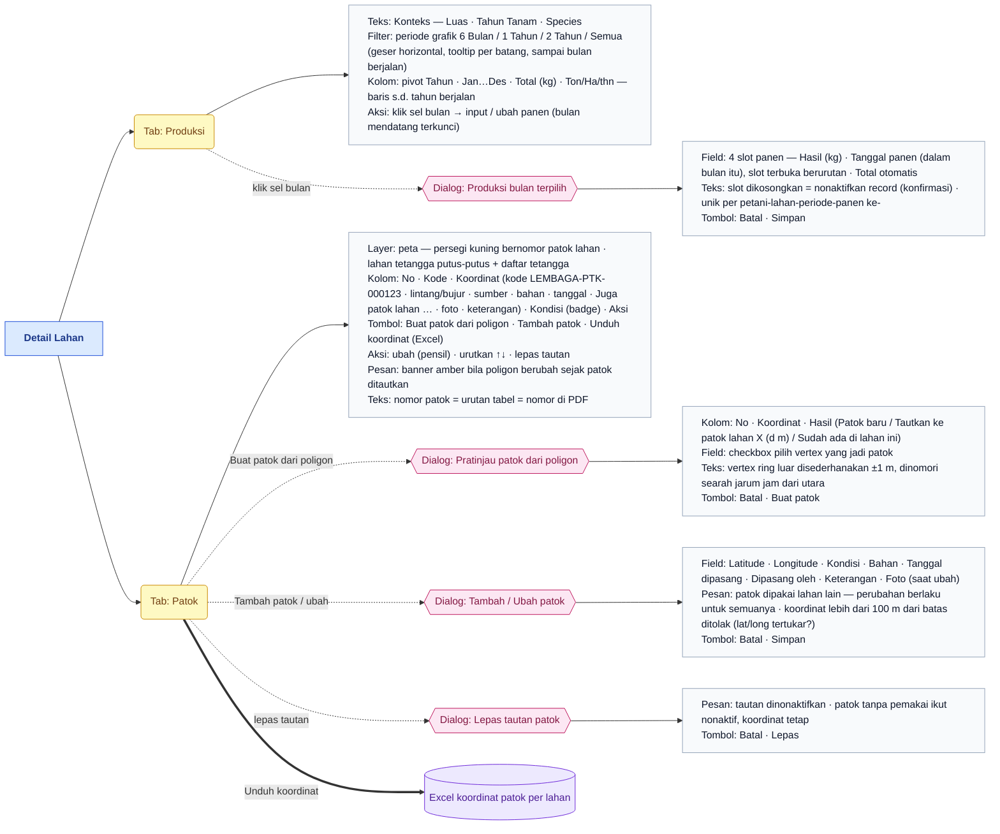
```mermaid
%%{init: {"flowchart": {"wrappingWidth": 420}}}%%
flowchart LR
  md_parcels_detail["Detail Lahan"]:::page

  md_parcels_detail_t4("Tab: Produksi"):::section
  md_parcels_detail_t4_c["Teks: Konteks — Luas · Tahun Tanam · Species<br/>Filter: periode grafik 6 Bulan / 1 Tahun / 2 Tahun / Semua (geser horizontal, tooltip per batang, sampai bulan berjalan)<br/>Kolom: pivot Tahun · Jan…Des · Total (kg) · Ton/Ha/thn — baris s.d. tahun berjalan<br/>Aksi: klik sel bulan → input / ubah panen (bulan mendatang terkunci)"]:::content

  md_parcels_detail_month{{"Dialog: Produksi bulan terpilih"}}:::dialog
  md_parcels_detail_month_c["Field: 4 slot panen — Hasil (kg) · Tanggal panen (dalam bulan itu), slot terbuka berurutan · Total otomatis<br/>Teks: slot dikosongkan = nonaktifkan record (konfirmasi) · unik per petani-lahan-periode-panen ke-<br/>Tombol: Batal · Simpan"]:::content

  md_parcels_detail_t5("Tab: Patok"):::section
  md_parcels_detail_t5_c["Layer: peta — persegi kuning bernomor patok lahan · lahan tetangga putus-putus + daftar tetangga<br/>Kolom: No · Kode · Koordinat (kode LEMBAGA-PTK-000123 · lintang/bujur · sumber · bahan · tanggal · Juga patok lahan … · foto · keterangan) · Kondisi (badge) · Aksi<br/>Tombol: Buat patok dari poligon · Tambah patok · Unduh koordinat (Excel)<br/>Aksi: ubah (pensil) · urutkan ↑↓ · lepas tautan<br/>Pesan: banner amber bila poligon berubah sejak patok ditautkan<br/>Teks: nomor patok = urutan tabel = nomor di PDF"]:::content

  md_parcels_detail_patokprev{{"Dialog: Pratinjau patok dari poligon"}}:::dialog
  md_parcels_detail_patokprev_c["Kolom: No · Koordinat · Hasil (Patok baru / Tautkan ke patok lahan X (d m) / Sudah ada di lahan ini)<br/>Field: checkbox pilih vertex yang jadi patok<br/>Teks: vertex ring luar disederhanakan ±1 m, dinomori searah jarum jam dari utara<br/>Tombol: Batal · Buat patok"]:::content

  md_parcels_detail_patokform{{"Dialog: Tambah / Ubah patok"}}:::dialog
  md_parcels_detail_patokform_c["Field: Latitude · Longitude · Kondisi · Bahan · Tanggal dipasang · Dipasang oleh · Keterangan · Foto (saat ubah)<br/>Pesan: patok dipakai lahan lain — perubahan berlaku untuk semuanya · koordinat lebih dari 100 m dari batas ditolak (lat/long tertukar?)<br/>Tombol: Batal · Simpan"]:::content

  md_parcels_detail_patokdel{{"Dialog: Lepas tautan patok"}}:::dialog
  md_parcels_detail_patokdel_c["Pesan: tautan dinonaktifkan · patok tanpa pemakai ikut nonaktif, koordinat tetap<br/>Tombol: Batal · Lepas"]:::content

  md_parcels_detail_patokxlsx[("Excel koordinat patok per lahan")]:::data

  md_parcels_detail --> md_parcels_detail_t4 --> md_parcels_detail_t4_c
  md_parcels_detail --> md_parcels_detail_t5 --> md_parcels_detail_t5_c
  md_parcels_detail_t4 -.->|klik sel bulan| md_parcels_detail_month --> md_parcels_detail_month_c
  md_parcels_detail_t5 -.->|Buat patok dari poligon| md_parcels_detail_patokprev --> md_parcels_detail_patokprev_c
  md_parcels_detail_t5 -.->|Tambah patok / ubah| md_parcels_detail_patokform --> md_parcels_detail_patokform_c
  md_parcels_detail_t5 -.->|lepas tautan| md_parcels_detail_patokdel --> md_parcels_detail_patokdel_c
  md_parcels_detail_t5 ==>|Unduh koordinat| md_parcels_detail_patokxlsx

  classDef page fill:#dbeafe,stroke:#1d4ed8,color:#1e3a8a,font-weight:bold
  classDef section fill:#fef9c3,stroke:#ca8a04,color:#713f12
  classDef content fill:#f8fafc,stroke:#94a3b8,color:#0f172a,text-align:left
  classDef dialog fill:#fce7f3,stroke:#be185d,color:#831843
  classDef data fill:#ede9fe,stroke:#6d28d9,color:#4c1d95
```

Dialog produksi bulanan menulis ke data yang sama dengan sub menu **Produksi** (record per petani · lahan · periode · panen ke-); yang disimpan di sini langsung tampil di Produksi (daftar).

## Produksi (daftar)

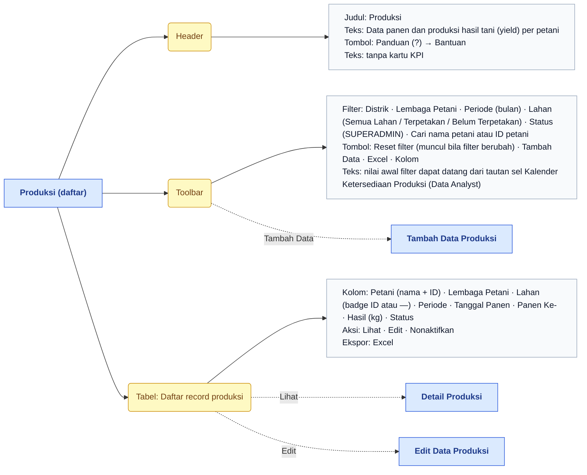
```mermaid
%%{init: {"flowchart": {"wrappingWidth": 420}}}%%
flowchart LR
  md_production_list["Produksi (daftar)"]:::page

  md_production_list_hdr("Header"):::section
  md_production_list_hdr_c["Judul: Produksi<br/>Teks: Data panen dan produksi hasil tani (yield) per petani<br/>Tombol: Panduan (?) → Bantuan<br/>Teks: tanpa kartu KPI"]:::content

  md_production_list_tb("Toolbar"):::section
  md_production_list_tb_c["Filter: Distrik · Lembaga Petani · Periode (bulan) · Lahan (Semua Lahan / Terpetakan / Belum Terpetakan) · Status (SUPERADMIN) · Cari nama petani atau ID petani<br/>Tombol: Reset filter (muncul bila filter berubah) · Tambah Data · Excel · Kolom<br/>Teks: nilai awal filter dapat datang dari tautan sel Kalender Ketersediaan Produksi (Data Analyst)"]:::content

  md_production_list_tbl("Tabel: Daftar record produksi"):::section
  md_production_list_tbl_c["Kolom: Petani (nama + ID) · Lembaga Petani · Lahan (badge ID atau —) · Periode · Tanggal Panen · Panen Ke- · Hasil (kg) · Status<br/>Aksi: Lihat · Edit · Nonaktifkan<br/>Ekspor: Excel"]:::content

  md_production_new["Tambah Data Produksi"]:::page
  md_production_detail["Detail Produksi"]:::page
  md_production_edit["Edit Data Produksi"]:::page

  md_production_list --> md_production_list_hdr --> md_production_list_hdr_c
  md_production_list --> md_production_list_tb --> md_production_list_tb_c
  md_production_list --> md_production_list_tbl --> md_production_list_tbl_c
  md_production_list_tb -.->|Tambah Data| md_production_new
  md_production_list_tbl -.->|Lihat| md_production_detail
  md_production_list_tbl -.->|Edit| md_production_edit

  classDef page fill:#dbeafe,stroke:#1d4ed8,color:#1e3a8a,font-weight:bold
  classDef section fill:#fef9c3,stroke:#ca8a04,color:#713f12
  classDef content fill:#f8fafc,stroke:#94a3b8,color:#0f172a,text-align:left
```

## Tambah Data Produksi

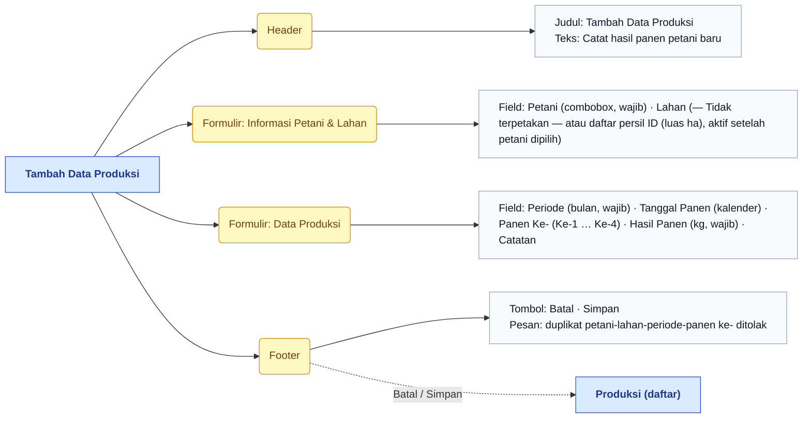
```mermaid
%%{init: {"flowchart": {"wrappingWidth": 420}}}%%
flowchart LR
  md_production_new["Tambah Data Produksi"]:::page

  md_production_new_hdr("Header"):::section
  md_production_new_hdr_c["Judul: Tambah Data Produksi<br/>Teks: Catat hasil panen petani baru"]:::content

  md_production_new_f1("Formulir: Informasi Petani & Lahan"):::section
  md_production_new_f1_c["Field: Petani (combobox, wajib) · Lahan (— Tidak terpetakan — atau daftar persil ID (luas ha), aktif setelah petani dipilih)"]:::content

  md_production_new_f2("Formulir: Data Produksi"):::section
  md_production_new_f2_c["Field: Periode (bulan, wajib) · Tanggal Panen (kalender) · Panen Ke- (Ke-1 … Ke-4) · Hasil Panen (kg, wajib) · Catatan"]:::content

  md_production_new_ft("Footer"):::section
  md_production_new_ft_c["Tombol: Batal · Simpan<br/>Pesan: duplikat petani-lahan-periode-panen ke- ditolak"]:::content

  md_production_list["Produksi (daftar)"]:::page

  md_production_new --> md_production_new_hdr --> md_production_new_hdr_c
  md_production_new --> md_production_new_f1 --> md_production_new_f1_c
  md_production_new --> md_production_new_f2 --> md_production_new_f2_c
  md_production_new --> md_production_new_ft --> md_production_new_ft_c
  md_production_new_ft -.->|Batal / Simpan| md_production_list

  classDef page fill:#dbeafe,stroke:#1d4ed8,color:#1e3a8a,font-weight:bold
  classDef section fill:#fef9c3,stroke:#ca8a04,color:#713f12
  classDef content fill:#f8fafc,stroke:#94a3b8,color:#0f172a,text-align:left
```

## Detail Produksi

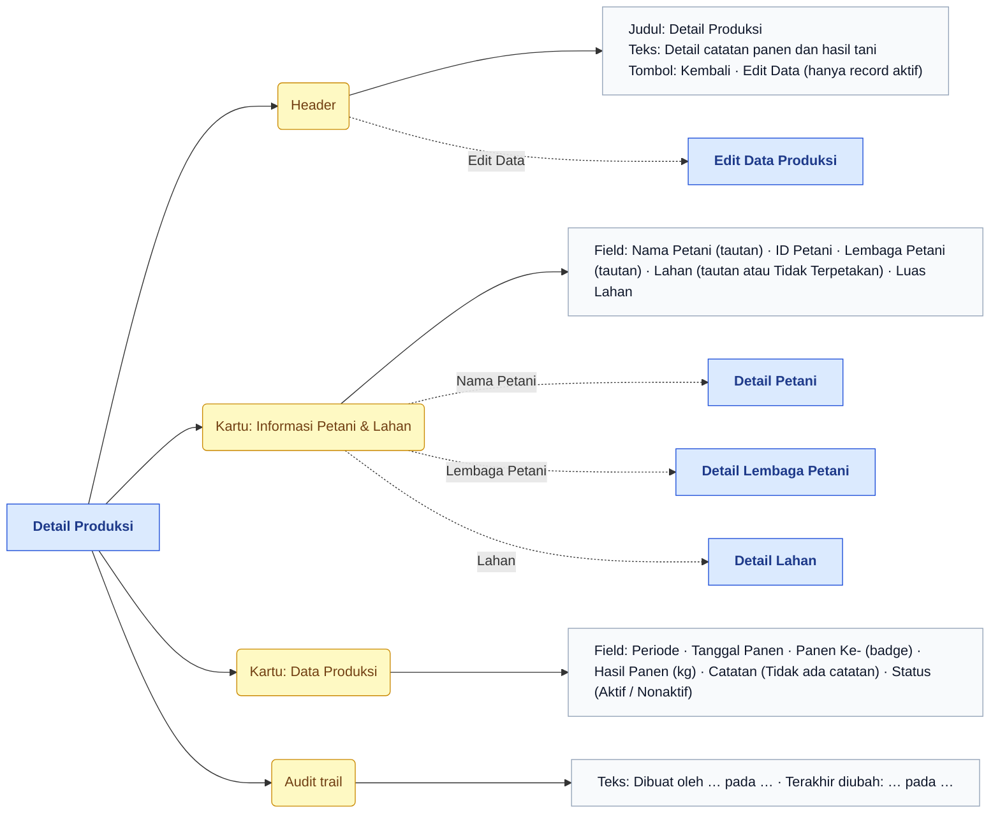
```mermaid
%%{init: {"flowchart": {"wrappingWidth": 420}}}%%
flowchart LR
  md_production_detail["Detail Produksi"]:::page

  md_production_detail_hdr("Header"):::section
  md_production_detail_hdr_c["Judul: Detail Produksi<br/>Teks: Detail catatan panen dan hasil tani<br/>Tombol: Kembali · Edit Data (hanya record aktif)"]:::content

  md_production_detail_k1("Kartu: Informasi Petani & Lahan"):::section
  md_production_detail_k1_c["Field: Nama Petani (tautan) · ID Petani · Lembaga Petani (tautan) · Lahan (tautan atau Tidak Terpetakan) · Luas Lahan"]:::content

  md_production_detail_k2("Kartu: Data Produksi"):::section
  md_production_detail_k2_c["Field: Periode · Tanggal Panen · Panen Ke- (badge) · Hasil Panen (kg) · Catatan (Tidak ada catatan) · Status (Aktif / Nonaktif)"]:::content

  md_production_detail_audit("Audit trail"):::section
  md_production_detail_audit_c["Teks: Dibuat oleh … pada … · Terakhir diubah: … pada …"]:::content

  md_production_edit["Edit Data Produksi"]:::page
  md_farmers_detail["Detail Petani"]:::page
  md_groups_detail["Detail Lembaga Petani"]:::page
  md_parcels_detail["Detail Lahan"]:::page

  md_production_detail --> md_production_detail_hdr --> md_production_detail_hdr_c
  md_production_detail --> md_production_detail_k1 --> md_production_detail_k1_c
  md_production_detail --> md_production_detail_k2 --> md_production_detail_k2_c
  md_production_detail --> md_production_detail_audit --> md_production_detail_audit_c
  md_production_detail_hdr -.->|Edit Data| md_production_edit
  md_production_detail_k1 -.->|Nama Petani| md_farmers_detail
  md_production_detail_k1 -.->|Lembaga Petani| md_groups_detail
  md_production_detail_k1 -.->|Lahan| md_parcels_detail

  classDef page fill:#dbeafe,stroke:#1d4ed8,color:#1e3a8a,font-weight:bold
  classDef section fill:#fef9c3,stroke:#ca8a04,color:#713f12
  classDef content fill:#f8fafc,stroke:#94a3b8,color:#0f172a,text-align:left
```

## Edit Data Produksi

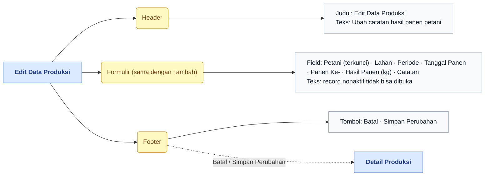
```mermaid
%%{init: {"flowchart": {"wrappingWidth": 420}}}%%
flowchart LR
  md_production_edit["Edit Data Produksi"]:::page

  md_production_edit_hdr("Header"):::section
  md_production_edit_hdr_c["Judul: Edit Data Produksi<br/>Teks: Ubah catatan hasil panen petani"]:::content

  md_production_edit_f("Formulir (sama dengan Tambah)"):::section
  md_production_edit_f_c["Field: Petani (terkunci) · Lahan · Periode · Tanggal Panen · Panen Ke- · Hasil Panen (kg) · Catatan<br/>Teks: record nonaktif tidak bisa dibuka"]:::content

  md_production_edit_ft("Footer"):::section
  md_production_edit_ft_c["Tombol: Batal · Simpan Perubahan"]:::content

  md_production_detail["Detail Produksi"]:::page

  md_production_edit --> md_production_edit_hdr --> md_production_edit_hdr_c
  md_production_edit --> md_production_edit_f --> md_production_edit_f_c
  md_production_edit --> md_production_edit_ft --> md_production_edit_ft_c
  md_production_edit_ft -.->|Batal / Simpan Perubahan| md_production_detail

  classDef page fill:#dbeafe,stroke:#1d4ed8,color:#1e3a8a,font-weight:bold
  classDef section fill:#fef9c3,stroke:#ca8a04,color:#713f12
  classDef content fill:#f8fafc,stroke:#94a3b8,color:#0f172a,text-align:left
```

## Monev BMP (daftar)

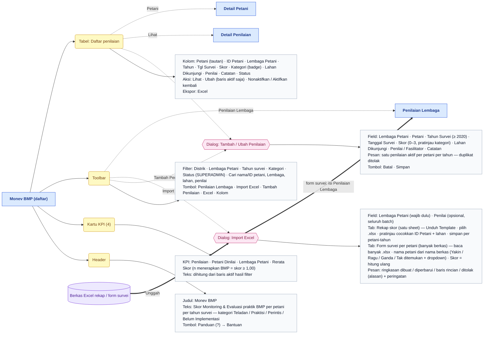
```mermaid
%%{init: {"flowchart": {"wrappingWidth": 420}}}%%
flowchart LR
  md_bmpmonev_list["Monev BMP (daftar)"]:::page

  md_bmpmonev_list_hdr("Header"):::section
  md_bmpmonev_list_hdr_c["Judul: Monev BMP<br/>Teks: Skor Monitoring & Evaluasi praktik BMP per petani per tahun survei — kategori Teladan / Praktisi / Perintis / Belum Implementasi<br/>Tombol: Panduan (?) → Bantuan"]:::content

  md_bmpmonev_list_kpi("Kartu KPI (4)"):::section
  md_bmpmonev_list_kpi_c["KPI: Penilaian · Petani Dinilai · Lembaga Petani · Rerata Skor (n menerapkan BMP = skor ≥ 1,00)<br/>Teks: dihitung dari baris aktif hasil filter"]:::content

  md_bmpmonev_list_tb("Toolbar"):::section
  md_bmpmonev_list_tb_c["Filter: Distrik · Lembaga Petani · Tahun survei · Kategori · Status (SUPERADMIN) · Cari nama/ID petani, Lembaga, lahan, penilai<br/>Tombol: Penilaian Lembaga · Import Excel · Tambah Penilaian · Excel · Kolom"]:::content

  md_bmpmonev_list_tbl("Tabel: Daftar penilaian"):::section
  md_bmpmonev_list_tbl_c["Kolom: Petani (tautan) · ID Petani · Lembaga Petani · Tahun · Tgl Survei · Skor · Kategori (badge) · Lahan Dikunjungi · Penilai · Catatan · Status<br/>Aksi: Lihat · Ubah (baris aktif saja) · Nonaktifkan / Aktifkan kembali<br/>Ekspor: Excel"]:::content

  md_bmpmonev_form{{"Dialog: Tambah / Ubah Penilaian"}}:::dialog
  md_bmpmonev_form_c["Field: Lembaga Petani · Petani · Tahun Survei (≥ 2020) · Tanggal Survei · Skor (0–3, pratinjau kategori) · Lahan Dikunjungi · Penilai / Fasilitator · Catatan<br/>Pesan: satu penilaian aktif per petani per tahun — duplikat ditolak<br/>Tombol: Batal · Simpan"]:::content

  md_bmpmonev_import{{"Dialog: Import Excel"}}:::dialog
  md_bmpmonev_import_c["Field: Lembaga Petani (wajib dulu) · Penilai (opsional, seluruh batch)<br/>Tab: Rekap skor (satu sheet) — Unduh Template · pilih .xlsx · pratinjau cocokkan ID Petani + lahan · simpan per petani-tahun<br/>Tab: Form survei per petani (banyak berkas) — baca banyak .xlsx · nama petani dari nama berkas (Yakin / Ragu / Ganda / Tak ditemukan + dropdown) · Skor = hitung ulang<br/>Pesan: ringkasan dibuat / diperbarui / baris rincian / ditolak (alasan) + peringatan"]:::content

  md_bmpmonev_xlsx[("Berkas Excel rekap / form survei")]:::data
  md_bmpmonev_detail["Detail Penilaian"]:::page
  md_bmpmonev_lembaga["Penilaian Lembaga"]:::page
  md_farmers_detail["Detail Petani"]:::page

  md_bmpmonev_list --> md_bmpmonev_list_hdr --> md_bmpmonev_list_hdr_c
  md_bmpmonev_list --> md_bmpmonev_list_kpi --> md_bmpmonev_list_kpi_c
  md_bmpmonev_list --> md_bmpmonev_list_tb --> md_bmpmonev_list_tb_c
  md_bmpmonev_list --> md_bmpmonev_list_tbl --> md_bmpmonev_list_tbl_c
  md_bmpmonev_list_tb -.->|Tambah Penilaian| md_bmpmonev_form --> md_bmpmonev_form_c
  md_bmpmonev_list_tbl -.->|Ubah| md_bmpmonev_form
  md_bmpmonev_list_tb -.->|Import Excel| md_bmpmonev_import --> md_bmpmonev_import_c
  md_bmpmonev_xlsx ==>|Unggah| md_bmpmonev_import
  md_bmpmonev_import ==>|form survei: isi Penilaian Lembaga| md_bmpmonev_lembaga
  md_bmpmonev_list_tb -.->|Penilaian Lembaga| md_bmpmonev_lembaga
  md_bmpmonev_list_tbl -.->|Lihat| md_bmpmonev_detail
  md_bmpmonev_list_tbl -.->|Petani| md_farmers_detail

  classDef page fill:#dbeafe,stroke:#1d4ed8,color:#1e3a8a,font-weight:bold
  classDef section fill:#fef9c3,stroke:#ca8a04,color:#713f12
  classDef content fill:#f8fafc,stroke:#94a3b8,color:#0f172a,text-align:left
  classDef dialog fill:#fce7f3,stroke:#be185d,color:#831843
  classDef data fill:#ede9fe,stroke:#6d28d9,color:#4c1d95
```

Skor 0–3 → kategori: **Teladan** (di atas 2,50) · **Praktisi** (1,50–2,50) · **Perintis** (1,00–1,49) · **Belum Implementasi** (di bawah 1,00).

## Detail Penilaian

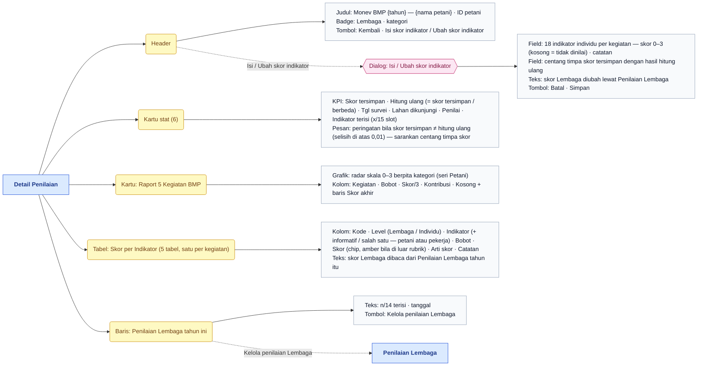
```mermaid
%%{init: {"flowchart": {"wrappingWidth": 420}}}%%
flowchart LR
  md_bmpmonev_detail["Detail Penilaian"]:::page

  md_bmpmonev_detail_hdr("Header"):::section
  md_bmpmonev_detail_hdr_c["Judul: Monev BMP {tahun} — {nama petani} · ID petani<br/>Badge: Lembaga · kategori<br/>Tombol: Kembali · Isi skor indikator / Ubah skor indikator"]:::content

  md_bmpmonev_detail_kpi("Kartu stat (6)"):::section
  md_bmpmonev_detail_kpi_c["KPI: Skor tersimpan · Hitung ulang (= skor tersimpan / berbeda) · Tgl survei · Lahan dikunjungi · Penilai · Indikator terisi (x/15 slot)<br/>Pesan: peringatan bila skor tersimpan ≠ hitung ulang (selisih di atas 0,01) — sarankan centang timpa skor"]:::content

  md_bmpmonev_detail_rap("Kartu: Raport 5 Kegiatan BMP"):::section
  md_bmpmonev_detail_rap_c["Grafik: radar skala 0–3 berpita kategori (seri Petani)<br/>Kolom: Kegiatan · Bobot · Skor/3 · Kontribusi · Kosong + baris Skor akhir"]:::content

  md_bmpmonev_detail_ind("Tabel: Skor per Indikator (5 tabel, satu per kegiatan)"):::section
  md_bmpmonev_detail_ind_c["Kolom: Kode · Level (Lembaga / Individu) · Indikator (+ informatif / salah satu — petani atau pekerja) · Bobot · Skor (chip, amber bila di luar rubrik) · Arti skor · Catatan<br/>Teks: skor Lembaga dibaca dari Penilaian Lembaga tahun itu"]:::content

  md_bmpmonev_detail_grp("Baris: Penilaian Lembaga tahun ini"):::section
  md_bmpmonev_detail_grp_c["Teks: n/14 terisi · tanggal<br/>Tombol: Kelola penilaian Lembaga"]:::content

  md_bmpmonev_detail_edit{{"Dialog: Isi / Ubah skor indikator"}}:::dialog
  md_bmpmonev_detail_edit_c["Field: 18 indikator individu per kegiatan — skor 0–3 (kosong = tidak dinilai) · catatan<br/>Field: centang timpa skor tersimpan dengan hasil hitung ulang<br/>Teks: skor Lembaga diubah lewat Penilaian Lembaga<br/>Tombol: Batal · Simpan"]:::content

  md_bmpmonev_lembaga["Penilaian Lembaga"]:::page

  md_bmpmonev_detail --> md_bmpmonev_detail_hdr --> md_bmpmonev_detail_hdr_c
  md_bmpmonev_detail --> md_bmpmonev_detail_kpi --> md_bmpmonev_detail_kpi_c
  md_bmpmonev_detail --> md_bmpmonev_detail_rap --> md_bmpmonev_detail_rap_c
  md_bmpmonev_detail --> md_bmpmonev_detail_ind --> md_bmpmonev_detail_ind_c
  md_bmpmonev_detail --> md_bmpmonev_detail_grp --> md_bmpmonev_detail_grp_c
  md_bmpmonev_detail_hdr -.->|Isi / Ubah skor indikator| md_bmpmonev_detail_edit --> md_bmpmonev_detail_edit_c
  md_bmpmonev_detail_grp -.->|Kelola penilaian Lembaga| md_bmpmonev_lembaga

  classDef page fill:#dbeafe,stroke:#1d4ed8,color:#1e3a8a,font-weight:bold
  classDef section fill:#fef9c3,stroke:#ca8a04,color:#713f12
  classDef content fill:#f8fafc,stroke:#94a3b8,color:#0f172a,text-align:left
  classDef dialog fill:#fce7f3,stroke:#be185d,color:#831843
```

## Penilaian Lembaga

```mermaid
%%{init: {"flowchart": {"wrappingWidth": 420}}}%%
flowchart LR
  md_bmpmonev_lembaga["Penilaian Lembaga"]:::page

  md_bmpmonev_lembaga_hdr("Header"):::section
  md_bmpmonev_lembaga_hdr_c["Judul: Penilaian Lembaga — Monev BMP<br/>Teks: Skor 14 indikator level Lembaga per tahun survei — 6 di antaranya berbobot dan masuk skor akhir setiap petani<br/>Tombol: Kembali · Tambah Penilaian Lembaga"]:::content

  md_bmpmonev_lembaga_tbl("Tabel: Lembaga × tahun"):::section
  md_bmpmonev_lembaga_tbl_c["Kolom: Lembaga Petani · Tahun · Tgl Survei · Rerata (14 indikator) · 14 kode indikator (chip 0–3, — bila kosong) · Penilai · Aksi<br/>Filter: urut klik header Lembaga Petani (abjad) atau Rerata (bawaan) · tahun terbaru dulu<br/>Aksi: Ubah<br/>Pesan: empty state"]:::content

  md_bmpmonev_lembaga_form{{"Dialog: Tambah / Ubah Penilaian Lembaga"}}:::dialog
  md_bmpmonev_lembaga_form_c["Field: Lembaga Petani · Tahun · Tanggal (kalender) · Penilai · Catatan<br/>Field: 14 baris indikator — skor 0–3 + catatan (label rubrik ditampilkan)<br/>Pesan: Lembaga-tahun yang sudah dinilai → buka lewat tombol Ubah<br/>Tombol: Batal · Simpan"]:::content

  md_bmpmonev_lembaga --> md_bmpmonev_lembaga_hdr --> md_bmpmonev_lembaga_hdr_c
  md_bmpmonev_lembaga --> md_bmpmonev_lembaga_tbl --> md_bmpmonev_lembaga_tbl_c
  md_bmpmonev_lembaga_hdr -.->|Tambah Penilaian Lembaga| md_bmpmonev_lembaga_form --> md_bmpmonev_lembaga_form_c
  md_bmpmonev_lembaga_tbl -.->|Ubah| md_bmpmonev_lembaga_form

  classDef page fill:#dbeafe,stroke:#1d4ed8,color:#1e3a8a,font-weight:bold
  classDef section fill:#fef9c3,stroke:#ca8a04,color:#713f12
  classDef content fill:#f8fafc,stroke:#94a3b8,color:#0f172a,text-align:left
  classDef dialog fill:#fce7f3,stroke:#be185d,color:#831843
```

## Target Program

```mermaid
%%{init: {"flowchart": {"wrappingWidth": 420}}}%%
flowchart LR
  md_programtarget["Target Program"]:::page

  md_programtarget_hdr("Header"):::section
  md_programtarget_hdr_c["Judul: Target Program<br/>Teks: Angka kontrak / trayektori program untuk seluruh wilayah — dipakai tampilan vs Kontrak di kartu Training Benefit per year (Dashboard Pelatihan)<br/>Tombol: Panduan (?) → Bantuan"]:::content

  md_programtarget_grid("Kartu: Grid target"):::section
  md_programtarget_grid_c["Kolom: Start of the Program (s.d. tahun, bisa diubah) · tahun target (× hapus kolom) · Total (dihitung = Start + Σ tahunan)<br/>Kolom: baris = 5 indikator per paket — Paket 1 · Paket 2 MK · Paket 2 K3 · Paket 3 & 4 · Petani pernah mengikuti pelatihan (minimal 1) sebagai total program<br/>Field: sel angka bulat (1500 atau 1.500) — bingkai merah bila tidak valid · baca-saja tanpa hak ubah<br/>Tombol: Tambah tahun · Simpan target (seluruh grid sekali simpan)<br/>Pesan: kolom tahun harus berurutan tanpa celah mulai Start + 1<br/>Teks: definisi · Terakhir diubah waktu oleh nama"]:::content

  md_programtarget --> md_programtarget_hdr --> md_programtarget_hdr_c
  md_programtarget --> md_programtarget_grid --> md_programtarget_grid_c

  classDef page fill:#dbeafe,stroke:#1d4ed8,color:#1e3a8a,font-weight:bold
  classDef section fill:#fef9c3,stroke:#ca8a04,color:#713f12
  classDef content fill:#f8fafc,stroke:#94a3b8,color:#0f172a,text-align:left
```

Tanpa scope akses — angka berlaku untuk seluruh program; angka kontrak hanya disimpan di DB lewat halaman ini.

## Alur lintas menu

```mermaid
%%{init: {"flowchart": {"wrappingWidth": 420}}}%%
flowchart LR
  bu_farmers["Upload Massal Petani"]:::page
  bu_parcels["Upload Massal Lahan (3 tab)"]:::page
  bu_production["Upload Massal Produksi"]:::page
  bu_trees["Upload Massal Pohon Sawit"]:::page

  md_farmers_list["Petani (daftar)"]:::page
  md_farmers_detail["Detail Petani"]:::page
  md_groups_detail["Detail Lembaga Petani"]:::page
  md_parcels_list["Lahan (daftar)"]:::page
  md_parcels_detail["Detail Lahan"]:::page
  md_production_list["Produksi (daftar)"]:::page
  md_bmpmonev_list["Monev BMP (daftar)"]:::page
  md_programtarget["Target Program"]:::page

  md_farmers_pdf[("PDF Profil Petani")]:::data
  md_parcels_pdf[("PDF Profil Lahan")]:::data

  mp_parcel["Peta Lahan"]:::page
  da_per["Ketersediaan Data — Per Lembaga"]:::page
  db_bmp["BMP Dashboard (Produksi)"]:::page
  db_training["Dashboard Pelatihan"]:::page

  bu_farmers ==>|Excel petani| md_farmers_list
  bu_parcels ==>|Shapefile ZIP poligon · tab Detail Lahan| md_parcels_list
  bu_production ==>|Excel produksi| md_production_list
  bu_trees ==>|Shapefile titik pohon| md_parcels_detail

  md_farmers_detail ==>|Profil Petani PDF| md_farmers_pdf
  md_parcels_detail ==>|Profil Lahan PDF| md_parcels_pdf
  md_parcels_detail -.->|lihat di peta| mp_parcel
  mp_parcel -.->|Lihat Detail| md_parcels_detail
  md_groups_detail -.->|Kelengkapan Data| da_per
  md_groups_detail -.->|BMP Dashboard| db_bmp
  md_bmpmonev_list -.->|dibaca| db_bmp
  md_programtarget -.->|vs Kontrak| db_training

  classDef page fill:#dbeafe,stroke:#1d4ed8,color:#1e3a8a,font-weight:bold
  classDef data fill:#ede9fe,stroke:#6d28d9,color:#4c1d95
```

- **Bulk Upload** adalah pintu masuk data massal: Upload Data Petani → Petani; Upload Data Lahan (ZIP shapefile, tab poligon & tab Detail Lahan untuk surat/STDB/kode vendor) → Lahan + revisi; Upload Data Produksi → Produksi; Pohon Sawit → titik pohon yang tampil di peta Detail Lahan / Detail Petani. Master Data menampilkan hasilnya dan menyediakan koreksi manual.
- **Peta Lahan** (Map) dan Peta BMP memakai popup lahan standar yang sama dengan peta Sebaran Lahan di Detail Lembaga/Petani: **Lihat Detail** → Detail Lahan, **Edit Lahan** → dialog Edit Lahan yang sama, **Profil Lahan** → PDF yang sama.
- Kartu **Kelengkapan Data** di Detail Lembaga membuka Data Analyst › Ketersediaan Data › Per Lembaga dengan Lembaga sudah terpilih; tab Produksi Detail Lembaga/Petani menautkan Peta BMP, Report Produksi, dan BMP Dashboard; tautan sel Kalender Ketersediaan Produksi (Data Analyst) membuka Produksi (daftar) dengan filter Lembaga + Periode terisi.
- Angka **Monev BMP** dibaca Dashboard › Monev BMP; tab Monev BMP dan badge kategori di Detail Petani adalah tampilan yang sama. **Target Program** hanya dibaca kartu Training Benefit per year (vs Kontrak) di Dashboard Pelatihan.
- Tombol **Lihat roster lengkap** (Struktur Kelembagaan) dan **Laporan NKT** di Detail Lembaga memakai sumber yang sama dengan Report › Kelompok Tani (Detail) dan Report › Lahan.

## Urutan demo yang disarankan

1. Buka Master Data → Lembaga Petani: kartu KPI, filter Distrik, tabel; klik **Lihat** satu Lembaga → tab Ringkasan (struktur Kelompok Tani) dan tab Lahan (peta sebaran, Laporan NKT, Unduh Lahan).
2. Dari tab Petani Lembaga itu masuk ke **Petani (daftar)**: cari NIK/ID, buka **Detail Petani**; tunjukkan tab Lahan (tabel + peta), tab Produksi (matriks Kg per lahan), lalu klik **Profil Petani (PDF)**.
3. Dari tabel lahan petani klik Kode Lahan → **Detail Lahan**: badge NKT, kartu Kelengkapan Data, tab Informasi (Sepadan, NKT, Lahan Tetangga), tab Legalitas (surat/STDB), tab Patok (**Buat patok dari poligon**), tab Produksi (klik sel bulan → isi panen).
4. Buka **Produksi (daftar)**: filter Lembaga + Periode, tunjukkan record yang baru diisi dari Detail Lahan; **Tambah Data** untuk alur formulir penuh, lalu Detail → Edit Data.
5. Buka **Pelatihan**: Tambah Pelatihan (paket, Lembaga, notulen PDF) → Detail Pelatihan → **Tambah Peserta** (tab Pilih Manual vs Upload List Peserta) → isi nilai Pre/Post-Test.
6. Buka **Monev BMP**: KPI dan kategori; **Import Excel** (rekap skor vs form survei) atau **Tambah Penilaian**; Lihat → Detail Penilaian (radar 5 kegiatan, skor indikator) → **Penilaian Lembaga** (14 indikator).
7. Tutup dengan **Target Program**: isi Start of the Program dan tahun target, Simpan target, lalu tunjukkan dampaknya di Dashboard Pelatihan (vs Kontrak).
