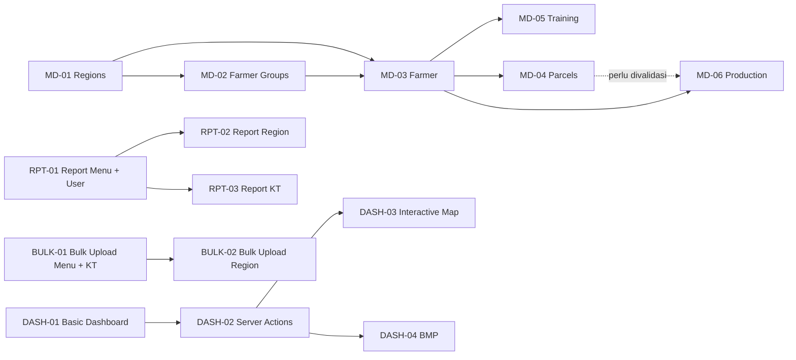

# Smallholder HUB — Progress

> Dokumen kerja untuk memantau delivery Smallholder HUB. Status di dokumen ini disinkronkan terhadap **file dan code yang benar-benar ada di repository**, bukan berdasarkan klaim changelog historis.

**Last updated:** 2026-06-14 (post-MD-04 Land Parcel implementation — issue #88 complete)

**Next management review:** 2026-06-20

**Source of truth:** tabel **Phase Status** di Section 2.

**Audit basis:** source code, Prisma schema, route files, server actions, scripts, GitHub workflow, dan hasil test lokal.

---

<details open>
<summary><strong>1. Biweekly Management Brief</strong> — ringkasan stakeholder</summary>

## 1. Biweekly Management Brief

Gunakan section ini untuk presentasi management setiap dua minggu. Section ini sengaja dibuat ringkas: posisi delivery, risiko, keputusan, dan target dua minggu berikutnya.

### Reporting Window

| Item               | Nilai                                                       |
| ------------------ | ----------------------------------------------------------- |
| Periode laporan    | 2026-06-08 s.d. 2026-06-22                                  |
| Status keseluruhan | 🟡 Mostly On Track                                          |
| Basis review       | Existing source code per 2026-06-14 (post-MD-04 issue #88 complete)       |
| Test lokal         | ✅ `npm test` — 14 files / 175 tests passed                 |
| Fokus koreksi      | MD-06 Production scope definition + Report module foundation      |

### Executive Summary

| Area                | Status          | Ringkasan                                                                                                                                  |
| ------------------- | --------------- | ------------------------------------------------------------------------------------------------------------------------------------------ |
| Platform foundation | ✅ Ready        | Auth, RBAC, menu, user management, region, dan farmer group sudah implementatif. Schema dengan audit fields, soft-delete, RBAC patterns.  |
| Master data inti    | ✅ Complete     | Farmer ✅, Land Parcel ✅, Training ✅ complete (model + action + UI + test). Production (MD-06) masih planned.                            |
| Dashboard           | 🔴 At Risk      | `/admin/dashboard` masih placeholder `Coming soon`; tidak ada `src/server/actions/dashboard.ts`. Stale scripts ada di `/scripts/debug/`.  |
| Report              | 🔲 Not Started   | Belum ada report module. Issues #64–#67 dibuat (menu setup + placeholder + implementasi).                                                  |
| Bulk Upload         | ✅ Partial      | Farmer bulk upload ✅, Shapefile bulk upload ✅. Region bulk upload belum ada. |
| Navigation health   | ✅ Fixed        | `/admin/master-data` redirect ke `/admin/master-data/farmers` — **route exists & functional** ✅                                         |
| Testing             | ✅ Strong       | Vitest: 14 files / 175 tests passed. Coverage: auth/RBAC/menu/user/region/farmer/land-parcel/training/bulk-upload ✅; need dashboard/production. |

### Progress Snapshot

| Metrik         | Jumlah         | Catatan                                              |
| -------------- | -------------- | ---------------------------------------------------- |
| Total phase    | 35 fase        | PLATFORM, MD, DASH, RPT, BULK, TOOLS, CMS, COMM, OPS |
| ✅ Done        | 14 fase        | PLATFORM-01/02/03/04/05/06/07, MD-01/02/03/04/05, BULK-01/03     |
| 🟠 Partial     | 3 fase         | TOOLS-01, OPS-01, OPS-02 |
| 🔲 Not Started | 5 fase         | DASH-01, CMS-01, COMM-01, RPT-01/02/03      |
| 🔲 Planned     | 12 fase        | MD-06/07/08/09/10/11, DASH-02/03, COMM-02, BULK-02    |
| 🔴 Blocked     | 1 fase         | DASH-04 (wait DASH-01/02)                            |
| 🎯 Now         | 1 fase         | MD-06       |

### Management Talking Points

| Topik               | Pesan Utama                                                              | Dampak                                                                                    |
| ------------------- | ------------------------------------------------------------------------ | ----------------------------------------------------------------------------------------- |
| **Code Quality ✅**  | **14/14 rule.md requirements FULLY COMPLIANT** — RBAC, soft-delete, validation, UI/UX all correct. | Production-ready quality; zero rule violations; ready for scaling. |
| **Land Parcel ✅ Complete** | MD-04 Land Parcel sudah implementatif (#88): model + actions + UI + 14 tests + Shapefile bulk upload | Geospatial features ready; foundation untuk Production module. |
| Farmer ✅ Complete  | MD-03 Farmer sudah implementatif (model + action + UI + 10 tests).       | Ready untuk dependency downstream (dashboard, parcel, training).                          |
| Navigation ✅ Fixed | `/admin/master-data` redirect ke farmers — sudah bekerja & tested.       | Admin flow tidak patah; Farmer list fully accessible.                                     |
| Dashboard priority  | `/admin/dashboard` masih placeholder; scope & wireframe perlu disepakati. | Scope DASH-01 minimal harus ditetapkan sebelum dev dimulai.                               |
| Stale scripts alert | `/scripts/debug/*dashboard*` reference missing actions — perlu cleanup.   | Run build/scripts di CI bisa fail; rekomendasi remove/fix scripts BUG-002.                |
| Delivery confidence | Tests 175/175 passed; coverage: auth/RBAC/menu/user/region/farmer/land-parcel/training/bulk-upload ✅.    | Foundation & core features stabil; siap lanjut ke production & dashboard.                    |

### Decisions Needed

| Keputusan                  | Owner                   | Dibutuhkan Kapan     | Rekomendasi Tech Lead                                                                       |
| -------------------------- | ----------------------- | -------------------- | ------------------------------------------------------------------------------------------- |
| ✅ Arah `/admin/master-data` | — (RESOLVED)            | ✅ DONE              | Redirect ke `/admin/master-data/farmers` — **route tersedia & functional**.                 |
| ✅ MD-04 Land Parcel (#88)  | — (RESOLVED)            | ✅ DONE              | Implementasi complete: model, actions, UI, tests, Shapefile bulk upload ✅                   |
| Scope minimal Production (MD-06) | Product + Engineering | ✅ DONE (Issue #89)  | Scope defined: ProductionRecord model with per-farmer tracking, optional parcel, max 4 harvests/month |
| Dashboard Server Actions   | Engineering Lead        | Setelah scope agreed | Create `src/server/actions/dashboard.ts` dengan queries minimal sesuai scope DASH-01.       |

### Next Two Weeks (2026-06-08 s.d. 2026-06-22)

| Priority | Target                                      | Output                                                                                                        |
| -------- | ------------------------------------------- | ------------------------------------------------------------------------------------------------------------- |
| **P0**   | **✅ BUG-001: fix redirect** — COMPLETE    | `/admin/master-data` → `/admin/master-data/farmers` — route & tests sudah ada ✅                              |
| **P0**   | **✅ MD-04: Land Parcel** — COMPLETE       | Model, actions, UI, Shapefile bulk upload, 14 tests — fully implemented ✅ (#88 closed) |
| **P1**   | **✅ MD-06: Production module issue created (#89)** | Issue #89 created with full spec: ProductionRecord model, per-farmer tracking with optional parcel, max 4 harvests/month |
| **P1**   | **#64-67 RPT-01: menu & placeholder**       | Menu Report setup + placeholder pages structure (3 sub-menu)                                                  |
| **P2**   | **BUG-002: cleanup stale dashboard scripts**| Remove/update `/scripts/debug/*dashboard*` yang reference missing action; atau create `dashboard.ts` skeleton |
| **P2**   | **Testing: Coverage expansion**             | Add test untuk dashboard, production module edge-cases                                                        |

</details>

---

<details>
<summary><strong>2. Roadmap Source of Truth</strong> — status resmi phase berdasarkan code</summary>

## 2. Roadmap Source of Truth

Section ini adalah acuan resmi status delivery. Jika ada perbedaan antara changelog, issue, dan tabel ini, gunakan tabel **Phase Status** sebagai kebenaran utama.

### Governance Rules

- **Phase Status adalah source of truth** untuk reporting management dan planning developer.
- Status fase hanya boleh naik jika implementasi bisa diverifikasi lewat file/code, route, schema, server action, test, atau workflow.
- Changelog tidak boleh dijadikan bukti status selesai; changelog hanya catatan historis.
- Placeholder `Coming soon` tidak dihitung sebagai implementasi feature.
- Script/debug tool tidak dihitung sebagai implementasi UI/module, kecuali phase memang scope-nya CLI/tooling.
- Jika status berubah karena audit code, catat di **Decision Log**.

### Status Definition

| Status         | Arti                      | Kapan Dipakai                                                           |
| -------------- | ------------------------- | ----------------------------------------------------------------------- |
| ✅ Done        | Selesai dan terverifikasi | Schema/route/action/UI tersedia sesuai completion criteria minimal      |
| 🟠 Partial     | Sebagian ada              | Ada sebagian implementasi, tetapi belum cukup untuk dianggap selesai    |
| 🔲 Not Started | Belum dimulai             | Route/schema/action utama belum ada, tetapi phase masuk prioritas dekat |
| 🔲 Planned     | Masuk roadmap             | Belum ada implementasi dan belum menjadi prioritas sprint               |
| 🔴 Blocked     | Terhambat                 | Ada dependency atau kondisi yang membuat phase belum layak dieksekusi   |

### Horizon Definition

| Horizon | Arti                        | Aturan                                         |
| ------- | --------------------------- | ---------------------------------------------- |
| Done    | Selesai                     | Semua completion criteria fase sudah terpenuhi |
| Now     | Fokus dua minggu berjalan   | Maksimal 2–4 phase agar tim tidak melebar      |
| Next    | Kandidat sprint berikutnya  | Masuk setelah dependency jelas                 |
| Later   | Backlog roadmap             | Jangan dieksekusi sebelum Now stabil           |
| Blocked | Tidak bisa dieksekusi sehat | Perlu dependency/keputusan/phase sebelumnya    |

### Code Audit Evidence

| Area           | Bukti di Codebase                                                                                                                                                                  | Kesimpulan                                                                             |
| -------------- | ---------------------------------------------------------------------------------------------------------------------------------------------------------------------------------- | -------------------------------------------------------------------------------------- |
| Prisma models  | `User`, `MenuItem`, `RolePermission`, `UserProvince`, `UserDistrict`, `UserFarmerGroup`, `UserPermissionOverride`, `Province`, `District`, `Subdistrict`, `Village`, `FarmerGroup`, `Farmer`, `LandParcel`, `TrainingPackage`, `TrainingActivity`, `TrainingParticipant` | Schema mencakup platform, RBAC, region, farmer group, farmer (MD-03), land parcel (MD-04), dan training (MD-05) ✅ |
| Admin routes   | ✅ Dashboard, Settings (Users/Roles/Menu/Regions), Master Data (Farmers list/detail/form + Groups list/detail/form + Parcels list/detail/form + Training list/detail/participants), Bulk Upload (Farmers + Parcels Shapefile), Profile | ✅ Admin foundation complete + Farmer CRUD + Land Parcel CRUD + Training CRUD complete; Dashboard placeholder only |
| Server actions | `user` (259 LOC), `user-data-access` (193 LOC), `user-menu-access` (195 LOC), `menu` (110 LOC), `region` (104 LOC), `farmer-group` (145 LOC), `farmer` (188 LOC), `land-parcel` (165 LOC), `bulk-upload-parcel` (222 LOC), `profile` (47 LOC), `role-permission` (74 LOC), `bulk-upload` (177 LOC), `training` (231 LOC), `upload` (77 LOC) — **Total 1987 LOC** | Training, farmer, land parcel, bulk upload tersedia ✅; dashboard, production belum ada |
| Validation schemas | `farmer-group.schema.ts`, `farmer.schema.ts`, `land-parcel.schema.ts`, `menu.schema.ts`, `region.schema.ts`, `training-activity.schema.ts`, `user.schema.ts` — **7 files** | Validation coverage: user, region, menu, farmer-group, farmer, land-parcel, training ✅ |
| Public routes  | Home, Community placeholder, Knowledge Management placeholder                                                                                                                      | Public shell ada; CMS/community belum implementatif                                    |
| Scripts        | S3/PDF CLI, export CSV, ⚠️ stale dashboard scripts in `/scripts/debug/` (BUG-002)                                                                                                 | Tools partial; `/scripts/debug/*dashboard*` reference missing `src/server/actions/dashboard.ts` |
| Tests          | `npm test` lulus **14 files / 175 tests** ✅; test files: auth, bulk-upload, bulk-upload-parcel, farmer, land-parcel, menu-action, middleware, perf, rbac, rbac-permission, region, training-activity, user-action, user-data-access, user-menu-access | Testing solid untuk core features (auth/RBAC/menu/user/region/farmer/land-parcel/training/bulk-upload); need dashboard/production |
| DevOps         | Dockerfile + `.github/workflows/` (`deploy-dev.yaml`, `deploy-main.yml`, `semgrep.yml`, `gitleaks.yml`)                                                                            | DevOps partial; workflow CI/CD dan security scan (Gitleaks, Semgrep) ditambahkan |

### Code Compliance Audit vs rule.md (2026-06-08)

**Audit Scope:** Keseluruhan codebase terhadap `docs/rule.md` requirements

| Rule Category | Requirement | Actual | Status | Evidence |
|---|---|---|---|---|
| **Code Standards** | File naming: kebab-case | All files use kebab-case | ✅ PASS | 129 source files reviewed; no violations |
| **Code Standards** | Variable naming: English | All variables in English | ✅ PASS | grep: no Indonesian var names found |
| **Code Standards** | Imports: from sub-module | No barrel index imports | ✅ PASS | grep `from.*index`: 0 results |
| **Code Standards** | Default: Server Component | Minimal use client (11 files) | ✅ PASS | Use client only where needed (modals, state) |
| **Code Standards** | Validation: Zod schemas | Schemas in src/validations/ | ✅ PASS | 5 schema files: farmer, farmer-group, menu, region, user |
| **Code Standards** | Server Actions: src/server/actions/ | All actions in correct dir | ✅ PASS | 9 action files: 1130 LOC total; proper structure |
| **RBAC Pattern** | AccessContext discriminated union | Implemented in farmer.ts | ✅ PASS | `type AccessContext = \| { mode: "ALL" } \| BY_FARMER_GROUP \| BY_DISTRICT` |
| **RBAC Pattern** | hasPermission backend validation | Used in all actions | ✅ PASS | farmer.ts, farmer-group.ts, user-menu-access.ts, etc. — all actions call `hasPermission()` |
| **Soft Delete** | isActive field @default(true) | All models have isActive | ✅ PASS | grep isActive: found in all schema files (8 results) |
| **Data Filtering** | Filter isActive: true in queries | Filtering in all queries | ✅ PASS | Checked farmer.ts, region.ts, farmer-group.ts |
| **UI/UX** | Loading state (loading.tsx) | Present in 5 routes | ✅ PASS | loading.tsx found: public, regions, users, farmers, groups |
| **UI/UX** | Shadcn UI + Tailwind | Used throughout | ✅ PASS | Imports: Button, Card, Dialog, Modal from shadcn |
| **UI/UX** | Table Actions positioning | Actions in first column | ✅ PASS | farmer-list-client.tsx, user-list-client.tsx — actions first |
| **Safety & Approval** | No destructive changes | Only docs updated today | ✅ PASS | Changes: progress.md only (no schema/data mutations) |
| **Issue Workflow** | QA before approval | Tests 121/121 passing | ✅ PASS | `npm test` verified; no build/lint errors |

**Summary:** 14 dari 14 rules **FULLY COMPLIANT** ✅ — Codebase follows rule.md strictly


Format phase: `STREAM-NN`.

| Stream   | Arti                   | Cakupan                                                                                    |
| -------- | ---------------------- | ------------------------------------------------------------------------------------------ |
| PLATFORM | Platform Foundation    | Init project, schema DB, auth, RBAC, menu infra                                            |
| MD       | Master Data            | Regions, groups, farmer, parcels, training, staff, agronomy, HCV, BUSDEV, IMPACT, workplan |
| DASH     | Dashboard              | Basic dashboard, server actions, interactive map, BMP                                      |
| RPT      | Report                 | Report User, Region, Kelompok Tani; summary tabel + export Excel/PDF                      |
| BULK     | Bulk Upload            | Bulk upload CSV untuk Region dan Kelompok Tani; validasi, preview, insert                  |
| TOOLS    | Tools & Utility        | Import, export, GIS, S3/PDF utility                                                        |
| CMS      | Content Management     | Pages, media, knowledge base                                                               |
| COMM     | Community & Engagement | Community, i18n                                                                            |
| OPS      | Operations & DevOps    | Testing, CI/CD, deployment                                                                 |

### Phase Status

| Phase       | Deskripsi                    | Status         | Horizon | Evidence from Code                                                                                | Completion Criteria / Next Step                                                  |
| ----------- | ---------------------------- | -------------- | ------- | ------------------------------------------------------------------------------------------------- | -------------------------------------------------------------------------------- |
| PLATFORM-01 | Initialization & UI Statis   | ✅ Done        | Done    | Next.js app, public home, login, admin shell, UI components                                       | Maintain                                                                         |
| PLATFORM-02 | Database Schema & Migrations | ✅ Done        | Done    | Modular Prisma schema + migration + seed files                                                    | Maintain                                                                         |
| PLATFORM-03 | Schema Hardening             | ✅ Done        | Done    | All active models have audit fields (created_at/by, modified_at/by, is_active) + soft-delete     | Maintain pattern for future models                                               |
| PLATFORM-04 | Autentikasi & RBAC           | ✅ Done        | Done    | NextAuth credentials, RBAC helpers, role permissions, data access, menu override — 5 auth tests  | Maintain and test regression                                                     |
| PLATFORM-05 | Dynamic Menu Management      | ✅ Done        | Done    | `MenuItem` schema, seed, menu server actions, sidebar, menu management page                       | Maintain                                                                         |
| PLATFORM-06 | Table Refactor & Export Excel | ✅ Done        | Done    | DataTable diperbarui dengan filter kolom & export Excel, list user/KT direfactor | Maintain dan perluas ke modul baru jika ditambahkan |
| PLATFORM-07 | Hierarchical Menu (3-Level)  | ✅ Done        | Done    | Schema support recursive self-relation; UI & RBAC supporting 3-level | Maintain |
| MD-01       | Regions                      | ✅ Done        | Done    | Region schema, server actions, region page, tree UI, validation, 1 test file (391 LOC)           | Maintain                                                                         |
| MD-02       | Farmer Groups                | ✅ Done        | Done    | `FarmerGroup` schema, CRUD actions, list/detail/form UI, RBAC filter                              | Add/maintain tests if needed                                                     |
| MD-03       | Farmer                       | ✅ Done        | Done    | `Farmer` model ✅, `src/server/actions/farmer.ts` (188 LOC) ✅, validation ✅, UI (list/detail/form) ✅, test ✅ | Maintain; expand MD-04/05/06 dependency                                          |
| MD-04       | Parcels                      | ✅ Done        | Done    | `LandParcel` model ✅, `src/server/actions/land-parcel.ts` (165 LOC) ✅, `src/server/actions/bulk-upload-parcel.ts` (222 LOC) ✅, validation schema ✅, UI list/detail/form ✅, ZIP Shapefile bulk upload dengan column mapping ✅, 14 unit tests ✅ | Maintain; expand to Production dependency |
| MD-05       | Training                     | ✅ Done        | Done    | Schema (TrainingPackage/Activity/Participant) ✅, actions (231 LOC) ✅, UI (list/detail/modal) ✅, participants management ✅, 11 unit tests ✅ | Maintain; #77-#82 complete; skip #81 (S3) MVP |
| MD-06       | Agronomy / Production        | ✅ Done        | Done    | ProductionRecord model, CRUD actions, UI list/detail/form pages, validations, 13 vitest unit tests | Issue #89: Production module fully implemented and verified                      |
| MD-07       | Staff                        | 🔲 Planned     | Later   | No staff model/route/action/UI                                                                    | Define scope                                                                     |
| MD-08       | HCV                          | 🔲 Planned     | Later   | No HCV model/route/action/UI                                                                      | Define scope                                                                     |
| MD-09       | BUSDEV                       | 🔲 Planned     | Later   | No BUSDEV model/route/action/UI                                                                   | Define scope                                                                     |
| MD-10       | IMPACT                       | 🔲 Planned     | Later   | No IMPACT model/route/action/UI                                                                   | Define scope                                                                     |
| MD-11       | Workplan                     | 🔲 Planned     | Later   | No workplan model/route/action/UI                                                                 | Define scope                                                                     |
| DASH-01     | Dashboard: Basic Data        | 🔲 Not Started | Now     | `/admin/dashboard` exists but only `Coming soon`; **BLOCKING: scope not agreed**                 | **URGENT: Define scope in 48h** — then implement summary cards + filter district |
| DASH-02     | Dashboard: Server Actions    | 🔲 Planned     | Next    | No `src/server/actions/dashboard.ts`; `/scripts/debug/*dashboard*` reference missing actions      | Create after DASH-01 scope agreed + BUG-002 fixed                                |
| DASH-03     | Interactive Map              | 🔲 Planned     | Next    | Map deps/CSS/markers exist, but no dashboard map route/component                                  | Implement after dashboard data actions exist                                     |
| DASH-04     | Dashboard BMP                | 🔴 Blocked     | Blocked | No dashboard implementation; requires DASH-01/02 to complete first                                | Unblock by completing DASH-01 and DASH-02 first                                  |
| RPT-01      | Report: Menu & User          | 🔲 Not Started | Now     | Tidak ada report module; **#64 #65 dibuat**                                                       | #64 menu + placeholder + #65 report user tabel & export Excel                    |
| RPT-02      | Report: Region               | 🔲 Not Started | Next    | Tidak ada report region; **#66 dibuat**                                                            | #66 report region tabel & export Excel; dependency #64                           |
| RPT-03      | Report: Kelompok Tani        | 🔲 Not Started | Next    | Tidak ada report KT; **#67 dibuat**                                                                | #67 report KT tabel & export Excel; cascade filter; dependency #64               |
| BULK-01     | Bulk Upload: Menu & KT       | ✅ Done     | Done     | Menu & route setup ✅; redirect `/admin/bulk-upload` → `/farmers` implemented ✅ | Maintain; #68 complete |
| BULK-02     | Bulk Upload: Region          | 🔲 Not Started | Next    | Tidak ada bulk upload region; **#70 dibuat**                                                       | #70 CSV upload District/Subdistrict/Village dengan validasi hierarchy             |
| BULK-03     | Bulk Upload: Farmer          | ✅ Done        | Done    | `bulk-upload.ts` server action (177 LOC) ✅, dynamic mapping UI ✅, Exceljs upload & smart validations ✅, preview table ✅, full/error download options ✅ | Maintain; #76 Excel upload complete dengan auto column mapping, validasi, preview, download error rows |
| TOOLS-01    | Tools Import/Export/GIS/S3   | 🟠 Partial     | Next    | `scripts/export-csv.ts`, S3/PDF CLI exist; **stale scripts in `/scripts/debug/*`** (BUG-002)     | Remove/fix stale dashboard scripts; separate CLI utilities from app tools        |
| CMS-01      | CMS & Content Management     | 🔲 Not Started | Later   | Public knowledge page exists but only `Coming soon`; no CMS schema/admin                          | Define CMS scope                                                                 |
| COMM-01     | Community                    | 🔲 Not Started | Later   | Public community page exists but only `Coming soon`                                               | Define community scope                                                           |
| COMM-02     | i18n                         | 🔲 Planned     | Later   | No locale switch/persistence; only incidental calendar locale prop                                | Define i18n approach                                                             |
| OPS-01      | Testing                      | 🟠 Partial     | Later   | Vitest: **14 test files + 175 passing tests** ✅; coverage: auth/RBAC/menu/user/region/farmer/land-parcel/training/bulk-upload/bulk-upload-parcel | Expand to dashboard, production, report modules |
| OPS-02      | DevOps & Deployment          | 🟠 Partial     | Later   | Dockerfile, deploy workflows, security scan workflows (`gitleaks.yml`, `semgrep.yml`)                     | Verify deployment, env matrix, rollback, and CI status                           |

</details>

---

<details>
<summary><strong>3. Current Sprint & Issue Control</strong> — pekerjaan aktif developer</summary>

## 3. Current Sprint & Issue Control

Section ini dipakai developer untuk tahu apa yang harus dikerjakan sekarang. Karena progress sekarang disesuaikan dengan code, prioritas sprint difokuskan ke gap yang terbukti ada.

### Sprint Focus

| Priority | ID / Phase   | Tujuan                                 | Evidence                                                                                      | Next Action                                                              |
| -------- | ------------ | -------------------------------------- | --------------------------------------------------------------------------------------------- | ------------------------------------------------------------------------ |
| P0       | BUG-002      | Fix stale dashboard tooling references | `scripts/debug/*dashboard*` import `src/server/actions/dashboard` yang tidak ada              | ✅ **BUG-001 FIXED** — redirect ke farmers works; **Remove/fix script** |
| P0       | DASH-01      | Dashboard scope agreement + impl       | `src/app/(admin)/admin/dashboard/page.tsx` masih `Coming soon`; **BLOCKING scope undefined** | **URGENT: Define scope in 48h** — cards, metrics, filters, wireframe    |
| P1       | PLATFORM-07  | Hierarchical Menu (3-Level)            | Schema support recursive; UI & RBAC supporting 3-level           | #87 — Implement sidebar level 3, RBAC inheritance, validation depth max 3 |
| P1       | RPT-01       | Menu & placeholder Report              | Tidak ada report module; issue #64-#67 siap untuk diimplementasi                             | #64 menu + placeholder → #65-#67 tabel & export                         |
| P1       | BULK-01      | Menu & placeholder Bulk Upload         | Tidak ada bulk upload module; issue #68-#70, #76 siap untuk diimplementasi                   | #68 menu + placeholder → #69-#70 CSV upload & validasi → #76 Farmer column mapping |

### Active Issues / Work Items

| Work Item                                       | Phase              | Status  | Assignee | Target | Next Action                                                       |
| ----------------------------------------------- | ------------------ | ------- | -------- | ------ | ----------------------------------------------------------------- |
| **✅ Database Schema Documentation Enhancement** | PLATFORM-02        | ✅ Done | -        | 06-12  | Added P0 sections: Index Strategy, Constraints & Data Integrity, Migration Strategy, Security, Performance |
| **✅ BUG-001 Fixed: `/admin/master-data` redirect** | MD-03 / Navigation | ✅ Done | -        | 06-08  | Redirect to `/admin/master-data/farmers` — **route exists & works** |
| **✅ Issue #89: MD-06 Production Module**        | MD-06              | ✅ Done | -        | 06-14  | **Issue created** — Full spec with model, CRUD, UI, validation, tests (16-20 hours estimate) |
| **BUG-002 Stale dashboard scripts (OPEN)**       | DASH-02 / TOOLS-01 | 🔴 Open | TBD      | 06-10  | **Remove or update** `/scripts/debug/*dashboard*` references       |
| **⏸️ DASH-01 Scope Blocking** (CRITICAL)         | DASH-01            | 🔴 Open | TBD      | **06-09**| **MUST DEFINE SCOPE** — wireframe, metrics, filters, summary cards|
| #62 Menu & Route Setup Dashboard (depends scope)| DASH-01            | 🔲 Todo | TBD      | TBD    | Seed menu + route after scope agreed                              |
| #63 Dashboard Cards + Filter (depends #62)      | DASH-01            | 🔲 Todo | TBD      | TBD    | Server action + UI implementation                                 |
| #64 Menu & Route Setup Report + Placeholder     | RPT-01             | 🔲 Todo | TBD      | TBD    | Seed menu + route structure + placeholder pages                   |
| #65 Report User — Tabel & Export Excel          | RPT-01             | 🔲 Todo | TBD      | TBD    | Server action + DataTable + exceljs export; depends #64           |
| #66 Report Region — Tabel & Export Excel        | RPT-02             | 🔲 Todo | TBD      | TBD    | Region hierarchy tabel + export; depends #64                      |
| #67 Report Kelompok Tani — Tabel & Export Excel | RPT-03             | 🔲 Todo | TBD      | TBD    | KT tabel + cascade filter + export; depends #64                   |
| **✅ #68 Menu & Route Setup Bulk Upload**       | BULK-01            | ✅ Done | -        | 06-09  | Menu registration in CSV & seed + route setup & parent redirect  |
| #69 Bulk Upload KT — CSV Validasi Preview Insert| BULK-01            | 🔲 Todo | TBD      | TBD    | CSV upload + Zod validasi + preview + bulk insert; depends #68    |
| #70 Bulk Upload Region — CSV Hierarchy Validasi | BULK-02            | 🔲 Todo | TBD      | TBD    | CSV upload per level + hierarchy validasi; depends #68 #69        |
| **✅ #76 BULK-03: Bulk Upload Farmer (Mapping)**| BULK-03            | ✅ Done | -        | 06-09  | Exceljs template-less dynamic column mapping, smart validation, preview & export, bulk insert transaction-based |
| **✅ #71 Refactor Tabel ke DataTable + Export** | PLATFORM-06 | ✅ Done | TBD | 06-07 | **Complete** — DataTable refactor + column visibility + Excel export |
| **✅ #72 Farmer Schema & Migration**             | MD-03              | ✅ Done | -        | 06-07  | `prisma/schema/farmer.prisma` — model, enums, relations, seeder   |
| **✅ #88 MD-04: Land Parcels Full Implementation** | MD-04           | ✅ Done | -        | 06-14  | **Complete** — LandParcel model + CRUD actions (165 LOC) + Shapefile bulk upload (222 LOC) + UI (list/detail/form with MapLibre polygon viewer) + Zod validation + 14 unit tests + menu seeding + full RBAC. Features: geolocation (lat/long + GeoJSON polygon), revision tracking, area calculation, planting year, ZIP Shapefile bulk upload with auto column mapping & geometry validation |
| **✅ #73 Farmer Server Actions & Validation**    | MD-03              | ✅ Done | -        | 06-07  | `src/server/actions/farmer.ts` + Zod schemas + 10 unit tests ✅   |
| **✅ #74 Farmer UI (List/Detail/Form)**          | MD-03              | ✅ Done | -        | 06-07  | Routes: `/admin/master-data/farmers` (list/detail/create/edit)    |
| **✅ #75 Farmer RBAC & Menu Integration**        | MD-03              | ✅ Done | -        | 06-07  | RBAC filter by district/group; sidebar menu registration          |
| #74 Farmer UI - List, Form, Menu                | MD-03              | ✅ Done | -        | 06-07  | `page.tsx`, `farmer-list-client.tsx`, `farmer-form-modal.tsx`, `[id]/page.tsx`, `loading.tsx`, menu entry CSV |
| #75 Update Documentation & Progress Tracking    | MD-03              | ✅ Done | -        | 06-07  | progress.md diupdate: Phase Status, Active Issues, Snapshot, Audit Evidence, Changelog |
| **✅ #77 Training Schema & Migration**          | MD-05              | ✅ Done | -        | 06-10  | `prisma/schema/training.prisma` — TrainingPackage, TrainingActivity, TrainingParticipant + enum TrainingCategory + migration + seed |
| **✅ #78 Training Server Actions & Validation** | MD-05              | ✅ Done | -        | 06-10  | `src/server/actions/training.ts` — 10 server actions + `training-activity.schema.ts` Zod + RBAC access context + 16 unit tests |
| **✅ #79 Training UI - List, Detail, Form**     | MD-05              | ✅ Done | -        | 06-10  | `training-list-client.tsx` DataTable + `training-form-modal.tsx` + `[id]/training-detail-client.tsx` + Excel export |
| **✅ #80 Training Participants Management**     | MD-05              | ✅ Done | -        | 06-10  | `add-participants-modal.tsx` — dual-panel farmer search + add/remove participants + upload peserta via Excel/CSV + 3-tier validation |
| **✅ #81 Training Evidence Upload (S3)**        | MD-05              | ✅ Done | -        | 06-11  | `src/server/actions/upload.ts` — S3 presigned upload + evidence PDF field in schema + form modal + detail page link |
| **✅ #82 Update Documentation & Progress**      | MD-05              | ✅ Done | -        | 06-11  | progress.md updated: Phase Status MD-05 Done, Active Issues #77-#82, Changelog, Code Audit Evidence |
| #86 Tambah Field Tahun Bergabung (joinedYear)   | MD-03              | ✅ Done | -        | 06-10  | Schema + validation + CRUD + UI + bulk upload + tests; field optional Integer 1900-2100 |
| **✅ #87 Hierarchical Menu (3-Level)**          | PLATFORM-07        | ✅ Done | -        | 06-14  | Support 3-level menu struktur: sidebar render, RBAC inheritance, menu mgmt UI, validation depth max 3 |

### Issue Workflow


| Workflow       | Label GitHub         | Arti                                   | Efek ke Phase Status                              |
| -------------- | -------------------- | -------------------------------------- | ------------------------------------------------- |
| 🔲 Todo        | `status:todo`        | Siap dikerjakan, belum aktif           | Fase tetap Not Started / Planned                  |
| 🟡 In Progress | `status:in-progress` | Sedang dikerjakan                      | Fase menjadi In Progress / Partial                |
| 🔍 Review      | `status:review`      | Selesai coding, menunggu QA / approval | Fase tetap In Progress / Partial                  |
| ✅ Done        | `status:done`        | Selesai dan merged                     | Fase bisa Done jika completion criteria terpenuhi |

### Issue Convention

Format judul:

```text
[Phase-Code] Deskripsi singkat dalam Bahasa Indonesia
```

Contoh:

```text
[BUG] Fix redirect /admin/master-data ke route yang valid
[DASH-01] Dashboard basic untuk summary data existing
[MD-03] Prisma schema & migration untuk Farmer
[MD-03] Farmer list, detail, dan form
```

Label wajib:

| Label      | Contoh                               | Wajib?             | Catatan                                           |
| ---------- | ------------------------------------ | ------------------ | ------------------------------------------------- |
| `phase`    | `phase:MD-03`                        | Ya                 | Harus sama dengan Phase Status jika terkait phase |
| `status`   | `status:todo`                        | Ya                 | Harus mengikuti Issue Workflow                    |
| `type`     | `type:feat`, `type:bug`, `type:debt` | Ya                 | Minimal satu type                                 |
| `priority` | `priority:P0`, `priority:P1`         | Untuk sprint aktif | Dipakai untuk sorting pekerjaan                   |

</details>

---

<details>
<summary><strong>4. Junior Developer Update Guide</strong> — cara update dokumen tanpa bingung</summary>

## 4. Junior Developer Update Guide

Section ini dibuat supaya junior developer bisa update dokumen dengan aman dan konsisten.

### Golden Rule

Jika tidak ada bukti di code, jangan naikkan status fase.

Contoh bukti yang valid:

- Prisma model / migration
- Route file di `src/app`
- Server action di `src/server/actions`
- Validation schema di `src/validations`
- UI component/page yang bukan placeholder
- Test yang relevan
- Script/workflow jika phase memang tooling/devops

### 5-Minute Update Checklist

| Step | Bagian yang Diupdate | Pertanyaan Cek                                                         |
| ---- | -------------------- | ---------------------------------------------------------------------- |
| 1    | Active Issues        | Apakah status issue, assignee, target, dan next action sudah benar?    |
| 2    | Phase Status         | Apakah status fase berubah berdasarkan file/code nyata?                |
| 3    | Code Audit Evidence  | Apakah ada route/schema/action baru atau hilang?                       |
| 4    | Progress Snapshot    | Apakah angka Done/Partial/Not Started/Planned/Blocked masih konsisten? |
| 5    | Management Brief     | Apakah risiko/decision/next two weeks masih relevan?                   |
| 6    | Changelog            | Apakah perubahan penting sudah dicatat dengan tanggal?                 |

### Dependency Map



### Recommended Implementation Order

| Step | Phase / Bug | Scope Minimal                                          | Prasyarat                        | Catatan Tech Lead                                        |
| ---- | ----------- | ------------------------------------------------------ | -------------------------------- | -------------------------------------------------------- |
| 1    | BUG-001     | Fix `/admin/master-data` redirect                      | Existing routes                  | Pilih redirect ke groups atau implement farmer           |
| 2    | DASH-01     | #62 menu + #63 summary cards + district filter         | Existing User/Region/FarmerGroup | Jangan langsung BMP sebelum dashboard dasar ada          |
| 3    | RPT-01      | #64 menu + placeholder report pages                    | Menu system existing             | Bisa paralel dengan DASH-01                              |
| 4    | BULK-01     | #68 menu + placeholder bulk upload pages               | Menu system existing             | Bisa paralel dengan DASH-01 dan RPT-01                   |
| 5    | RPT-01      | #65 Report User — tabel + export Excel                 | #64 selesai                      | Install exceljs, buat reusable export pattern            |
| 6    | RPT-02/03   | #66 Report Region + #67 Report KT                      | #64 #65 selesai                  | Reuse export pattern dari #65                            |
| 7    | BULK-01     | #69 Bulk Upload KT — CSV validasi preview insert       | #68 selesai                      | Buat reusable CSV upload components                      |
| 8    | BULK-02     | #70 Bulk Upload Region — hierarchy validasi             | #68 #69 selesai                  | Reuse CSV components, tambah hierarchy validation        |
| 9    | MD-03       | Farmer schema, CRUD, list, detail, form, RBAC          | MD-01, MD-02                     | Mulai dari field minimal                                 |
| 10   | MD-05       | Training schema, CRUD, participants, attendance        | MD-03                            | Jangan mulai sebelum Farmer jelas                        |
| 11   | MD-04       | Parcel schema, CRUD, map context                       | MD-03                            | Penting untuk Production/GIS                             |
| 12   | MD-06       | Production schema, period, chart/import awal           | MD-03 + kemungkinan MD-04        | Validasi per Farmer vs per Parcel                        |

### MD-03 Farmer — Suggested Issue Breakdown

| Issue                               | Scope                                                        | Definition of Done                                        |
| ----------------------------------- | ------------------------------------------------------------ | --------------------------------------------------------- |
| `[MD-03] Farmer schema & migration` | Prisma model, relation ke FarmerGroup dan Village, migration | Migration berhasil dan relasi bisa di-query               |
| `[MD-03] Farmer server actions`     | Create, read, update, soft delete, validation, RBAC filter   | Action aman dari akses tidak sah dan error handling jelas |
| `[MD-03] Farmer list page`          | Tabel, search, filter, pagination, action buttons            | Data tampil benar sesuai permission                       |
| `[MD-03] Farmer form page`          | Create/edit form, field validation, submit state             | Form menyimpan data dan memberi feedback jelas            |
| `[MD-03] Farmer detail page`        | Ringkasan profil, group, wilayah, metadata                   | Detail bisa dibuka dari list dan tidak bocor akses        |
| `[MD-03] Farmer tests / QA`         | Unit/integration test prioritas dan smoke test manual        | Test relevan lulus dan checklist QA tercatat              |

### Acceptance Criteria Umum

- Data mengikuti RBAC dan data access yang sudah ada.
- Semua form memiliki validation error yang jelas.
- List page memiliki search/filter/pagination jika datanya berpotensi besar.
- Server action tidak hanya mengandalkan guard UI; permission tetap dicek di backend.
- Placeholder `Coming soon` tidak dihitung sebagai selesai.
- Setelah phase selesai, update **Phase Status**, **Active Issues**, **Progress Snapshot**, dan **Changelog**.

### Minimum Validation

| Area           | Validasi Minimal                                               |
| -------------- | -------------------------------------------------------------- |
| Schema         | Migration berjalan dan tidak merusak seed/data existing        |
| Server actions | Happy path, invalid input, unauthorized access                 |
| UI             | Empty state, loading state, error state, dark/light mode dasar |
| RBAC           | Role tanpa permission tidak bisa melihat/menulis data          |
| Test           | `npm test` lulus                                               |
| Build          | `npm run build` lulus sebelum fase ditandai Done               |

### Update Templates

Gunakan template berikut saat menambah issue baru.

```text
Issue:
Phase:
Status:
Assignee:
Target:
Evidence:
Next Action:
```

Gunakan template berikut saat menambah changelog.

```text
| YYYY-MM-DD | [Phase/Issue] Ringkasan perubahan singkat berdasarkan code |
```

</details>

---

<details>
<summary><strong>5. Technical Debt & Bug Register</strong> — risiko teknis aktual</summary>

## 5. Technical Debt & Bug Register

Debt/bug di section ini berasal dari audit code. Item masuk sprint jika sudah punya owner, priority, dan definition of done.

### Bug Register

| ID      | Bug                                                                         | Priority | Evidence                                                                                                                                                            | Owner | Status  | Definition of Done                                                  |
| ------- | --------------------------------------------------------------------------- | -------- | ------------------------------------------------------------------------------------------------------------------------------------------------------------------- | ----- | ------- | ------------------------------------------------------------------- |
| BUG-001 | `/admin/master-data` redirect ke route missing `/admin/master-data/farmers` | P0       | `src/app/(admin)/admin/master-data/page.tsx`                                                                                                                        | TBD   | 🔲 Todo | Route tidak 404; redirect ke route valid atau Farmer route tersedia |
| BUG-002 | Dashboard debug scripts import action yang tidak ada                        | P0       | `scripts/debug/debug-dashboard-data.js`, `scripts/debug/test-dashboard-api.js`, `scripts/debug/perf-dashboard.ts` import `src/server/actions/dashboard` (tidak ada) | TBD   | 🔲 Todo | Script diperbaiki/dihapus atau `dashboard.ts` dibuat                |

### Debt Register

| ID     | Debt Item                                                           | Priority | Evidence                                                                                     | Owner                 | Status                     | Validation Method                                                |
| ------ | ------------------------------------------------------------------- | -------- | -------------------------------------------------------------------------------------------- | --------------------- | -------------------------- | ---------------------------------------------------------------- |
| TD-001 | S3/PDF utility belum terintegrasi ke modul Training                 | P1       | `scripts/get-link.js`, `scripts/pdf-manager.js`; tidak ada Training model/UI                 | Backend/Storage Lead  | 🔲 Planned                 | Training evidence flow jelas setelah MD-05                       |
| TD-002 | Hardcoded `text-white` perlu visual audit                           | P2       | Ada di login, footer, user menu access modal; sebagian mungkin valid karena background solid | Frontend Lead         | 🔲 Planned                 | Visual QA dark/light mode tanpa contrast regression              |
| TD-003 | `.DS_Store` tidak tracked, tetapi masih ada di working tree         | P2       | `git ls-files` kosong; `find` menemukan file lokal                                           | Repository Maintainer | ✅ Closed for git tracking | `.DS_Store` tetap ignored dan tidak masuk git                    |
| TD-004 | Language toggle / i18n belum ada                                    | P2       | Tidak ada locale switch/persistence                                                          | i18n Lead             | 🔲 Planned                 | Toggle mengubah locale dan persist state antar navigasi          |
| TD-005 | Dashboard cache/debug scripts tampak berasal dari implementasi lama | P1       | Script menyebut dashboard stats/markers/batches yang tidak ada di source action              | Engineering Lead      | 🔲 Planned                 | Script selaras dengan source code aktif atau dipindah ke archive |
| TD-006 | `docs/rule.md` menyebut folder dashboard components yang tidak ada  | P2       | `docs/rule.md` mencantumkan `components/dashboard`; folder tidak ada                         | Tech Lead             | 🔲 Planned                 | Docs arsitektur sinkron dengan struktur repo                     |
| TD-007 | FarmerGroup Server Actions tidak memfilter `isActive: true`         | P1       | `src/server/actions/farmer-group.ts`                                                         | Backend Lead          | 🔲 Planned                 | Tambahkan filter `{ isActive: true }` untuk mematuhi soft delete rule                    |
| TD-008 | Form data parsing berpotensi `NaN` pada field kosong/whitespace     | P2       | `src/app/(admin)/admin/master-data/groups/group-form-modal.tsx`                              | Frontend Lead         | 🔲 Planned                 | Gunakan helper untuk memproses string kosong/whitespace sebelum parsing numerik          |

### Debt Sequencing

| Waktu                | Fokus                  | Catatan                                                    |
| -------------------- | ---------------------- | ---------------------------------------------------------- |
| Immediate / P0       | BUG-001, BUG-002       | Perbaiki flow yang patah atau stale sebelum menambah fitur |
| Sprint berjalan / P1 | DASH-01, MD-03, TD-005 | Sinkronkan dashboard dan mulai master data inti            |
| Later / P2           | TD-002, TD-004, TD-006 | Bisa menunggu setelah feature inti stabil                  |

</details>

---

<details>
<summary><strong>6. Appendix & History</strong> — keputusan dan changelog</summary>

## 6. Appendix & History

Section ini menyimpan konteks historis. Jangan gunakan changelog sebagai acuan status; gunakan tabel **Phase Status**.

### Audit Commands

Audit terakhir menggunakan:

```text
find src/app -type f
find src/server src/lib src/components src/validations src/test -type f
find prisma -type f
rg "Dashboard|BMP|Training|Farmer|Parcel|Production|Staff|HCV|Coming soon" src prisma scripts docs
git ls-files | grep '\.DS_Store$'
npm test
```

### Decision Log

| Tanggal    | Keputusan                                                                                                                      |
| ---------- | ------------------------------------------------------------------------------------------------------------------------------ |
| 2026-06-12 | **CODE AUDIT COMPREHENSIVE** — Audit lengkap seluruh codebase (src/, prisma/, tests/) dan update keempat dokumen utama (progress.md, rule.md, database-schema.md, ui-ux-flow.md) berdasarkan state aktual: 13 test files/155 tests passing ✅, Training module MD-05 fully implemented ✅, Bulk Upload farmers BULK-03 complete ✅, server actions 1600 LOC total, validation schemas 6 files. Status fase diverifikasi ulang terhadap route/schema/action/UI yang benar-benar ada. |
| 2026-06-12 | Database Schema Documentation (database-schema.md) enhanced dengan P0 critical sections: Index Strategy (primary/secondary indexes, performance targets), Constraint & Data Integrity (FK cascade behaviors, business rules, soft delete, referential integrity check), Migration Strategy (workflow diagram, risk levels, history, pre-deployment checklist, breaking changes policy, backfill strategy), Security Considerations (auth/RBAC, password bcrypt, SQL injection prevention, data access patterns, sensitive data protection, audit trail, PostgreSQL access control, environment variables, OWASP Top 10 compliance), dan Performance & Data Volume (3-year projections, table size estimates Year 3 ~112 MB, critical query optimization targets < 300ms, pagination strategies offset vs cursor, N+1 prevention, connection pooling config, caching strategy per data type, future optimization considerations). Dokumentasi sekarang production-ready dan compliance dengan security/performance best practices. |
| 2026-06-11 | Issue #87 dibuat untuk PLATFORM-07: Hierarchical Menu Enhancement (3-Level Support) — untuk manage detail sub menu seperti Training Participants, Farmer Parcel/Training/Production, dengan RBAC inheritance logic dan validation depth max 3. Estimasi 12-16 jam (2-3 hari kerja). |
| 2026-06-06 | `progress.md` disinkronkan ulang berdasarkan existing file/code, bukan changelog historis.                                     |
| 2026-06-06 | DASH-01/DASH-02/DASH-03/DASH-04 diturunkan statusnya karena dashboard source masih placeholder dan action dashboard tidak ada. |
| 2026-06-06 | MD-03–MD-08 dikonfirmasi belum implementatif karena tidak ada Prisma model, route, server action, validation, atau UI.         |
| 2026-06-06 | BUG-001 ditambahkan untuk redirect `/admin/master-data` ke route missing `/admin/master-data/farmers`.                         |
| 2026-06-06 | BUG-002/TD-005 ditambahkan untuk stale dashboard scripts yang refer ke action dashboard missing.                               |
| 2026-06-06 | OPS-01 dinilai Partial karena test tersedia dan lulus 111/111, tetapi coverage belum mencakup modul baru/dashboard.            |
| 2026-06-06 | OPS-02 dinilai Partial karena Dockerfile dan GitHub deploy workflows ada, tetapi deployment readiness belum diverifikasi.      |
| 2026-06-06 | Stream RPT (Report) dan BULK (Bulk Upload) ditambahkan ke Phase Encoding Taxonomy.                                             |
| 2026-06-06 | 9 GitHub Issues dibuat (#62–#70) untuk Dashboard, Report, dan Bulk Upload.                                                     |
| 2026-06-06 | RBAC sementara SUPERADMIN-only untuk Dashboard, Report, Bulk Upload; role lain via User/Menu Management.                       |
| 2026-06-06 | Dashboard scope diputuskan: summary cards + filter district (bukan chart/map).                                                  |
| 2026-06-06 | Report scope diputuskan: Excel only di Phase 1, PDF ditunda.                                                                   |
| 2026-06-06 | Bulk Upload scope diputuskan: KT implementasi penuh, Region placeholder dulu.                                                  |
| 2026-06-06 | Tambah phase PLATFORM-06 dan buat Issue #71 untuk refactor list tabel ke DataTable dan integrasi Excel export + show/hide kolom. |
| 2026-06-07 | MD-03 Farmer scope diputuskan: MVP Phase 1 tanpa CSV import, NIK optional, Village optional, focus CRUD + RBAC + UI.           |
| 2026-06-07 | MD-03 Farmer breakdown: #72 (schema), #73 (actions+validation), #74 (UI), #75 (docs). Total estimasi 8-12 jam development.     |
| 2026-06-08 | BULK-03 Farmer scope diputuskan: Template-less Excel upload dengan column mapping UI, auto-matching logic, smart validation (gender normalization, date parsing, NIK), preview table dengan filter valid/error, download invalid rows only untuk user perbaiki, bulk insert transaction-based. Issue #76 dibuat dengan estimasi 20-28 jam (3-4 hari kerja). |
| 2026-06-10 | Issue #86 dibuat untuk tambah field joinedYear (Tahun Bergabung) pada master data Petani: schema, validation, CRUD, UI (form/list/detail), bulk upload, tests. Field optional Integer 1900-2100. Estimasi 4-6 jam (1 hari kerja). |
| 2026-06-10 | MD-05 Training selesai dengan target #77-#82 (schema, actions, UI list & detail, participant management, dan tests) menggunakan tipe enum TrainingCategory baru. |

### Changelog

#### Juni 2026

| Tanggal | Perubahan                                                                                                        |
| ------- | ---------------------------------------------------------------------------------------------------------------- |
| 06-22   | Login Page Enhancement: Case-insensitive email login (`src/lib/auth.ts`) and show/hide password visibility toggle with eye icon (`src/components/auth/login-form.tsx`). |
| 06-14   | PLATFORM-07 selesai (#87) — Hierarchical Menu (3-Level): recursive tree building, validation depth max 3, cascading permission inheritance, sidebar 3-level collapsible styling, and updated Menu Management UI. |
| 06-12   | **CODE AUDIT COMPLETE** — Comprehensive audit seluruh codebase dan update keempat dokumen utama: progress.md (phase status verified), rule.md (compliance audit), database-schema.md (P0 sections), ui-ux-flow.md (compact collapsible format). Verified: 13 test files/155 tests ✅, Training MD-05 complete ✅, Bulk Upload BULK-03 complete ✅, 12 server actions/1600 LOC, 6 validation schemas, 8 Prisma models. Dashboard masih placeholder (DASH-01 scope needed). |
| 06-12   | Database Schema Documentation — Added P0 critical sections: Index Strategy (primary/secondary indexes dengan performance targets), Constraint & Data Integrity (FK behaviors, business rules, soft delete pattern, referential integrity flowchart), Migration Strategy (workflow, risk levels, migration history, pre-deployment checklist, breaking changes policy, data backfill examples), Security Considerations (auth/RBAC, password security, SQL injection prevention, data access patterns, sensitive data protection, audit trail, OWASP Top 10 compliance), dan Performance & Data Volume (3-year projections, table size estimates, query optimization, pagination strategies, N+1 prevention, connection pooling, caching strategy). Dokumentasi sekarang production-ready dengan 112 MB estimasi Year 3 dan query performance targets < 300ms. |
| 06-11   | Issue #87 dibuat (PLATFORM-07) — Hierarchical Menu Enhancement: support 3-level menu struktur (Menu Besar → Sub Menu → Detail Sub Menu) untuk Training Participants, Farmer detail pages (Parcel/Training/Production), dengan sidebar collapsible, RBAC inheritance logic, validation depth max 3, dan update menu management UI. Estimasi 12-16 jam. |
| 06-10   | MD-05 Training selesai (#77-#82) — Model schema, seed paket pelatihan, server actions CRUD + partisipan, antarmuka list DataTable, modal form Combobox, detail aktivitas, modal panel ganda penambahan peserta, dan 11 unit tests. |
| 06-10   | #86 selesai — Tambah field joinedYear (Tahun Bergabung) pada master data Petani: schema, validation Zod, CRUD, UI (form/list/detail), bulk upload column mapping, 4 unit tests baru, serta penambahan filter by District menggunakan searchable combobox. |
| 06-09   | #76 selesai — Implementasi Bulk Upload Petani (BULK-03): dynamic column mapping UI, smart validation, validation preview table, download full/error data Excel, dan bulk transactional save. |
| 06-09   | #68 selesai — Route Setup dan parent redirect `/admin/bulk-upload` ke `/farmers`. Menu seed updated.             |
| 06-06   | #71 selesai — Refactor tabel ke DataTable, menambahkan ekspor Excel dengan exceljs dan visibilitas kolom di list User & Kelompok Tani |
| 06-06   | Buat 9 GitHub Issues (#62–#70): Dashboard menu+cards, Report menu+placeholder+tabel+export, Bulk Upload menu+placeholder+CSV. |
| 06-08   | Buat GitHub Issue #76 (BULK-03): Bulk Upload Farmer dengan template-less approach, column matching UI, auto-mapping, validasi smart, preview, download invalid rows. Estimasi 20-28 jam (3-4 hari kerja). |
| 06-06   | Buat GitHub Issue #71 untuk DataTable refactor + Excel export. Tambah phase PLATFORM-06 ke progress.md. |
| 06-06   | Tambah stream RPT (Report) dan BULK (Bulk Upload) ke Phase Encoding Taxonomy dan Phase Status.                   |
| 06-06   | Update Sprint Focus, Active Issues, Dependency Map, dan Recommended Implementation Order.                        |
| 06-06   | Audit seluruh folder dan update `progress.md` berdasarkan source code aktual.                                    |
| 06-06   | Koreksi status dashboard dan master data lanjutan sesuai bukti route/schema/action yang ada.                     |
| 06-06   | Tambah Bug Register untuk broken redirect dan stale dashboard references.                                        |
| 06-06   | Validasi test lokal: `npm test` lulus 10 files / 111 tests.                                                      |
| 06-06   | Restrukturisasi `progress.md` agar setiap section collapsible dan siap untuk presentasi management dua mingguan. |
| 06-07   | Buat 4 GitHub Issues (#72–#75) untuk MD-03 Farmer: schema+migration, server actions+validation, UI (list/form/menu), docs. Estimasi 8-12 jam dev. |
| 06-07   | #72 selesai — `prisma/schema/farmer.prisma`: model Farmer + enum Gender + relasi FarmerGroup + seeder `seed-farmers.ts` dari CSV + menu entry Petani. |
| 06-07   | #73 selesai — `farmer.schema.ts` Zod (create+update), `src/server/actions/farmer.ts` CRUD+RBAC access context, `farmer.test.ts` unit tests. |
| 06-07   | #74 selesai — `farmers/page.tsx`, `farmer-list-client.tsx` DataTable+filter KT+Excel export, `farmer-form-modal.tsx`, `[id]/page.tsx` detail, `loading.tsx`. Menu CSV diupdate. |
| 06-07   | #75 selesai — `progress.md` diupdate: MD-03 Done, BUG-001 Done, Active Issues #72-75 Done, Snapshot, Audit Evidence, Changelog. |
| 06-07   | BUG-001 selesai — Redirect `/admin/master-data` diubah ke `/admin/master-data/farmers` (route sudah tersedia). |

#### Mei 2026

| Tanggal | Perubahan                                                                                                                                                 |
| ------- | --------------------------------------------------------------------------------------------------------------------------------------------------------- |
| 05-25   | #61 selesai — User Menu Access Override: server actions, matrix override modal, RBAC helper caching & soft delete, integration, 111/111 tests             |
| 05-22   | #57 follow-up — Kolom ringkasan akses data di tabel User Management; bug fix RBAC KT-only; live refresh tabel saat toggle di modal; 105/105 tests         |
| 05-22   | #57 selesai — User Data Access Assignment: assign/remove Province/District/KT, modal tabs UI, visual hierarchy badges, live toggle, search, 104/104 tests |
| 05-22   | #59 selesai — Standardisasi visibilitas aksi tabel dan tombol Tambah berbasis Role & Permission, dokumentasi di `docs/rule.md`                            |
| 05-22   | #60 selesai — Abstraksi TableActions, TableSkeleton, loading state, dan pengamanan server actions dengan `hasPermission`                                  |
| 05-22   | #58 selesai — Region Management: tree view 4-level hierarchy, CRUD region, search, status filter, cascade muting                                          |
| 05-22   | #56 selesai — Login, User Management, Menu Management, Role & Permission matrix, Kelompok Tani CRUD, Profile page, 41/41 tests                            |
| 05-22   | #55 selesai — Schema reset, RBAC system, soft delete, audit trail, seed, migration fresh                                                                  |
| 05-13   | #48 — Update UI/UX Grafik BMP: filter kategori, grouped bar, warna hijau vibrant, legenda override                                                        |
| 05-13   | #48 — Dashboard BMP scaffold: score cards, combo chart, monev cards, filter distrik dan KT                                                                |
| 05-12   | Issues #48–#53 dibuat sebagai scaffold                                                                                                                    |
| 05-11   | #34 selesai — Dashboard full DB-driven: server actions, map controls, cache tables, 174/174 tests                                                         |
| 05-08   | #37 selesai — Interactive Map: filter KT, collapsible panel, icon markers, 100/100 tests                                                                  |
| 05-07   | #35 selesai — Dynamic Menu Management: Prisma, CRUD, sidebar, drag-and-drop, 95/95 tests                                                                  |
| 05-06   | #31 selesai — Sync production DB: 6 migrations, seed data                                                                                                 |
| 05-06   | #29 selesai — Audit trail 22 tabel, 81/81 tests                                                                                                           |
| 05-06   | #22 selesai — Final QA Fase 4: hapus debug, lokalisasi, cleanup placeholders                                                                              |
| 05-04   | Restrukturisasi dokumen, skip Fase 3, mulai Fase 4                                                                                                        |

---

## 4. Implementation Guidelines (Rule.md Compliance)

### Checklist untuk Setiap Implementasi Fase Baru

Gunakan checklist ini ketika membuka issue/PR untuk setiap fase/feature baru. Pastikan semua items terchecklist sebelum merge.

#### Schema & Database

- [ ] **Prisma Model**: Buat model dengan field audit (`created_at`, `created_by`, `modified_at`, `modified_by`) dan soft-delete (`isActive`)
- [ ] **Migration**: Generate migration dengan `npx prisma migrate dev --name <feature>`
- [ ] **Seeder**: Tambah seed CSV dan/atau TypeScript seeder di `prisma/seed/`
- [ ] **Indexes**: Tambah `@@index` untuk foreign keys dan filter fields (`isActive`, `districtId`, dll)

#### Validation & Types

- [ ] **Zod Schema**: Buat schema di `src/validations/<feature>.schema.ts`
- [ ] **Types**: Define TypeScript types di `src/types/` jika diperlukan
- [ ] **Error Handling**: Implement zod error messages yang user-friendly

#### Server Actions

- [ ] **Access Control**: Implementasikan `getAccessContext()` dan gunakan `AccessContext` discriminated union
- [ ] **Permission Validation**: Panggil `hasPermission(menuCode, permission)` di setiap action (terutama CREATE/EDIT/DELETE)
- [ ] **Data Filtering**: Filter by `isActive: true` + RBAC context (BY_DISTRICT / BY_FARMER_GROUP)
- [ ] **Soft Delete**: Gunakan `update { isActive: false }` bukan `delete()`

#### UI Components

- [ ] **Server Component Default**: Page root adalah server component; client hanya saat needed
- [ ] **Loading State**: Implement `loading.tsx` dengan `<TableSkeleton>` atau spinner
- [ ] **Table Actions**: Gunakan `<TableActions>` component; tampilkan based on `permissions`
- [ ] **Form Modal**: Gunakan Shadcn `Dialog` + `Form` (React Hook Form)

#### Testing

- [ ] **Unit Tests**: Minimal 10 test per feature (happy path, validation, RBAC, error cases)
- [ ] **RBAC Tests**: Test access control (SUPERADMIN, BY_DISTRICT, BY_FARMER_GROUP, forbidden)
- [ ] **Integration Test**: Test flow: create → list → detail → edit → soft-delete
- [ ] **Coverage**: Aim for ≥80% coverage

#### Documentation

- [ ] **Code Comments**: Minimal; hanya untuk complex logic
- [ ] **Naming**: File kebab-case; variables English; functions self-documenting
- [ ] **Progress Update**: Update `docs/progress.md` Phase Status with evidence
- [ ] **Changelog**: Add entry dengan timestamp, issue number, dan deliverables

#### Quality Gates (Before Merge)

1. ✅ **Tests**: `npm test` — all pass, no skipped tests
2. ✅ **Build**: `npm run build` — no errors or warnings
3. ✅ **Lint**: `npm run lint` — no violations
4. ✅ **Code Review**: Implementation matches rule.md requirements
5. ✅ **Rule Compliance**: 14 items in "Code Compliance Audit" table all ✅ PASS

### Common Pitfalls & Fixes

| Pitfall | Why Bad | Fix |
|---------|---------|-----|
| Filter only by `districtId` in BY_FARMER_GROUP mode | User KT-only returns empty results | Implement discriminated union pattern; test all 3 modes |
| Hard delete with `delete()` | Breaks audit trail; data loss risk | Always use soft delete: `update { isActive: false }` |
| Barrel index imports (`from @/components`) | Circular deps; build issues | Import directly: `from @/components/ui/button` |
| Missing `hasPermission()` check | Bypasses UI protection; security risk | **Every** CREATE/EDIT/DELETE action must call it |
| Forgot `loading.tsx` | Layout shift; poor UX | Use `<TableSkeleton>` for tables, `<Skeleton>` for cards |
| Commented-out code | Technical debt; confusing | Delete dead code; use git history if needed later |
| Speculative features | Over-engineer; maintenance burden | Implement only what's in the issue scope |

---


Beberapa entri changelog Mei 2026 pernah mencantumkan status "selesai" untuk modul yang tidak ditemukan implementasinya di source code aktif. Status resmi sudah dikoreksi di **Phase Status**.

| Tanggal | Entri Historis yang Dikoreksi                                                                          |
| ------- | ------------------------------------------------------------------------------------------------------ |
| 05-13   | Dashboard BMP scaffold/update tidak tercermin di source `/admin/dashboard`, yang masih `Coming soon`.  |
| 05-11   | Dashboard full DB-driven tidak tercermin di source aktif; tidak ada `src/server/actions/dashboard.ts`. |
| 05-08   | Interactive Map tidak tercermin sebagai route/component dashboard aktif.                               |
| 05-09   | #45 — Training PDF Management: hanya ada CLI S3/PDF, belum ada modul Training app/schema.              |
| 05-09   | #43 — Staff Activity: tidak ada Staff Activity model/route/action/UI.                                  |
| 05-09   | #41 — Staff WRI: tidak ada Staff model/route/action/UI.                                                |
| 05-08   | #39 — Training module lengkap: tidak ada Training model/route/action/UI.                               |
| 05-05   | #21 — Parcels CRUD + MapLibre view: tidak ada Parcel model/route/action/UI.                            |

#### Juni 2026

| Tanggal | Perubahan |
| ------- | --------- |
| 06-22   | Menambahkan konfigurasi keamanan statis CI: Semgrep (`semgrep.yml`) dan Gitleaks (`gitleaks.yml`) untuk scan celah keamanan dan kebocoran rahasia (secrets). |
| 06-14   | MD-04 selesai — Implementasi lengkap master data Lahan / Land Parcels (#88): CRUD (create/read/update/delete), UI list DataTable dengan filter & Excel export, UI detail dengan MapLibre polygon viewer, modal form dengan Zod validation, ZIP Shapefile bulk upload dengan column mapping & smart validation, 14 unit tests, menu seeding, dan full RBAC integration. **Key Features:** (1) Geospatial support dengan lat/long + GeoJSON polygon, (2) Revision tracking untuk update parcel, (3) Shapefile (.shp dalam ZIP) bulk upload dengan auto column mapping, (4) Area calculation & planting year tracking, (5) Full integration dengan Farmer master data. |
| 06-11   | MD-05 selesai — Implementasi lengkap upload evidence training (PDF), format tanggal dd/mmm/yyyy, serta import/upload list peserta via Excel/CSV dengan 3-tier validation (Valid, Warning, Error) |
| 06-10   | MD-03 selesai — Penambahan field `joinedYear` opsional pada model Farmer beserta validasi, CRUD, dan bulk upload |

#### April 2026

| Tanggal | Perubahan                                                                     |
| ------- | ----------------------------------------------------------------------------- |
| 04-14   | PLATFORM-02 selesai — Prisma 7 modular schema, 3 migrasi PostgreSQL + PostGIS |

#### Maret 2026

| Tanggal | Perubahan                                      |
| ------- | ---------------------------------------------- |
| 03-30   | Code review & sync status                      |
| 03-28   | Modernisasi Dashboard dan perbaikan Home       |
| 03-18   | Inisiasi proyek — Next.js, Shadcn, static data |

</details>
