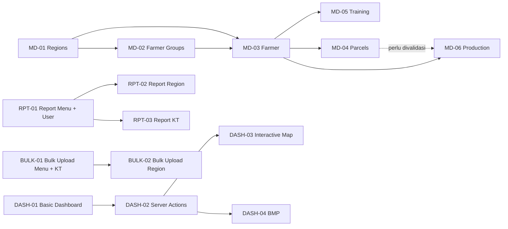

# Smallholder HUB — Progress

> Dokumen kerja untuk memantau delivery Smallholder HUB. Status di dokumen ini disinkronkan terhadap **file dan code yang benar-benar ada di repository**, bukan berdasarkan klaim changelog historis.

**Last updated:** 2026-06-06 (re-verified terhadap working tree commit `5667a44`)

**Next management review:** 2026-06-20

**Source of truth:** tabel **Phase Status** di Section 2.

**Audit basis:** source code, Prisma schema, route files, server actions, scripts, GitHub workflow, dan hasil test lokal.

---

<details open>
<summary><strong>1. Biweekly Management Brief</strong> — ringkasan stakeholder</summary>

## 1. Biweekly Management Brief

Gunakan section ini untuk presentasi management setiap dua minggu. Section ini sengaja dibuat ringkas: posisi delivery, risiko, keputusan, dan target dua minggu berikutnya.

### Reporting Window

| Item               | Nilai                                                       |
| ------------------ | ----------------------------------------------------------- |
| Periode laporan    | 2026-06-06 s.d. 2026-06-20                                  |
| Status keseluruhan | 🔴 At Risk                                                  |
| Basis review       | Existing source code per 2026-06-06                         |
| Test lokal         | ✅ `npm test` — 10 files / 111 tests passed                 |
| Fokus koreksi      | Menyamakan roadmap dengan implementasi aktual di repository |

### Executive Summary

| Area                | Status          | Ringkasan                                                                                                                                  |
| ------------------- | --------------- | ------------------------------------------------------------------------------------------------------------------------------------------ |
| Platform foundation | 🟡 Mostly Ready | Auth, RBAC, menu, user management, region, dan farmer group sudah ada. Schema hardening belum sepenuhnya mencakup sync/lifecycle.          |
| Master data inti    | 🔴 At Risk      | Farmer, Parcels, Training, Production, Staff, dan HCV belum punya Prisma model, route, server actions, atau validation schema.             |
| Dashboard           | 🔴 At Risk      | `/admin/dashboard` masih placeholder `Coming soon`; tidak ada `src/server/actions/dashboard.ts`. Issues #62, #63 dibuat.                   |
| Report              | 🔲 Not Started   | Belum ada report module. Issues #64–#67 dibuat (menu setup + placeholder + implementasi).                                                  |
| Bulk Upload         | 🔲 Not Started   | Belum ada bulk upload module. Issues #68–#70 dibuat (menu setup + placeholder + implementasi).                                              |
| Navigation health   | 🔴 Broken Link  | `/admin/master-data` redirect ke `/admin/master-data/farmers`, tetapi route `farmers` belum ada.                                           |
| Testing             | 🟡 Partial      | Unit tests tersedia dan lulus, tetapi coverage masih fokus pada auth/RBAC/menu/user/region; belum ada dashboard atau master data lanjutan. |

### Progress Snapshot

| Metrik         | Jumlah         | Catatan                                              |
| -------------- | -------------- | ---------------------------------------------------- |
| Total phase    | 33 fase        | PLATFORM, MD, DASH, RPT, BULK, TOOLS, CMS, COMM, OPS |
| ✅ Done        | 8 fase         | PLATFORM-01/02/04/05/06, MD-01/02/03                 |
| 🟠 Partial     | 4 fase         | PLATFORM-03, TOOLS-01, OPS-01, OPS-02                |
| 🔲 Not Started | 9 fase         | DASH-01, CMS-01, COMM-01, RPT-01/02/03, BULK-01/02  |
| 🔲 Planned     | 11 fase        | MD-04–11, DASH-02/03, COMM-02                        |
| 🔴 Blocked     | 1 fase         | DASH-04                                              |
| 🎯 Now         | 3 fase + 1 bug | DASH-01, RPT-01, BULK-01, BUG-002                    |

### Management Talking Points

| Topik               | Pesan Utama                                                              | Dampak                                                                                    |
| ------------------- | ------------------------------------------------------------------------ | ----------------------------------------------------------------------------------------- |
| Roadmap correction  | Status lama terlalu optimistis untuk dashboard dan master data lanjutan. | Management perlu membaca progress dari Phase Status terbaru.                              |
| Immediate priority  | Perbaiki broken navigation dan mulai MD-03 Farmer.                       | Menghindari demo/admin flow yang patah dan membuka dependency Training/Parcel/Production. |
| Dashboard reality   | Dashboard source saat ini belum implementatif.                           | DASH-04 BMP tidak bisa dinilai In Progress dari code; harus dimulai dari DASH-01.         |
| Delivery confidence | Test existing lulus 111/111.                                             | Foundation cukup stabil untuk lanjut, tetapi feature coverage belum menyentuh modul baru. |

### Decisions Needed

| Keputusan                  | Owner                   | Dibutuhkan Kapan     | Rekomendasi Tech Lead                                                                       |
| -------------------------- | ----------------------- | -------------------- | ------------------------------------------------------------------------------------------- |
| Arah `/admin/master-data`  | Engineering Lead        | Segera               | Pilih: redirect sementara ke `/admin/master-data/groups` atau implement MD-03 Farmer route. |
| Scope minimal MD-03 Farmer | Product + Engineering   | Sebelum implementasi | Tetapkan field wajib, relasi FarmerGroup/Village, RBAC, dan acceptance criteria.            |
| Dashboard MVP              | Product + Engineering   | Sprint berjalan      | Definisikan ulang DASH-01 sebelum membahas DASH-04 BMP.                                     |
| Model data Production      | Product + Domain Expert | Sebelum MD-06        | Putuskan production dicatat per Farmer, per Parcel, atau per season/periode.                |

### Next Two Weeks

| Priority | Target                                      | Output                                                                                                        |
| -------- | ------------------------------------------- | ------------------------------------------------------------------------------------------------------------- |
| P0       | BUG-001: fix broken master-data redirect    | `/admin/master-data` tidak lagi mengarah ke route yang tidak ada                                              |
| P0       | BUG-002: cleanup stale dashboard references | Script/debug docs tidak mengarah ke `src/server/actions/dashboard.ts` yang belum ada, atau file action dibuat |
| P0       | #62 #63 DASH-01 dashboard basic             | `/admin/dashboard` menampilkan summary cards dengan filter district                                           |
| P0       | #72 #73 #74 #75 MD-03 Farmer                | Issues dibuat; schema, server actions, UI, docs (estimasi 2 hari dev + QA)                                    |
| P1       | #64 RPT-01 menu & placeholder report        | Menu Report + sub-menu + placeholder pages terdaftar di sidebar                                               |
| P1       | #68 BULK-01 menu & placeholder bulk upload  | Menu Bulk Upload + sub-menu + placeholder pages terdaftar di sidebar                                          |
| P1       | Testing scope expansion                     | Tambah test untuk dashboard basic / redirect / MD-03 setelah implementasi                                     |

</details>

---

<details>
<summary><strong>2. Roadmap Source of Truth</strong> — status resmi phase berdasarkan code</summary>

## 2. Roadmap Source of Truth

Section ini adalah acuan resmi status delivery. Jika ada perbedaan antara changelog, issue, dan tabel ini, gunakan tabel **Phase Status** sebagai kebenaran utama.

### Governance Rules

- **Phase Status adalah source of truth** untuk reporting management dan planning developer.
- Status fase hanya boleh naik jika implementasi bisa diverifikasi lewat file/code, route, schema, server action, test, atau workflow.
- Changelog tidak boleh dijadikan bukti status selesai; changelog hanya catatan historis.
- Placeholder `Coming soon` tidak dihitung sebagai implementasi feature.
- Script/debug tool tidak dihitung sebagai implementasi UI/module, kecuali phase memang scope-nya CLI/tooling.
- Jika status berubah karena audit code, catat di **Decision Log**.

### Status Definition

| Status         | Arti                      | Kapan Dipakai                                                           |
| -------------- | ------------------------- | ----------------------------------------------------------------------- |
| ✅ Done        | Selesai dan terverifikasi | Schema/route/action/UI tersedia sesuai completion criteria minimal      |
| 🟠 Partial     | Sebagian ada              | Ada sebagian implementasi, tetapi belum cukup untuk dianggap selesai    |
| 🔲 Not Started | Belum dimulai             | Route/schema/action utama belum ada, tetapi phase masuk prioritas dekat |
| 🔲 Planned     | Masuk roadmap             | Belum ada implementasi dan belum menjadi prioritas sprint               |
| 🔴 Blocked     | Terhambat                 | Ada dependency atau kondisi yang membuat phase belum layak dieksekusi   |

### Horizon Definition

| Horizon | Arti                        | Aturan                                         |
| ------- | --------------------------- | ---------------------------------------------- |
| Done    | Selesai                     | Semua completion criteria fase sudah terpenuhi |
| Now     | Fokus dua minggu berjalan   | Maksimal 2–4 phase agar tim tidak melebar      |
| Next    | Kandidat sprint berikutnya  | Masuk setelah dependency jelas                 |
| Later   | Backlog roadmap             | Jangan dieksekusi sebelum Now stabil           |
| Blocked | Tidak bisa dieksekusi sehat | Perlu dependency/keputusan/phase sebelumnya    |

### Code Audit Evidence

| Area           | Bukti di Codebase                                                                                                                                                                  | Kesimpulan                                                                             |
| -------------- | ---------------------------------------------------------------------------------------------------------------------------------------------------------------------------------- | -------------------------------------------------------------------------------------- |
| Prisma models  | `User`, `MenuItem`, `RolePermission`, `UserProvince`, `UserDistrict`, `UserFarmerGroup`, `UserPermissionOverride`, `Province`, `District`, `Subdistrict`, `Village`, `FarmerGroup`, `Farmer` | Schema mencakup platform, RBAC, region, farmer group, dan farmer (MD-03) |
| Admin routes   | Dashboard placeholder, Settings Users/Roles/Menu/Regions, Master Data Groups + Farmers (list/detail/form), Profile                                                                  | Admin foundation ada; farmer tersedia; dashboard belum implementatif                   |
| Server actions | `user`, `user-data-access`, `user-menu-access`, `menu`, `region`, `farmer-group`, `farmer`, `profile`, `role-permission`                                                           | Action farmer tersedia; dashboard, training, parcel, production belum ada              |
| Public routes  | Home, Community placeholder, Knowledge Management placeholder                                                                                                                      | Public shell ada; CMS/community belum implementatif                                    |
| Scripts        | S3/PDF CLI, export CSV, dashboard cache/debug scripts                                                                                                                              | Tools partial; beberapa dashboard scripts stale karena action dashboard tidak ada      |
| Tests          | `npm test` lulus 10 files / 111 tests                                                                                                                                              | Testing partial dan belum mencakup dashboard/master data lanjutan                      |
| DevOps         | Dockerfile + `.github/workflows/deploy-dev.yaml` + `deploy-main.yml`                                                                                                               | DevOps partial; workflow ada tetapi deployment readiness belum diverifikasi di dokumen |

### Phase Encoding Taxonomy

Format phase: `STREAM-NN`.

| Stream   | Arti                   | Cakupan                                                                                    |
| -------- | ---------------------- | ------------------------------------------------------------------------------------------ |
| PLATFORM | Platform Foundation    | Init project, schema DB, auth, RBAC, menu infra                                            |
| MD       | Master Data            | Regions, groups, farmer, parcels, training, staff, agronomy, HCV, BUSDEV, IMPACT, workplan |
| DASH     | Dashboard              | Basic dashboard, server actions, interactive map, BMP                                      |
| RPT      | Report                 | Report User, Region, Kelompok Tani; summary tabel + export Excel/PDF                      |
| BULK     | Bulk Upload            | Bulk upload CSV untuk Region dan Kelompok Tani; validasi, preview, insert                  |
| TOOLS    | Tools & Utility        | Import, export, GIS, S3/PDF utility                                                        |
| CMS      | Content Management     | Pages, media, knowledge base                                                               |
| COMM     | Community & Engagement | Community, i18n                                                                            |
| OPS      | Operations & DevOps    | Testing, CI/CD, deployment                                                                 |

### Phase Status

| Phase       | Deskripsi                    | Status         | Horizon | Evidence from Code                                                                                | Completion Criteria / Next Step                                                  |
| ----------- | ---------------------------- | -------------- | ------- | ------------------------------------------------------------------------------------------------- | -------------------------------------------------------------------------------- |
| PLATFORM-01 | Initialization & UI Statis   | ✅ Done        | Done    | Next.js app, public home, login, admin shell, UI components                                       | Maintain                                                                         |
| PLATFORM-02 | Database Schema & Migrations | ✅ Done        | Done    | Modular Prisma schema + migration + seed files                                                    | Maintain                                                                         |
| PLATFORM-03 | Schema Hardening             | 🟠 Partial     | Next    | Audit fields and soft-delete style exist on active models; no clear sync model/lifecycle coverage | Define sync requirement; verify all future models follow audit/soft-delete rules |
| PLATFORM-04 | Autentikasi & RBAC           | ✅ Done        | Done    | NextAuth credentials, RBAC helpers, role permissions, data access, menu override                  | Maintain and test regression                                                     |
| PLATFORM-05 | Dynamic Menu Management      | ✅ Done        | Done    | `MenuItem` schema, seed, menu server actions, sidebar, menu management page                       | Maintain                                                                         |
| PLATFORM-06 | Table Refactor & Export Excel | ✅ Done        | Done    | DataTable diperbarui dengan filter kolom & export Excel, list user/KT direfactor | Maintain dan perluas ke modul baru jika ditambahkan |
| MD-01       | Regions                      | ✅ Done        | Done    | Region schema, server actions, region page, tree UI, validation, tests                            | Maintain                                                                         |
| MD-02       | Farmer Groups                | ✅ Done        | Done    | `FarmerGroup` schema, CRUD actions, list/detail/form UI, RBAC filter                              | Add/maintain tests if needed                                                     |
| MD-03       | Farmer                       | ✅ Done        | Done    | `Farmer` model, migration, server actions, validation, list/detail/form UI, RBAC, menu — #72 #73 #74 #75 | Maintain dan perluas ke MD-04/05 jika dibutuhkan                        |
| MD-04       | Parcels                      | 🔲 Planned     | Next    | No parcel model/route/action/UI                                                                   | Start after MD-03                                                                |
| MD-05       | Training                     | 🔲 Planned     | Next    | No training model/route/action/UI; S3/PDF CLI only                                                | Start after MD-03; define participants/evidence model                            |
| MD-06       | Agronomy / Production        | 🔲 Planned     | Next    | No production/agronomy model/route/action/UI                                                      | Validate dependency to Farmer/Parcel first                                       |
| MD-07       | Staff                        | 🔲 Planned     | Later   | No staff model/route/action/UI                                                                    | Define scope                                                                     |
| MD-08       | HCV                          | 🔲 Planned     | Later   | No HCV model/route/action/UI                                                                      | Define scope                                                                     |
| MD-09       | BUSDEV                       | 🔲 Planned     | Later   | No BUSDEV model/route/action/UI                                                                   | Define scope                                                                     |
| MD-10       | IMPACT                       | 🔲 Planned     | Later   | No IMPACT model/route/action/UI                                                                   | Define scope                                                                     |
| MD-11       | Workplan                     | 🔲 Planned     | Later   | No workplan model/route/action/UI                                                                 | Define scope                                                                     |
| DASH-01     | Dashboard: Basic Data        | 🔲 Not Started | Now     | `/admin/dashboard` exists but only `Coming soon`; **#62 #63 dibuat**                              | #62 menu setup + #63 summary cards dengan filter district                        |
| DASH-02     | Dashboard: Server Actions    | 🔲 Planned     | Next    | No `src/server/actions/dashboard.ts`                                                              | Create dashboard server actions after DASH-01 scope agreed                       |
| DASH-03     | Interactive Map              | 🔲 Planned     | Next    | Map deps/CSS/markers exist, but no dashboard map route/component                                  | Implement after dashboard data actions exist                                     |
| DASH-04     | Dashboard BMP                | 🔴 Blocked     | Blocked | No dashboard implementation; scripts reference missing dashboard action                           | Unblock by completing DASH-01 and DASH-02 first                                  |
| RPT-01      | Report: Menu & User          | 🔲 Not Started | Now     | Tidak ada report module; **#64 #65 dibuat**                                                       | #64 menu + placeholder + #65 report user tabel & export Excel                    |
| RPT-02      | Report: Region               | 🔲 Not Started | Next    | Tidak ada report region; **#66 dibuat**                                                            | #66 report region tabel & export Excel; dependency #64                           |
| RPT-03      | Report: Kelompok Tani        | 🔲 Not Started | Next    | Tidak ada report KT; **#67 dibuat**                                                                | #67 report KT tabel & export Excel; cascade filter; dependency #64               |
| BULK-01     | Bulk Upload: Menu & KT       | 🔲 Not Started | Now     | Tidak ada bulk upload module; **#68 #69 dibuat**                                                   | #68 menu + placeholder + #69 CSV upload KT dengan validasi & preview             |
| BULK-02     | Bulk Upload: Region          | 🔲 Not Started | Next    | Tidak ada bulk upload region; **#70 dibuat**                                                       | #70 CSV upload District/Subdistrict/Village dengan validasi hierarchy             |
| TOOLS-01    | Tools Import/Export/GIS/S3   | 🟠 Partial     | Next    | `scripts/export-csv.ts`, S3/PDF CLI, dashboard cache/debug scripts                                | Separate CLI utilities from app tools; remove/fix stale dashboard scripts        |
| CMS-01      | CMS & Content Management     | 🔲 Not Started | Later   | Public knowledge page exists but only `Coming soon`; no CMS schema/admin                          | Define CMS scope                                                                 |
| COMM-01     | Community                    | 🔲 Not Started | Later   | Public community page exists but only `Coming soon`                                               | Define community scope                                                           |
| COMM-02     | i18n                         | 🔲 Planned     | Later   | No locale switch/persistence; only incidental calendar locale prop                                | Define i18n approach                                                             |
| OPS-01      | Testing                      | 🟠 Partial     | Later   | Vitest setup + 10 test files + 111 passing tests                                                  | Expand coverage for dashboard, redirects, and future MD modules                  |
| OPS-02      | DevOps & Deployment          | 🟠 Partial     | Later   | Dockerfile + GitHub deploy workflows                                                              | Verify deployment, env matrix, rollback, and CI status                           |

</details>

---

<details>
<summary><strong>3. Current Sprint & Issue Control</strong> — pekerjaan aktif developer</summary>

## 3. Current Sprint & Issue Control

Section ini dipakai developer untuk tahu apa yang harus dikerjakan sekarang. Karena progress sekarang disesuaikan dengan code, prioritas sprint difokuskan ke gap yang terbukti ada.

### Sprint Focus

| Priority | ID / Phase  | Tujuan                                 | Evidence                                                                                      | Next Action                                                              |
| -------- | ----------- | -------------------------------------- | --------------------------------------------------------------------------------------------- | ------------------------------------------------------------------------ |
| P0       | BUG-001     | Fix broken master-data redirect        | `src/app/(admin)/admin/master-data/page.tsx` redirect ke missing `/admin/master-data/farmers` | Ubah redirect ke `/admin/master-data/groups` atau implement route Farmer |
| P0       | BUG-002     | Fix stale dashboard tooling references | `scripts/debug/*dashboard*` import `src/server/actions/dashboard` yang tidak ada              | Hapus/fix script atau buat dashboard action                              |
| P0       | DASH-01     | Dashboard summary cards + filter       | `src/app/(admin)/admin/dashboard/page.tsx` masih `Coming soon`                                | #62 menu setup → #63 summary cards + district filter                     |
| P0       | MD-03       | Kickoff Farmer                         | Tidak ada `Farmer` model/route/action/validation                                              | Buat issue schema, CRUD actions, UI, RBAC, tests                         |
| P1       | RPT-01      | Menu & placeholder Report              | Tidak ada report module                                                                       | #64 menu setup + placeholder → #65 Report User tabel & Excel            |
| P1       | BULK-01     | Menu & placeholder Bulk Upload         | Tidak ada bulk upload module                                                                  | #68 menu setup + placeholder → #69 Bulk Upload KT CSV                   |
| P1       | PLATFORM-03 | Clarify schema hardening               | Audit fields ada; sync/lifecycle belum jelas                                                  | Definisikan hardening checklist untuk model baru                         |

### Active Issues / Work Items

| Work Item                                       | Phase              | Status  | Assignee | Target | Next Action                                                       |
| ----------------------------------------------- | ------------------ | ------- | -------- | ------ | ----------------------------------------------------------------- |
| BUG-001 Broken `/admin/master-data` redirect    | MD-03 / Navigation | ✅ Done | -        | 06-07  | Redirect diubah ke `/admin/master-data/farmers` — route tersedia  |
| BUG-002 Stale dashboard scripts                 | DASH-02 / TOOLS-01 | 🔲 Todo | TBD      | TBD    | Align scripts with actual dashboard action availability           |
| #62 Menu & Route Setup Dashboard                | DASH-01            | 🔲 Todo | TBD      | TBD    | Seed menu + route structure + redirect                            |
| #63 Dashboard Basic — Summary Cards + Filter    | DASH-01            | 🔲 Todo | TBD      | TBD    | Server action + summary cards + district filter; depends #62      |
| #64 Menu & Route Setup Report + Placeholder     | RPT-01             | 🔲 Todo | TBD      | TBD    | Seed menu + route structure + placeholder pages                   |
| #65 Report User — Tabel & Export Excel          | RPT-01             | 🔲 Todo | TBD      | TBD    | Server action + DataTable + exceljs export; depends #64           |
| #66 Report Region — Tabel & Export Excel        | RPT-02             | 🔲 Todo | TBD      | TBD    | Region hierarchy tabel + export; depends #64                      |
| #67 Report Kelompok Tani — Tabel & Export Excel | RPT-03             | 🔲 Todo | TBD      | TBD    | KT tabel + cascade filter + export; depends #64                   |
| #68 Menu & Route Setup Bulk Upload + Placeholder| BULK-01            | 🔲 Todo | TBD      | TBD    | Seed menu + route structure + placeholder pages                   |
| #69 Bulk Upload KT — CSV Validasi Preview Insert| BULK-01            | 🔲 Todo | TBD      | TBD    | CSV upload + Zod validasi + preview + bulk insert; depends #68    |
| #70 Bulk Upload Region — CSV Hierarchy Validasi | BULK-02            | 🔲 Todo | TBD      | TBD    | CSV upload per level + hierarchy validasi; depends #68 #69        |
| #71 Refactor Tabel ke DataTable + Show/Hide Kolom & Export Excel | PLATFORM-06 | ✅ Done | TBD | TBD | Selesai direfaktor ke DataTable dan mendukung export Excel serta visibilitas kolom |
| #72 Farmer Schema & Migration                   | MD-03              | ✅ Done | -        | 06-07  | `prisma/schema/farmer.prisma`, enum Gender, relasi FarmerGroup, seeder CSV |
| #73 Farmer Server Actions & Validation          | MD-03              | ✅ Done | -        | 06-07  | `farmer.schema.ts` Zod, `farmer.ts` server actions, `farmer.test.ts` unit tests |
| #74 Farmer UI - List, Form, Menu                | MD-03              | ✅ Done | -        | 06-07  | `page.tsx`, `farmer-list-client.tsx`, `farmer-form-modal.tsx`, `[id]/page.tsx`, `loading.tsx`, menu entry CSV |
| #75 Update Documentation & Progress Tracking    | MD-03              | ✅ Done | -        | 06-07  | progress.md diupdate: Phase Status, Active Issues, Snapshot, Audit Evidence, Changelog |

### Issue Workflow


| Workflow       | Label GitHub         | Arti                                   | Efek ke Phase Status                              |
| -------------- | -------------------- | -------------------------------------- | ------------------------------------------------- |
| 🔲 Todo        | `status:todo`        | Siap dikerjakan, belum aktif           | Fase tetap Not Started / Planned                  |
| 🟡 In Progress | `status:in-progress` | Sedang dikerjakan                      | Fase menjadi In Progress / Partial                |
| 🔍 Review      | `status:review`      | Selesai coding, menunggu QA / approval | Fase tetap In Progress / Partial                  |
| ✅ Done        | `status:done`        | Selesai dan merged                     | Fase bisa Done jika completion criteria terpenuhi |

### Issue Convention

Format judul:

```text
[Phase-Code] Deskripsi singkat dalam Bahasa Indonesia
```

Contoh:

```text
[BUG] Fix redirect /admin/master-data ke route yang valid
[DASH-01] Dashboard basic untuk summary data existing
[MD-03] Prisma schema & migration untuk Farmer
[MD-03] Farmer list, detail, dan form
```

Label wajib:

| Label      | Contoh                               | Wajib?             | Catatan                                           |
| ---------- | ------------------------------------ | ------------------ | ------------------------------------------------- |
| `phase`    | `phase:MD-03`                        | Ya                 | Harus sama dengan Phase Status jika terkait phase |
| `status`   | `status:todo`                        | Ya                 | Harus mengikuti Issue Workflow                    |
| `type`     | `type:feat`, `type:bug`, `type:debt` | Ya                 | Minimal satu type                                 |
| `priority` | `priority:P0`, `priority:P1`         | Untuk sprint aktif | Dipakai untuk sorting pekerjaan                   |

</details>

---

<details>
<summary><strong>4. Junior Developer Update Guide</strong> — cara update dokumen tanpa bingung</summary>

## 4. Junior Developer Update Guide

Section ini dibuat supaya junior developer bisa update dokumen dengan aman dan konsisten.

### Golden Rule

Jika tidak ada bukti di code, jangan naikkan status fase.

Contoh bukti yang valid:

- Prisma model / migration
- Route file di `src/app`
- Server action di `src/server/actions`
- Validation schema di `src/validations`
- UI component/page yang bukan placeholder
- Test yang relevan
- Script/workflow jika phase memang tooling/devops

### 5-Minute Update Checklist

| Step | Bagian yang Diupdate | Pertanyaan Cek                                                         |
| ---- | -------------------- | ---------------------------------------------------------------------- |
| 1    | Active Issues        | Apakah status issue, assignee, target, dan next action sudah benar?    |
| 2    | Phase Status         | Apakah status fase berubah berdasarkan file/code nyata?                |
| 3    | Code Audit Evidence  | Apakah ada route/schema/action baru atau hilang?                       |
| 4    | Progress Snapshot    | Apakah angka Done/Partial/Not Started/Planned/Blocked masih konsisten? |
| 5    | Management Brief     | Apakah risiko/decision/next two weeks masih relevan?                   |
| 6    | Changelog            | Apakah perubahan penting sudah dicatat dengan tanggal?                 |

### Dependency Map



### Recommended Implementation Order

| Step | Phase / Bug | Scope Minimal                                          | Prasyarat                        | Catatan Tech Lead                                        |
| ---- | ----------- | ------------------------------------------------------ | -------------------------------- | -------------------------------------------------------- |
| 1    | BUG-001     | Fix `/admin/master-data` redirect                      | Existing routes                  | Pilih redirect ke groups atau implement farmer           |
| 2    | DASH-01     | #62 menu + #63 summary cards + district filter         | Existing User/Region/FarmerGroup | Jangan langsung BMP sebelum dashboard dasar ada          |
| 3    | RPT-01      | #64 menu + placeholder report pages                    | Menu system existing             | Bisa paralel dengan DASH-01                              |
| 4    | BULK-01     | #68 menu + placeholder bulk upload pages               | Menu system existing             | Bisa paralel dengan DASH-01 dan RPT-01                   |
| 5    | RPT-01      | #65 Report User — tabel + export Excel                 | #64 selesai                      | Install exceljs, buat reusable export pattern            |
| 6    | RPT-02/03   | #66 Report Region + #67 Report KT                      | #64 #65 selesai                  | Reuse export pattern dari #65                            |
| 7    | BULK-01     | #69 Bulk Upload KT — CSV validasi preview insert       | #68 selesai                      | Buat reusable CSV upload components                      |
| 8    | BULK-02     | #70 Bulk Upload Region — hierarchy validasi             | #68 #69 selesai                  | Reuse CSV components, tambah hierarchy validation        |
| 9    | MD-03       | Farmer schema, CRUD, list, detail, form, RBAC          | MD-01, MD-02                     | Mulai dari field minimal                                 |
| 10   | MD-05       | Training schema, CRUD, participants, attendance        | MD-03                            | Jangan mulai sebelum Farmer jelas                        |
| 11   | MD-04       | Parcel schema, CRUD, map context                       | MD-03                            | Penting untuk Production/GIS                             |
| 12   | MD-06       | Production schema, period, chart/import awal           | MD-03 + kemungkinan MD-04        | Validasi per Farmer vs per Parcel                        |

### MD-03 Farmer — Suggested Issue Breakdown

| Issue                               | Scope                                                        | Definition of Done                                        |
| ----------------------------------- | ------------------------------------------------------------ | --------------------------------------------------------- |
| `[MD-03] Farmer schema & migration` | Prisma model, relation ke FarmerGroup dan Village, migration | Migration berhasil dan relasi bisa di-query               |
| `[MD-03] Farmer server actions`     | Create, read, update, soft delete, validation, RBAC filter   | Action aman dari akses tidak sah dan error handling jelas |
| `[MD-03] Farmer list page`          | Tabel, search, filter, pagination, action buttons            | Data tampil benar sesuai permission                       |
| `[MD-03] Farmer form page`          | Create/edit form, field validation, submit state             | Form menyimpan data dan memberi feedback jelas            |
| `[MD-03] Farmer detail page`        | Ringkasan profil, group, wilayah, metadata                   | Detail bisa dibuka dari list dan tidak bocor akses        |
| `[MD-03] Farmer tests / QA`         | Unit/integration test prioritas dan smoke test manual        | Test relevan lulus dan checklist QA tercatat              |

### Acceptance Criteria Umum

- Data mengikuti RBAC dan data access yang sudah ada.
- Semua form memiliki validation error yang jelas.
- List page memiliki search/filter/pagination jika datanya berpotensi besar.
- Server action tidak hanya mengandalkan guard UI; permission tetap dicek di backend.
- Placeholder `Coming soon` tidak dihitung sebagai selesai.
- Setelah phase selesai, update **Phase Status**, **Active Issues**, **Progress Snapshot**, dan **Changelog**.

### Minimum Validation

| Area           | Validasi Minimal                                               |
| -------------- | -------------------------------------------------------------- |
| Schema         | Migration berjalan dan tidak merusak seed/data existing        |
| Server actions | Happy path, invalid input, unauthorized access                 |
| UI             | Empty state, loading state, error state, dark/light mode dasar |
| RBAC           | Role tanpa permission tidak bisa melihat/menulis data          |
| Test           | `npm test` lulus                                               |
| Build          | `npm run build` lulus sebelum fase ditandai Done               |

### Update Templates

Gunakan template berikut saat menambah issue baru.

```text
Issue:
Phase:
Status:
Assignee:
Target:
Evidence:
Next Action:
```

Gunakan template berikut saat menambah changelog.

```text
| YYYY-MM-DD | [Phase/Issue] Ringkasan perubahan singkat berdasarkan code |
```

</details>

---

<details>
<summary><strong>5. Technical Debt & Bug Register</strong> — risiko teknis aktual</summary>

## 5. Technical Debt & Bug Register

Debt/bug di section ini berasal dari audit code. Item masuk sprint jika sudah punya owner, priority, dan definition of done.

### Bug Register

| ID      | Bug                                                                         | Priority | Evidence                                                                                                                                                            | Owner | Status  | Definition of Done                                                  |
| ------- | --------------------------------------------------------------------------- | -------- | ------------------------------------------------------------------------------------------------------------------------------------------------------------------- | ----- | ------- | ------------------------------------------------------------------- |
| BUG-001 | `/admin/master-data` redirect ke route missing `/admin/master-data/farmers` | P0       | `src/app/(admin)/admin/master-data/page.tsx`                                                                                                                        | TBD   | 🔲 Todo | Route tidak 404; redirect ke route valid atau Farmer route tersedia |
| BUG-002 | Dashboard debug scripts import action yang tidak ada                        | P0       | `scripts/debug/debug-dashboard-data.js`, `scripts/debug/test-dashboard-api.js`, `scripts/debug/perf-dashboard.ts` import `src/server/actions/dashboard` (tidak ada) | TBD   | 🔲 Todo | Script diperbaiki/dihapus atau `dashboard.ts` dibuat                |

### Debt Register

| ID     | Debt Item                                                           | Priority | Evidence                                                                                     | Owner                 | Status                     | Validation Method                                                |
| ------ | ------------------------------------------------------------------- | -------- | -------------------------------------------------------------------------------------------- | --------------------- | -------------------------- | ---------------------------------------------------------------- |
| TD-001 | S3/PDF utility belum terintegrasi ke modul Training                 | P1       | `scripts/get-link.js`, `scripts/pdf-manager.js`; tidak ada Training model/UI                 | Backend/Storage Lead  | 🔲 Planned                 | Training evidence flow jelas setelah MD-05                       |
| TD-002 | Hardcoded `text-white` perlu visual audit                           | P2       | Ada di login, footer, user menu access modal; sebagian mungkin valid karena background solid | Frontend Lead         | 🔲 Planned                 | Visual QA dark/light mode tanpa contrast regression              |
| TD-003 | `.DS_Store` tidak tracked, tetapi masih ada di working tree         | P2       | `git ls-files` kosong; `find` menemukan file lokal                                           | Repository Maintainer | ✅ Closed for git tracking | `.DS_Store` tetap ignored dan tidak masuk git                    |
| TD-004 | Language toggle / i18n belum ada                                    | P2       | Tidak ada locale switch/persistence                                                          | i18n Lead             | 🔲 Planned                 | Toggle mengubah locale dan persist state antar navigasi          |
| TD-005 | Dashboard cache/debug scripts tampak berasal dari implementasi lama | P1       | Script menyebut dashboard stats/markers/batches yang tidak ada di source action              | Engineering Lead      | 🔲 Planned                 | Script selaras dengan source code aktif atau dipindah ke archive |
| TD-006 | `docs/rule.md` menyebut folder dashboard components yang tidak ada  | P2       | `docs/rule.md` mencantumkan `components/dashboard`; folder tidak ada                         | Tech Lead             | 🔲 Planned                 | Docs arsitektur sinkron dengan struktur repo                     |
| TD-007 | FarmerGroup Server Actions tidak memfilter `isActive: true`         | P1       | `src/server/actions/farmer-group.ts`                                                         | Backend Lead          | 🔲 Planned                 | Tambahkan filter `{ isActive: true }` untuk mematuhi soft delete rule                    |
| TD-008 | Form data parsing berpotensi `NaN` pada field kosong/whitespace     | P2       | `src/app/(admin)/admin/master-data/groups/group-form-modal.tsx`                              | Frontend Lead         | 🔲 Planned                 | Gunakan helper untuk memproses string kosong/whitespace sebelum parsing numerik          |

### Debt Sequencing

| Waktu                | Fokus                  | Catatan                                                    |
| -------------------- | ---------------------- | ---------------------------------------------------------- |
| Immediate / P0       | BUG-001, BUG-002       | Perbaiki flow yang patah atau stale sebelum menambah fitur |
| Sprint berjalan / P1 | DASH-01, MD-03, TD-005 | Sinkronkan dashboard dan mulai master data inti            |
| Later / P2           | TD-002, TD-004, TD-006 | Bisa menunggu setelah feature inti stabil                  |

</details>

---

<details>
<summary><strong>6. Appendix & History</strong> — keputusan dan changelog</summary>

## 6. Appendix & History

Section ini menyimpan konteks historis. Jangan gunakan changelog sebagai acuan status; gunakan tabel **Phase Status**.

### Audit Commands

Audit terakhir menggunakan:

```text
find src/app -type f
find src/server src/lib src/components src/validations src/test -type f
find prisma -type f
rg "Dashboard|BMP|Training|Farmer|Parcel|Production|Staff|HCV|Coming soon" src prisma scripts docs
git ls-files | grep '\.DS_Store$'
npm test
```

### Decision Log

| Tanggal    | Keputusan                                                                                                                      |
| ---------- | ------------------------------------------------------------------------------------------------------------------------------ |
| 2026-06-06 | `progress.md` disinkronkan ulang berdasarkan existing file/code, bukan changelog historis.                                     |
| 2026-06-06 | DASH-01/DASH-02/DASH-03/DASH-04 diturunkan statusnya karena dashboard source masih placeholder dan action dashboard tidak ada. |
| 2026-06-06 | MD-03–MD-08 dikonfirmasi belum implementatif karena tidak ada Prisma model, route, server action, validation, atau UI.         |
| 2026-06-06 | BUG-001 ditambahkan untuk redirect `/admin/master-data` ke route missing `/admin/master-data/farmers`.                         |
| 2026-06-06 | BUG-002/TD-005 ditambahkan untuk stale dashboard scripts yang refer ke action dashboard missing.                               |
| 2026-06-06 | OPS-01 dinilai Partial karena test tersedia dan lulus 111/111, tetapi coverage belum mencakup modul baru/dashboard.            |
| 2026-06-06 | OPS-02 dinilai Partial karena Dockerfile dan GitHub deploy workflows ada, tetapi deployment readiness belum diverifikasi.      |
| 2026-06-06 | Stream RPT (Report) dan BULK (Bulk Upload) ditambahkan ke Phase Encoding Taxonomy.                                             |
| 2026-06-06 | 9 GitHub Issues dibuat (#62–#70) untuk Dashboard, Report, dan Bulk Upload.                                                     |
| 2026-06-06 | RBAC sementara SUPERADMIN-only untuk Dashboard, Report, Bulk Upload; role lain via User/Menu Management.                       |
| 2026-06-06 | Dashboard scope diputuskan: summary cards + filter district (bukan chart/map).                                                  |
| 2026-06-06 | Report scope diputuskan: Excel only di Phase 1, PDF ditunda.                                                                   |
| 2026-06-06 | Bulk Upload scope diputuskan: KT implementasi penuh, Region placeholder dulu.                                                  |
| 2026-06-06 | Tambah phase PLATFORM-06 dan buat Issue #71 untuk refactor list tabel ke DataTable dan integrasi Excel export + show/hide kolom. |
| 2026-06-07 | MD-03 Farmer scope diputuskan: MVP Phase 1 tanpa CSV import, NIK optional, Village optional, focus CRUD + RBAC + UI.           |
| 2026-06-07 | MD-03 Farmer breakdown: #72 (schema), #73 (actions+validation), #74 (UI), #75 (docs). Total estimasi 8-12 jam development.     |

### Changelog

#### Juni 2026

| Tanggal | Perubahan                                                                                                        |
| ------- | ---------------------------------------------------------------------------------------------------------------- |
| 06-06   | #71 selesai — Refactor tabel ke DataTable, menambahkan ekspor Excel dengan exceljs dan visibilitas kolom di list User & Kelompok Tani |
| 06-06   | Buat 9 GitHub Issues (#62–#70): Dashboard menu+cards, Report menu+placeholder+tabel+export, Bulk Upload menu+placeholder+CSV. |
| 06-06   | Buat GitHub Issue #71 untuk DataTable refactor + Excel export. Tambah phase PLATFORM-06 ke progress.md. |
| 06-06   | Tambah stream RPT (Report) dan BULK (Bulk Upload) ke Phase Encoding Taxonomy dan Phase Status.                   |
| 06-06   | Update Sprint Focus, Active Issues, Dependency Map, dan Recommended Implementation Order.                        |
| 06-06   | Audit seluruh folder dan update `progress.md` berdasarkan source code aktual.                                    |
| 06-06   | Koreksi status dashboard dan master data lanjutan sesuai bukti route/schema/action yang ada.                     |
| 06-06   | Tambah Bug Register untuk broken redirect dan stale dashboard references.                                        |
| 06-06   | Validasi test lokal: `npm test` lulus 10 files / 111 tests.                                                      |
| 06-06   | Restrukturisasi `progress.md` agar setiap section collapsible dan siap untuk presentasi management dua mingguan. |
| 06-07   | Buat 4 GitHub Issues (#72–#75) untuk MD-03 Farmer: schema+migration, server actions+validation, UI (list/form/menu), docs. Estimasi 8-12 jam dev. |
| 06-07   | #72 selesai — `prisma/schema/farmer.prisma`: model Farmer + enum Gender + relasi FarmerGroup + seeder `seed-farmers.ts` dari CSV + menu entry Petani. |
| 06-07   | #73 selesai — `farmer.schema.ts` Zod (create+update), `src/server/actions/farmer.ts` CRUD+RBAC access context, `farmer.test.ts` unit tests. |
| 06-07   | #74 selesai — `farmers/page.tsx`, `farmer-list-client.tsx` DataTable+filter KT+Excel export, `farmer-form-modal.tsx`, `[id]/page.tsx` detail, `loading.tsx`. Menu CSV diupdate. |
| 06-07   | #75 selesai — `progress.md` diupdate: MD-03 Done, BUG-001 Done, Active Issues #72-75 Done, Snapshot, Audit Evidence, Changelog. |
| 06-07   | BUG-001 selesai — Redirect `/admin/master-data` diubah ke `/admin/master-data/farmers` (route sudah tersedia). |

#### Mei 2026

| Tanggal | Perubahan                                                                                                                                                 |
| ------- | --------------------------------------------------------------------------------------------------------------------------------------------------------- |
| 05-25   | #61 selesai — User Menu Access Override: server actions, matrix override modal, RBAC helper caching & soft delete, integration, 111/111 tests             |
| 05-22   | #57 follow-up — Kolom ringkasan akses data di tabel User Management; bug fix RBAC KT-only; live refresh tabel saat toggle di modal; 105/105 tests         |
| 05-22   | #57 selesai — User Data Access Assignment: assign/remove Province/District/KT, modal tabs UI, visual hierarchy badges, live toggle, search, 104/104 tests |
| 05-22   | #59 selesai — Standardisasi visibilitas aksi tabel dan tombol Tambah berbasis Role & Permission, dokumentasi di `docs/rule.md`                            |
| 05-22   | #60 selesai — Abstraksi TableActions, TableSkeleton, loading state, dan pengamanan server actions dengan `hasPermission`                                  |
| 05-22   | #58 selesai — Region Management: tree view 4-level hierarchy, CRUD region, search, status filter, cascade muting                                          |
| 05-22   | #56 selesai — Login, User Management, Menu Management, Role & Permission matrix, Kelompok Tani CRUD, Profile page, 41/41 tests                            |
| 05-22   | #55 selesai — Schema reset, RBAC system, soft delete, audit trail, seed, migration fresh                                                                  |
| 05-13   | #48 — Update UI/UX Grafik BMP: filter kategori, grouped bar, warna hijau vibrant, legenda override                                                        |
| 05-13   | #48 — Dashboard BMP scaffold: score cards, combo chart, monev cards, filter distrik dan KT                                                                |
| 05-12   | Issues #48–#53 dibuat sebagai scaffold                                                                                                                    |
| 05-11   | #34 selesai — Dashboard full DB-driven: server actions, map controls, cache tables, 174/174 tests                                                         |
| 05-08   | #37 selesai — Interactive Map: filter KT, collapsible panel, icon markers, 100/100 tests                                                                  |
| 05-07   | #35 selesai — Dynamic Menu Management: Prisma, CRUD, sidebar, drag-and-drop, 95/95 tests                                                                  |
| 05-06   | #31 selesai — Sync production DB: 6 migrations, seed data                                                                                                 |
| 05-06   | #29 selesai — Audit trail 22 tabel, 81/81 tests                                                                                                           |
| 05-06   | #22 selesai — Final QA Fase 4: hapus debug, lokalisasi, cleanup placeholders                                                                              |
| 05-04   | Restrukturisasi dokumen, skip Fase 3, mulai Fase 4                                                                                                        |

### Historical Correction

Beberapa entri changelog Mei 2026 pernah mencantumkan status "selesai" untuk modul yang tidak ditemukan implementasinya di source code aktif. Status resmi sudah dikoreksi di **Phase Status**.

| Tanggal | Entri Historis yang Dikoreksi                                                                          |
| ------- | ------------------------------------------------------------------------------------------------------ |
| 05-13   | Dashboard BMP scaffold/update tidak tercermin di source `/admin/dashboard`, yang masih `Coming soon`.  |
| 05-11   | Dashboard full DB-driven tidak tercermin di source aktif; tidak ada `src/server/actions/dashboard.ts`. |
| 05-08   | Interactive Map tidak tercermin sebagai route/component dashboard aktif.                               |
| 05-09   | #45 — Training PDF Management: hanya ada CLI S3/PDF, belum ada modul Training app/schema.              |
| 05-09   | #43 — Staff Activity: tidak ada Staff Activity model/route/action/UI.                                  |
| 05-09   | #41 — Staff WRI: tidak ada Staff model/route/action/UI.                                                |
| 05-08   | #39 — Training module lengkap: tidak ada Training model/route/action/UI.                               |
| 05-05   | #21 — Parcels CRUD + MapLibre view: tidak ada Parcel model/route/action/UI.                            |

#### April 2026

| Tanggal | Perubahan                                                                     |
| ------- | ----------------------------------------------------------------------------- |
| 04-14   | PLATFORM-02 selesai — Prisma 7 modular schema, 3 migrasi PostgreSQL + PostGIS |

#### Maret 2026

| Tanggal | Perubahan                                      |
| ------- | ---------------------------------------------- |
| 03-30   | Code review & sync status                      |
| 03-28   | Modernisasi Dashboard dan perbaikan Home       |
| 03-18   | Inisiasi proyek — Next.js, Shadcn, static data |

</details>
