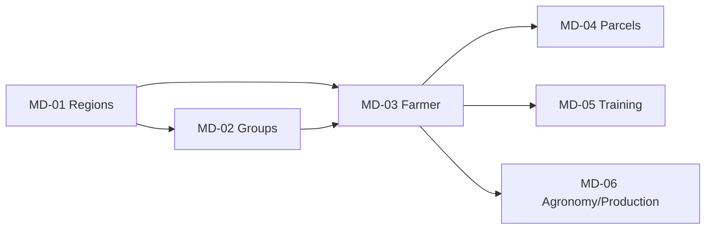

# Smallholder HUB — Progress

> Tracking progress development. Detail issue: [GitHub Issues](https://github.com/WRI-Indonesia/mis-smallholder-hub/issues)

---

<details open>
<summary><strong>1. 🗺️ Big Picture — Roadmap</strong> — untuk management / stakeholder</summary>

### Aturan Governance

- **Source of truth** untuk status delivery adalah tabel **Phase Status** di bawah.
- Ringkasan roadmap harus selalu diturunkan dari tabel status; tidak boleh ada status yang berdiri sendiri di luar tabel.
- Setiap issue aktif harus dipetakan ke phase dan horizon (Now / Next / Later).
- Status fase di tabel Phase Status bersifat **mengikat** — jika suatu fase bertuliskan ✅ Completed, maka seluruh komponennya sudah terimplementasi di codebase.

### Phase Encoding Taxonomy

Setiap phase menggunakan format `STREAM-NN`:

| Stream | Arti | Cakupan |
|--------|------|---------|
| **PLATFORM** | Platform Foundation | Init project, Schema DB, Auth, RBAC, Menu Infra |
| **MD** | Master Data | Regions, Groups, Farmer, Parcels, Training, Staff, Agronomy, HCV, BUSDEV, IMPACT, Workplan |
| **DASH** | Dashboard | Basic Dashboard, BMP, Interactive Map |
| **TOOLS** | Tools & Utility | Import, Export, GIS |
| **CMS** | Content Management | Pages, Media, Knowledge Base |
| **COMM** | Community & Engagement | Community, i18n |
| **OPS** | Operations & DevOps | Testing, CI/CD, Deployment |

Aturan penomoran:
- Nomor module dalam satu stream bersifat **fixed** — tidak berubah meski ada penyisipan di stream lain.
- Sub-module opsional menggunakan dot: `MD-03.1` = Farmer List, `MD-03.2` = Farmer Detail.
- Status fase adalah **sumber kebenaran tunggal**.

### Ringkasan Progress

| Metrik | Jumlah |
|--------|--------|
| ✅ **Completed** | 11 fase (PLATFORM-01–05, MD-01/02, DASH-01–03) |
| 🟡 **In Progress** | 1 fase (DASH-04 Dashboard BMP) |
| 🔲 **Now (Prioritas)** | 2 fase (MD-03 Farmer, MD-05 Training) |
| 🔲 **Next** | 5 fase (MD-04, MD-06, MD-07, MD-08, TOOLS-01) |
| 🔲 **Later** | 7 fase (MD-09–11, CMS-01, COMM-01/02, OPS-01/02) |

### Phase Status (Source of Truth)

| Phase | Deskripsi | Status | Horizon |
|-------|-----------|--------|---------|
| **PLATFORM-01** | Initialization & UI Statis | ✅ Completed | Done |
| **PLATFORM-02** | Database Schema & Migrations | ✅ Completed | Done |
| **PLATFORM-03** | Schema Hardening (Audit Trail, Sync) | ✅ Completed | Done |
| **PLATFORM-04** | Autentikasi & RBAC | ✅ Completed | Done |
| **PLATFORM-05** | Dynamic Menu Management | ✅ Completed | Done |
| **MD-01** | Regions (Province/District/Subdistrict/Village) | ✅ Completed | Done |
| **MD-02** | Farmer Groups (Kelompok Tani) | ✅ Completed | Done |
| **MD-03** | **Farmer (Individu)** | 🔲 **Belum Dimulai** | **Now** |
| **MD-04** | **Parcels (Lahan)** | 🔲 **Belum Dimulai** | **Next** |
| **MD-05** | **Training & Pelatihan** | 🔲 **Belum Dimulai** | **Now** |
| **MD-06** | **Agronomy / Data Produksi** | 🔲 **Belum Dimulai** | **Next** |
| MD-07 | Staff | 🔲 Planned | Next |
| MD-08 | HCV | 🔲 Planned | Next |
| MD-09 | BUSDEV | 🔲 Planned | Later |
| MD-10 | IMPACT | 🔲 Planned | Later |
| MD-11 | Workplan | 🔲 Planned | Later |
| **DASH-01** | Dashboard: Basic Data | ✅ Completed | Done |
| **DASH-02** | Dashboard: Server Actions | ✅ Completed | Done |
| **DASH-03** | Interactive Map | ✅ Completed | Done |
| **DASH-04** | Dashboard BMP | 🟡 In Progress | Now |
| **TOOLS-01** | Tools (Import/Export/GIS) | 🔲 Planned | Next |
| **CMS-01** | CMS & Content Management | 🔲 Planned | Later |
| **COMM-01** | Community | 🔲 Planned | Later |
| **COMM-02** | i18n | 🔲 Planned | Later |
| **OPS-01** | Testing | 🔲 Planned | Later |
| **OPS-02** | DevOps & Deployment | 🔲 Planned | Later |

### Delivery Horizon (Issue Lanes)

| Horizon | Fokus | Issues |
|---------|-------|--------|
| **Now** | Selesaikan DASH-04 (Dashboard BMP) + mulai **MD-03** (Farmer) + **MD-05** (Training) | [#48](https://github.com/WRI-Indonesia/mis-smallholder-hub/issues/48), [#49](https://github.com/WRI-Indonesia/mis-smallholder-hub/issues/49), [#50](https://github.com/WRI-Indonesia/mis-smallholder-hub/issues/50), [#51](https://github.com/WRI-Indonesia/mis-smallholder-hub/issues/51), #New-Farmer, #New-Training |
| **Next** | **MD-04** (Parcels) + **MD-06** (Agronomy/Produksi) + TOOLS-01 (Import) + MD-07 (Staff) + MD-08 (HCV) | [#52](https://github.com/WRI-Indonesia/mis-smallholder-hub/issues/52), [#53](https://github.com/WRI-Indonesia/mis-smallholder-hub/issues/53) |
| **Later** | Backlog non-kritis: MD-09–MD-11, CMS-01, COMM-01/02, OPS-01/02 | [#44](https://github.com/WRI-Indonesia/mis-smallholder-hub/issues/44) |

### Delivery Plan: Farmer, Training & Production (MD-03, MD-05, MD-06)

#### Dependensi Modul



#### Urutan Implementasi

| Step | Modul | Prasyarat | Estimasi |
|------|-------|-----------|----------|
| 1 | **MD-03 Farmer** (Schema + CRUD) | MD-01, MD-02 ✅ | — |
| 2 | **MD-05 Training** (Schema + CRUD + Participants) | MD-03 | — |
| 3 | **MD-06 Agronomy** (Schema + CRUD + Period/Reporting) | MD-03 | — |
| 4 | **MD-04 Parcels** (Schema + CRUD + Map) | MD-03 | — |

#### Definisi Per Modul

| Modul | Prisma Model Baru | Server Actions | Halaman |
|-------|-------------------|----------------|---------|
| **MD-03 Farmer** | `Farmer` (relasi ke FarmerGroup, Village) | CRUD + RBAC filter | List, Detail, Form |
| **MD-05 Training** | `Training`, `TrainingParticipant` (relasi ke Farmer) | CRUD + attendance | List, Detail, Form |
| **MD-06 Agronomy** | `Production` (relasi ke Farmer, period) | CRUD + batch import | List, Detail, Form, Chart |

</details>

<details>
<summary><strong>2. 🎯 Active Sprint — Issue Control</strong> — untuk tim developer</summary>

### Issue Workflow

Setiap GitHub Issue mengikuti alur berikut:


| Status | Label GitHub | Arti | Refleksi di Phase Status |
|--------|-------------|------|--------------------------|
| 🔲 **Todo** | `status:todo` | Belum dikerjakan, siap diambil | 🔲 Planned / Belum Dimulai |
| 🟡 **In Progress** | `status:in-progress` | Sedang dikerjakan | 🟡 In Progress |
| 🔍 **Review** | `status:review` | Selesai coding, butuh QA / approval | 🟡 In Progress (masuk hitungan issue aktif) |
| ✅ **Done** | `status:done` | Selesai, sudah di-merge ke branch aktif | ✅ Completed |

### Issue & Label Convention

**Format judul issue:**
```
[Phase-Code] Deskripsi singkat (B. Indonesia)
```

Contoh:
```
[MD-03] Prisma schema & migration untuk Farmer
[MD-05] Training CRUD server actions
[DASH-04] Perbaikan filter grafik BMP
```

**Wajib labels:**

| Label | Contoh Nilai | Kegunaan |
|-------|-------------|----------|
| `phase` | `phase:MD-03`, `phase:DASH-04` | Filter issue per fase |
| `status` | `status:todo`, `status:in-progress`, `status:review`, `status:done` | Workflow tracking |
| `type` | `type:feat`, `type:bug`, `type:debt` | Kategorisasi |

**Catatan:** Label `phase` dan `status` wajib ada di setiap issue. Label `type` opsional tapi dianjurkan.

### Active Sprint

| Issue | Phase | Workflow | Assignee | Target |
|-------|-------|----------|----------|--------|
| [#48](https://github.com/WRI-Indonesia/mis-smallholder-hub/issues/48) | DASH-04 | 🟡 In Progress | — | — |
| [#49](https://github.com/WRI-Indonesia/mis-smallholder-hub/issues/49) | DASH-04 | 🟡 In Progress | — | — |
| [#50](https://github.com/WRI-Indonesia/mis-smallholder-hub/issues/50) | DASH-04 | 🟡 In Progress | — | — |
| [#51](https://github.com/WRI-Indonesia/mis-smallholder-hub/issues/51) | DASH-04 | 🟡 In Progress | — | — |
| — | MD-03 | 🔲 Todo | — | — |
| — | MD-05 | 🔲 Todo | — | — |
| — | MD-06 | 🔲 Todo | — | — |

> **Catatan**: Issue baru untuk MD-03, MD-05, MD-06 akan dibuat setelah desain schema disepakati. Kolom `Assignee` dan `Target` diisi saat issue masuk ke **In Progress**.

### Hubungan Issue ↔ Phase Status

```
Phase Status (progress.md)         GitHub Issue Board
─────────────────────────          ─────────────────
🔲 Planned / Belum Dimulai  ───→    🔲 Todo (beberapa issue)
🟡 In Progress              ───→    🟡 In Progress + 🔍 Review
✅ Completed                ───→    ✅ Done (semua issue fase ditutup)
```

- Satu fase bisa memiliki **banyak issue** (misal: MD-03 butuh issue schema, issue CRUD, issue UI)
- Fase dianggap **✅ Completed** hanya jika **semua issue** fase tersebut sudah **✅ Done**
- Fase sedang **🟡 In Progress** jika minimal satu issue fase tersebut sedang **🟡 In Progress** atau **🔍 Review**

</details>

<details>
<summary><strong>3. 🧹 Technical Debt</strong> — untuk tech lead</summary>

### Debt Register

| Debt Item | Severity | Impact Area | Owner | Deadline | Validation Method | Linked Issue | Status |
|-----------|----------|-------------|-------|----------|-------------------|--------------|--------|
| S3 orphan cleanup (file PDF lama tidak terhapus saat delete/ganti evidence) | High | Data consistency, storage cost | Backend/Storage Lead | 2026-06-20 | Uji delete/replace evidence lalu verifikasi object lama terhapus dan tidak muncul di listing cleanup | TD-001 | 🔲 Planned |
| Dark mode hardcoded `text-white` di beberapa halaman | Medium | UI consistency, accessibility | Frontend Lead | 2026-07-04 | Visual QA dark/light mode pada halaman terdampak tanpa text contrast regression | TD-002 | 🔲 Planned |
| `.DS_Store` tracked di git | Low | Repository hygiene | Repository Maintainer | 2026-06-06 | `git --no-pager ls-files \| grep '\\.DS_Store$'` harus kosong | TD-003 | ✅ Closed |
| Language toggle non-functional | Low | i18n readiness | i18n Lead | 2026-08-14 | Toggle bahasa harus mengubah locale dan persist state antar navigasi | TD-004 | 🔲 Planned |
| Spacing guideline belum formal (`globals.css`) | Low | Design system consistency | Design System Lead | 2026-07-18 | Publish guideline spacing + mapping token agar implementasi UI konsisten | TD-005 | 🔲 Planned |

### Phase B — Issue-Level Execution Plan

| Issue | Scope Eksekusi | Assigned Owner | Deadline | Deliverables | Definition of Done |
|-------|----------------|----------------|----------|--------------|--------------------|
| TD-001 | Perbaikan lifecycle file evidence agar orphan object tidak tertinggal saat replace/delete | Backend/Storage Lead | 2026-06-20 | Patch cleanup logic + safeguard test case replace/delete + catatan risiko rollback | Semua skenario replace/delete evidence lulus test, object lama tidak tersisa di storage/listing, `npm test` dan `npm run build` lulus |
| TD-002 | Standardisasi text color dark mode untuk komponen/halaman terdampak hardcoded `text-white` | Frontend Lead | 2026-07-04 | Daftar halaman terdampak + patch tokenized text color + visual regression checklist | Tidak ada hardcoded `text-white` di area terdampak, kontras tetap terbaca di dark mode, verifikasi visual tercatat |
| TD-003 | Kebersihan repository terkait `.DS_Store` | Repository Maintainer | 2026-06-06 | Verifikasi tracking git + guard `.gitignore` bila diperlukan | Query tracked file `.DS_Store` kosong dan status ditutup |
| TD-004 | Aktivasi language toggle agar locale benar-benar berubah dan tersimpan antar navigasi | i18n Lead | 2026-08-14 | Implementasi toggle locale + persistence state + smoke test navigasi | Toggle memengaruhi locale aktif, state bertahan setelah refresh/navigasi, tidak merusak flow existing |
| TD-005 | Formalisasi spacing guideline berbasis token pada `globals.css` dan contoh pemakaian | Design System Lead | 2026-07-18 | Dokumen guideline spacing + mapping token + referensi implementasi di komponen shared | Guideline dipublikasikan dan dipakai sebagai referensi resmi untuk task UI berikutnya |

### Phase B Sequencing

- **Week 1** (hingga 2026-06-20): selesaikan **TD-001** (high severity) dan tutup administratif **TD-003**.
- **Week 2–4** (hingga 2026-07-18): eksekusi **TD-002** dan **TD-005** paralel dengan prioritas konsistensi UI.
- **Milestone i18n** (hingga 2026-08-14): eksekusi **TD-004** agar sinkron dengan fase pengembangan i18n.

</details>

<details>
<summary><strong>4. 📜 Log — History</strong> — untuk semua</summary>

### Decision Log

| Tanggal | Keputusan |
|---------|-----------|
| 2026-06-06 | Model roadmap dikonsolidasikan: tabel Phase Status menjadi sumber kebenaran tunggal untuk mencegah kontradiksi status. |
| 2026-06-06 | Eksekusi diprioritaskan ke lane **Now** (Dashboard BMP), sementara issue import diposisikan sebagai **Next**. |
| 2026-06-06 | Technical debt dipindah ke debt register operasional dengan owner, due window, dan metode validasi. |
| **2026-06-06** | **Phase encoding diubah ke sistem `STREAM-NN` (PLATFORM, MD, DASH, TOOLS, CMS, COMM, OPS) untuk skalabilitas. Lihat tabel taxonomy di Section 1.** |
| **2026-06-06** | **Koreksi status: MD-03 (Farmer), MD-04 (Parcels), MD-05 (Training), MD-06 (Agronomy/Produksi), MD-07 (Staff) diubah dari ✅ Completed → 🔲 Belum Dimulai, karena belum ada implementasi di codebase. Fase 4 lama dipecah menjadi MD-01 s.d. MD-11.** |
| **2026-06-06** | **Restrukturisasi `progress.md` menjadi 4 section: Big Picture, Active Sprint, Technical Debt, Log — untuk membedakan audiens (management, developer, tech lead, semua).** |

### Changelog

#### Juni 2026

| Tanggal | Perubahan |
|---------|-----------|
| **06-06** | **Restrukturisasi `progress.md` ke format 4 section + encoding phase `STREAM-NN` + koreksi status fase (lihat Decision Log)** |
| 06-06 | Konsolidasi `docs/progress.md`: canonical roadmap model (source-of-truth status + delivery horizon), decision log, dan technical debt register operasional |
| 06-06 | Eksekusi Fase B: technical debt dikonversi ke issue-level execution plan (TD-001 s.d. TD-005) dengan assigned owner, deadline, deliverables, definition of done, dan sequencing |

#### Mei 2026

| Tanggal | Perubahan |
|---------|-----------|
| 05-25 | #61 selesai — User Menu Access Override: Server actions, matrix override modal, rbac helper caching & soft delete, integration, 111/111 tests |
| 05-22 | #57 follow-up — Kolom ringkasan akses data di tabel User Management; bug fix RBAC KT-only (farmerGroup-only assignment sekarang filter by `id` bukan `districtId`); live refresh tabel saat toggle di modal; 105/105 tests |
| 05-22 | #57 selesai — User Data Access Assignment: 7 server actions (assign/remove Province/District/KT), UserDataAccessModal (Tabs UI, visual hierarchy badges, live toggle, search), integrasi ke User Management, 104/104 tests |
| 05-22 | #59 selesai — Standardisasi visibilitas aksi tabel (View, Edit, Delete) dan tombol Tambah berbasis Role & Permission, serta dokumentasi di `docs/rule.md` |
| 05-22 | #60 selesai — Abstraksi aksi tabel dengan komponen TableActions, implementasi TableSkeleton, loading.tsx untuk modul User & Kelompok Tani, dan pengamanan server actions dengan helper hasPermission |
| 05-22 | #58 selesai — Region Management: tree view 4-level hierarchy, CRUD Province/District/Subdistrict/Village, search, status filter, cascade muting, loading skeleton, backend hasPermission hardening |
| 05-22 | #56 selesai — Login (NextAuth), User Management CRUD, Menu Management CRUD, Role & Permission matrix, Kelompok Tani CRUD (list+filter+pagination+detail+RBAC actions), Profile page, 41/41 tests |
| 05-22 | #55 selesai — Schema reset: 6 file baru, RBAC system, soft delete + audit trail, seed + CSV, migration fresh |
| 05-13 | #48 — Update UI/UX Grafik BMP: filter Kategori, grouped bar, warna hijau vibrant, legenda override |
| 05-13 | #48 — Dashboard BMP scaffold: 5 score cards, combo chart, monev cards, filter distrik+KT |
| 05-12 | Issues #48–#53 dibuat (scaffold only) |
| 05-11 | #34 selesai — Dashboard full DB-driven: server actions, map controls, cache tables, 174/174 tests |
| 05-08 | #37 selesai — Interactive Map: filter KT, collapsible panel, icon markers, 100/100 tests |
| 05-07 | #35 selesai — Dynamic Menu Management: Prisma, CRUD, sidebar, drag-and-drop, 95/95 tests |
| 05-06 | #31 selesai — Sync production DB: 6 migrations, seed data |
| 05-06 | #29 selesai — Audit trail 22 tabel, 81/81 tests |
| 05-06 | #22 selesai — Final QA Fase 4: hapus debug, lokalisasi, cleanup placeholders |
| 05-04 | Restrukturisasi dokumen, skip Fase 3, mulai Fase 4 |

> **Catatan koreksi**: Beberapa entri changelog Mei 2026 di bawah ini mencantumkan status "selesai" untuk modul yang **tidak ditemukan implementasinya di codebase** (tidak ada model Prisma, server actions, atau halaman). Status tersebut telah dikoreksi di tabel Phase Status (Section 1) menjadi **🔲 Belum Dimulai** dan akan dijadwalkan ulang.

~~| 05-09 | #45 selesai — Training PDF Management: S3 upload, presigned URL, CLI tools, 174/174 tests |~~
~~| 05-09 | #43 selesai — Staff Activity: daily log, approval, calendar, export Excel, 154/154 tests |~~
~~| 05-09 | #41 selesai — Staff WRI: CRUD, job desk, multi-select distrik/KT, 130/130 tests |~~
~~| 05-08 | #39 selesai — Training module lengkap: list, form, detail, S3 upload, 116/116 tests |~~
~~| 05-05 | #21 selesai — Parcels CRUD + MapLibre view |~~

#### April 2026

| Tanggal | Perubahan |
|---------|-----------|
| 04-14 | PLATFORM-02 selesai — Prisma 7 modular schema, 3 migrasi PostgreSQL + PostGIS |

#### Maret 2026

| Tanggal | Perubahan |
|---------|-----------|
| 03-30 | Code review & sync status |
| 03-28 | Modernisasi Dashboard, perbaikan Home |
| 03-18 | Inisiasi proyek — Next.js, Shadcn, static data |

</details>