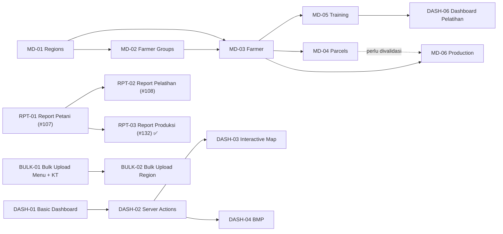

# Proyek — Panduan Kontribusi & Update Dokumen

> Bagian dari dokumentasi **Proyek**. Indeks: [../README.md](../README.md) · Terkait: [brief.md](./brief.md) · [roadmap.md](./roadmap.md) · [sprint.md](./sprint.md) · [tech-debt.md](./tech-debt.md) · [changelog.md](./changelog.md)

> Panduan proses untuk developer: cara update dokumen status, urutan implementasi, dan checklist kepatuhan `rule.md`.
> Konten stabil (jarang berubah) — dipisah dari `progress.md` (restrukturisasi 2026-07-12) agar file status tetap ramping.
> Status delivery aktual ada di [`roadmap.md`](./roadmap.md); standar teknis di [`code-standards.md`](../standards/code-standards.md).

---

## 1. Junior Developer Update Guide

Section ini dibuat supaya junior developer bisa update dokumen dengan aman dan konsisten.

### Golden Rule

Jika tidak ada bukti di code, jangan naikkan status fase.

Contoh bukti yang valid:

- Prisma model / migration
- Route file di `src/app`
- Server action di `src/server/actions`
- Validation schema di `src/validations`
- UI component/page yang bukan placeholder
- Test yang relevan
- Script/workflow jika phase memang tooling/devops

### 5-Minute Update Checklist

| Step | Bagian yang Diupdate | Pertanyaan Cek                                                         |
| ---- | --------------------- | -------------------------------------------------------------------------- |
| 1    | Active Issues        | Apakah status issue, assignee, target, dan next action sudah benar?    |
| 2    | Phase Status         | Apakah status fase berubah berdasarkan file/code nyata?                |
| 3    | Code Audit Evidence  | Apakah ada route/schema/action baru atau hilang?                       |
| 4    | Progress Snapshot    | Apakah angka Done/Partial/Not Started/Planned/Blocked masih konsisten? |
| 5    | Management Brief     | Apakah risiko/decision/next two weeks masih relevan?                   |
| 6    | Changelog            | Apakah perubahan penting sudah dicatat dengan tanggal?                 |

### Dependency Map



### Recommended Implementation Order

| Step | Phase / Bug | Scope Minimal                                          | Prasyarat                        | Catatan Tech Lead                                        |
| ---- | ----------- | ---------------------------------------------------------- | ----------------------------------- | -------------------------------------------------------------- |
| 1    | BUG-001     | Fix `/admin/master-data` redirect                      | Existing routes                  | Pilih redirect ke groups atau implement farmer          |
| 2    | DASH-01     | #62 menu + #63 summary cards + district filter         | Existing User/Region/FarmerGroup | Jangan langsung BMP sebelum dashboard dasar ada          |
| 3    | RPT-01      | #64 menu + placeholder report pages                    | Menu system existing             | Bisa paralel dengan DASH-01                              |
| 4    | BULK-01     | #68 menu + placeholder bulk upload pages               | Menu system existing             | Bisa paralel dengan DASH-01 dan RPT-01                   |
| 5    | RPT-01      | #65 Report User — tabel + export Excel                 | #64 selesai                      | Install exceljs, buat reusable export pattern            |
| 6    | RPT-02/03   | #66 Report Region + #67 Report KT                      | #64 #65 selesai                  | Reuse export pattern dari #65                            |
| 7    | BULK-01     | #69 Bulk Upload KT — CSV validasi preview insert       | #68 selesai                      | Buat reusable CSV upload components                      |
| 8    | BULK-02     | #70 Bulk Upload Region — hierarchy validasi             | #68 #69 selesai                  | Reuse CSV components, tambah hierarchy validation        |
| 9    | MD-03       | Farmer schema, CRUD, list, detail, form, RBAC          | MD-01, MD-02                     | Mulai dari field minimal                                 |
| 10   | MD-05       | Training schema, CRUD, participants, attendance        | MD-03                            | Jangan mulai sebelum Farmer jelas                        |
| 11   | MD-04       | Parcel schema, CRUD, map context                       | MD-03                            | Penting untuk Production/GIS                             |
| 12   | MD-06       | Production schema, period, chart/import awal           | MD-03 + kemungkinan MD-04        | Validasi per Farmer vs per Parcel                        |

### MD-03 Farmer — Suggested Issue Breakdown

| Issue                               | Scope                                                        | Definition of Done                                        |
| ------------------------------------ | ---------------------------------------------------------------- | --------------------------------------------------------------- |
| `[MD-03] Farmer schema & migration` | Prisma model, relation ke FarmerGroup dan Village, migration | Migration berhasil dan relasi bisa di-query               |
| `[MD-03] Farmer server actions`     | Create, read, update, soft delete, validation, RBAC filter   | Action aman dari akses tidak sah dan error handling jelas |
| `[MD-03] Farmer list page`          | Tabel, search, filter, pagination, action buttons            | Data tampil benar sesuai permission                       |
| `[MD-03] Farmer form page`          | Create/edit form, field validation, submit state             | Form menyimpan data dan memberi feedback jelas            |
| `[MD-03] Farmer detail page`        | Ringkasan profil, group, wilayah, metadata                   | Detail bisa dibuka dari list dan tidak bocor akses        |
| `[MD-03] Farmer tests / QA`         | Unit/integration test prioritas dan smoke test manual        | Test relevan lulus dan checklist QA tercatat               |

### Acceptance Criteria Umum

- Data mengikuti RBAC dan data access yang sudah ada.
- Semua form memiliki validation error yang jelas.
- List page memiliki search/filter/pagination jika datanya berpotensi besar.
- Server action tidak hanya mengandalkan guard UI; permission tetap dicek di backend.
- Placeholder `Coming soon` tidak dihitung sebagai selesai.
- Setelah phase selesai, update **Phase Status**, **Active Issues**, **Progress Snapshot**, dan **Changelog**.

### Minimum Validation

| Area           | Validasi Minimal                                               |
| -------------- | -------------------------------------------------------------------- |
| Schema         | Migration berjalan dan tidak merusak seed/data existing        |
| Server actions | Happy path, invalid input, unauthorized access                 |
| UI             | Empty state, loading state, error state, dark/light mode dasar |
| RBAC           | Role tanpa permission tidak bisa melihat/menulis data          |
| Test           | `npm test` lulus                                               |
| Build          | `npm run build` lulus sebelum fase ditandai Done               |

### Update Templates

Gunakan template berikut saat menambah issue baru.

```text
Issue:
Phase:
Status:
Assignee:
Target:
Evidence:
Next Action:
```

Gunakan template berikut saat menambah changelog. Baris ditambahkan di **paling atas tabel** dalam section `<details>` bulan berjalan (Decision Log pakai `YYYY-MM-DD`, Changelog pakai `MM-DD`); saat ganti bulan, buat section `<details><summary><strong>Bulan YYYY</strong></summary>` baru di atas.

```text
| YYYY-MM-DD | [Phase/Issue] Ringkasan perubahan singkat berdasarkan code |
```


---

## 2. Implementation Guidelines (Rule.md Compliance)

#### Checklist untuk Setiap Implementasi Fase Baru

Gunakan checklist ini ketika membuka issue/PR untuk setiap fase/feature baru. Pastikan semua items terchecklist sebelum merge.

**Schema & Database**

- [ ] **Prisma Model**: Buat model dengan field audit (`created_at`, `created_by`, `modified_at`, `modified_by`) dan soft-delete (`isActive`)
- [ ] **Migration**: Generate migration dengan `npx prisma migrate dev --name <feature>`
- [ ] **Seeder**: Tambah seed CSV dan/atau TypeScript seeder di `prisma/seeds/` (pakai `upsert` agar idempotent)
- [ ] **Indexes**: Tambah `@@index` untuk foreign keys dan filter fields (`isActive`, `districtId`, dll)

**Validation & Types**

- [ ] **Zod Schema**: Buat schema di `src/validations/<feature>.schema.ts`
- [ ] **Types**: Define TypeScript types di `src/types/` jika diperlukan
- [ ] **Error Handling**: Implement zod error messages yang user-friendly

**Server Actions**

- [ ] **Access Control**: Implementasikan `getAccessContext()` dan gunakan `AccessContext` discriminated union — juga pada read **by-id** dan validasi target mutasi (pelajaran audit 2026-07-10)
- [ ] **Permission Validation**: Panggil `hasPermission(menuCode, permission)` di **setiap** action, termasuk helper "for select" (pelajaran audit 2026-07-10)
- [ ] **Data Filtering**: Filter by `isActive: true` + RBAC context (BY_DISTRICT / BY_FARMER_GROUP)
- [ ] **Soft Delete**: Gunakan `update { isActive: false }` bukan `delete()`

**UI Components**

- [ ] **Server Component Default**: Page root adalah server component; client hanya saat needed
- [ ] **Loading State**: Implement `loading.tsx` dengan `<TableSkeleton>` atau spinner
- [ ] **Table Actions**: Gunakan `<TableActions>` component; tampilkan based on `permissions`
- [ ] **Form Modal**: Gunakan Shadcn `Dialog` + form manual (FormData/useState) + Zod di server action

**Testing**

- [ ] **Unit Tests**: Minimal 10 test per feature (happy path, validation, RBAC, error cases)
- [ ] **RBAC Tests**: Test access control (SUPERADMIN, BY_DISTRICT, BY_FARMER_GROUP, forbidden)
- [ ] **Integration Test**: Test flow: create → list → detail → edit → soft-delete
- [ ] **Coverage**: Aim for ≥80% coverage

**Documentation**

- [ ] **Code Comments**: Minimal; hanya untuk complex logic
- [ ] **Naming**: File kebab-case; variables English; functions self-documenting
- [ ] **Bantuan**: cek materi di `src/content/help/` — perbarui tutorial/konsep yang jadi keliru karena perubahan ini, dan tambahkan tutorial baru bila alurnya memang baru. Label tombol/kolom dikutip persis dari `docs/product/pages/`
- [ ] **Progress Update**: Update `docs/project/roadmap.md` Phase Status with evidence
- [ ] **Changelog**: Add entry dengan timestamp, issue number, dan deliverables

**Quality Gates (Before Merge)**

1. ✅ **Tests**: `npm test` — all pass, no skipped tests
2. ✅ **Build**: `npm run build` — no errors or warnings
3. ✅ **Lint**: `npm run lint` — **exit 0**, 0 error (BUG-006 ✅ selesai 2026-07-12, #126; wajib dijalankan lokal sebelum commit — lihat Pre-Commit Gate di [`workflow.md`](../standards/workflow.md))
4. ✅ **CI di PR hijau**: `gitleaks` & `semgrep` (lint/build/test **tidak** dijalankan CI — pastikan lokal)
4. ✅ **Bantuan tersinkron**: tidak ada materi Bantuan yang jadi keliru akibat perubahan ini (lihat Docs Compliance Check §5 di [`workflow.md`](../standards/workflow.md))
4. ✅ **Code Review**: Implementation matches rule.md requirements
5. ✅ **Rule Compliance**: Semua kategori pada tabel "Code Compliance Audit" ([`roadmap.md`](./roadmap.md)) berstatus PASS

#### Common Pitfalls & Fixes

| Pitfall | Why Bad | Fix |
|---------|---------|-----|
| Filter only by `districtId` in BY_FARMER_GROUP mode | User KT-only returns empty results | Implement discriminated union pattern; test all 3 modes |
| Guard `hasPermission` hanya di page.tsx | Server action = endpoint HTTP; bisa dipanggil langsung (UI-bypass) | Guard **di dalam action**, bukan hanya page (temuan audit: role-permission/menu/upload) |
| Read/mutasi **by-id** tanpa scope check | User ter-scope bisa akses data lintas wilayah via id | Terapkan `getAccessContext` juga pada `getXById`/update/toggle (pola `land-parcel.ts:68`) |
| Hard delete with `delete()` | Breaks audit trail; data loss risk | Always use soft delete: `update { isActive: false }` |
| Barrel index imports (`from @/components`) | Circular deps; build issues | Import directly dari sub-module; pengecualian resmi hanya `@/components/shared` |
| Missing `hasPermission()` check | Bypasses UI protection; security risk | **Every** action (read & mutasi, termasuk helper select) must call it |
| Forgot `loading.tsx` | Layout shift; poor UX | Use `<TableSkeleton>` for tables, `<Skeleton>` for cards |
| Commented-out code | Technical debt; confusing | Delete dead code; use git history if needed later |
| Speculative features | Over-engineer; maintenance burden | Implement only what's in the issue scope |
| Kelas Tailwind `peer-*` dipasang di elemen **bersarang** | `peer-*` menghasilkan selektor **sibling** (`:where(.peer):checked ~ *`), jadi hanya berlaku pada elemen yang bersibling **setelah** checkbox. Di elemen bersarang aturannya tak pernah cocok — toggle tampak benar di kode tetapi **diam di layar** (2× terjadi di HELP-02) | Pasang kelas `peer-*` di **pembungkus yang bersibling** dengan checkbox, lalu sasar ke dalam lewat `[&_[data-x]]:`/`[&>[data-x]]:`. Verifikasi dengan membaca CSS hasil build (`grep` di `.next/static/css/`), jangan berhenti di "build sukses" |
| **Pembilang & penyebut beda filter** pada metrik cakupan | Rasio bisa tembus >100%; indikator "tercapai" jadi salah dan aksi lanjutan (drill-down) terkunci — cacat DASH-06 2026-07-21 | Terapkan filter yang **sama persis** di kedua sisi (`isActive` **dan** keanggotaan/scope). Kalau angka ringkas dan daftar rinciannya dihitung di dua tempat (client vs SQL), pastikan predikatnya identik — beda sedikit = angka dan daftar saling bertentangan di depan pengguna |
| Agregat dijumlah hanya atas kategori yang **sudah ada datanya** | Angka jadi non-monoton: menambah data justru menaikkan "kekurangan", terbaca sebagai kemunduran | Jumlahkan atas seluruh kategori bertarget/kanonis, bukan atas hasil `filter(ada data)` |
