# Smallholder HUB — UI/UX Flow

> Dokumentasi alur navigasi dan user journey berdasarkan role.
> **Last updated**: 2026-06-12 (Post-Audit)

---

## Quick Reference

| Category | Status | Details |
|----------|--------|---------|
| **Test Status** | ✅ **13 files / 161 tests passing** | Full coverage: auth, RBAC, menu, user, region, farmer, training, bulk upload |
| **Completed Modules** | ✅ 13 phases done | Platform (1-7), MD (1-3, 5), BULK (1, 3) |
| **Server Actions** | ✅ 12 files / 1600 LOC | user, menu, region, farmer-group, farmer, training, bulk-upload, upload, etc. |
| **Prisma Models** | ✅ 8 schemas | User, Menu, RBAC (5 models), Geography (4), FarmerGroup, Farmer, Training (3) |
| **Priority P0** | 🔴 **DASH-01 scope** | Dashboard scope agreement needed in 48h (BLOCKING) |
| **Priority P1** | 🔲 RPT-01 | Report module foundation |

---

<details open>
<summary><strong>Status Legend & Overview</strong></summary>

## Status Legend

| Symbol | Status | Keterangan |
|--------|--------|-----------|
| ✅ | Done | Implementasi selesai dan terverifikasi |
| 🟠 | Partial | Sebagian implementasi ada |
| 🔲 | Planned | Masuk roadmap tetapi belum dimulai |
| 🔴 | Blocked | Terhambat dependency atau keputusan |

## System Architecture

```
┌─────────────────────────────────────────────────────────────┐
│                     Public Routes                             │
│  ✅ Home  │  🔲 Community  │  🔲 Knowledge  │  ✅ Login      │
└─────────────────────────────────────────────────────────────┘
                              │
                    ┌─────────┴─────────┐
                    │   Authentication   │
                    └─────────┬─────────┘
                              │
        ┌─────────────────────┼─────────────────────┐
        │                     │                     │
    ┌───▼───┐          ┌──────▼──────┐      ┌──────▼──────┐
    │ SUPER │          │   ADMIN     │      │  OPERATOR   │
    │ ADMIN │          │  (District) │      │  (KT-level) │
    └───┬───┘          └──────┬──────┘      └──────┬──────┘
        │                     │                     │
        ├─ Dashboard (All)    ├─ Dashboard (Filt)  ├─ Dashboard (View)
        ├─ Master Data (All)  ├─ Master Data (Filt)├─ Master Data (CRUD)
        ├─ Settings (Full)    ├─ Settings (Limited)│
        ├─ Report (All)       ├─ Report (Filtered) ├─ Report (View)
        ├─ Bulk Upload (All)  ├─ Bulk Upload (Scope)
        └─ Tools (All)        │                     │
                              │              ┌──────▼──────┐
                              │              │ MANAGEMENT  │
                              │              │ (Read-only) │
                              │              └──────┬──────┘
                              │                     │
                              │              ├─ Dashboard (View All)
                              │              └─ Report (View All)
                              │
```

</details>

---

<details>
<summary><strong>Navigation Structure & Menu Hierarchy</strong></summary>

## Admin Sidebar Menu (Compact View)

```
📊 Dashboard (🔲 DASH-01)
   ├── 🔲 Basic Dashboard — Summary cards + district filter
   ├── 🔲 Interactive Map — KT markers + location
   └── 🔲 Dashboard BMP — Best Management Practice metrics

📁 Master Data
   ├── ✅ Regions (MD-01) — Province/District/Subdistrict/Village tree
   ├── ✅ Kelompok Tani (MD-02) — List/detail/CRUD
   ├── ✅ Petani (MD-03) — List/detail/CRUD + joinedYear
   ├── 🔲 Lahan / Parcels (MD-04) — Map + polygon
   ├── ✅ Pelatihan / Training (MD-05) — Activities + participants + evidence
   ├── 🔲 Produksi / Production (MD-06) — Period + chart
   ├── 🔲 Staff (MD-07)
   ├── 🔲 HCV (MD-08)
   ├── 🔲 BUSDEV (MD-09)
   ├── 🔲 IMPACT (MD-10)
   └── 🔲 Workplan (MD-11)

📈 Report (🔲 RPT-01)
   ├── 🔲 Report User — Table + Excel export
   ├── 🔲 Report Region — Hierarchy + export
   └── 🔲 Report Kelompok Tani — Cascade filter + export

📤 Bulk Upload
   ├── ✅ Bulk Upload Petani (BULK-03) — Excel mapping + validation + preview
   ├── 🔲 Bulk Upload Kelompok Tani (BULK-01) — CSV + validation
   └── 🔲 Bulk Upload Region (BULK-02) — Hierarchy validation

⚙️ Settings
   ├── ✅ User Management (PLATFORM-04) — CRUD + data access + menu override
   ├── ✅ Role & Permission (PLATFORM-04) — Matrix C/V/E/D
   ├── ✅ Menu Management (PLATFORM-05/07) — Dynamic sidebar (3-level support)
   └── ✅ Region Settings (MD-01) — Tree hierarchy

🔧 Tools (🟠 TOOLS-01)
   ├── ✅ Export CSV — Static data export
   ├── 🟠 S3/PDF Manager — CLI tools (partial)
   └── 🔲 GIS Utilities — Planned

👤 Profile
   └── ✅ Change Password
```

</details>

---

<details>
<summary><strong>RBAC & Data Access Pattern</strong></summary>

## Access Context Resolution

```
User Request
    │
    ▼
┌────────────────────────┐
│ Check Role             │
└───────┬────────────────┘
        │
        ├─ SUPERADMIN → Mode: ALL (✅ Full Access, no filters)
        │
        ├─ No Assignment → Mode: ALL (✅ Unrestricted access)
        │
        ├─ UserProvince → Mode: BY_DISTRICT (🔍 Expand to all districts in province)
        │
        ├─ UserDistrict → Mode: BY_DISTRICT (🔍 Filter by assigned districts)
        │
        └─ UserFarmerGroup (only) → Mode: BY_FARMER_GROUP (🔍 Filter by specific groups)
            │
            ▼
    ┌──────────────────────┐
    │  Permission Check     │
    │  - Menu Access?       │
    │  - Required Perm?     │
    │  - Override?          │
    └──────┬───────────────┘
           │
           ▼
    ┌──────────────────────┐
    │  Execute Query        │
    │  + isActive filter    │
    │  + RBAC data filter   │
    │  + Audit trail        │
    └──────────────────────┘
```

### Data Access Hierarchy Examples

| User | Role | UserProvince | UserDistrict | UserFarmerGroup | Result Access |
|------|------|--------------|--------------|-----------------|---------------|
| Ahmad | Project Leader | Riau | — | — | Semua district di Riau → semua KT |
| Erma | District Coord | — | Kampar | — | Semua KT di Kampar |
| Anissa | Facilitator | — | Kampar | KBM, Kopsa | Hanya KBM & Kopsa |
| Super Admin | SUPERADMIN | — | — | — | Semua (skip filter) |

### Permission Resolution Priority

1. **SUPERADMIN** → Grant all, skip all filters
2. **UserPermissionOverride** (Granted) → Grant
3. **UserPermissionOverride** (Revoked) → Forbid
4. **RolePermission** (default) → Check C/V/E/D
5. **No Permission** → Hide menu / Forbidden

</details>

---

<details>
<summary><strong>Master Data CRUD Flow (Standard Pattern)</strong></summary>

## Farmer CRUD Example (Applies to All Master Data)

```
User Access Module
    │
    ▼
┌─────────────────────────────────────────────────────────────────────┐
│ List Page                                                            │
│  - Search + Filter (KT, Status, District)                           │
│  - DataTable (Pagination, Sort, Column Visibility)                  │
│  - Actions: View | Edit | Delete (based on permissions)             │
│  - Button: + Tambah (if has CREATE permission)                      │
└──────────┬──────────────────────────────────────────────────────────┘
           │
           ├─ View → Detail Page (Read-only)
           │
           ├─ Edit → Modal Form
           │   │
           │   ├─ Zod Validation (client-side)
           │   ├─ Server Action (backend permission check)
           │   ├─ Execute Query (with RBAC filter)
           │   ├─ Add Audit Trail (modified_by, modified_at)
           │   └─ Success Toast + Refresh
           │
           ├─ Delete → Soft Delete Modal
           │   │
           │   ├─ Confirmation Dialog
           │   ├─ Update isActive = false
           │   ├─ Audit Trail
           │   └─ Refresh List
           │
           └─ Create → Modal Form
               │
               ├─ Zod Validation
               ├─ Server Action (hasPermission check)
               ├─ Insert with isActive = true
               ├─ Add Audit Trail (created_by, created_at)
               └─ Success Toast + Redirect/Refresh
```

### Key Patterns

- **Client-side validation**: Zod schemas in `src/validations/`
- **Backend permission validation**: `hasPermission(menuCode, permission)` in every action
- **RBAC filtering**: `AccessContext` discriminated union (ALL | BY_DISTRICT | BY_FARMER_GROUP)
- **Soft delete**: Update `isActive = false`, never hard delete
- **Audit trail**: Auto-set `created_by`, `modified_by`, `created_at`, `modified_at`

</details>

---

<details>
<summary><strong>Bulk Upload Flow (Farmer Pattern)</strong></summary>

## Bulk Upload Farmer (✅ Implemented)

```
User Access Bulk Upload
    │
    ▼
┌───────────────────────────────────────────────────────────────────┐
│ Step 1: Select Context                                            │
│  - Choose Farmer Group (Searchable Combobox)                     │
│  - File input disabled until KT selected                          │
└───────────┬───────────────────────────────────────────────────────┘
            │
            ▼
┌───────────────────────────────────────────────────────────────────┐
│ Step 2: Upload Excel File                                         │
│  - Upload .xlsx file                                              │
│  - Parse columns automatically                                    │
└───────────┬───────────────────────────────────────────────────────┘
            │
            ▼
┌───────────────────────────────────────────────────────────────────┐
│ Step 3: Dynamic Column Mapping                                    │
│  - Auto-match columns (fuzzy match by name)                       │
│  - Manual override via dropdown                                   │
│  - Show preview of mapped fields                                  │
└───────────┬───────────────────────────────────────────────────────┘
            │
            ▼
┌───────────────────────────────────────────────────────────────────┐
│ Step 4: Smart Validation                                          │
│  - Normalize gender (L/P → M/F)                                   │
│  - Clean NIK format (16 digits only)                              │
│  - Parse dates (Excel serial / dd/mm/yyyy / yyyy-mm-dd)          │
│  - Validate joinedYear (1900-2100)                                │
│  - Check uniqueness (file-level + DB-level)                       │
└───────────┬───────────────────────────────────────────────────────┘
            │
            ▼
┌───────────────────────────────────────────────────────────────────┐
│ Step 5: Preview & Filter                                          │
│  - Show all rows with status (Valid | Error)                      │
│  - Filter: All | Valid Only | Error Only                          │
│  - Summary: X valid, Y errors                                     │
│  - Action buttons:                                                │
│    • Download Full (all rows + status column)                     │
│    • Download Errors Only (invalid rows + error messages)         │
│    • Save Valid Data                                              │
└───────────┬───────────────────────────────────────────────────────┘
            │
            ├─ Download Full → Excel export (all rows + "Keterangan")
            │
            ├─ Download Errors Only → Excel export (errors + messages)
            │
            └─ Save Valid Data
                │
                ├─ Confirmation Dialog
                ├─ Bulk Insert (Transaction-based)
                ├─ Success Toast (X records saved)
                └─ Redirect to Farmer List
```

### Validation Tiers

1. **File-level**: Check duplicates within uploaded file
2. **DB-level**: Check existing records in database
3. **Format validation**: Zod schemas + normalization logic

</details>

---

<details>
<summary><strong>Role-Specific Access Summary</strong></summary>

## SUPERADMIN

- **Dashboard**: ✅ Full access (all data, no filters)
- **Master Data**: ✅ Full CRUD, all regions/groups/farmers
- **Settings**: ✅ User/Role/Menu/Region management
- **Report**: ✅ All reports, all data
- **Bulk Upload**: ✅ All modules
- **Tools**: ✅ Export, S3/PDF, GIS

## ADMIN (District/Province Level)

- **Dashboard**: 🔲 Filtered by assigned district/province
- **Master Data**: ✅ CRUD within assigned district (Groups, Farmers, Training)
- **Settings**: 🟠 Limited (View/Edit users based on permission)
- **Report**: 🔲 Filtered reports (User, KT within scope)
- **Bulk Upload**: ✅ Farmer (assigned groups only)
- **Tools**: 🟠 Limited access

## OPERATOR (Field Level)

- **Dashboard**: 🔲 View summary (assigned KT only)
- **Master Data**: ✅ CRUD Farmers/Parcels/Training/Production within assigned KT
- **Settings**: ❌ No access
- **Report**: 🔲 View reports (assigned KT only)
- **Bulk Upload**: ❌ No access
- **Tools**: ❌ No access

## MANAGEMENT (Read-Only)

- **Dashboard**: 🔲 View all metrics (organization-wide)
- **Master Data**: ❌ Read-only (no CRUD)
- **Settings**: ❌ No access
- **Report**: 🔲 View all reports (all data)
- **Bulk Upload**: ❌ No access
- **Tools**: ❌ No access

</details>

---

<details>
<summary><strong>Implementation Status (Current)</strong></summary>

## Completed Modules (✅ 13 Phases)
 
| Phase | Module | Key Features | LOC |
|-------|--------|--------------|-----|
| PLATFORM-01 | Init & UI | Next.js, Shadcn, Tailwind setup | — |
| PLATFORM-02 | Schema & Migrations | 8 Prisma models, modular schema | — |
| PLATFORM-03 | Schema Hardening | Audit fields, soft-delete pattern | — |
| PLATFORM-04 | Auth & RBAC | NextAuth, RBAC helpers, data access, overrides | 647 LOC (user + access + menu) |
| PLATFORM-05 | Menu Management | Dynamic sidebar, CRUD, recursive parent-child | 110 LOC |
| PLATFORM-06 | DataTable & Export | Column visibility, Excel export (exceljs) | — |
| PLATFORM-07 | 3-Level Menu | Sidebar, RBAC inheritance, validation depth max 3 | — |
| MD-01 | Regions | 4-level hierarchy, tree UI, CRUD | 104 LOC |
| MD-02 | Farmer Groups | List, detail, CRUD, RBAC filtering | 145 LOC |
| MD-03 | Farmers | Full CRUD, RBAC, joinedYear field | 188 LOC |
| MD-05 | Training | 3 models, activities, participants, evidence upload | 231 LOC |
| BULK-01 | Bulk Upload Menu | Route setup, redirect to /farmers | — |
| BULK-03 | Bulk Upload Farmer | Excel mapping, validation, preview, download errors | 177 LOC |
 
**Total Server Actions**: 12 files, **1600 LOC**  
**Total Tests**: 13 files, **161 tests passing** ✅

## In Progress (🟠 2 Phases)

| Phase | Module | Status | Missing |
|-------|--------|--------|---------|
| TOOLS-01 | Tools | Partial | GIS utilities, app-integrated S3 manager |
| OPS-01 | Testing | Partial | Dashboard, parcel, production test coverage |

## Planned - Now (🔲 2 Phases Priority)
 
| Phase | Module | Next Steps | Blocker |
|-------|--------|------------|---------|
| DASH-01 | Dashboard Basic | **URGENT**: Define scope in 48h | ❌ Scope not agreed |
| RPT-01 | Report Module | Menu + placeholder → User/Region/KT reports | — |

## Planned - Next (🔲 5 Phases)

- MD-04 (Parcels), MD-06 (Production), RPT-02/03 (Reports), BULK-02 (Region Bulk Upload)

## Planned - Later (🔲 8 Phases)

- MD-07/08/09/10/11 (Staff, HCV, BUSDEV, IMPACT, Workplan), CMS-01, COMM-01/02, OPS-02

## Blocked (🔴 1 Phase)

- DASH-04 (Dashboard BMP) — requires DASH-01/02 complete first

</details>

---

<details>
<summary><strong>Testing & Quality Status</strong></summary>

## Test Coverage Summary

**Test Status**: ✅ **13 files / 155 tests passing**

### Covered Modules

| Module | Test File | Tests | Status |
|--------|-----------|-------|--------|
| Auth | auth.test.ts | 12 | ✅ |
| RBAC | rbac.test.ts, rbac-permission.test.ts | 28 | ✅ |
| Menu | menu-action.test.ts | 15 | ✅ |
| User | user-action.test.ts, user-data-access.test.ts, user-menu-access.test.ts | 42 | ✅ |
| Region | region.test.ts | 18 | ✅ |
| Farmer | farmer.test.ts | 14 | ✅ |
| Training | training-activity.test.ts | 11 | ✅ |
| Bulk Upload | bulk-upload.test.ts | 10 | ✅ |
| Middleware | middleware.test.ts | 3 | ✅ |
| Performance | perf.test.ts | 2 | ✅ |

### Need Coverage

- ❌ Dashboard (no tests yet — module not implemented)
- ❌ Report (no tests yet — module not implemented)
- ❌ Parcel (planned)
- ❌ Production (planned)

## Code Compliance (rule.md)

**Status**: ✅ **14/14 rules FULLY COMPLIANT**

All code follows:
- ✅ Kebab-case file naming
- ✅ English variable naming
- ✅ Zod validation in `src/validations/`
- ✅ Server actions in `src/server/actions/`
- ✅ RBAC patterns (`AccessContext` discriminated union)
- ✅ Soft delete (`isActive` field)
- ✅ Data filtering (`isActive: true` + RBAC)
- ✅ UI/UX standards (loading states, table actions, Shadcn UI)
- ✅ Backend permission validation (`hasPermission()`)
- ✅ No barrel index imports
- ✅ Server Component default

</details>

---

## Priority Actions (Next 2 Weeks)
 
| Priority | Action | Owner | Deadline | Impact |
|----------|--------|-------|----------|--------|
| **P0** | **DASH-01 Scope Agreement** | Product + Engineering | **2026-06-14 (48h)** | **BLOCKING** — Dashboard cannot start without scope |
| P1 | RPT-01 Implementation | Engineering | 2026-06-20 | Report module foundation (menu + placeholder + User report) |
| P2 | BUG-002 Fix Stale Scripts | Engineering | 2026-06-20 | Remove `/scripts/debug/*dashboard*` or create skeleton `dashboard.ts` |

---

## Key Decisions Needed

| Decision | Owner | Deadline | Context |
|----------|-------|----------|---------|
| Dashboard minimal scope | Product + Engineering | **2026-06-14** | Define: berapa summary cards? Metrics apa? Filter apa? Wireframe? |
| Production data model | Product + Domain Expert | Before MD-06 | Per-farmer, per-parcel, atau per-season? |

---

## Related Documentation

- **[progress.md](./progress.md)** — Detailed phase status & roadmap (biweekly management brief)
- **[rule.md](./rule.md)** — Development rules & coding standards
- **[database-schema.md](./database-schema.md)** — ERD, indexes, migrations, security
- **[general-rule.md](./general-rule.md)** — Behavioral principles

---

**Last Updated**: 2026-06-12 (Post-Comprehensive Audit)  
**Next Review**: After DASH-01 scope agreement  
**Audit Basis**: Full codebase scan (src/, prisma/, tests/) — 13 test files/155 tests ✅

## System Overview

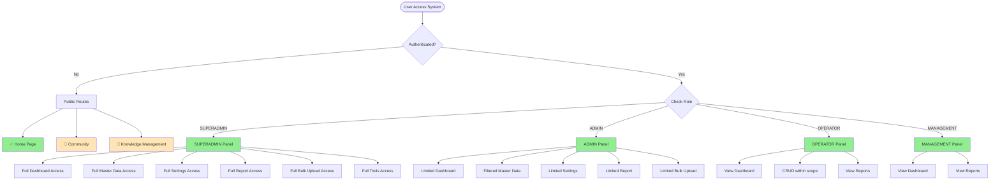

---

## Public User Flow

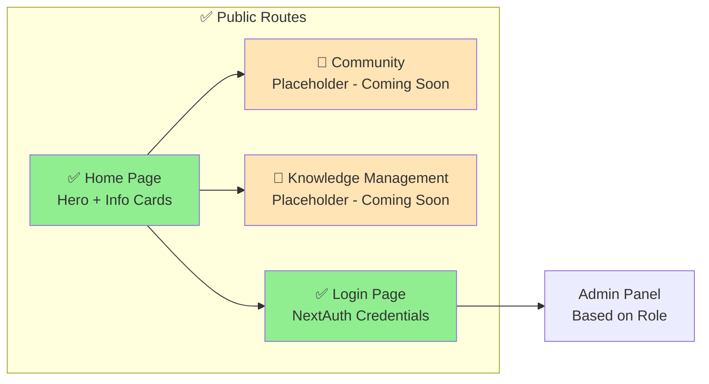

---

## SUPERADMIN Flow

**Full system access - no data filtering, all permissions granted**

```mermaid
flowchart TD
    SA_HOME([SUPERADMIN Login]) --> SA_DASH[Dashboard]
    
    %% Dashboard Branch
    SA_DASH --> SA_DASH_BASIC[🔲 Basic Dashboard<br/>Summary Cards + Filter]
    SA_DASH --> SA_DASH_MAP[🔲 Interactive Map<br/>KT Markers + Filter]
    SA_DASH --> SA_DASH_BMP[🔲 Dashboard BMP<br/>Best Management Practice]
    
    %% Master Data Branch
    SA_HOME --> SA_MD[Master Data]
    
    SA_MD --> SA_MD_REGION[✅ Regions<br/>Province/District/Subdistrict/Village]
    SA_MD --> SA_MD_GROUP[✅ Farmer Groups<br/>List/Detail/CRUD]
    SA_MD --> SA_MD_FARMER[✅ Farmers<br/>List/Detail/CRUD + RBAC]
    SA_MD --> SA_MD_PARCEL[🔲 Parcels<br/>Map + Polygon]
    SA_MD --> SA_MD_TRAINING[🔲 Training<br/>Participants + Evidence]
    SA_MD --> SA_MD_PROD[🔲 Production<br/>Period + Chart]
    SA_MD --> SA_MD_STAFF[🔲 Staff<br/>WRI + Activity]
    SA_MD --> SA_MD_HCV[🔲 HCV<br/>High Conservation Value]
    SA_MD --> SA_MD_BUSDEV[🔲 BUSDEV<br/>Business Development]
    SA_MD --> SA_MD_IMPACT[🔲 IMPACT<br/>Impact Metrics]
    SA_MD --> SA_MD_WORKPLAN[🔲 Workplan<br/>Annual Planning]
    
    %% Settings Branch
    SA_HOME --> SA_SET[Settings]
    SA_SET --> SA_SET_USER[✅ User Management<br/>CRUD + Data Access]
    SA_SET --> SA_SET_ROLE[✅ Role & Permission<br/>Matrix Management]
    SA_SET --> SA_SET_MENU[✅ Menu Management<br/>Dynamic Sidebar]
    SA_SET --> SA_SET_REGION[✅ Region Settings<br/>Tree Hierarchy]
    
    %% Report Branch
    SA_HOME --> SA_RPT[Report]
    
    SA_RPT --> SA_RPT_USER[🔲 Report User<br/>Table + Excel Export]
    SA_RPT --> SA_RPT_REGION[🔲 Report Region<br/>Hierarchy + Export]
    SA_RPT --> SA_RPT_KT[🔲 Report Kelompok Tani<br/>Cascade Filter + Export]
    
    %% Bulk Upload Branch
    SA_HOME --> SA_BULK[Bulk Upload]
    SA_BULK --> SA_BULK_FARMER[✅ Bulk Farmer<br/>Excel Mapping + Validation]
    SA_BULK --> SA_BULK_KT[🔲 Bulk KT<br/>CSV + Preview]
    SA_BULK --> SA_BULK_REGION[🔲 Bulk Region<br/>Hierarchy Validation]
    
    %% Tools Branch
    SA_HOME --> SA_TOOLS[🟡 Tools]
    SA_TOOLS --> SA_TOOLS_EXPORT[✅ Export CSV]
    SA_TOOLS --> SA_TOOLS_S3[🟡 S3/PDF Manager]
    SA_TOOLS --> SA_TOOLS_GIS[🔲 GIS Utilities]
    
    %% Profile
    SA_HOME --> SA_PROFILE[✅ Profile<br/>Change Password]
    
    style SA_MD_REGION fill:#90EE90
    style SA_MD_GROUP fill:#90EE90
    style SA_MD_FARMER fill:#90EE90
    style SA_MD_PARCEL fill:#FFE4B5
    style SA_MD_TRAINING fill:#FFE4B5
    style SA_MD_PROD fill:#FFE4B5
    style SA_MD_STAFF fill:#FFE4B5
    style SA_MD_HCV fill:#FFE4B5
    style SA_MD_BUSDEV fill:#FFE4B5
    style SA_MD_IMPACT fill:#FFE4B5
    style SA_MD_WORKPLAN fill:#FFE4B5
    style SA_SET_USER fill:#90EE90
    style SA_SET_ROLE fill:#90EE90
    style SA_SET_MENU fill:#90EE90
    style SA_SET_REGION fill:#90EE90
    style SA_RPT_USER fill:#FFE4B5
    style SA_RPT_REGION fill:#FFE4B5
    style SA_RPT_KT fill:#FFE4B5
    style SA_BULK_FARMER fill:#90EE90
    style SA_BULK_KT fill:#FFE4B5
    style SA_BULK_REGION fill:#FFE4B5
    style SA_TOOLS_EXPORT fill:#90EE90
    style SA_TOOLS_S3 fill:#FFFF99
    style SA_TOOLS_GIS fill:#FFE4B5
    style SA_PROFILE fill:#90EE90
    style SA_DASH_BASIC fill:#FFE4B5
    style SA_DASH_MAP fill:#FFE4B5
    style SA_DASH_BMP fill:#FFE4B5
```

---

## ADMIN Flow

**District/Province level access - filtered by UserDistrict/UserProvince**

```mermaid
flowchart TD
    
    ADM_HOME([ADMIN Login]) --> ADM_DASH[Dashboard<br/>🔲 Filtered by District]
    
    %% Master Data - Filtered
    ADM_HOME --> ADM_MD[Master Data<br/>Filtered by Assignment]
    ADM_MD --> ADM_MD_GROUP[✅ Farmer Groups<br/>Within Assigned District]
    ADM_MD --> ADM_MD_FARMER[✅ Farmers<br/>Within Assigned District/Group]
    ADM_MD --> ADM_MD_PARCEL[🔲 Parcels<br/>Within Assigned Scope]
    ADM_MD --> ADM_MD_TRAINING[🔲 Training<br/>Within Assigned Scope]
    
    %% Limited Settings Access
    ADM_HOME --> ADM_SET[Settings<br/>Limited Access]
    ADM_SET --> ADM_SET_USER[View/Edit Users<br/>Based on Permission]
    ADM_SET --> ADM_SET_REGION[View Region Hierarchy]
    
    %% Report Access
    ADM_HOME --> ADM_RPT[Report<br/>🔲 Filtered Data]
    ADM_RPT --> ADM_RPT_USER[Report User<br/>Within Scope]
    ADM_RPT --> ADM_RPT_KT[Report KT<br/>Within District]
    
    %% Bulk Upload - Limited
    ADM_HOME --> ADM_BULK[Bulk Upload<br/>Within Scope]
    ADM_BULK --> ADM_BULK_FARMER[✅ Bulk Farmer<br/>Assigned Groups Only]
    
    %% Profile
    ADM_HOME --> ADM_PROFILE[✅ Profile<br/>Change Password]
    
    style ADM_MD_GROUP fill:#90EE90
    style ADM_MD_FARMER fill:#90EE90
    style ADM_MD_PARCEL fill:#FFE4B5
    style ADM_MD_TRAINING fill:#FFE4B5
    style ADM_SET_USER fill:#90EE90
    style ADM_SET_REGION fill:#90EE90
    style ADM_BULK_FARMER fill:#90EE90
    style ADM_PROFILE fill:#90EE90
    style ADM_DASH fill:#FFE4B5
    style ADM_RPT fill:#FFE4B5
```

---

## OPERATOR Flow

**Field-level access - filtered by UserFarmerGroup**

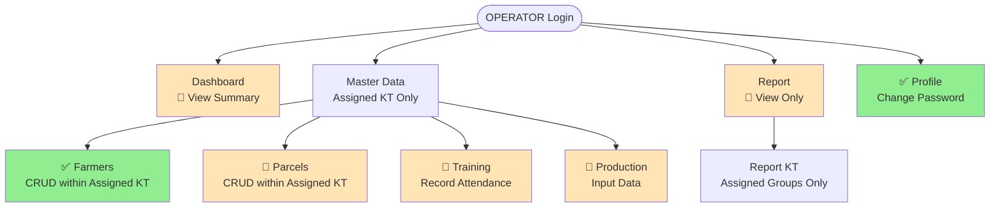

---

## MANAGEMENT Flow

**Read-only dashboard and reports**

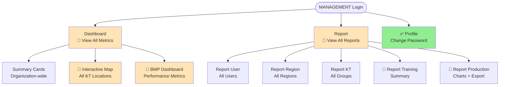

---

## RBAC & Data Access Pattern

### Permission Resolution Flow

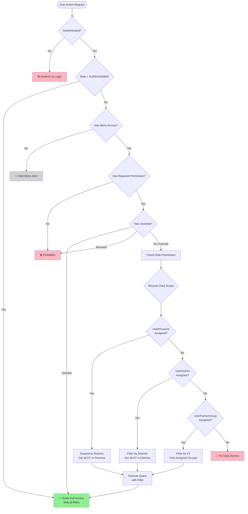

### Data Access Hierarchy

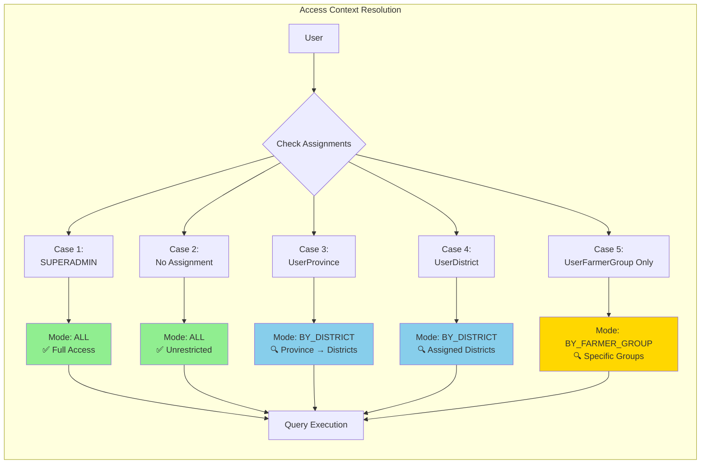

---

## Master Data CRUD Flow

### Standard CRUD Pattern (Farmer Example)

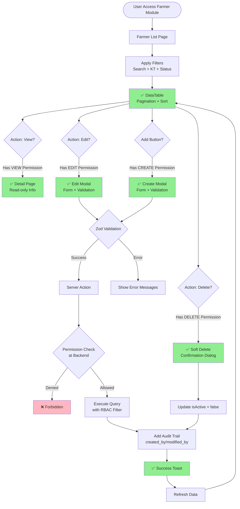

---

## Bulk Upload Flow

### Farmer Bulk Upload Pattern (✅ Implemented)

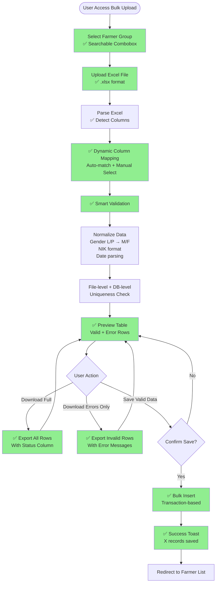

---

## Report Export Flow

### Report Generation Pattern (🔲 Planned)

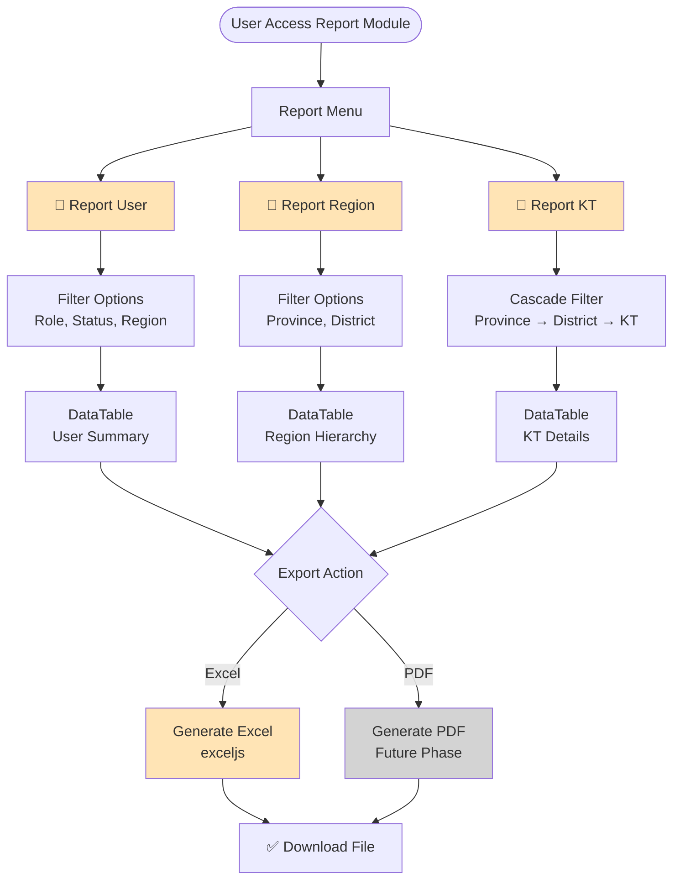

---

## Dashboard Flow (🔲 Planned)

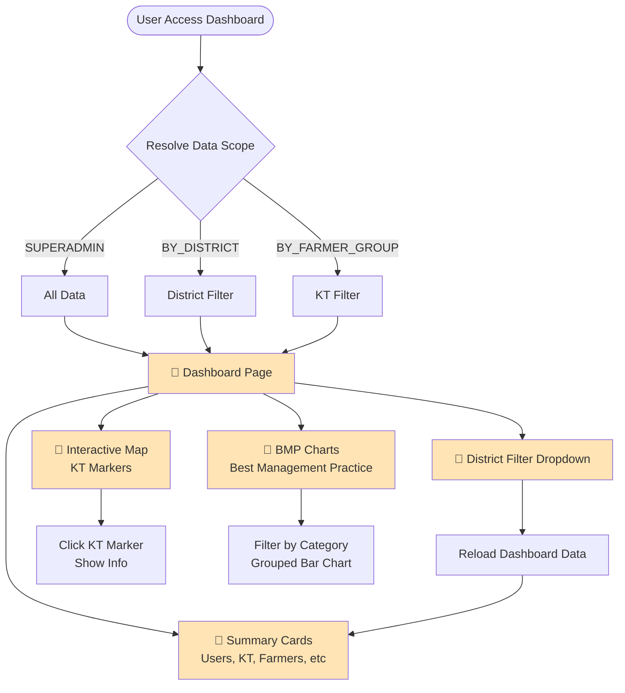

---

## Navigation Structure

### Admin Sidebar Menu Hierarchy

```
📊 Dashboard (🔲 DASH-01)
├── Basic Dashboard
├── Interactive Map
└── Dashboard BMP

📁 Master Data
├── ✅ Regions (MD-01)
├── ✅ Kelompok Tani (MD-02)
├── ✅ Petani (MD-03)
├── 🔲 Lahan / Parcels (MD-04)
├── 🔲 Pelatihan / Training (MD-05)
├── 🔲 Produksi / Production (MD-06)
├── 🔲 Staff (MD-07)
├── 🔲 HCV (MD-08)
├── 🔲 BUSDEV (MD-09)
├── 🔲 IMPACT (MD-10)
└── 🔲 Workplan (MD-11)

📈 Report (🔲 RPT-01)
├── 🔲 Report User
├── 🔲 Report Region
└── 🔲 Report Kelompok Tani

📤 Bulk Upload (🟡 BULK-01)
├── ✅ Bulk Upload Petani (BULK-03)
├── 🔲 Bulk Upload Kelompok Tani
└── 🔲 Bulk Upload Region

⚙️ Settings
├── ✅ User Management (PLATFORM-04)
├── ✅ Role & Permission (PLATFORM-04)
├── ✅ Menu Management (PLATFORM-05)
└── ✅ Region Settings (MD-01)

🔧 Tools (🟡 TOOLS-01)
├── ✅ Export CSV
├── 🟡 S3/PDF Manager
└── 🔲 GIS Utilities

👤 Profile
└── ✅ Change Password
```

---

## Implementation Status Summary

### Completed Modules (✅)

| Module | Phase | Features |
|--------|-------|----------|
| Platform Foundation | PLATFORM-01/02/03/04/05 | Next.js setup, Prisma schema, Auth, RBAC, Menu system |
| Regions | MD-01 | Tree hierarchy, CRUD, Province/District/Subdistrict/Village |
| Farmer Groups | MD-02 | List, Detail, CRUD, RBAC filtering |
| Farmers | MD-03 | Full CRUD, RBAC, DataTable, Excel export |
| Bulk Upload Farmer | BULK-03 | Excel mapping, smart validation, preview, error download |
| User Management | PLATFORM-04 | CRUD, Data Access, Permission Override |
| Settings | PLATFORM-04/05 | Role/Permission matrix, Menu management, Region settings |

### In Progress (🟡)

| Module | Phase | Status |
|--------|-------|--------|
| Tools | TOOLS-01 | Export CSV ✅, S3/PDF CLI partial |
| Bulk Upload Menu | BULK-01 | Menu & route setup done, KT/Region pending |

### Planned - Now (🔲)

| Module | Phase | Next Steps |
|--------|-------|-----------|
| Dashboard | DASH-01 | **URGENT**: Define scope (cards, metrics, filters) in 48h |
| Report | RPT-01 | Menu setup + placeholder pages → User/Region/KT reports |
| Bulk Upload KT | BULK-01 | CSV upload with validation & preview |

### Planned - Next (🔲)

| Module | Phase | Dependencies |
|--------|-------|--------------|
| Parcels | MD-04 | After MD-03 (Farmer) |
| Training | MD-05 | After MD-03/04 |
| Production | MD-06 | After MD-03, validate per-farmer vs per-parcel |
| Bulk Upload Region | BULK-02 | After BULK-01 (KT) |

### Planned - Later (🔲)


| Module | Phase | Notes |
|--------|-------|-------|
| Staff | MD-07 | Scope to be defined |
| HCV | MD-08 | High Conservation Value tracking |
| BUSDEV | MD-09 | Business Development module |
| IMPACT | MD-10 | Impact metrics & reporting |
| Workplan | MD-11 | Annual planning |
| CMS | CMS-01 | Content Management System |
| Community | COMM-01 | Community engagement features |
| i18n | COMM-02 | Internationalization |

### Blocked (🔴)

| Module | Phase | Blocker |
|--------|-------|---------|
| Dashboard BMP | DASH-04 | Requires DASH-01 & DASH-02 completion |

---

## Notes

### Current Priorities (2026-06-10)

1. **P0 - BUG-002**: Fix stale dashboard scripts in `/scripts/debug/`
2. **P0 - DASH-01**: Dashboard scope agreement (BLOCKING) - define in 48h
3. **P1 - RPT-01**: Menu & placeholder for Report module
4. **P1 - BULK-01**: Complete KT & Region bulk upload implementation

### Key Decisions Needed

| Decision | Owner | Deadline | Impact |
|----------|-------|----------|--------|
| Dashboard minimal scope | Product + Engineering | 2026-06-11 | DASH-01 implementation can start |
| Production data model | Product + Domain Expert | Before MD-06 | Per-farmer vs per-parcel structure |

### Testing Coverage


**Test Status**: 130 tests passing ✅

Covered modules:
- ✅ Auth & RBAC
- ✅ Menu system
- ✅ User management
- ✅ Region management
- ✅ Farmer management
- ✅ Bulk upload

Need coverage:
- Dashboard
- Report
- Training
- Parcel
- Production

### Code Compliance

**14/14 rules FULLY COMPLIANT** ✅

All code follows:
- Kebab-case naming
- English variables
- Zod validation
- Server actions in correct directory
- RBAC patterns (AccessContext discriminated union)
- Soft delete (isActive field)
- Proper data filtering
- UI/UX standards (loading states, table actions, Shadcn UI)

---

## Related Documentation

- [progress.md](./progress.md) - Detailed phase status & roadmap
- [rule.md](./rule.md) - Development rules & standards
- [database-schema.md](./database-schema.md) - ERD & schema documentation
- [general-rule.md](./general-rule.md) - Behavioral principles

---

**Last Updated**: 2026-06-10  
**Next Review**: After DASH-01 scope agreement
